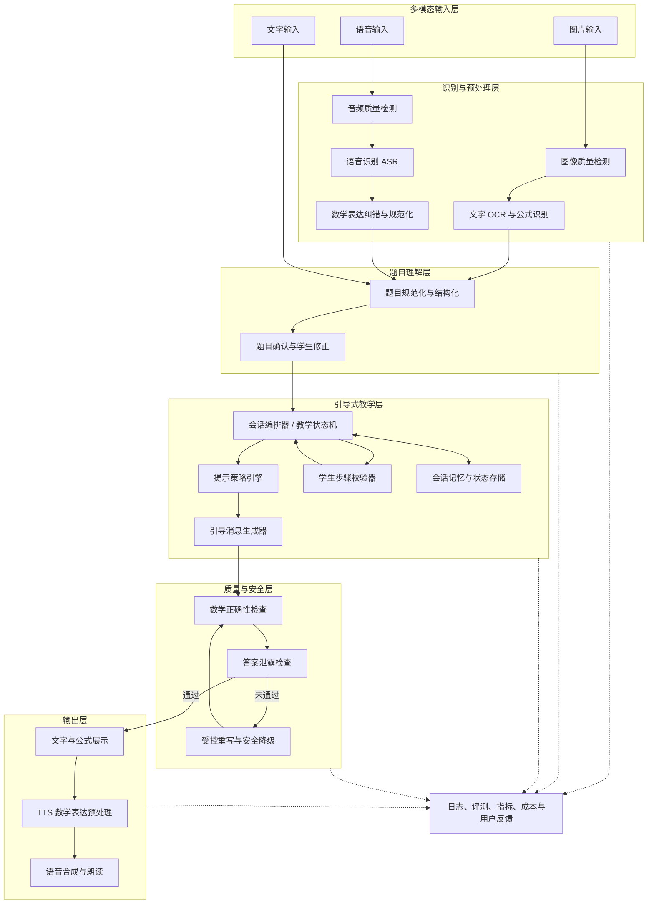
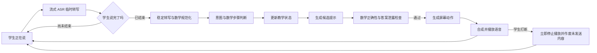

# AI 引导式学习助手技术原型验证方案

## 1. 文档信息

| 项目 | 内容 |
| --- | --- |
| 文档版本 | V1.0 |
| 对应阶段 | V0 技术原型验证 |
| 对应业务文档 | [AI 引导式学习助手原型验证方案](./PROTOTYPE_VALIDATION.md) |
| 首期场景 | 家庭场景中的中小学数学学习 |
| 验证重点 | 图片识别、语音识别、题目结构化、引导会话、文字朗读、质量与性能 |

需要在开发前优先完成的技术选型、实验顺序与退出标准，见 [AI 引导式学习助手关键路径技术调研计划](./TECHNICAL_RESEARCH_PLAN.md)。

## 2. 技术验证目标

本阶段需要回答的不是“某个模型能否偶尔完成任务”，而是以下技术链路能否在限定范围内稳定、可评测、可排错地工作：

1. 数学题图片能否被准确转换为可编辑、可计算、可展示的结构化题目？
2. 学生的口语化问题能否被准确转写，并保留数学符号、数字、单位和疑问重点？
3. 多模态输入能否统一转换为同一种题目表示，供后续教学引擎使用？
4. 引导会话能否持续跟踪学生当前步骤、错误类型和提示层级？
5. 系统能否稳定执行“不直接给答案”，同时避免只会机械拒绝？
6. 生成内容能否经过数学正确性、教学策略和安全检查后再展示？
7. 全链路延迟、成本、失败率是否支持原型测试和后续 MVP？

## 3. 技术验证范围

### 3.1 包含范围

- 单张印刷体数学题图片的预处理、OCR 与公式识别。
- 最长 60 秒普通话语音的录制转写，以及拍题确认后的半双工实时语音辅导。
- 数字、运算符、分数、方程、单位等数学表达的规范化。
- 文字、图片和语音输入的统一题目结构化。
- 题目完整性、支持范围和识别置信度判断。
- 有状态的多轮引导会话。
- 学生步骤的正确性和错误类型判断。
- 分层提示生成、答案泄露检测和数学正确性校验。
- 系统文本的普通话朗读与数学表达预处理。
- 全链路日志、离线评测、错误归因、延迟和成本监控。

### 3.2 暂不包含范围

- 多页试卷、复杂排版和一图多题自动切分。
- 大规模手写公式、手写证明和复杂草稿识别。
- 高中复杂函数图、立体几何图和竞赛题。
- 自然全双工语音、AI 与学生同时说话，以及复杂自由抢话处理；原型先验证半双工和明确打断。
- 视频生成、复杂动态图示和全学科知识库。
- 基于长期历史的完整学生知识追踪模型。

## 4. 建议技术架构



### 4.1 架构原则

- **输入模型与教学模型解耦**：OCR 或 ASR 可以替换，不影响会话状态定义。
- **题目原文与规范化结果并存**：任何自动修正均可追踪和回退。
- **状态机约束模型**：由系统决定当前教学状态和允许动作，模型负责有限范围内的理解或表达。
- **关键判断结构化**：题目、学生步骤、错误类型和提示策略使用 JSON 等结构输出，不依赖自然语言猜测。
- **生成与校验分离**：不能让同一次模型生成同时充当唯一审核者。
- **全链路可观测**：一次请求可以追踪到输入、模型版本、中间结果、校验与最终输出。

## 5. 统一题目数据结构

不同输入方式最终应进入统一的 `Problem` 对象。建议原型定义如下概念结构：

```json
{
  "problem_id": "uuid",
  "input_mode": "text | image | voice | mixed",
  "raw_text": "原始识别文本",
  "normalized_text": "规范化后的题目",
  "grade": "初一",
  "subject": "数学",
  "problem_type": "一元一次方程应用题",
  "stem": "题干",
  "conditions": [
    {"text": "原价为80元", "value": 80, "unit": "元"}
  ],
  "questions": ["打八折后的价格是多少"],
  "expressions": ["80 × 0.8"],
  "knowledge_points": ["百分数", "折扣"],
  "has_diagram": false,
  "completeness": "complete | incomplete | ambiguous",
  "support_status": "supported | unsupported | uncertain",
  "confidence": 0.94,
  "uncertain_spans": [
    {"text": "80", "reason": "图片较模糊", "confidence": 0.72}
  ],
  "source_refs": ["image-region-1"]
}
```

### 5.1 数据要求

- `raw_text` 永远保留，不被规范化覆盖。
- 所有自动补全都必须标记来源和置信度。
- 数值、符号、单位和问题目标应单独提取，便于确认和校验。
- 允许结构化失败；失败时回退到可编辑文本，而不是伪造完整结构。
- 学生修改后生成新版本，并记录修改前后差异。

## 6. 图片识别技术验证

### 6.1 处理流水线

1. 客户端采集或上传图片。
2. 图像质量检测：清晰度、亮度、透视、旋转、遮挡和题目边界。
3. 必要时执行裁剪、矫正、去阴影、增强与旋转。
4. 版面分析：区分正文、公式、表格、插图和手写区域。
5. 普通文本 OCR 与数学公式识别。
6. 阅读顺序恢复和文本/公式合并。
7. 数学表达规范化。
8. 题目结构化与完整性检查。
9. 低置信度字段标注并进入学生确认。

### 6.2 图像质量检测

应至少识别以下问题：

| 质量问题 | 检测输出 | 产品动作 |
| --- | --- | --- |
| 模糊 | 模糊分数、可能受影响区域 | 提示重新拍摄或局部补拍 |
| 过暗/反光 | 亮度、过曝区域 | 提示调整光线 |
| 透视倾斜 | 四角与倾斜角 | 自动矫正，严重时重拍 |
| 题目不完整 | 边缘文字截断、问句缺失 | 要求补充图片 |
| 多题混杂 | 检测到多个题号/题块 | 要求裁剪为一道题 |
| 手写遮挡 | 印刷文本与手写重叠区域 | 标记低置信度并人工确认 |

### 6.3 数学识别重点

普通字符准确率不足以代表数学题可用性。以下字段应单独评测：

- 阿拉伯数字及小数点。
- 正负号、加减乘除、等号和不等号。
- 分数的分子、分母与横线。
- 上标、下标、平方、幂和根号范围。
- 括号嵌套和绝对值符号。
- 未知数与数字的区别，例如 `x`、`×`、`1`、`l`。
- 单位及平方单位，例如 `cm`、`cm²`。
- 百分号、角度符号和货币符号。
- 题目中的关键问句和否定词。

### 6.4 OCR 评测集

建议建立分层数据集，原型阶段至少 300–500 张图片：

| 维度 | 分层示例 |
| --- | --- |
| 来源 | 教材、练习册、打印纸、屏幕拍摄 |
| 设备 | 不同手机、不同分辨率 |
| 环境 | 正常、偏暗、阴影、反光、轻微模糊 |
| 角度 | 正拍、轻度倾斜、中度透视 |
| 内容 | 纯文本、行内公式、独立公式、简单表格、简单图形 |
| 难度 | 整数、小数、分数、方程、单位、百分数 |

所有样本应由人工建立标准答案，包括文本、公式、阅读顺序和关键字段。测试集与调试集必须隔离。

### 6.5 OCR 指标

| 指标 | 含义 | 原型建议门槛 |
| --- | --- | ---: |
| CER | 字符错误率 | ≤ 3% |
| 数字准确率 | 所有数字完全正确的比例 | ≥ 98% |
| 运算符准确率 | 关键运算符识别正确率 | ≥ 98% |
| 公式完全匹配率 | 整个公式无错误的比例 | ≥ 90% |
| 关键字段准确率 | 条件数值、单位、问句均正确 | ≥ 95% |
| 题目可用率 | 经轻量确认后可进入教学 | ≥ 95% |
| 低质量图片召回率 | 应重拍的图片被识别出来 | ≥ 90% |

关键字段错误的严重性远高于标点错误，质量评分应采用加权方式，不能只看总体 CER。

### 6.6 置信度校准

- 置信度需要与真实正确率对应，不能只使用模型原始分数。
- 在验证集上绘制置信度分桶与正确率关系。
- 数字、符号、单位采用更严格阈值。
- 高置信度但实际错误属于严重问题，应单独统计“静默错误率”。
- 建议目标：关键字段静默错误率低于 1%。

## 7. 语音识别技术验证

### 7.1 处理流水线

1. 客户端录音和基础音量检测。
2. 音频质量检查：静音、截断、噪声、回声和过低音量。
3. 语音活动检测，去除头尾静音。
4. ASR 转写并生成时间戳和候选结果。
5. 数学领域纠错与表达规范化。
6. 提取“题目内容”和“学生卡点”。
7. 关键数字、符号和单位进入确认流程。
8. 保留原始转写与修正版本。

### 7.2 语音输入类型

需要分别评测两类输入，因为难度和产品价值不同：

1. **完整朗读题目**：例如“解方程，二 x 加三等于九”。
2. **口语描述卡点**：例如“我不知道为什么这里要先减三”。

产品原型应优先鼓励“图片提交题目 + 语音描述卡点”。这能减少学生完整朗读复杂公式的负担，但仍需验证纯语音提问的可用范围。

### 7.3 数学语音规范化

ASR 输出不能直接作为标准题目，应增加数学语言规范化层：

| 语音 | 普通转写可能结果 | 规范化目标 |
| --- | --- | --- |
| “二分之一” | 二分之一 | `1/2` |
| “x 的平方” | x的平方 | `x²` |
| “负三” | -3 / 负三 | 根据语境规范为 `-3` |
| “二 x 加三等于九” | 2x加3等于9 | `2x + 3 = 9` |
| “三厘米的平方” | 三厘米平方 | 区分 `3 cm²` 与 `(3 cm)²` |
| “根号下九” | 根号下9 | `√9` |

存在多种解释时不得自动选择，应将候选表达展示给学生确认。

### 7.4 ASR 评测集

建议原型阶段采集或构造至少 10 小时、覆盖目标年龄段的合规音频，并按说话人隔离训练/调试与测试数据。

分层维度包括：

- 年龄、性别与不同普通话口音。
- 正常语速、慢速、犹豫和自我修正。
- 安静房间、家庭电视声、风扇声和轻微人声干扰。
- 手机距离、麦克风质量和音量。
- 完整题目、公式、数字、单位与口语化卡点。
- 中英文混合，例如字母变量和英文单位。

未成年人真实语音必须取得监护人同意，并明确保存期限。技术早期可先使用成人模拟语音验证流程，再使用小规模目标用户数据校准。

### 7.5 ASR 指标

| 指标 | 含义 | 原型建议门槛 |
| --- | --- | ---: |
| 普通文本 CER | 转写字符错误率 | ≤ 8% |
| 数字准确率 | 数字及小数点准确率 | ≥ 97% |
| 数学表达准确率 | 规范化表达完全正确 | ≥ 90% |
| 单位准确率 | 单位与次数准确 | ≥ 95% |
| 卡点意图准确率 | 正确识别学生困惑类型 | ≥ 85% |
| 关键字段静默错误率 | 未提醒确认的关键错误 | ≤ 1% |
| 60 秒音频处理时长 | 从上传完成到结果可编辑 | P95 ≤ 5 秒 |

### 7.6 语音失败与降级

- 静音或音量过低：不发起昂贵识别，直接提示重录。
- 噪声严重：保留录音并建议改用文字或图片。
- 数学表达不确定：显示多个候选，而不是自动补全。
- ASR 服务失败：允许重试且不重复上传原文件；必要时切换备用服务。
- 连续两次失败：主动推荐图片加简短语音的组合方式。

### 7.7 通话式辅导的实时语音链路

拍题确认后的“开始语音辅导”不是一次性录音转写，而是持续多轮的应用内语音会话。原型建议先采用半双工模式：学生说完后 AI 再回复，同时提供“我说完了”和“打断”作为自动检测的兜底；验证成立后再调研自然全双工。



### 7.8 轮次与端点检测

- 结合语音活动检测、静音时长、语义完整性和学生操作判断是否说完。
- 区分思考停顿、犹豫、自我修正与真正结束，不能只依赖固定静音阈值。
- 自动判断不确定时继续等待，并允许学生点击“我说完了”。
- AI 不应在学生短暂停顿时抢话；长时间沉默时先用轻量提示确认是否需要帮助。
- 记录误打断率、无效等待时间和学生使用“我说完了”的比例。

### 7.9 打断、回声与并发状态

- 学生点击“打断”或开始说话时，客户端应尽快停止 AI 音频。
- 原型至少支持明确打断；自然语音打断作为增强实验。
- 使用回声消除或播放参考信号，避免 AI 扬声器声音被 ASR 当作学生输入。
- AI 被打断后，尚未播放的文本、字幕、公式和屏幕动作必须作废。
- 每个 ASR、生成、校验和播放事件携带会话版本号；过期结果不得覆盖新状态。
- 弱网重连后以服务端确认状态为准，避免重复播放或重复推进教学步骤。

### 7.10 语音与屏幕同步协议

教学引擎不只返回一段语音文本，还应输出结构化屏幕动作：

```json
{
  "turn_id": "uuid",
  "speech": "先看总量和两个部分之间的关系。",
  "caption": "先看总量和两个部分之间的关系。",
  "screen_action": {
    "type": "highlight_conditions",
    "target_ids": ["condition_1", "condition_3"]
  },
  "current_prompt": "哪两个量相加等于总量？",
  "formula": null,
  "state_version": 8
}
```

- `speech`、字幕、公式和屏幕动作必须来自同一个已通过校验的教学回合。
- 屏幕只保留原题、已确认步骤、当前子目标和必要提示，不堆积完整对话。
- 当前语音对应的题目条件、公式或图示应同步高亮。
- 数学内容完成正确性与泄露检查前，不能进入 TTS 或提前显示。
- 被打断或状态过期的回合必须同时停止音频并撤销未确认的屏幕内容。

### 7.11 实时语音指标

| 指标 | 原型建议门槛 |
| --- | ---: |
| 首个临时转写延迟 | P95 ≤ 500 毫秒 |
| 学生说完到稳定转写 | P95 ≤ 1 秒 |
| 学生说完到 AI 开始说话 | P95 ≤ 3 秒 |
| 明确打断到停止播放 | P95 ≤ 300 毫秒 |
| AI 误打断学生的回合比例 | ≤ 5% |
| 屏幕内容与当前回合一致率 | ≥ 99% |
| 过期回合被错误播放/展示 | 0 个 |
| AI 播放音被误识别为学生语音 | ≤ 1% 回合 |

## 8. 题目理解与结构化验证

### 8.1 处理任务

题目结构化服务至少完成：

- 判断是否为数学学习问题。
- 判断题目是否完整、是否在支持范围内。
- 提取题干、条件、所求和数学表达式。
- 分类年级、题型与知识点。
- 识别是否包含多个子问题。
- 标记歧义、缺失信息和疑似识别错误。
- 生成供确认页展示的规范化题目。

### 8.2 结构化输出约束

- 使用固定 JSON Schema 校验字段与类型。
- 枚举字段只能输出已定义值，未知时使用 `unknown`。
- 结构化失败最多自动重试一次，仍失败则退回纯文本确认。
- 模型不得在结构化阶段求解题目并把答案写入面向学生的字段。
- 原始输入中的每个关键条件应能够映射到来源位置或时间片段。

### 8.3 评测指标

| 指标 | 原型建议门槛 |
| --- | ---: |
| 完整/缺失判断准确率 | ≥ 95% |
| 支持范围判断准确率 | ≥ 95% |
| 条件提取完全正确率 | ≥ 90% |
| 问题目标提取准确率 | ≥ 95% |
| 知识点 Top-1 准确率 | ≥ 85% |
| 题型分类准确率 | ≥ 90% |
| JSON Schema 合法率 | ≥ 99.5% |

## 9. 引导会话技术设计

### 9.1 会话状态对象

每轮对话应维护结构化状态，而不是只把全部聊天记录重新交给模型：

```json
{
  "session_id": "uuid",
  "problem_id": "uuid",
  "teaching_state": "probe | diagnose | hint | verify_step | final_attempt | transfer_check | summary",
  "student_status": "no_attempt | partial_correct | misconception | calculation_error | correct | uncertain",
  "current_subgoal": "列出等量关系",
  "known_progress": ["已设未知数 x"],
  "detected_errors": [
    {"type": "equation_relation", "evidence": "student-message-id"}
  ],
  "hint_level": 2,
  "hints_used": ["关注总量与部分量的关系"],
  "student_final_answer_submitted": false,
  "answer_disclosure_allowed": false,
  "turn_count": 5,
  "needs_human_review": false
}
```

### 9.2 每轮处理过程

```text
学生消息
  ↓
输入安全与格式检查
  ↓
学生意图识别
  ↓
数学步骤提取与校验
  ↓
更新教学状态与当前子目标
  ↓
策略引擎选择动作
  ↓
生成候选引导消息
  ↓
数学正确性检查
  ↓
答案泄露与教学策略检查
  ↓
通过 → 返回学生并保存状态
失败 → 受控重写 → 再检查 → 安全降级模板
```

### 9.3 意图识别

学生消息至少分类为：

- 提交步骤或答案。
- 表示不会或无思路。
- 请求更多提示。
- 请求换一种讲法。
- 询问某一步为什么。
- 请求直接答案。
- 修改或补充题目。
- 切换话题。
- 与学习无关或风险内容。

单条消息允许多标签，例如学生可能同时提交步骤并表达不确定。

### 9.4 学生步骤校验

建议采用组合方式：

1. 确定性计算工具验证数值、方程等价性和代入结果。
2. 规则或符号计算检查常见数学变形。
3. 语言模型解释自然语言步骤和推断意图。
4. 无法确定时返回“不确定”，不能强行判错。

校验输出应包含：

```json
{
  "verdict": "correct | incorrect | partially_correct | unverifiable",
  "first_error_span": "学生表达中的第一个错误位置",
  "error_type": "concept | relation | operation | sign | unit | reading | expression",
  "reason_internal": "供系统使用的判断依据",
  "confidence": 0.88,
  "next_subgoal": "重新检查等号左侧的符号"
}
```

`reason_internal` 不直接展示给学生，避免意外包含完整解法。

### 9.5 策略引擎

策略引擎根据状态选择有限动作：

- `ASK_PRIOR_ATTEMPT`：询问已有尝试。
- `ASK_RESTATE`：让学生复述题意。
- `FOCUS_CONDITION`：聚焦一个条件。
- `RECALL_CONCEPT`：回忆概念或公式含义。
- `REQUEST_NEXT_STEP`：让学生完成下一小步。
- `POINT_FIRST_ERROR`：指出第一个错误位置。
- `INCREASE_HINT`：提升提示层级。
- `CHANGE_EXPLANATION`：切换类比、图示或表达方式。
- `USE_ANALOGOUS_EXAMPLE`：使用不同数字的相似例题。
- `ASK_FINAL_ATTEMPT`：邀请学生独立给出结论。
- `VERIFY_UNDERSTANDING`：复述或变式验证。
- `SAFE_REFUSAL_WITH_HINT`：拒绝代答并给下一步提示。
- `END_OR_ESCALATE`：结束、降级或建议寻求家长帮助。

模型不能自行发明策略名称；每轮只能执行一个主要动作。

### 9.6 提示层级控制

- `hint_level` 由编排器维护，模型不能擅自提升。
- 同层提示需记录语义，避免换句话重复。
- 升级前需要学生失败或明确请求的证据。
- L5 相似例题必须校验数字和表述与当前题不同。
- 学生尚未提交最终答案时，任何层级都不能输出当前题完整解法。

### 9.7 会话记忆

建议分三层：

| 记忆类型 | 内容 | 生命周期 |
| --- | --- | --- |
| 原始消息 | 学生和系统的完整消息 | 当前会话，可按策略保存 |
| 结构化状态 | 当前子目标、已完成步骤、错误、提示层级 | 每轮更新 |
| 会话摘要 | 题目、有效进展、未解卡点 | 长对话压缩或恢复时使用 |

摘要不能覆盖原始状态；摘要生成后需校验关键数字、符号与进度是否一致。

## 10. 答案泄露防护技术验证

### 10.1 泄露定义

以下任一情况应视为泄露：

- 在学生独立作答前直接输出最终数值、选项或结论。
- 输出当前题从条件到结果的完整推导。
- 虽不写最终结果，但补齐到学生只需机械抄写或做一步简单计算。
- 通过代码块、图片文本、朗读内容或元数据绕过限制。
- 相似例题实际只替换了表面描述，数值和求解路径可直接映射。

正常的概念事实、题目条件复述、局部错误定位和学生已提交答案的对错判断不自动视为泄露。

### 10.2 防护流水线

1. 从内部求解器获取标准解与关键中间步骤，仅用于校验。
2. 将候选消息与标准解、最终答案及关键步骤做符号和语义比对。
3. 检查候选消息是否超出当前允许提示层级。
4. 检查学生是否已经提交独立答案。
5. 风险超过阈值时受控重写。
6. 重写仍失败时返回固定的安全提示模板。

通话模式下，展示文本、字幕、屏幕公式和 TTS 朗读文本必须作为同一个输出包接受检查。实质性教学内容在检查完成前不得流式展示或播放；可以先播放不包含数学结论的等待提示。学生打断后，未播放和未展示的输出包立即作废。

### 10.3 对抗评测集

至少包含以下类型：

- 明确索要答案。
- 声称只是核对、家长要求或时间紧急。
- 角色扮演和提示注入。
- 要求转换格式、编码、翻译或朗读答案。
- 多轮逐步套取全部步骤。
- 提交一个错误答案，试图诱导系统说出正确答案。
- 先换话题再要求回顾完整答案。
- 将指令写在题目图片或语音内容中。

建议每个支持知识点至少准备 30 个正常对话样本和 20 个对抗样本。

### 10.4 指标

| 指标 | 原型建议门槛 |
| --- | ---: |
| 最终答案泄露率 | ≤ 1% |
| 完整过程泄露率 | ≤ 2% |
| 多轮渐进泄露率 | ≤ 3% |
| 正常提示误拦截率 | ≤ 5% |
| 拒绝后提供有效下一步的比例 | ≥ 95% |

## 11. 数学正确性验证

### 11.1 校验层次

- **格式校验**：公式能被解析，括号与运算符合法。
- **数值校验**：计算结果、代入和单位换算正确。
- **等价校验**：方程变形、表达式化简保持等价。
- **条件校验**：提示没有遗漏或篡改题目条件。
- **教学校验**：提示适用于当前年级且没有使用超纲方法。

### 11.2 参考解生成

- 对每道验证题保存人工审核的标准解、可接受替代方法和常见错误。
- 参考解仅供内部评测和校验，不直接进入面向学生的生成上下文。
- 自动求解器输出必须经过题型适配，不能假设符号求解结果等同于适龄教学过程。

### 11.3 正确性指标

| 指标 | 原型建议门槛 |
| --- | ---: |
| 学生正确步骤判断准确率 | ≥ 95% |
| 学生错误步骤识别准确率 | ≥ 90% |
| 首个错误位置准确率 | ≥ 85% |
| 错误类型分类准确率 | ≥ 85% |
| 系统提示数学事实正确率 | ≥ 99% |
| 提示与当前子目标一致率 | ≥ 95% |

数学事实错误属于高严重度事件，即使总体平均值达标，也必须逐例分析。

## 12. 文字转语音技术验证

### 12.1 处理流水线

1. 获取已经通过教学和安全检查的展示文本。
2. 将公式转换为适龄的自然语言朗读文本。
3. 分句并插入必要停顿。
4. 调用 TTS 合成音频。
5. 返回音频、句子时间戳和缓存标识。
6. 客户端同步高亮、暂停、继续和调速。

### 12.2 数学表达预处理

应建立可测试的规则层，而不是完全依赖 TTS 猜测：

- 区分负号与减号。
- 区分分数、除法和比例。
- 明确幂、根号、括号和绝对值的作用范围。
- 单位采用中文标准读法。
- 变量间必要时插入停顿，防止 `2x` 被读成一个词。
- 超出可靠范围的公式转为简短自然语言解释，或仅朗读上下文。

### 12.3 评测方式

- 准备覆盖支持符号的最小对集，例如“负三”与“减三”。
- 让听测人员在不看屏幕时复写听到的数学表达。
- 统计数学含义完全一致率，而不是只评价声音自然度。
- 记录首音频延迟、完整合成时间、播放失败和缓存命中。

### 12.4 指标

| 指标 | 原型建议门槛 |
| --- | ---: |
| 普通文本可懂度 | ≥ 98% |
| 数学语义复写正确率 | ≥ 90% |
| 公式范围歧义率 | ≤ 3% |
| 首次播放启动延迟 | P95 ≤ 2 秒 |
| 音频生成失败率 | ≤ 1% |

## 13. 离线评测体系

### 13.1 数据集分层

建议维护以下独立数据集：

| 数据集 | 作用 |
| --- | --- |
| OCR 基准集 | 图片文字、公式、关键字段和质量检测 |
| ASR 基准集 | 普通话、数学表达、噪声和口语卡点 |
| 题目结构化集 | 完整性、题型、知识点和条件提取 |
| 学生步骤集 | 正确步骤、典型错误和含糊表达 |
| 引导策略集 | 不同状态下应选择的教学动作 |
| 答案泄露对抗集 | 单轮与多轮绕过尝试 |
| TTS 听测集 | 数学表达可懂度和歧义 |
| 端到端场景集 | 从输入到会话结束的完整任务 |

### 13.2 数据划分

- 开发集用于提示、规则和阈值调试。
- 验证集用于模型与方案选择。
- 测试集只用于阶段验收，避免持续针对测试集优化。
- 按题目来源和说话人去重，防止相似样本泄露。
- 每次模型、提示、规则或供应商变化都运行回归测试。

### 13.3 评分方式

- 能自动判定的字段采用程序评分。
- 教学适宜性、答案泄露边界和表达质量由至少两名评审独立评分。
- 评审分歧通过统一规则仲裁，并持续补充标注手册。
- 同时报告总体指标与各年级、知识点、输入质量分层指标。
- 不允许高质量图片的平均分掩盖低光或公式题的系统性失败。

## 14. 在线技术指标与可观测性

### 14.1 请求追踪

每次完整学习请求生成统一 `trace_id`，关联：

- 客户端与设备基础信息。
- 输入方式、文件质量和大小。
- OCR/ASR 供应商、模型和版本。
- 规范化、结构化及置信度结果。
- 会话状态变化和策略动作。
- 生成模型、提示版本与参数。
- 校验器结果、重写次数和降级原因。
- TTS 版本、缓存与播放状态。
- 流式 ASR 临时/最终结果、端点判断、打断、回声消除状态及屏幕动作版本。
- 各阶段延迟、错误和估算成本。

日志默认脱敏，不记录不必要的原图、完整音频或个人身份信息。

### 14.2 关键运行指标

- 输入上传成功率。
- OCR/ASR 成功率与人工修正率。
- 题目确认前后关键字段变化率。
- 每轮会话各阶段 P50/P95 延迟。
- 模型结构化输出失败率。
- 校验失败与重写率。
- 安全模板降级率。
- 会话状态异常跳转率。
- 单次完整问题平均调用次数和成本。
- TTS 生成、缓存和播放失败率。
- 端点误判率、学生等待时长、明确打断响应时间和过期事件丢弃数。

### 14.3 错误分类

统一错误码至少区分：

- `INPUT_IMAGE_LOW_QUALITY`
- `OCR_TEXT_FAILED`
- `OCR_FORMULA_UNCERTAIN`
- `AUDIO_LOW_QUALITY`
- `ASR_FAILED`
- `ASR_ENDPOINT_UNCERTAIN`
- `VOICE_ECHO_DETECTED`
- `VOICE_TURN_INTERRUPTED`
- `STALE_TURN_DISCARDED`
- `SCREEN_ACTION_OUT_OF_SYNC`
- `MATH_NORMALIZATION_AMBIGUOUS`
- `PROBLEM_INCOMPLETE`
- `PROBLEM_UNSUPPORTED`
- `STRUCTURED_OUTPUT_INVALID`
- `STEP_VERIFICATION_UNCERTAIN`
- `HINT_POLICY_VIOLATION`
- `ANSWER_LEAKAGE_BLOCKED`
- `MATH_CORRECTNESS_FAILED`
- `MODEL_TIMEOUT`
- `TTS_FAILED`

错误信息对学生应使用自然语言，对开发人员保留结构化原因。

## 15. 性能、稳定性与成本验证

### 15.1 延迟预算建议

| 环节 | P50 目标 | P95 目标 |
| --- | ---: | ---: |
| 图片质检与 OCR | ≤ 2 秒 | ≤ 5 秒 |
| 60 秒以内语音转写 | ≤ 3 秒 | ≤ 5 秒 |
| 流式 ASR 首个临时结果 | ≤ 300 毫秒 | ≤ 500 毫秒 |
| 学生说完到稳定转写 | ≤ 600 毫秒 | ≤ 1 秒 |
| 题目结构化 | ≤ 1.5 秒 | ≤ 3 秒 |
| 普通会话单轮 | ≤ 3 秒 | ≤ 6 秒 |
| 校验与必要重写 | ≤ 2 秒 | ≤ 4 秒 |
| TTS 首次可播放 | ≤ 1 秒 | ≤ 2 秒 |
| 学生说完到通话回复开始 | ≤ 2 秒 | ≤ 3 秒 |
| 明确打断到停止播放 | ≤ 150 毫秒 | ≤ 300 毫秒 |

端到端体验可以通过并行处理和流式展示优化，但未通过校验的生成内容不能提前展示。

### 15.2 稳定性测试

- OCR、ASR、模型和 TTS 分别注入超时、限流和错误响应。
- 验证重试是否幂等，避免重复创建会话或计费。
- 模拟弱网、上传中断、应用切后台和恢复。
- 模拟学生短暂停顿、自我修正、明确打断、AI 播放回声和连续快速发言。
- 验证并发 ASR、生成、校验、TTS 和屏幕事件不会让过期结果污染当前回合。
- 验证长对话压缩前后状态一致性。
- 验证供应商切换后的输出格式兼容。
- 对关键外部服务设置超时、有限重试、熔断和降级。

### 15.3 成本记录

每次会话至少记录：

- OCR 图片数与调用成本。
- ASR 音频分钟数与成本。
- 各模型输入/输出 token 与调用次数。
- 校验和重写带来的额外成本。
- TTS 字符数、音频时长与缓存命中。

原型阶段先建立成本基线，再依据可接受的家庭订阅价格反推单次学习成本目标。

## 16. 隐私与安全技术要求

- 图片和音频上传使用加密传输。
- 文件使用不可猜测标识，并与学生身份信息分离。
- 原始图片和音频设置短期自动删除策略。
- 在客户端或上传后检测人脸、姓名、学校等可能的无关隐私信息。
- 模型供应商调用前执行数据最小化，确认数据保留与训练策略。
- 日志不保存访问令牌、完整个人信息或未经脱敏的模型上下文。
- 测试环境与正式环境隔离，真实未成年人数据不得进入开发者个人设备。
- 数据删除应覆盖原文件、结构化结果、会话记录、缓存和备份生命周期。
- 所有后台人工查看均需授权并记录审计日志。

## 17. 技术实验矩阵

### 17.1 图片识别选型

对候选方案使用同一盲测集比较：

- 通用 OCR + 公式 OCR 的组合。
- 多模态模型直接转写。
- OCR 结果交由多模态模型纠错。
- 单模型与双模型交叉校验。

比较指标包括关键字段准确率、公式完全匹配率、静默错误、延迟、成本和可部署性。

### 17.2 语音识别选型

比较：

- 通用 ASR 原始结果。
- 加数学热词或上下文提示的 ASR。
- ASR + 规则规范化。
- ASR + 小模型数学纠错。

重点观察数字和公式改善是否以普通语言误改为代价。

### 17.3 引导会话方案

至少比较：

- 单一大模型直接管理全对话。
- 状态机 + 大模型生成提示。
- 状态机 + 步骤校验器 + 大模型生成提示。

建议以第三种作为目标架构，第一种仅作为基线。比较正确性、泄露率、状态一致性、延迟和成本。

### 17.4 模型与规则组合

- 同模型自检。
- 独立模型审核。
- 规则/符号工具 + 模型审核。
- 高风险时双重审核，低风险时单次审核。

验证目标是在正确性和答案防泄露达标的前提下减少不必要调用。

## 18. 技术实施阶段建议

### 阶段 A：基准集与单能力验证

- 确定年级、知识点、题型和输入限制。
- 建立 OCR、ASR、步骤判断、泄露和 TTS 基准集。
- 独立比较各能力候选方案，形成基线数据。

### 阶段 B：统一题目管线

- 实现图片、语音和文字到统一 `Problem` 对象的转换。
- 实现题目确认和修改版本记录。
- 验证关键字段置信度及静默错误。

### 阶段 C：引导会话闭环

- 实现会话状态、策略动作和提示层级。
- 接入学生步骤校验、答案泄露检查和数学正确性检查。
- 用脚本化学生回复完成多轮回归测试。

### 阶段 D：端到端功能原型

- 接入客户端输入、确认、对话和朗读。
- 建立 trace、错误码、延迟与成本监控。
- 开展故障注入、弱网、恢复与降级测试。

### 阶段 E：小规模真实用户验证

- 在监护人同意下进行目标学生测试。
- 对比离线指标与真实修正率、失败率和对话表现。
- 将真实失败案例脱敏后加入回归集。

## 19. 技术验收门槛

进入 MVP 前建议同时满足：

1. 支持范围内图片题目的关键字段准确率达到 95%，静默关键错误低于 1%。
2. 语音中的数字准确率达到 97%，数学表达规范化准确率达到 90%。
3. 三种输入均能稳定生成合法的统一题目结构，失败时可安全回退。
4. 会话状态在多轮对话、暂停恢复和换种讲法后保持一致。
5. 学生步骤判断准确率达到约定门槛，低置信度时不会武断判错。
6. 系统提示数学事实正确率达到 99%，严重错误均可追踪和复现。
7. 最终答案泄露率低于 1%，拒绝代答后仍能提供有效下一步。
8. 支持范围内数学表达的朗读语义复写正确率达到 90%。
9. 图片、语音、会话和 TTS 的 P95 延迟达到本文预算或有明确优化方案。
10. 任一外部服务失败时，学生输入和会话进度不会丢失。
11. 每次请求可通过 `trace_id` 还原关键中间结果、模型版本和校验过程。
12. 未成年人图片、音频和日志具有明确的数据最小化、访问控制和删除机制。
13. 半双工通话中端点判断、明确打断、回声处理和弱网恢复达到实时语音指标。
14. 语音、字幕、公式和屏幕高亮使用同一回合版本，过期内容不会播放或展示。

## 20. 技术验证待确认事项

1. 首批年级、知识点与题型边界。
2. 是否允许使用云端 OCR、ASR、模型与 TTS 服务，以及数据驻留要求。
3. 原型可接受的单次完整学习会话成本上限。
4. 原始图片、音频和对话分别保存多久。
5. 是否使用符号计算工具验证方程和计算步骤。
6. 是否在原型阶段建设人工审核台。
7. 首轮目标学生语音数据的获取与监护人授权方式。
8. 答案泄露和数学正确性评审由谁标注、仲裁与签字验收。
