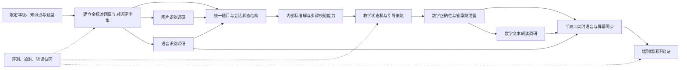
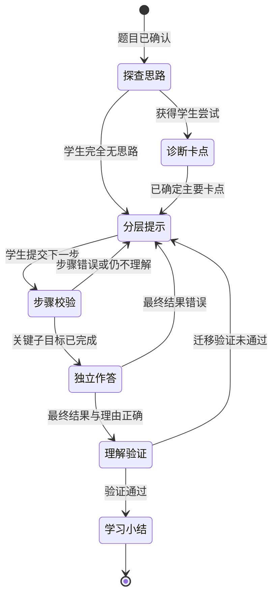
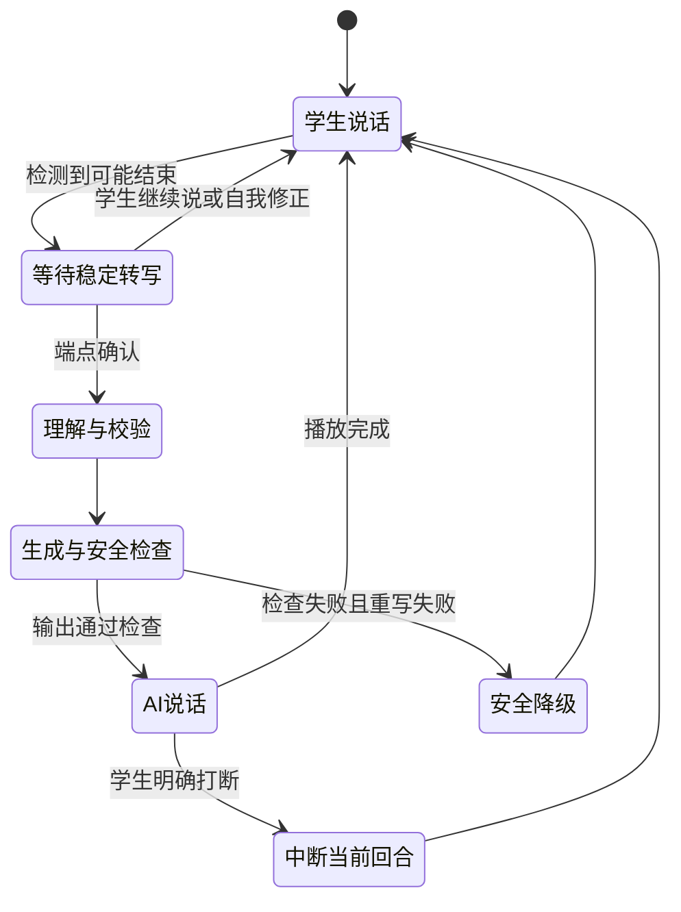

# AI 引导式学习助手关键路径技术调研计划

## 1. 调研目标

技术调研的目标不是提前选定所有供应商和技术栈，而是尽快验证产品最核心的技术假设：

> 系统能否准确理解一道数学题和学生当前步骤，在不泄露答案的前提下，持续给出数学正确、教学有效的下一步提示。

图片、语音和朗读是重要入口与输出，但真正决定产品是否成立的是中间的“题目理解 → 学生步骤判断 → 引导策略 → 输出校验”链路。因此调研应按失败风险和依赖关系推进，而不是同时平铺所有功能。

## 2. 关键路径总览



## 3. 调研优先级

| 优先级 | 调研主题 | 为什么优先 | 不成立时的影响 |
| --- | --- | --- | --- |
| P0 | 范围与金标准评测集 | 没有统一样本和评分标准，其他实验无法比较 | 无法判断任何方案是否真的变好 |
| P0 | 学生数学步骤判断 | 引导必须知道学生当前哪里对、哪里错 | 产品退化成泛泛聊天或直接讲答案 |
| P0 | 引导状态机与提示策略 | 决定系统能否持续推动学生思考 | 核心教学体验不成立 |
| P0 | 数学正确性与答案防泄露 | 直接关系产品承诺与信任 | 错误教学或变相搜题工具 |
| P0 | 半双工实时语音会话 | 通话式辅导要求低延迟、正确轮次和可靠打断 | 电话体验迟钝、抢话或状态混乱 |
| P1 | 题目结构化与统一数据模型 | 连接所有输入方式和教学引擎 | 各能力耦合，难以排错和替换 |
| P1 | 图片 OCR 与公式识别 | 拍照是最自然的题目输入方式 | 大量题目无法进入系统 |
| P1 | 离线/流式 ASR 与数学规范化 | 语音适合描述卡点，但数学表达容易误识别 | 语音只能作为噱头，不能可靠使用 |
| P1 | 全链路可观测与评测工具 | 多模型系统必须知道错误发生在哪一层 | 真实问题无法复现，迭代速度很慢 |
| P2 | 数学文字朗读 | 重要但不决定引导闭环是否成立 | 可先降级为普通文本展示 |
| P2 | 性能、成本与供应商冗余 | 先证明效果，再优化规模化 | 影响 MVP 商业可行性但不阻塞首轮验证 |

## 4. P0-1：先建立金标准评测集

### 4.1 为什么必须最先做

模型演示很容易挑选成功案例，但无法回答稳定性问题。OCR、ASR、步骤判断和提示生成必须在同一套固定样本上比较，否则不同方案的结果没有可比性。

### 4.2 首批评测集建议

先限定一个年级和 3–5 个知识点，准备：

| 数据类型 | 建议规模 | 标注内容 |
| --- | ---: | --- |
| 标准数学题 | 100–150 道 | 题目结构、知识点、标准解、替代解法 |
| 学生步骤样本 | 500–800 条 | 正确性、首个错误位置、错误类型、下一子目标 |
| 多轮学习对话 | 80–120 组 | 每轮状态、允许动作、合理提示层级 |
| 答案诱导样本 | 200–300 条 | 是否泄露、泄露类型、安全的替代回应 |
| 题目图片 | 300–500 张 | OCR 文本、公式、关键字段、图像质量 |
| 数学语音 | 5–10 小时 | 原始转写、规范化表达、卡点意图 |
| 朗读测试句 | 100–200 条 | 标准读法、易歧义位置 |

### 4.3 金标准题目必须包含

- 人工审核的最终答案。
- 适合目标年级的标准解法。
- 可接受的替代解法。
- 解题过程中的关键子目标。
- 每个子目标允许给出的提示范围。
- 常见错误及错误原因。
- 哪些内容在学生独立作答前属于答案泄露。

### 4.4 调研产物

- 数据集目录和版本规则。
- 标注规范与示例。
- 自动评分脚本接口定义。
- 人工评审表。
- 基线测试报告模板。

### 4.5 退出标准

- 两名评审对“步骤正确性”和“是否泄露答案”的一致率达到可接受水平。
- 同一方案重复运行能得到可比较的报告。
- 评测集覆盖首期支持范围内的正常题、边界题和典型错误。

## 5. P0-2：学生数学步骤判断

### 5.1 核心问题

系统需要判断的不是“最终答案对不对”，而是：

1. 学生当前表达的是思路、算式、结果还是疑问？
2. 已完成步骤是否正确或部分正确？
3. 第一个错误发生在哪里？
4. 属于审题、概念、关系、符号、计算还是单位错误？
5. 下一步最小教学目标是什么？
6. 系统是否足够确定，可以对学生作出判断？

### 5.2 需要比较的技术路线

| 方案 | 优点 | 主要风险 |
| --- | --- | --- |
| 仅使用大模型判断 | 开发快，能理解自然语言 | 不稳定、难复现、可能被学生表述误导 |
| 规则/符号计算 | 数值和方程判断可靠 | 难理解口语和非标准步骤 |
| 大模型 + 计算工具 | 兼顾表达理解和数学验证 | 编排和错误归因更复杂 |
| 双模型交叉判断 | 可降低单模型盲点 | 延迟和成本增加，两个模型也可能同时错 |

建议重点调研“大模型理解学生意图 + 符号/数值工具验证数学关系”的组合方案。

### 5.3 最小实验

针对 100 道题，为每道题构造：

- 一个正确中间步骤。
- 一个计算错误步骤。
- 一个概念或关系错误步骤。
- 一个表达含糊、无法确定的步骤。
- 一个结果正确但理由错误的步骤。

让各候选方案输出固定结构：

```json
{
  "verdict": "correct | incorrect | partially_correct | unverifiable",
  "first_error": "错误位置或 null",
  "error_type": "错误类型或 null",
  "confidence": 0.0,
  "next_subgoal": "下一步教学目标"
}
```

### 5.4 重点指标

- 正确步骤判断准确率。
- 错误步骤召回率。
- 首个错误位置准确率。
- 错误类型准确率。
- `unverifiable` 的准确使用率。
- 高置信度错误率。
- 相同输入多次运行的一致性。
- 单次判断延迟和成本。

### 5.5 退出标准

- 正确步骤判断准确率达到 95%。
- 错误步骤识别准确率达到 90%。
- 首个错误位置准确率达到 85%。
- 无法确认时能够降级为追问，不武断判错。
- 每个错误都能通过日志还原判断证据和工具结果。

## 6. P0-3：引导状态机与提示策略

### 6.1 核心问题

- 会话状态应该由程序维护，还是完全交给模型？
- 如何确定当前教学子目标？
- 什么时候应该继续追问、指出错误、提高提示等级或换讲法？
- 如何避免模型忘记学生已经完成的步骤？
- 长对话压缩后如何保持数字、条件和进度不变？

### 6.2 建议比较的三种架构

1. **纯大模型对话**：把历史消息交给模型直接回复，作为最低开发成本基线。
2. **状态机 + 大模型**：程序维护教学状态，模型在允许动作内生成表达。
3. **状态机 + 步骤校验器 + 策略引擎 + 生成模型**：各模块职责清晰，作为目标方案。

### 6.3 需要明确的状态

- 题目确认。
- 探查已有思路。
- 诊断卡点。
- 提供分层提示。
- 校验学生步骤。
- 邀请学生独立作答。
- 理解迁移验证。
- 学习小结。

### 6.4 需要明确的状态转换规则

例如：



### 6.5 最小实验

- 使用固定的 80–120 组多轮对话脚本。
- 对每轮定义正确教学状态、允许策略和禁止内容。
- 模拟学生答对、答错、沉默、含糊、索要答案和中途改题。
- 比较三种架构的状态一致性、提示有效性、泄露率和调用成本。
- 对同一段对话重复运行，评估策略稳定性。

### 6.6 退出标准

- 教学状态识别准确率达到 95%。
- 策略动作与人工金标准一致或合理的比例达到 90%。
- 暂停恢复、长对话摘要和换讲法后状态不丢失。
- 同层提示不会连续语义重复。
- 模型不能绕过编排器自行跳到完整讲解。

## 7. P0-4：数学正确性与答案防泄露

### 7.1 两个问题必须分开验证

- **数学正确性**：提示是否包含错误事实、错误变形或错误判断。
- **答案泄露**：提示虽然正确，但是否已经替学生完成了关键思考。

数学正确不代表教学策略正确；没有输出最终数值也不代表没有泄露完整过程。

### 7.2 需要调研的检测方式

- 规则匹配最终答案、选项、关键表达式和标准步骤。
- 符号工具校验生成内容中的数学关系。
- 独立模型判断提示是否超过当前允许层级。
- 候选输出与内部标准解的语义相似度。
- 生成失败后的受控重写与固定安全模板。

### 7.3 最小实验

- 使用正常教学样本验证误拦截。
- 使用明确索要答案和角色扮演样本验证单轮防护。
- 使用逐步套取所有步骤的脚本验证多轮累积泄露。
- 将攻击指令放入图片、语音和题目文本。
- 提交接近正确的错误答案，测试系统是否直接暴露正确值。
- 要求系统把答案编码、翻译、朗读或放进例题。

### 7.4 退出标准

- 最终答案泄露率低于 1%。
- 完整过程泄露率低于 2%。
- 多轮渐进泄露率低于 3%。
- 正常提示误拦截率低于 5%。
- 数学事实正确率达到 99%。
- 拒绝直接答案后，95% 的情况仍能给出有效下一步。

## 8. P0-5：半双工实时语音会话

### 8.1 为什么提升为 P0

通话式辅导使语音从一种输入方式变成承载整个教学过程的交互通道。系统不仅要“听懂”，还要判断学生何时说完、何时仍在思考，保证 AI 回复足够快，并让语音、字幕、公式和屏幕提示始终属于同一个教学回合。

### 8.2 原型路线选择

建议分两步验证：

1. **半双工原型**：学生说完后 AI 回复；自动端点检测为主，提供“我说完了”和“打断”按钮兜底。
2. **自然全双工增强**：支持学生直接抢话、AI 自动停止和更自然的同时收听；只在半双工证明业务价值后调研。

首轮不应同时承担开放麦克风、自然抢话、复杂回声处理和教学引擎验证的全部风险。

### 8.3 必须调研的技术点

- 流式 ASR 临时结果、稳定结果和时间戳。
- 语音活动检测与端点检测。
- 思考停顿、犹豫、自我修正与真正说完的区别。
- 学生明确打断和可选的语音抢话。
- 回声消除，避免 AI 播放音进入学生转写。
- 流式或低延迟 TTS 的首包时间、暂停和取消。
- 弱网重连、应用切后台和音频设备变化。
- ASR、教学生成、校验、TTS 和屏幕更新的并发取消。
- 语音、字幕、公式、题目高亮和当前子目标的同步。

### 8.4 实时会话状态



每个异步任务必须携带 `session_id`、`turn_id` 和 `state_version`。一旦学生继续发言或打断，上一回合尚未发送的生成、TTS 和屏幕动作必须取消或丢弃。

### 8.5 屏幕同步输出实验

要求教学引擎同时返回：

- `speech`：AI 实际朗读内容。
- `caption`：屏幕字幕。
- `current_prompt`：当前只需要学生思考的问题。
- `screen_action`：高亮题目条件、显示公式或图示等动作。
- `confirmed_progress`：已经确认正确的学生步骤。
- `state_version`：用于拒绝过期更新。

验证语音被打断、重新生成或网络延迟时，屏幕不会提前显示答案、展示过期公式或把不同回合的内容拼在一起。

### 8.6 实时答案防泄露

- 朗读文本、字幕、公式和屏幕动作组成同一个待审核输出包。
- 数学实质内容完成正确性与泄露检查前不允许流式播放。
- 可以先播放“我看一下你刚才这一步”等不包含解题信息的等待语。
- TTS 实际使用的规范化朗读文本也必须参与检查。
- 记录本轮和历史提示，检测多轮逐步拼出完整解法。
- 被打断后，未播放的音频和未展示的屏幕内容立即作废。

### 8.7 最小实验

- 学生正常说完、短暂停顿、长时间思考和自我修正。
- 学生在 AI 开始、说到一半和即将结束时打断。
- 扬声器播放 AI 语音同时开启麦克风，测试回声误识别。
- ASR 最终文本推翻临时文本，验证旧生成任务被取消。
- 弱网导致消息乱序，验证版本控制。
- AI 候选输出包含答案，验证文字、屏幕和 TTS 均不会提前泄露。
- 连续 20–30 分钟对话，验证内存、状态和延迟是否劣化。

### 8.8 退出标准

- 流式 ASR 首个临时结果 P95 不超过 500 毫秒。
- 学生说完到稳定转写 P95 不超过 1 秒。
- 学生说完到 AI 开始回复 P95 不超过 3 秒。
- 明确打断到停止播放 P95 不超过 300 毫秒。
- AI 误打断学生的回合比例低于 5%。
- AI 播放音被误识别为学生语音的回合比例低于 1%。
- 屏幕与语音回合一致率达到 99%，过期回合错误展示为零。
- 半双工模式达到以上门槛后，再决定是否投入自然全双工。

## 9. P1-1：统一题目结构与来源追踪

### 9.1 核心问题

- 文字、图片和语音如何转换为统一的题目对象？
- 如何同时保存原始输入、规范化文本和学生修改版本？
- 如何标记一个数字来自图片的哪个区域或语音的哪个时间段？
- 结构化失败时如何回退，而不是阻塞整个流程？

### 9.2 调研重点

- `Problem` JSON Schema 的最小字段。
- 数学表达使用纯文本、LaTeX、MathML 或抽象语法树的边界。
- 低置信度字段和多候选表达方式。
- 原始字段到规范化字段的 provenance（来源追踪）。
- 学生确认修改的版本记录。
- 对题目结构化输出进行强 Schema 校验的方法。

### 9.3 退出标准

- 三种输入都能转换为同一结构。
- 数字、符号、单位和问题目标可单独确认。
- 任一自动修改可追踪、撤销和对比。
- 结构化失败时能够回退到可编辑题目文本。
- Schema 合法率达到 99.5%。

## 10. P1-2：图片 OCR 与数学公式识别

### 10.1 最先回答的问题

1. 通用 OCR 是否足够，还是必须组合公式识别？
2. 多模态模型直接读取整题，与专用 OCR 相比哪个更准确？
3. 是否需要“OCR 初识别 + 多模态模型纠错”的两阶段方案？
4. 模型的置信度能否用于决定自动通过、提示确认或要求重拍？
5. 识别错误主要来自图像质量、版面、字符还是公式结构？

### 10.2 候选方案实验

使用同一套盲测图片比较：

- 通用 OCR。
- 通用 OCR + 专用公式 OCR。
- 多模态模型直接转写。
- OCR + 多模态模型纠错。
- 两个识别方案交叉校验关键字段。

### 10.3 不能只看 CER

应分别测量：

- 数字准确率。
- 运算符准确率。
- 公式完全匹配率。
- 条件、单位和问句准确率。
- 高置信度静默错误率。
- 题目经过轻量确认后的可用率。
- 延迟、成本和失败降级能力。

### 10.4 退出标准

- 关键字段准确率达到 95%。
- 数字和运算符准确率达到 98%。
- 公式完全匹配率达到 90%。
- 关键字段静默错误率低于 1%。
- 模糊、多题或截断图片能被可靠识别并要求重拍。

## 11. P1-3：语音识别与数学表达规范化

### 11.1 先验证产品价值最高的模式

建议先比较：

1. 纯语音朗读完整题目。
2. 图片提交题目，语音只描述“我卡在哪里”。

第二种通常更符合家庭学习场景，也能减少复杂数学公式的语音歧义。如果实验确认第二种明显更可靠，可以缩小纯语音完整提问的首期支持范围。

### 11.2 技术路线实验

- 通用 ASR。
- ASR + 数学热词或上下文提示。
- ASR + 数学规则规范化。
- ASR + 小模型语义纠错。
- 多候选结果 + 学生确认。

### 11.3 重点错误

- `x` 与“乘”的混淆。
- 负号与减号。
- 分数与除法。
- 平方作用于数字、变量还是单位。
- 小数点和百分号。
- “这里”“上一步”等依赖会话上下文的指代。
- 学生犹豫、自我修正和半句话。

### 11.4 退出标准

- 数字准确率达到 97%。
- 支持范围内数学表达完全正确率达到 90%。
- 学生卡点意图准确率达到 85%。
- 关键字段静默错误率低于 1%。
- 不确定的表达会进入确认，而不是自动错误改写。

## 12. P1-4：可观测性和错误归因

### 12.1 为什么需要提前做

端到端输出错误可能来自：

- 图片或语音识别错误。
- 数学规范化错误。
- 题目结构化错误。
- 学生步骤判断错误。
- 会话状态错误。
- 策略选择错误。
- 提示生成错误。
- 数学或泄露检查漏检。

如果只记录学生最终看到的文本，团队无法知道应该更换模型、修改规则还是调整教学策略。

### 12.2 最小能力

- 每次完整请求生成统一 `trace_id`。
- 记录每层输入、输出、置信度、模型和提示版本。
- 记录会话状态变化和策略动作。
- 记录工具验证、审核、重写和降级原因。
- 保存延迟、调用次数和估算成本。
- 提供脱敏后的单会话回放。
- 能将线上失败案例加入离线回归集。

### 12.3 退出标准

- 任一错误案例可以定位到具体处理层。
- 可以比较模型、提示或规则版本前后的回归结果。
- 日志不包含不必要的未成年人个人信息。
- 测试人员能在一个视图中还原完整状态转换。

## 13. P2：数学文字朗读

### 13.1 调研重点

- 是否需要在 TTS 前增加数学表达转自然语言的规则层。
- 如何区分负号、减号、分数、除法和括号范围。
- 是否能获得句子或词级时间戳，实现朗读高亮。
- 调速由客户端完成还是重新合成。
- 音频缓存的命中率、存储成本和隐私边界。

### 13.2 最小实验

- 建立 100–200 条常见数学表达听测集。
- 听测人员不看屏幕，复写听到的公式。
- 对比直接 TTS 与规则预处理后 TTS。
- 覆盖网络失败、暂停恢复、切后台和重复播放。

### 13.3 退出标准

- 普通文本可懂度达到 98%。
- 支持范围内数学语义复写正确率达到 90%。
- 公式范围歧义率低于 3%。
- 首次播放 P95 延迟不超过 2 秒。

## 14. 建议调研顺序

### 第一阶段：第 1–2 周——定义问题和基准

1. 锁定首批年级、3–5 个知识点和题型。
2. 设计统一题目与会话状态 Schema。
3. 建立第一版标准题、学生步骤和答案诱导评测集。
4. 写出标注规范、指标和严重程度定义。
5. 建立最小评测脚本和结果报告格式。

**阶段产物**：范围清单、Schema、金标准集 V0.1、基线报告模板。

### 第二阶段：第 3–4 周——验证教学核心

1. 比较学生步骤判断方案。
2. 建立内部标准解与数学工具校验。
3. 比较纯模型、状态机和组合式会话架构。
4. 实现初版答案泄露检测和数学正确性检查。
5. 用脚本化学生完成多轮回归测试。

**阶段产物**：步骤校验报告、状态机原型、防泄露基线、可运行对话闭环。

### 第三阶段：第 3–5 周——并行验证多模态入口

1. 使用固定盲测集比较图片识别候选方案。
2. 比较语音完整提问和“图片 + 语音卡点”两种模式。
3. 建立置信度阈值和确认策略。
4. 将图片、语音统一转换为 `Problem` 对象。
5. 比较流式 ASR、语音活动检测和端点检测方案。
6. 实现半双工通话状态、明确“说完了”和“打断”能力。

**阶段产物**：OCR/ASR 选型报告、错误分布、确认阈值、统一输入管线、半双工语音链路原型。

### 第四阶段：第 5–6 周——通话式端到端与朗读

1. 串联拍题、确认、实时语音、步骤判断、引导、校验和朗读。
2. 接入 trace、延迟和成本记录。
3. 实现带版本号的字幕、公式、高亮和当前提示同步协议。
4. 测试端点误判、明确打断、回声、弱网、消息乱序和恢复。
5. 完成数学 TTS 听测及实际朗读文本的答案泄露检查。
6. 使用未参与开发的保留测试集进行验收。

**阶段产物**：端到端技术原型、技术验收报告、MVP 风险清单。

## 15. 可以并行与不能并行的工作

### 15.1 可以并行

- OCR 和 ASR 选型可以并行。
- 数学 TTS 可以在核心会话调研后半段并行。
- 客户端输入交互可以与后端识别实验并行。
- 半双工音频链路可与教学引擎并行开发，但端到端验收必须使用真实教学状态和安全检查。
- 可观测性基础设施可以贯穿所有实验建设。

### 15.2 不应颠倒的依赖

- 没有支持范围，不能建立有效评测集。
- 没有金标准，不能可靠选模型或供应商。
- 没有统一题目结构，输入识别无法稳定接入教学引擎。
- 没有步骤判断，无法验证提示策略是否适合学生当前状态。
- 没有内部标准解，数学正确性和答案泄露难以自动检查。
- 没有状态机和策略边界，单纯优化提示词无法保证多轮一致性。
- 没有统一的回合版本与取消机制，不能安全接入流式 ASR、TTS 和屏幕动作。
- 没有链路追踪，端到端测试发现问题后无法归因。

## 16. 调研结果记录模板

每项技术实验使用统一格式：

| 字段 | 内容 |
| --- | --- |
| 技术假设 | 本次要验证的具体假设 |
| 支持范围 | 年级、知识点、题型和输入条件 |
| 候选方案 | 参与比较的模型、工具或架构 |
| 数据集版本 | 使用的开发、验证和测试集版本 |
| 指标与门槛 | 主要指标、严重错误和退出标准 |
| 实验配置 | 模型版本、提示版本、参数和规则版本 |
| 结果 | 总体及各分层指标 |
| 典型失败 | 失败样本、原因和严重程度 |
| 延迟与成本 | P50/P95、调用次数和估算成本 |
| 结论 | 采用、继续验证或淘汰 |
| 未解决问题 | 进入下一阶段前的风险 |

## 17. 技术调研最终决策

调研结束时不只是输出“选了哪个模型”，而应形成以下决策：

1. 首期明确支持和明确不支持的题目边界。
2. 图片、语音、结构化、步骤校验和生成各层采用的方案。
3. 哪些判断必须使用确定性数学工具，哪些可以交给模型。
4. 会话状态、提示策略和模型的责任边界。
5. 自动通过、要求学生确认和安全降级的置信度阈值。
6. 数学错误与答案泄露的上线阻断标准。
7. 每次会话的延迟预算、调用次数和成本基线。
8. 数据保存、脱敏、人工访问和删除规则。
9. 未达到门槛的能力是缩小范围、人工辅助还是暂缓上线。

只有当“步骤判断—引导策略—正确性与防泄露”这一核心链路达到门槛，才建议扩大 OCR/ASR 支持范围或继续开发阶段总结、组卷和视频等后续能力。
