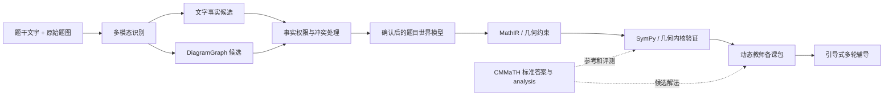

# CMMaTH 仓库分析

## 目录

- [1. 分析范围与结论摘要](#1-分析范围与结论摘要)
- [2. CMMaTH 是什么](#2-cmmath-是什么)
- [3. 论文中的完整数据集](#3-论文中的完整数据集)
- [4. GitHub 仓库实际提供了什么](#4-github-仓库实际提供了什么)
- [5. 数据结构与标注价值](#5-数据结构与标注价值)
- [6. GradeGPT 的作用与限制](#6-gradegpt-的作用与限制)
- [7. 对当前项目的价值](#7-对当前项目的价值)
- [8. 与题目世界模型和 DiagramGraph 的关系](#8-与题目世界模型和-diagramgraph-的关系)
- [9. 推荐的接入与评测方案](#9-推荐的接入与评测方案)
- [10. 风险与工程问题](#10-风险与工程问题)
- [11. 是否适合作为知识库](#11-是否适合作为知识库)
- [12. 分阶段落地建议](#12-分阶段落地建议)
- [13. 综合判断](#13-综合判断)
- [14. 主要参考资料](#14-主要参考资料)

## 1. 分析范围与结论摘要

分析对象：[`zzli2022/CMMaTH`](https://github.com/zzli2022/CMMaTH)。

本次分析基于 2026-08-17 获取的 `main` 分支快照，最新提交为 [`ecd558feab7906cfee4154647febdba73a286a05`](https://github.com/zzli2022/CMMaTH/commit/ecd558feab7906cfee4154647febdba73a286a05)，提交日期为 2024-06-16。分析范围包括论文、README、数据样本、模型调用脚本、GradeGPT 训练与评测代码，以及仓库文件完整性。没有训练 GradeGPT，也没有执行完整模型评测。

核心结论：

1. CMMaTH 的本质是一个**中文 K12 多模态数学模型评测基准**，不是题库教学系统，也不是引导式辅导框架。
2. 它最适合帮助我们评测“题目图片是否看懂、图文信息是否结合、最终数学答案是否正确”，不直接评测“是否像老师一样引导学生”。
3. 论文中的完整数据集有 23,856 题，但 GitHub 当前只公开了 1,000 条样本数据，而且没有提供这些题目引用的原始题图。仓库不能直接支持完整的多模态复现实验。
4. 完整数据集严重偏向高中：小学题只有 800 题，占约 3.35%。公开的 1,000 题样本中，六年级只有 6 题，因此它不能替代我们自己的“六年级应用题金标准/评测集”。
5. 其中的自然语言解答、知识点、年级、题型和图像类别，对生成“教师备课包”有参考价值，但不能直接当作固定教学步骤。
6. GradeGPT 是最终答案等价性判断器，不是数学证明器，也不是教学质量评估器。它无法判断答案是否提前泄露、是否理解学生思路、是否在合适时机结束辅导等核心问题。
7. 对当前项目最合理的使用方式是：借鉴其数据字段和评测方法，建立一个我们自己的、小而高质量的图形题私有评测集；不建议把 CMMaTH 全量塞入知识库后依赖相似题检索来驱动教学。

## 2. CMMaTH 是什么

CMMaTH 全称为 **A Chinese Multi-modal Math Skill Evaluation Benchmark for Foundation Models**。它希望回答的问题是：

> 一个多模态大模型能否理解带有中文文字、数学符号、统计图表和几何图形的 K12 数学题，并给出正确答案？

它的标准处理路径是：

```text
题干文字 + 题目图片
→ 多模态模型生成完整解答
→ 将模型解答与标准答案比较
→ 按年级、图像类别、知识点等维度统计准确率
```

因此，它主要覆盖：

- 图片中的中文与数学符号识别；
- 图表、几何图和题干之间的联合理解；
- 数学推理和最终答案生成；
- 开放式答案的自动等价性判断；
- 不同年级、图像类型和知识点的细粒度分析。

它不包含以下能力：

- 学生解题步骤理解；
- 学生当前意图和困惑点跟踪；
- 引导式教学状态机；
- 多轮实时语音辅导；
- 答案防泄露策略；
- 学生是否真正理解的判定；
- 图形重绘、事实确认和讲解高亮；
- 阶段性学习总结与组卷。

所以，CMMaTH 与我们的关系更接近“基础能力考场”，而不是“可以直接复用的老师”。

## 3. 论文中的完整数据集

### 3.1 数据规模

COLING 2025 正式论文给出的主要统计如下：

| 项目 | 数量 |
| --- | ---: |
| 总题目数 | 23,856 |
| 选择题 | 18,191 |
| 开放式题目 | 5,665 |
| 小学 1–6 年级 | 800 |
| 初中 7–9 年级 | 5,082 |
| 高中 10–12 年级 | 17,972 |
| 知识点 | 正式论文为 784 个 |
| 视觉主题 | 13 类 |
| `testmini` | 正式论文为 1,371 题 |

需要特别注意：早期 arXiv 版本和正式论文之间存在统计变化。早期版本曾出现 2,299 个知识点，以及 `testmini` 为 1,000 或 1,500 题的不同表述。本文后续涉及总体统计时，以 COLING 2025 正式论文为主；评估仓库可用性时，以 GitHub 中实际文件为准。

### 3.2 年级分布并不适合直接支撑六年级产品

小学题只占完整数据集约 3.35%，高中题约占 75.34%。这意味着：

- 它能评测广义的中文多模态数学能力；
- 它不能代表六年级学生真实遇到的题型分布；
- 它对高中解析几何、立体几何、统计图等内容的权重远高于小学应用题；
- 如果直接使用整体准确率，会掩盖我们真正关心的六年级表现。

### 3.3 视觉类型

论文和公开样本涉及的主要类型包括：

- 平面几何图、解析几何图、立体几何图；
- 条形图、折线图、散点图、饼图、雷达图；
- 可视化表格、流程图、韦恩图；
- 三视图、折叠展开图；
- 抽象类比图等。

这对我们计划支持的“基础平面几何、面积、周长、组合图形、统计图和示意图”有一定覆盖价值。但 CMMaTH 只标注视觉类别，没有提供可直接执行的 `DiagramGraph`、几何谓词或图元坐标真值。

### 3.4 数据收集和标注方式

论文描述的数据流程大致为：

```text
真实 K12 题库
→ 选出含图题
→ 过滤无需看图也能作答的题
→ 过滤过小、模糊或疑似不可解的图片
→ 生成并审核知识点标签
→ 保存标准答案和自然语言解答
```

知识点分类使用 GPT-4 和微调模型辅助，再经过人工多级核验。这个流程说明数据具有较强的真实题库属性，但也意味着知识点标签不是天然无误的数学形式化事实。

## 4. GitHub 仓库实际提供了什么

### 4.1 目录构成

仓库主要包含：

| 目录或文件 | 内容 |
| --- | --- |
| `cmmath.json` | 部分 CMMaTH 数据样本 |
| `GradeGPT/` | GradeGPT 微调脚本、提示词和部分训练数据 |
| `result/` | 若干旧模型的推理和评分结果 |
| `tool/` | 答案比较、模型运行和准确率统计工具 |
| `sh_files/` | 批量评测脚本 |
| `figures/` | 论文中的统计图，不是题目原图 |
| `run_llm_response.py` | 生成模型答案的入口脚本 |

### 4.2 公开数据只是 1,000 题样本

仓库中的 `cmmath.json` 实际包含 1,000 道题，而不是论文中的 23,856 道完整数据。README 也明确说明公开的是部分数据，并称完整数据会在评审完成后发布；但截至本次分析的仓库快照，最后一次提交仍停留在 2024 年，完整数据尚未出现在该仓库中。

公开样本的分布为：

| 年级 | 题数 | 年级 | 题数 |
| --- | ---: | --- | ---: |
| 1 | 7 | 7 | 51 |
| 2 | 2 | 8 | 70 |
| 3 | 5 | 9 | 88 |
| 4 | 11 | 10 | 175 |
| 5 | 9 | 11 | 255 |
| 6 | 6 | 12 | 321 |

其中选择题 781 道，开放式题目 219 道。六年级只有 6 道，无法构成有意义的产品评测集。

### 4.3 题目图片没有随数据提供

每条数据的 `image` 字段引用类似 `17886_img.png` 的图片文件，但仓库中没有这些题图；`figures/` 下只有论文使用的 3 张汇总图片。因此：

- 可以分析题干、答案、解答和标签；
- 不能仅凭当前仓库运行真正的图文联合评测；
- 不能验证 OCR、图形结构识别或 `DiagramGraph` 生成准确率；
- 如果找不到作者提供的独立下载地址，就需要联系作者获取题图。

这是该仓库目前最关键的可复现性缺口。

### 4.4 GradeGPT 也不是开箱即用

仓库提供了微调代码和部分指令数据，但 README 要求用户自行设置 `GRADEGPT_WEIGHT`。仓库内没有正式论文所述的完整训练数据和可直接使用的模型权重，因此不能直接获得论文宣称的免费自动评测能力。

## 5. 数据结构与标注价值

公开样本大致使用以下结构：

```json
{
  "problem_id": "17886",
  "question": "题干和选项",
  "image": ["17886_img.png"],
  "imulti_img": false,
  "answer": "标准答案",
  "answer_type": "choice",
  "grade_id": 12,
  "grade_group": 3,
  "knowledge_point": "嵌套的知识点路径",
  "skill": "运算能力",
  "analysis": "自然语言标准解答",
  "metadata": {
    "multimodal-category": "Bar Chart",
    "task-target": "...",
    "img_info": [{"height": "...", "width": "..."}]
  },
  "ocr": "OCR 字符、位置和置信信息"
}
```

对我们有价值的字段可以分为三类：

| 用途 | 可使用字段 | 限制 |
| --- | --- | --- |
| 题目筛选 | `grade_id`、`knowledge_point`、视觉类别 | 六年级数据太少，标签粒度和版本有漂移 |
| 教师备课候选 | `question`、`answer`、`analysis` | `analysis` 只是一条参考解法，不是完整解法空间 |
| 模型评测 | `answer_type`、标准答案、题目类别 | 当前缺少原图，不能完成多模态评测 |

另外，公开样本中大多数 `skill` 字段为空，不能依赖它直接建立稳定的能力画像。

最重要的使用边界是：`analysis` 应当被视为“待验证的参考解法”，不应直接变成固定对话顺序。它需要经过数学验证、核心思路抽取、多解法补充和提示边界设计，才能进入教师备课包。

## 6. GradeGPT 的作用与限制

### 6.1 它解决什么问题

开放式数学题的模型输出往往包含大量过程，不能只用字符串完全匹配。GradeGPT 接收：

```text
题目 + 标准答案 + 模型回答
```

然后输出模型回答是否与标准答案等价，并给出判断过程。论文称其使用约 5.6 万条由 GPT-4 蒸馏的跨语言答案判断指令进行训练；14B 版本配合 vLLM 的答案判断准确率达到 96.1%。

这个思路适合：

- 从较长回答中提取最终结论；
- 识别格式不同但数学含义相同的答案；
- 批量评估多种多模态模型；
- 按题型和知识点快速比较模型版本。

### 6.2 它不是什么

GradeGPT 不是：

- 独立数学证明器；
- SymPy 或几何计算内核；
- 学生步骤理解器；
- 教学策略评价器；
- 题目事实核验器。

它判断“回答是否与参考答案一致”，但无法保证中间推理每一步正确。在教学场景中，学生可能用错误理由碰巧得到正确答案；这类情况不能只靠 GradeGPT 识别。

### 6.3 对当前项目可借鉴的方式

我们可以借鉴“答案等价性评估器”的接口，但应使用组合评估：

```text
SymPy / 几何内核：验证可形式化的数学结论
规则检查器：检查单位、范围、格式和答案泄漏
LLM Judge：处理自然语言等价、不可形式化结论
人工复核集：持续检测自动裁判偏差
```

同时，辅导对话还必须单独评价：是否理解学生当前步骤、是否重复提问、是否过度限制学生思路、是否泄露答案、是否正确进入完结态。

## 7. 对当前项目的价值

### 7.1 可直接借鉴

1. **多维评测数据结构**：年级、知识点、答案类型、图像类型和自然语言解答字段值得参考。
2. **分类型统计**：不能只看总准确率，应分别看 OCR、统计图、几何图、开放题和各年级表现。
3. **答案等价判断**：可作为 SymPy 无法覆盖时的辅助裁判。
4. **真实中文图形题分布**：可以帮助我们了解未来图形题会遇到的视觉复杂度。
5. **图像依赖性筛选原则**：题目必须真的需要图片才能作答，才能有效验证图形理解能力。

### 7.2 需要转换后才能使用

| CMMaTH 内容 | 需要转换成 | 原因 |
| --- | --- | --- |
| 一条自然语言 `analysis` | 多条候选解法与共同核心 | 学生可能采用不同合法路径 |
| 知识点字符串 | 规范化知识节点 ID | 自由文本不利于稳定统计和检索 |
| OCR 字符与坐标 | 题干事实候选 | OCR 不能确认图形关系 |
| 图片视觉类别 | `DiagramGraph` 初始类型 | 类别只说明“是什么图”，没有描述图中事实 |
| 标准答案 | 可验证的 `MathIR` / 约束 | 答案本身不能证明解题过程正确 |
| 最终答题准确率 | 分阶段指标 | 无法定位是看错图、建模错还是计算错 |

### 7.3 不适合直接承担

- 六年级应用题知识库主体；
- 动态教师备课包的唯一来源；
- 引导会话的固定步骤模板；
- 学生理解程度判断；
- 实时语音交互评测；
- DiagramGraph 的监督真值。

## 8. 与题目世界模型和 DiagramGraph 的关系

CMMaTH 可以提供原始题目和参考解答，但距离我们的“题目世界模型”还有多层转换：



CMMaTH 当前没有标注以下结构：

- 点、线、角、面和图形对象；
- 平行、垂直、共线、等长、包含等谓词；
- 图中标注值对应哪个对象；
- 哪些事实来自题干、图形、模型推断或学生确认；
- 几何推导链与验证结果。

因此，若想用它评测 DiagramGraph，需要先人工选择一小批题并补充结构化真值。比较合理的标注规模不是立刻处理上万题，而是先标 30–100 道覆盖典型视觉类型的高质量题目。

## 9. 推荐的接入与评测方案

### 9.1 不只评最终答案

建议将每道图形题拆成五层指标：

| 层级 | 评测问题 | 示例指标 |
| --- | --- | --- |
| L1 感知 | 文字、数字和符号看对了吗 | OCR 字符/字段准确率 |
| L2 结构 | 图形对象和关系识别对了吗 | DiagramGraph 节点、边、谓词 F1 |
| L3 建模 | 是否形成正确数学约束 | 约束准确率、冲突率 |
| L4 求解 | 计算和推导是否正确 | 最终答案、关键结论验证通过率 |
| L5 教学 | 是否根据学生思路正确引导 | 不重复率、答案泄漏率、路径适应率、完结态准确率 |

这样才能区分：模型是“图没看懂”，还是“看懂了但方程列错”，或者“题会做但不会教”。

### 9.2 为当前 Demo 建立私有切片

推荐优先建立以下切片：

```text
六年级
∩ 应用题或基础图形题
∩ 开放式作答优先
∩ 必须依赖图片
∩ 有人工确认的题干、图形事实、解法和答案
```

可包含：

- 长方形、正方形、三角形、圆和组合图形面积；
- 线段图表达和差、倍数、分数或百分数关系；
- 条形图、折线图、扇形统计图；
- 行程示意图和简单空间示意图。

公开 CMMaTH 样本可以帮助确定类别和字段，但六年级样本太少，主体仍需要来自我们自己有使用权限的题目。

### 9.3 推荐的评测记录格式

每次模型实验至少保存：

```json
{
  "problem_id": "private-g6-001",
  "model": "qwen3-vl-flash",
  "prompt_version": "vision-v3",
  "recognized_problem": {},
  "diagram_graph": {},
  "confirmed_facts": [],
  "math_constraints": [],
  "solution": {},
  "verification": {},
  "final_answer_correct": true,
  "human_review": {}
}
```

这比只保留一个 `model_response` 更适合定位当前系统的问题，也方便比较多个视觉模型和提示词版本。

## 10. 风险与工程问题

### 10.1 数据许可不明确

仓库根目录没有发现 LICENSE 文件。虽然论文说明数据来自合作或私有题库并讨论了开放使用，但在没有明确许可文本时，不能默认题干、解答和图片可用于商业产品、再分发或模型训练。

建议：在正式接入前联系作者确认许可范围，并单独核对题目图片版权。

### 10.2 数据与论文版本漂移

早期论文、正式论文和仓库 README 的 `testmini`、知识点数量等统计不完全一致。工程上应记录数据版本、文件哈希和论文版本，不能笼统标记为“CMMaTH”。

### 10.3 公开基准污染

CMMaTH 已经公开较长时间，较新的模型可能在训练或后训练阶段见过题目。把它用于横向模型比较时，成绩可能包含记忆效应。

建议保留：

- 公开基准：观察通用能力；
- 私有新题集：观察真实泛化；
- 同构变式集：识别是否只记住原题。

### 10.4 自动裁判偏差

GradeGPT 本身是模型，也可能受表达方式、参考答案错误或训练分布影响。96.1% 是论文实验条件下的答案判断准确率，不表示对所有新题、所有语言表达都可靠。

### 10.5 仓库代码质量与安全性

本次静态检查发现：

- README 示例字段为 `is_multi_img`，实际数据使用 `imulti_img`，存在字段漂移；
- README 中部分目录和脚本名与仓库实际结构不一致；
- 仓库跟踪了 `.DS_Store`；
- 一处模型工具源码包含硬编码的访问令牌，不应照搬，也不应假定该令牌仍有效；
- 部分脚本导入、模型初始化顺序和路径配置比较脆弱；
- 依赖旧版本模型与运行环境，不能把论文命令视为当前环境下可直接执行。

如果复用评测逻辑，建议只参考接口和算法思路，在我们自己的代码库中重新实现最小、可测试的版本。

## 11. 是否适合作为知识库

结论是：**可以作为辅助案例库，但不适合作为决定教学行为的主知识库。**

### 11.1 可以放入知识库的内容

- 已确认许可的题干和图片；
- 规范化后的知识点；
- 经过验证的多条参考解法；
- 常见错误与提示策略；
- 图形题的 DiagramGraph 和数学约束；
- 题型原理和适用边界。

### 11.2 不应直接检索后发送给模型的内容

- 单一 `analysis` 作为唯一正确步骤；
- 未验证的自然语言解答；
- 相似题的答案；
- 与当前题目只有表面词语相似的固定提示；
- 完整评测集中的标准答案。

知识库的正确作用应是提供“候选知识和案例”，动态备课模块仍需要先独立理解当前题目，构建约束并验证解法，再决定哪些材料可作为补充。否则容易再次出现严格按照参考步骤提问、忽略学生合法思路的问题。

另外，评测集和知识库必须隔离。若先把 CMMaTH 题目及答案放入模型可检索知识库，再用同一批题评估模型，所得结果将失去意义。

## 12. 分阶段落地建议

### 阶段一：只借鉴，不接入生产

1. 复用字段设计思想，补充我们的图形题评测格式。
2. 为 30 道六年级图形题人工标注题目事实、DiagramGraph、数学约束和参考解法。
3. 用 Qwen3-VL-Flash 跑图片识别和 DiagramGraph 生成。
4. 分别统计 L1–L4 指标，而不是只看最终答案。

### 阶段二：建立多模型回归评测

1. 通过现有 LLM 适配层切换不同视觉模型。
2. 固定题目、提示词版本和输出 Schema。
3. 使用 SymPy、几何内核、规则和 LLM Judge 组合评分。
4. 对自动评分分歧和高风险题进行人工复核。

### 阶段三：连接教学业务

1. 将验证后的题目世界模型输入动态教师备课包。
2. 用不同学生思路脚本测试教学路径适应能力。
3. 增加“不泄露答案、接受非参考路径、纠错、理解确认和完结态”指标。
4. 将视觉解题准确率与教学对话质量分开看板展示。

## 13. 综合判断

| 维度 | 判断 |
| --- | --- |
| 中文多模态数学评测价值 | 高 |
| 六年级应用题覆盖 | 很低 |
| 图形题类别参考价值 | 中高 |
| 可直接下载运行的完整性 | 低 |
| 对 DiagramGraph 的直接支持 | 无，需要二次标注 |
| 对最终答案评测的启发 | 高 |
| 对引导式教学的直接支持 | 低 |
| 作为生产知识库的适合度 | 低到中，取决于许可和加工 |
| 作为架构/评测设计参考 | 高 |

最终建议：**不要把 CMMaTH 当成我们缺失的“教师大脑”，而应把它当成一套多模态数学能力评测思路。** 对当前项目最有价值的落地，是据此建立“图片感知 → 图形结构 → 数学建模 → 正确求解 → 教学表现”的分层评测体系，并用自主、私有、六年级定向的数据补足它的年级和教学缺口。

## 14. 主要参考资料

- [CMMaTH GitHub 仓库](https://github.com/zzli2022/CMMaTH)
- [COLING 2025 正式论文页面](https://aclanthology.org/2025.coling-main.184/)
- [COLING 2025 正式论文 PDF](https://aclanthology.org/2025.coling-main.184.pdf)
- [arXiv 论文页面](https://arxiv.org/abs/2407.12023)
- [早期论文 HTML 版本](https://ar5iv.labs.arxiv.org/html/2407.12023)
