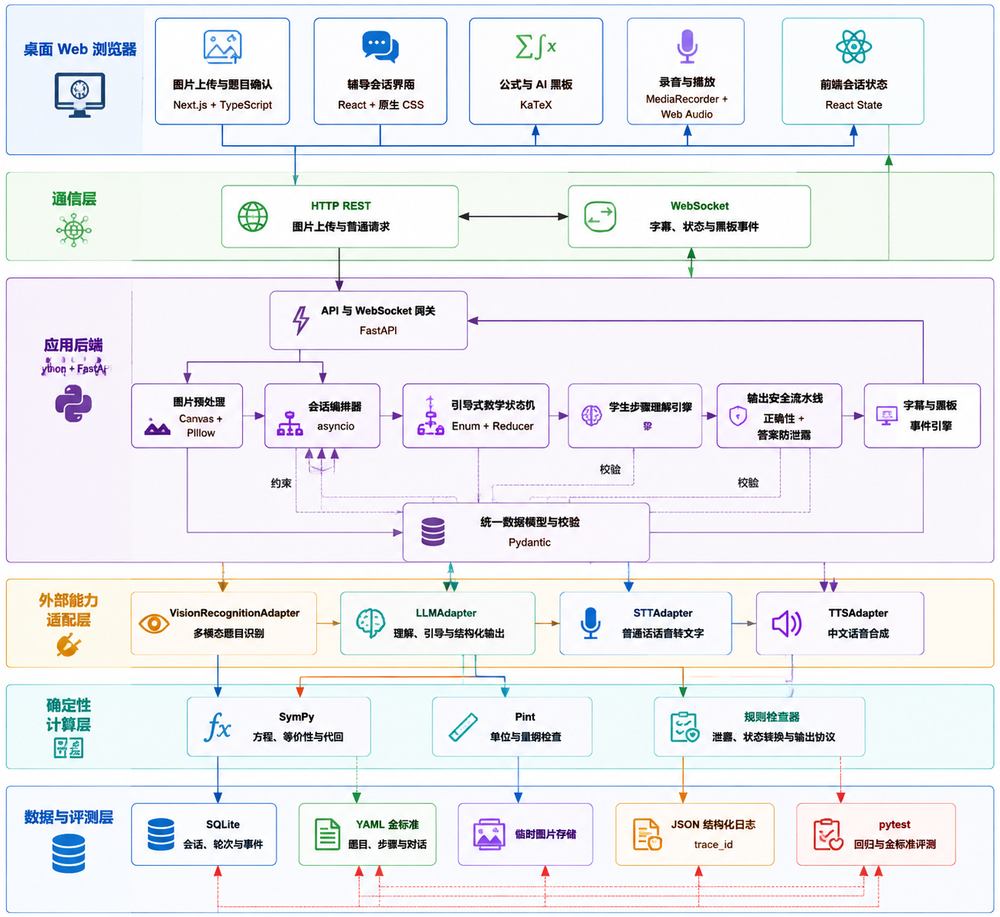
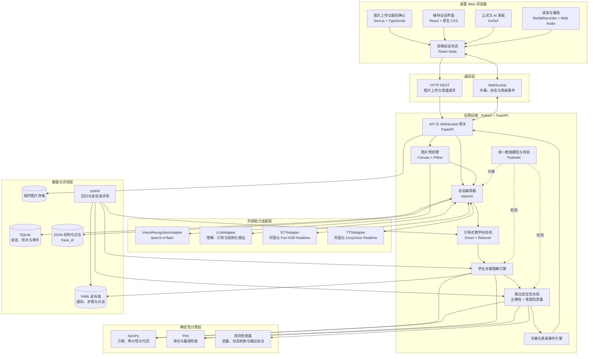

# 通话式 AI 课堂 Demo 技术选型（3.0～3.8）

## 目录

- [1. Demo 技术边界](#1-demo-技术边界)
- [2. 总体技术栈](#2-总体技术栈)
  - [2.1 纯技术架构图](#21-纯技术架构图)
  - [2.2 技术栈清单](#22-技术栈清单)
  - [2.3 LLM 多模型适配与对比机制](#23-llm-多模型适配与对比机制)
  - [2.4 已确定的 Demo 选型](#24-已确定的-demo-选型)
- [3. 3.0 图片题目上传、识别与结构化](#3-30-图片题目上传识别与结构化)
- [4. 3.1 学生数学步骤的理解与判断](#4-31-学生数学步骤的理解与判断)
- [5. 3.2 引导式教学状态机](#5-32-引导式教学状态机)
- [6. 3.3 数学正确性与答案防泄露](#6-33-数学正确性与答案防泄露)
- [7. 3.4 实时语音的轮次判断](#7-34-实时语音的轮次判断)
- [8. 3.5 数学语音识别与上下文纠错](#8-35-数学语音识别与上下文纠错)
  - [8.2 普通话 STT 候选对比](#82-普通话-stt-候选对比)
- [9. 3.6 语音、字幕和 AI 黑板同步](#9-36-语音字幕和-ai-黑板同步)
  - [9.1 中文 TTS 候选对比](#91-中文-tts-候选对比)
- [10. 3.7 打断、取消和异步任务一致性](#10-37-打断取消和异步任务一致性)
- [11. 3.8 端到端延迟](#11-38-端到端延迟)
- [12. Demo 模块结构](#12-demo-模块结构)
- [13. 实施顺序](#13-实施顺序)
- [14. 已确认事项与待讨论项](#14-已确认事项与待讨论项)

## 1. Demo 技术边界

本 Demo 只验证业务闭环是否成立，不承担生产级扩展、海量并发或完整商业化要求。

### 1.1 目标范围

- 六年级数学应用题。
- 使用 `evaluation/` 下的金标准题目作为首批题目来源。
- 以桌面 Web 手动上传图片作为题目入口，识别后必须由学生确认。
- 学生通过半双工语音与 AI 交流。
- 页面展示字幕、当前任务、题目对象、关系式和已确认步骤。
- 验证学生步骤理解、教学策略、数学检查和答案防泄露。
- 支持学生指出 AI 错误后的重新校验与状态回滚。

### 1.2 明确不做

- 自然全双工语音和复杂抢话。
- 多用户并发、集群和水平扩容。
- Redis、Kafka、Celery 等分布式组件。
- 完整账号、支付、家长端和长期学习画像。
- 全题型自动生成可靠参考解法。
- 复杂手写草稿识别和自由画板理解。
- 生产级模型路由、容灾和供应商自动切换。

### 1.3 技术取舍原则

1. 可观察和可调试优先于自动化程度。
2. 确定性规则优先处理能够确定的问题。
3. 大模型负责语言理解和候选生成，不独占数学事实判断。
4. 所有模型输出必须经过结构校验。
5. 先用显式按钮消除语音轮次风险，再逐步增加自动判断。
6. 所有外部模型、STT 和 TTS 均通过适配器调用，方便替换。

## 2. 总体技术栈

### 2.1 纯技术架构图



下方 Mermaid 图用于保留可编辑、可版本管理的架构定义：



图中的核心边界是：

- **Next.js 前端**只负责输入采集、页面展示和本地交互状态，不负责判断数学对错。
- **FastAPI 后端**是业务控制中心，统一编排识题、语音、模型、状态机和输出事件。
- **模型适配层**隔离具体供应商；替换视觉模型、LLM、STT 或 TTS 时，不修改核心教学逻辑。
- **确定性计算层**负责可以验证的数学事实与规则，避免完全依赖大模型判断。
- **SQLite、YAML 和 JSON 日志**分别承担运行数据、金标准和可追踪记录，三者职责不混用。
- 浏览器与后端之间，图片上传使用 **HTTP**，实时字幕、状态和黑板更新使用 **WebSocket**。

### 2.2 技术栈清单

| 层次 | Demo 推荐选型 | 选择原因 |
| --- | --- | --- |
| 前端 | Next.js App Router + TypeScript | 快速实现页面、交互状态和客户端音频能力 |
| UI | 原生 CSS 或轻量组件库 | Demo 不投入复杂设计系统 |
| 数学展示 | KaTeX | 稳定显示公式，不使用图片公式 |
| 图片输入 | HTML 文件选择器 | 桌面 Web 手动选择本地图片，不调用摄像头 |
| 图片预处理 | 浏览器 Canvas + 后端 Pillow | 前端压缩预览，后端校正方向并检查尺寸 |
| 题目识别 | `VisionRecognitionAdapter` + `qwen3-vl-flash` | Demo 直接识别印刷体应用题，避免先建设复杂 OCR 系统 |
| 题目结构化 | LLM 结构化输出 + Pydantic | 将学生确认后的题目转换为对象、关系和目标 |
| 音频采集 | 浏览器 `getUserMedia` + `MediaRecorder` | 浏览器原生能力，适合半双工录音 |
| 实时事件 | 原生 WebSocket | 双向发送会话事件、字幕和黑板更新 |
| 后端 | Python + FastAPI | 与 SymPy/Pint 处于同一运行环境，支持 WebSocket |
| 数据模型 | Pydantic | 校验模型结构化输出并生成 JSON Schema |
| 状态机 | Python Enum + 显式 reducer | 状态转换透明、易测试，不引入重量工作流框架 |
| 数学验证 | SymPy | 表达式、方程、精确计算、等价性和代回 |
| 单位验证 | Pint | 行程、工程等题目的单位和量纲检查 |
| 数据存储 | SQLite + JSON 字段/文本 | 单机 Demo 足够，便于直接检查和重放 |
| 金标准 | YAML 文件 | 已有种子数据，人工可读、方便版本管理 |
| 模型调用 | `LLMAdapter` 抽象 | 不把核心业务绑定到具体模型厂商 |
| 语音识别 | `STTAdapter` + 阿里云 Fun-ASR Realtime | 使用 WebSocket 流式识别、热词和上下文增强，同时保留替换能力 |
| 语音合成 | `TTSAdapter` + 阿里云 CosyVoice Realtime | 使用 WebSocket 流式合成，首版只选择一个系统音色 |
| 日志 | 结构化 JSON 日志 + `trace_id` | 还原每轮输入、状态、校验和输出 |
| 测试 | pytest | 对金标准、状态机、校验器和回归场景统一测试 |

### 2.3 LLM 多模型适配与对比机制

Demo 不把业务代码直接绑定到某个模型 SDK。所有文本模型通过统一 `LLMAdapter` 调用，并将厂商差异限制在 Provider 实现内部。

```python
class LLMRequest(BaseModel):
    task: Literal[
        "problem_structure",
        "student_step_analysis",
        "hint_generation",
        "response_review",
    ]
    messages: list[dict]
    response_schema: dict | None = None
    temperature: float = 0.0
    trace_id: str

class LLMResult(BaseModel):
    provider: str
    model: str
    content: str
    parsed: dict | None
    input_tokens: int | None
    output_tokens: int | None
    latency_ms: int
    finish_reason: str | None

class LLMAdapter(Protocol):
    async def generate(self, request: LLMRequest) -> LLMResult:
        ...
```

建议的实现结构：

```text
adapters/llm/
├── base.py
├── registry.py
├── openai_compatible.py
├── provider_a.py
├── provider_b.py
└── fake.py
```

`registry.py` 根据配置创建模型，不让业务层出现厂商名称：

```yaml
llm_profiles:
  tutor_primary:
    provider: provider_a
    model: model_a
    temperature: 0.2
  response_reviewer:
    provider: provider_b
    model: model_b
    temperature: 0.0
```

模型对比支持两种模式：

- **离线回放**：将同一批金标准输入依次发送给多个模型，比较结构化输出正确率、步骤定位准确率、答案泄露率、延迟和成本。这是 Demo 首选。
- **影子调用**：真实会话只采用主模型的结果，同时异步调用候选模型并保存结果，不影响学生体验。首版可暂不启用，避免增加成本和链路复杂度。

对比必须固定提示词版本、输入、Schema 和采样参数，并记录：

```json
{
  "prompt_version": "student_analyzer_v1",
  "provider": "...",
  "model": "...",
  "case_id": "g6-motion-0001",
  "schema_valid": true,
  "gold_score": 0.92,
  "answer_leakage": false,
  "latency_ms": 840,
  "estimated_cost": 0.0012
}
```

模型失败时统一归一为 `LLMError`，至少区分超时、限流、鉴权失败、内容过滤、Schema 校验失败和供应商服务错误。Demo 可以手动切换模型，但不需要实现生产级自动容灾。

### 2.4 已确定的 Demo 选型

| 决策项 | 当前结论 |
| --- | --- |
| 运行方式 | 仅本地运行 |
| 前端 | Next.js App Router + TypeScript，由实现阶段按 Demo 效率调整 UI |
| 图片识别 | 阿里云百炼 `qwen3-vl-flash` |
| LLM | 通过 `LLMAdapter` 支持多个模型，主模型和审核模型稍后通过评测确定 |
| 语音识别 | 阿里云百炼 Fun-ASR Realtime，通过 `STTAdapter` 接入 |
| 语音合成 | 阿里云百炼 CosyVoice Realtime，通过 `TTSAdapter` 接入 |
| 核心交互 | 语音通话是核心路径，不接受用纯文本闭环替代 MVP 验证 |
| 陌生题 | 未匹配金标准也继续辅导，但标记低置信度原因并进入事后质量抽查队列 |
| 评测数据 | 当前 `evaluation/` YAML 作为加载器初始 Schema，后续变更必须兼容或提供迁移脚本 |

官方能力参考：

- FastAPI 提供 WebSocket 支持：[FastAPI WebSockets](https://fastapi.tiangolo.com/advanced/websockets/)。
- Pydantic 可以从模型生成 JSON Schema，并验证结构化输入：[Pydantic JSON Schema](https://pydantic.dev/docs/validation/latest/api/pydantic/json_schema/)。
- 浏览器 `MediaRecorder` 支持对 `MediaStream` 录音并通过 `dataavailable` 获取音频块：[MDN MediaRecorder](https://developer.mozilla.org/en-US/docs/Web/API/MediaRecorder)。
- SymPy 用于方程求解和表达式处理：[SymPy 官方文档](https://docs.sympy.org/)。
- Pint 用于单位、数量和量纲：[Pint 官方文档](https://pint.readthedocs.io/en/stable/)。

## 3. 3.0 图片题目上传、识别与结构化

### 3.1 处理链路


### 3.2 Demo 识别范围

只支持：

- 单张图片中的一道六年级印刷体应用题。
- 中文题干。
- 整数、小数、常见分数和百分数。
- 速度、时间、路程、价格、工作量和年龄等常见单位。
- 简单表格可以尝试识别，但不作为 Demo 验收范围。

暂不支持：

- 一张试卷中的自动多题切分。
- 大量手写题干和手写草稿。
- 复杂几何图、统计图和示意图推理。
- 严重遮挡、反光、模糊或截断的图片。
- 多页题目。

### 3.3 Web 图片上传

首版只使用桌面浏览器文件选择器，不调用摄像头：

```tsx
<input
  type="file"
  accept="image/*"
  onChange={handleImageSelected}
/>
```

前端职责：

- 显示“上传题目图片”入口。
- 展示原图预览。
- 允许重新选择文件。
- 允许学生手动裁剪为一道题；Demo 可以先只提供简单裁剪框。
- 使用 Canvas 生成压缩预览图，减少等待。
- 原始图片仍上传后端，避免预览压缩损失关键字符。
- 上传前提示避免图片包含姓名、学校、人脸等无关信息。

Demo 不实现摄像头调用、拍摄引导或连续扫描。

### 3.4 图片上传与存储

FastAPI 提供 `multipart/form-data` 上传接口：

```text
POST /api/problems/images
Content-Type: multipart/form-data
```

限制建议：

- 文件类型：JPEG、PNG、WebP。
- 单文件上限：10 MB。
- 解码后最大像素数设置安全上限，防止超大图片耗尽内存。
- 使用服务端生成的随机文件名，不信任原始文件名。
- Demo 将原图保存在项目临时数据目录，题目确认后可按策略删除。
- SQLite 只保存文件引用、哈希、尺寸和识别结果，不存图片二进制。

### 3.5 基础图片质量检查

Demo 使用 Pillow 完成：

- 图片是否能正常解码。
- EXIF 方向校正。
- 宽高和像素数检查。
- 图片是否过小。
- 灰度方差等简单清晰度信号。
- 基础亮度检查。

质量结果：

```python
class ImageQualityResult(BaseModel):
    width: int
    height: int
    orientation_corrected: bool
    blur_score: float | None
    brightness_score: float | None
    issues: list[Literal[
        "too_small",
        "too_dark",
        "too_bright",
        "possibly_blurry",
        "decode_failed",
    ]]
    decision: Literal["accept", "warn", "retake"]
```

Demo 中的质量检查只作为预警，不能假设简单模糊分数能够准确判断所有图片。识别模型返回低置信度时，仍需要求重拍或人工确认。

### 3.6 识别技术选型

Demo 确定使用阿里云百炼 **`qwen3-vl-flash`** 做多模态图片识别，采用“视觉模型直接忠实转写”，暂不组合传统 OCR 与公式 OCR。该模型支持图片输入和结构化输出，适合将题目转写结果约束为统一 JSON；调用仍通过 `VisionRecognitionAdapter`，避免业务层绑定阿里云 SDK。

选择原因：

- 六年级应用题以中文印刷体和简单数学符号为主。
- 需要同时理解自然阅读顺序、题干和简单版面。
- Demo 重点是验证拍题进入教学闭环，不是比较 OCR 引擎。
- 可以通过适配器在后续替换为专业 OCR 或双模型校验。

模型调用约束：

- 默认使用非思考模式，任务仅限忠实转写和区域信息提取。
- 提示词明确禁止解题、补全缺失条件或根据常识修改数字。
- 使用 JSON Schema 约束输出为 `ImageRecognitionResult`。
- 保存模型 ID、模型快照版本、请求耗时与不确定字段，便于识别回归测试。
- API Key 只保存在本地后端环境变量中，不进入浏览器代码、日志或 Git。
- 若别名模型升级导致结果波动，可切换到固定快照版本复现实验。

官方模型说明：[阿里云百炼 qwen3-vl-flash](https://help.aliyun.com/zh/model-studio/qwen3-vl-flash)。

接口：

```python
class VisionRecognitionAdapter(Protocol):
    async def recognize_problem(
        self,
        image: bytes,
        mime_type: str,
    ) -> ImageRecognitionResult:
        ...
```

```python
class TextRegion(BaseModel):
    region_id: str
    text: str
    bbox: tuple[float, float, float, float] | None
    confidence: float | None

class UncertainSpan(BaseModel):
    text: str
    reason: str
    region_id: str | None
    confidence: float | None

class ImageRecognitionResult(BaseModel):
    raw_text: str
    normalized_display_text: str
    regions: list[TextRegion]
    uncertain_spans: list[UncertainSpan]
    possible_multiple_problems: bool
    possible_truncation: bool
    confidence: float | None
```

识别提示只要求模型回答“图片实际写了什么”，不得在这一阶段解题、修正题意或补充缺失条件。

### 3.7 题目确认页

确认页是必做能力，不是异常兜底。

页面并排展示：

```text
左侧：原始图片
右侧：可编辑的识别题目
```

重点高亮：

- 所有数字和小数点。
- 分数的分子、分母。
- 百分数和折扣。
- 单位。
- “多”“少”“比”“相向”“同向”“几年前”“几年后”等关系词。
- 最终问题目标。
- 模型标记的不确定片段。

学生操作：

- 修改识别文本。
- 点击不确定片段与原图区域对照。
- 重新选择图片。
- 确认“题目没问题”。

未经确认，系统不得生成参考解法或进入语音辅导。

### 3.8 两层模型职责

图片识别和应用题理解必须分开：

```text
第一层：VisionRecognition
只忠实转写图片内容

第二层：ProblemStructurer
只对学生确认后的文本进行对象和关系结构化
```

第二层不能静默修改第一层。例如原文“打八折”应保留，同时可以结构化为折扣率 `80%`；不能改写成“优惠 80%”。

### 3.9 统一 Problem 对象

```python
class ProblemObject(BaseModel):
    object_id: str
    name: str
    type: str
    value: int | float | str | None
    unit: str | None
    role: Literal["given", "unknown", "intermediate"]
    source_span: str

class ProblemRelationship(BaseModel):
    relationship_id: str
    type: str
    natural_language: str
    expression: str
    operands: list[str]
    result: str | None

class Problem(BaseModel):
    problem_id: str
    confirmed_text: str
    problem_type: str
    objects: list[ProblemObject]
    relationships: list[ProblemRelationship]
    target_object_ids: list[str]
    uncertain_fields: list[str]
    source_image_id: str
```

结构化结果可以由大模型生成，但必须经过 Pydantic 校验。关键对象不能映射回确认文本时，标记为不确定并返回确认页。

### 3.10 应用题结构化规则

针对七类题型增加确定性检查：

| 题型 | 必须识别的核心关系 |
| --- | --- |
| 和差问题 | 总数、相差数、大数和小数 |
| 倍数问题 | 标准量、比较量和倍数 |
| 分数问题 | 单位“1”、分率和对应量 |
| 百分数问题 | 原始量、百分率语义和目标量 |
| 行程问题 | 运动对象、方向、速度、时间和路程 |
| 工程问题 | 总工作量、工作效率、时间和工作者 |
| 年龄问题 | 人物、时间点、时间偏移和年龄关系 |

规则检查失败不代表题目一定错误，但不能直接开始教学，应显示结构化预览或请求确认。

### 3.11 与金标准题目的匹配

Demo 可以尝试用确认文本的标准化哈希或文本相似度匹配 `evaluation/` 中已有题目：

```text
匹配到已审核题目
→ 直接加载金标准参考解法和步骤图

没有匹配
→ 标记为陌生题
→ 在线生成候选参考解法并运行数学校验
→ 进入语音辅导
→ 标记低置信度原因，供开发者事后抽查
```

Demo **不因未匹配金标准而拒绝题目**。金标准用于提供更强的可验证证据，而不是支持题目的白名单。陌生题仍进入完整语音辅导，但系统应采取更保守的策略：在线生成 1～2 条候选参考解法，使用 SymPy/Pint/规则做能完成的校验，降低自动推进阈值，并在不确定时向学生澄清。

这里的“审核”是**开发者事后质量抽查**，不是辅导开始前的人工审批，学生不需要等待。需要抽查的原因包括：

- 没有人工确认的参考解法和步骤图，步骤定位更容易发生歧义。
- 某些自然语言关系无法由 SymPy/Pint 完整证明，模型可能生成逻辑上不可靠的路径。
- 缺少金标准时，系统无法自动计算步骤对齐准确率和答案防泄露等离线指标。
- 陌生题可能超出当前七类题型、包含缺失条件或复杂图表。

抽查记录应包含机器可读的原因码：

```python
review_reasons: list[Literal[
    "gold_case_not_found",
    "solution_generation_disagreement",
    "math_verification_unknown",
    "step_alignment_low_confidence",
    "unsupported_problem_structure",
    "student_challenged_ai",
]]
```

学生侧不显示“审核失败”等内部措辞，只在确有风险时提示：“这道题我需要更谨慎地核对，我们一步一步确认。”

### 3.12 Demo 验收标准

| 指标 | D0 目标 |
| --- | ---: |
| 清晰印刷体应用题上传成功率 | ≥ 95% |
| 关键数字和百分率识别准确率 | ≥ 98% |
| 题目目标识别准确率 | ≥ 95% |
| 学生完成确认流程 | ≥ 90% |
| 未确认题目进入教学 | 0% |
| 识别修改后旧参考解法继续使用 | 0% |
| 金标准题目正确匹配率 | ≥ 95% |

## 4. 3.1 学生数学步骤的理解与判断

### 4.1 推荐架构

```text
学生原始表达
→ 文本/语音规范化
→ 大模型生成步骤候选和对象候选
→ 与参考解法步骤图对齐
→ SymPy/Pint/规则验证数学关系
→ 输出结构化 StudentTurnAnalysis
```

### 4.2 技术选型

| 能力 | 推荐实现 |
| --- | --- |
| 题目与步骤来源 | 加载 `evaluation/cases/*.yaml` |
| 结构模型 | Pydantic `ProblemCase`、`SolutionPath`、`SolutionStep` |
| 学生意图识别 | 一次 LLM 结构化调用 |
| 步骤候选生成 | 同一次 LLM 调用返回 Top-3 候选 |
| 步骤对齐 | LLM 候选分数 + 当前步骤图前沿 + 最近对象加权 |
| 算式验证 | SymPy 精确计算和等价性检查 |
| 单位验证 | Pint |
| 对象绑定 | 题型规则 + LLM 证据，冲突时返回 `ambiguous` |
| 低置信度处理 | 生成澄清问题，不推进教学状态 |

### 4.3 Demo 中的结构化输出

```python
class StepCandidate(BaseModel):
    step_id: str
    object_ids: list[str]
    score: float
    evidence: list[str]

class StudentTurnAnalysis(BaseModel):
    intents: list[str]
    normalized_math: str | None
    candidates: list[StepCandidate]
    alignment: Literal["aligned", "ambiguous", "new_path", "unknown"]
    selected_step_id: str | None
    verdict: Literal["correct", "incorrect", "partially_correct", "unknown"]
    first_error: str | None
    error_type: str | None
    demonstrated_understanding: list[str]
    missing_understanding: list[str]
    next_subgoal: str
    confidence: float
```

### 4.4 Demo 简化

- 不在线为所有陌生题生成参考步骤图，优先读取金标准中的步骤。
- 只在学生提出未匹配方法时，调用模型生成 `new_path` 候选。
- 不训练专用分类模型。
- 不做向量数据库检索；单题步骤数量有限，直接放入模型上下文。
- 分析、步骤候选和初步教学子目标先合并为一次 LLM 调用，减少延迟。

### 4.5 必须保留的人工可观察信息

调试页面需要显示：

- 原始学生表达。
- 规范化数学表达。
- Top-3 步骤候选和分数。
- 选中的对象和步骤。
- SymPy/Pint 验证结果。
- 最终正误判断、置信度和下一子目标。

## 5. 3.2 引导式教学状态机

### 5.1 推荐实现

使用 Python Enum、不可变状态对象和纯函数 reducer，不引入外部状态机平台。

```python
class TeachingState(str, Enum):
    PROBE = "probe"
    DIAGNOSE = "diagnose"
    HINT = "hint"
    VERIFY_STEP = "verify_step"
    FINAL_ATTEMPT = "final_attempt"
    UNDERSTANDING_CHECK = "understanding_check"
    SUMMARY = "summary"
    CHALLENGE_REVIEW = "challenge_review"

def reduce_state(
    state: SessionState,
    event: TeachingEvent,
) -> SessionState:
    ...
```

### 5.2 策略选择

MVP 使用“规则优先、模型补充”：

```text
明确规则可判断
→ 直接选择教学动作

存在多个合理动作
→ 让 LLM 在允许动作集合中选择一个
```

允许动作使用固定枚举：

```python
class TeachingAction(str, Enum):
    ASK_PRIOR_ATTEMPT = "ask_prior_attempt"
    ASK_CLARIFICATION = "ask_clarification"
    FOCUS_CONDITION = "focus_condition"
    RECALL_CONCEPT = "recall_concept"
    REQUEST_NEXT_STEP = "request_next_step"
    POINT_FIRST_ERROR = "point_first_error"
    INCREASE_HINT = "increase_hint"
    CHANGE_EXPLANATION = "change_explanation"
    VERIFY_UNDERSTANDING = "verify_understanding"
    REVIEW_CHALLENGE = "review_challenge"
    END_WITH_SUMMARY = "end_with_summary"
```

### 5.3 状态持久化

每一轮把以下内容保存到 SQLite：

```text
session_id
state_version
teaching_state
current_subgoal
hint_level
completed_step_ids
revealed_solution_steps
understanding_evidence
unresolved_misconceptions
last_reliable_version
```

完整状态保存为 JSON，同时把关键检索字段单独设列。

### 5.4 理解判断

不使用模型直接输出 `understood=true`，而由证据规则计算：

```python
def derive_understanding(evidence: Evidence) -> UnderstandingStatus:
    if not evidence.final_answer_correct:
        return NEEDS_LEARNING
    if not evidence.has_independent_key_step:
        return COMPLETED_WITH_SUPPORT
    if evidence.explain_why_passed or evidence.micro_transfer_passed:
        return UNDERSTANDING_VERIFIED
    return BASIC_UNDERSTANDING
```

### 5.5 Demo 简化

- 不使用 LangGraph、Temporal 或 BPMN 引擎。
- 不做长期知识掌握，只判断本次会话状态。
- 理解验证只使用“解释原因”或“一道微型变式”。
- 所有状态转换都必须有 pytest 单元测试。

## 6. 3.3 数学正确性与答案防泄露

### 6.1 推荐检查流水线

```text
候选教学输出包
→ Pydantic 结构校验
→ 数学表达提取
→ SymPy 数学检查
→ Pint 单位检查
→ 题型对象规则检查
→ 最终答案与关键步骤泄露检查
→ 教学动作/提示等级一致性检查
→ 允许、重写或安全降级
```

### 6.2 数学正确性选型

| 检查 | Demo 实现 |
| --- | --- |
| 四则运算和分数 | SymPy `Rational`，避免浮点误差 |
| 表达式等价 | 化简两式之差并检查是否为零 |
| 方程和代回 | SymPy 求解或 substitution |
| 百分数 | 统一转成有理数，例如 `80% → 4/5` |
| 单位 | Pint，无法解析时返回 `unknown` |
| 对象绑定 | 六年级七类应用题规则检查器 |
| 题意一致性 | 独立 LLM 审核调用 |

### 6.3 泄露检查选型

MVP 采用三层检查：

1. **确定性匹配**：最终答案、等价答案和当前未完成关键步骤。
2. **提示等级规则**：检查输出是否超过当前允许内容。
3. **LLM 审核**：检查跨语音、字幕、公式和黑板的语义泄露。

统一输出包：

```python
class TeachingOutputPackage(BaseModel):
    turn_id: str
    state_version: int
    teaching_action: TeachingAction
    speech: str
    caption: str
    current_prompt: str
    formulas: list[str]
    screen_actions: list[ScreenAction]
    confirmed_progress: list[str]
```

检查结果：

```python
class GuardResult(BaseModel):
    math_status: Literal["valid", "invalid", "unknown"]
    state_consistent: bool
    leakage_safe: bool
    violations: list[str]
    decision: Literal["allow", "rewrite", "fallback"]
```

### 6.4 模型调用策略

- Demo 可以使用同一个 LLM，但生成和审核使用独立提示、独立上下文。
- 数学工具结果作为审核证据，不允许审核模型覆盖确定性失败。
- 温度设为低值，结构输出必须经过 Pydantic 验证。
- 最多允许一次自动重写；第二次仍失败则返回固定安全模板。

### 6.5 学生纠错

识别到 `CHALLENGE_AI` 后：

```text
冻结当前状态
→ 重新运行数学工具
→ 使用独立审核提示复核原输出和学生理由
→ AI 错误则回滚到 last_reliable_version
→ 学生错误则解释依据
→ unknown 则停止推进并请求确认
```

Demo 使用 SQLite 保存每个状态版本，回滚时创建新版本，不物理删除历史记录。

## 7. 3.4 实时语音的轮次判断

### 7.1 Demo 首选：显式半双工

第一版不自动决定学生何时说完，使用清晰的“按住说话/点击结束”或“我说完了”按钮：

```text
点击开始说
→ 浏览器录音
→ 点击我说完了
→ 上传本轮音频
→ ASR
→ 学生确认关键数学表达
→ 进入教学核心
```

这是为了先验证教学业务，不让端点检测成为前置阻塞。

### 7.2 浏览器录音

- `getUserMedia({ audio: true })` 获取麦克风。
- `MediaRecorder` 录制浏览器支持的音频格式。
- 每轮最长 60 秒。
- 客户端显示录音、暂停和结束状态。
- Demo 保存音频 Blob 到内存，结束后一次上传。

### 7.3 第二阶段：辅助自动端点

业务闭环成立后再增加：

- 浏览器或后端 VAD。
- 静音阈值。
- 语义完整性分类。
- 中性鼓励继续表达。

候选 VAD 为 Silero VAD。其官方仓库提供 PyTorch/ONNX 使用方式、8 kHz 和 16 kHz 支持，并包含浏览器 ONNX Runtime 示例：[Silero VAD](https://github.com/snakers4/silero-vad)。

### 7.4 语义完整性

不单独部署分类模型，先用一次小型 LLM 结构化判断：

```python
class UtteranceCompleteness(BaseModel):
    state: Literal[
        "complete",
        "thinking_pause",
        "incomplete",
        "uncertain",
    ]
    missing_slots: list[str]
    neutral_continuation_prompt: str | None
```

该调用只在自动端点实验中启用；显式“我说完了”优先级最高。

### 7.5 Demo 简化

- 不实现回声消除之外的复杂音频处理，使用浏览器默认约束。
- 不支持 AI 和学生同时说话。
- AI 播放时默认关闭学生录音入口；学生点击“打断”后才重新开启。
- 端点准确率不是 D0 Demo 的阻断指标。

## 8. 3.5 数学语音识别与上下文纠错

### 8.1 STT 适配器

不在业务代码中直接调用某个语音供应商：

```python
class STTAdapter(Protocol):
    async def transcribe(
        self,
        audio: bytes,
        context: SpeechContext,
    ) -> TranscriptResult:
        ...
```

```python
class TranscriptResult(BaseModel):
    raw_text: str
    segments: list[TranscriptSegment]
    confidence: float | None
    provider_metadata: dict
```

### 8.2 普通话 STT 候选对比

语音通话是核心路径，因此只比较支持流式或准实时识别、能够持续返回中间结果的服务。最终选择不能只看通用中文准确率，必须使用六年级数学口语集实测。

| 候选 | 实时接口与关键能力 | 对本 Demo 的优势 | 需要验证的风险 | 当前建议 |
| --- | --- | --- | --- | --- |
| 阿里云百炼 Fun-ASR Realtime | WebSocket；普通话；热词、上下文增强、时间戳、中间结果 | 与 `qwen3-vl-flash` 可共用百炼账号体系；上下文增强适合题目数字、单位和专有表达 | 数学符号口述、分数和自我纠正的识别效果仍需实测 | **Demo 已选定** |
| 腾讯云实时语音识别 V2 | WebSocket；流式识别；普通话、方言和中间结果 | 国内网络接入成熟，可作为独立供应商对照 | 热词配置方式、最终句稳定时间和价格需按实际账号验证 | **第二对比候选** |
| 火山引擎大模型流式 ASR | 双向流式；面向实时字幕和智能体对话 | 候选模型和语音产品线完整，适合比较自然口语 | 接口版本较多，需要确认所选资源与鉴权方式 | 第三对比候选 |
| 百度智能云实时 ASR | WebSocket；临时和最终结果；时间戳 | 接口直接，适合作为普通话基线 | 需要验证数学上下文增强能力和中间结果抖动 | 基线候选 |

Demo 只实现阿里云 Fun-ASR Realtime。腾讯云、火山引擎和百度智能云保留为未来效果或成本不达标时的替换候选，首版不接入。业务层仍必须通过 `STTAdapter` 调用，不能直接依赖 DashScope SDK 的返回结构。

STT 评测集至少包含：

- `3/5`、“五分之三”和“单位一”等分数表达。
- `25%`、“百分之二十五”和“打八折”等百分数表达。
- `x`、乘号、除号、等号及“设未知数”等方程表达。
- 米/秒、千米/小时、人/天等单位。
- “不对，我刚才说错了，应该是……”这种自我纠正。
- 犹豫、重复、停顿、儿童音高和轻微环境噪声。

比较指标：数字与运算符准确率、数学表达完全正确率、最终文本准确率、中间字幕稳定性、首个中间结果延迟、最终结果延迟、热词收益和单分钟成本。普通 WER 只作为辅助指标。

官方资料：

- [阿里云百炼实时语音识别](https://help.aliyun.com/zh/model-studio/real-time-speech-recognition-user-guide)
- [腾讯云 AI 智能语音功能介绍](https://cloud.tencent.com/document/product/647/131325)
- [火山引擎大模型流式语音识别](https://www.volcengine.com/docs/6561/1354871?lang=zh)
- [百度智能云实时语音识别 WebSocket API](https://cloud.baidu.com/doc/SPEECH/s/jlbxejt2i)

### 8.3 数学规范化

ASR 后单独执行 `MathSpeechNormalizer`：

```text
原始转写
→ 使用题目对象、变量和当前步骤作为上下文
→ 生成原文与规范化表达的差异
→ 标记数字、变量、运算符和单位风险
→ 必要时让学生确认
```

```python
class NormalizedTranscript(BaseModel):
    raw_text: str
    display_text: str
    math_expressions: list[str]
    uncertain_tokens: list[UncertainToken]
    self_correction_detected: bool
    requires_confirmation: bool
```

### 8.4 风险规则

以下变化必须确认：

- 数字和小数点。
- 分数的分子与分母。
- `x` 与乘号。
- 正负号。
- 百分率。
- 单位。
- “这里”“那个数”等存在多个候选对象的指代。

### 8.5 Demo 交互

- 页面同时显示原始转写和规范化数学表达。
- 高风险 token 使用高亮。
- 学生点击确认后才把表达交给步骤判断。
- 如果本轮没有数学表达，只是“我不理解”，可以直接通过。
- Demo 不静默修正关键数学内容。

### 8.6 Demo 简化

- D0 阶段可先允许学生手动编辑 ASR 结果。
- 不训练数学 ASR 模型。
- 不做说话人分离。
- 只支持普通话和题目中出现的拉丁变量。

## 9. 3.6 语音、字幕和 AI 黑板同步

### 9.1 中文 TTS 候选对比

TTS 需要支持边合成边播放或足够低的首包延迟。对本产品而言，“像老师一样清楚、耐心、有停顿”比音色数量和声音复刻更重要。

| 候选 | 流式能力与特点 | 对本 Demo 的优势 | 需要验证的风险 | 当前建议 |
| --- | --- | --- | --- | --- |
| 阿里云百炼 CosyVoice Realtime | WebSocket 双向流式；支持流式输入输出、语速/语调控制、多种音频格式 | 与视觉模型及 STT 账号体系一致；Python 接入方便 | 数学式、单位和长数字的停顿与读法需实测 | **Demo 已选定** |
| 阿里云百炼 Qwen-TTS Realtime | 实时合成；可通过指令控制表达方式 | 有机会用指令形成耐心、简洁的老师语气 | 指令稳定性、延迟和成本需要与 CosyVoice 对照 | 同厂增强候选 |
| 腾讯云对话式 TTS `flow_02_turbo` | SSE 流式；官方定位实时对话，支持中文和多种音色 | 文档明确面向低延迟对话，可作为跨厂商强对照 | SSE 分段、取消播放和浏览器音频缓冲需要验证 | **第二对比候选** |
| 火山引擎豆包语音合成 | 提供流式语音合成与多种中文音色 | 中文自然度和风格选择值得试听 | 接口版本与音色兼容关系需要固定后再实现 | 第三对比候选 |
| 百度智能云流式文本合成 | WebSocket，支持边合成边播放 | 可作为独立基础服务对照 | 教学语气、数学朗读和首包延迟需要实测 | 基线候选 |

Demo 只实现阿里云 CosyVoice Realtime。腾讯云、火山引擎和百度智能云保留为未来效果或成本不达标时的替换候选，首版不接入。仍需在 CosyVoice 的系统音色中做小规模盲听，确定默认音色、语速和停顿策略。

TTS 评测文本至少覆盖：

- “五分之三”“百分之二十五”“每小时 60 千米”。
- `120 ÷ 3 = 40`、括号和未知数等数学表达。
- 提问、鼓励、纠错和等待学生继续说四种语气。
- 20～80 字的短句，以及分句连续播放。
- 学生点击打断后的停止耗时，确保旧音频不会继续播放。

核心指标：首包延迟、整句合成耗时、自然度、可懂度、数学朗读正确率、分句衔接、打断停止耗时和成本。声音复刻不进入 Demo 范围。

官方资料：

- [阿里云百炼实时语音合成](https://help.aliyun.com/zh/model-studio/realtime-tts-user-guide)
- [腾讯云对话式语音合成](https://cloud.tencent.com/document/product/647/131300)
- [火山引擎豆包语音合成 WebSocket 接口](https://www.volcengine.com/docs/6561/2228192?lang=zh)
- [百度智能云流式文本在线合成](https://cloud.baidu.com/doc/SPEECH/s/lm5xd63rn)

### 9.2 AI 黑板实现

使用普通 React DOM 组件，不使用 Canvas：

```text
ProblemCard
CurrentTaskCard
ConfirmedSteps
FormulaCard
HighlightedObjects
RecentCaption
```

公式通过 KaTeX 渲染，黑板状态由服务端输出包驱动。

### 9.3 事件协议

FastAPI WebSocket 发送带版本的事件：

```python
class TutorEvent(BaseModel):
    event_id: str
    session_id: str
    turn_id: str
    state_version: int
    type: Literal[
        "status",
        "caption",
        "board_patch",
        "audio_ready",
        "turn_cancelled",
        "error",
    ]
    payload: dict
```

### 9.4 同步策略

- 服务端先生成并审核整个 `TeachingOutputPackage`。
- 审核通过后，先发送字幕和黑板 patch。
- TTS 完成后发送 `audio_ready`。
- Demo 不做词级精确同步；播放开始时统一显示本轮内容。
- 播放结束后隐藏临时字幕，保留当前任务和已确认步骤。
- 客户端拒绝低于当前 `state_version` 的事件。

### 9.5 黑板 patch

```json
{
  "type": "board_patch",
  "state_version": 8,
  "payload": {
    "current_prompt": "谁是单位 1？",
    "highlight_object_ids": ["original_price"],
    "formulas": [],
    "append_confirmed_steps": []
  }
}
```

### 9.6 Demo 简化

- 不做逐字字幕高亮。
- 不做动画公式推导。
- 不自动在原始图片上计算像素级高亮；先高亮结构化题目文本。
- 黑板只允许预定义 patch 类型，模型不能生成任意 HTML。

## 10. 3.7 打断、取消和异步任务一致性

### 10.1 版本模型

每轮使用：

```text
session_id
turn_id
state_version
event_id
```

服务端状态版本单调递增，SQLite 中保留每一版状态快照。

### 10.2 任务管理

单进程 Demo 使用 `asyncio.Task`：

```python
class TurnTaskRegistry:
    tasks: dict[tuple[str, str], set[asyncio.Task]]

    async def cancel_turn(self, session_id: str, turn_id: str):
        ...
```

一个回合可能包含：

- STT 任务。
- 步骤分析任务。
- 教学策略任务。
- 生成任务。
- Guard 任务。
- TTS 任务。

### 10.3 打断流程

```text
学生点击打断
→ 客户端立即停止音频
→ 发送 cancel_turn
→ 服务端标记旧 turn 已取消
→ 取消未完成 asyncio tasks
→ state_version 增加
→ 旧事件即使晚到也被客户端丢弃
→ 开始新的学生回合
```

### 10.4 幂等

- 每个学生提交携带 `client_event_id`。
- 服务端对已处理 ID 返回原结果，不重复推进状态。
- `board_patch` 使用事件 ID 去重。
- 回滚创建新状态版本，不覆盖历史快照。

### 10.5 Demo 简化

- 只运行一个 FastAPI 实例。
- 不使用 Redis 分布式锁。
- 不保证服务进程重启后恢复正在执行的模型任务。
- 已落库的会话和最后可靠状态可以恢复。

## 11. 3.8 端到端延迟

### 11.1 Demo 延迟预算

| 环节 | P95 目标 |
| --- | ---: |
| 音频上传 | ≤ 1 秒 |
| 批量 ASR | ≤ 3 秒 |
| 数学规范化与步骤分析 | ≤ 3 秒 |
| 策略和候选回复生成 | ≤ 3 秒 |
| Guard 检查 | ≤ 2 秒 |
| TTS 首次可播放 | ≤ 2 秒 |
| 学生结束录音到 AI 播放 | D0 ≤ 10 秒；D1 ≤ 5 秒 |

D0 优先验证正确性，不以电话级低延迟为硬门槛；D1 再优化通话感。

### 11.2 减少模型调用

D0 推荐每轮最多三个 LLM 调用：

```text
调用 1：学生步骤分析 + 初步教学子目标
调用 2：选择动作 + 生成统一输出包
调用 3：语义正确性与泄露审核
```

确定性规则可以直接拦截的内容，不进入第三次模型审核。

### 11.3 并行策略

- 题型规则和 SymPy/Pint 检查并行。
- TTS 必须等待 Guard 通过，不能提前合成实质性教学内容。
- 可以缓存“我检查一下你刚才这一步”等无教学内容的过渡音频。
- 会话只传结构化摘要和相关步骤，不重复传完整历史。
- 金标准题目的参考解法在加载时预解析和缓存。

### 11.4 可观测性

每轮记录：

```json
{
  "trace_id": "...",
  "turn_id": "...",
  "timings_ms": {
    "stt": 0,
    "normalization": 0,
    "analysis": 0,
    "policy_generation": 0,
    "math_guard": 0,
    "leakage_guard": 0,
    "tts": 0
  },
  "llm_calls": 0,
  "rewrite_count": 0
}
```

### 11.5 Demo 简化

- 不引入完整 OpenTelemetry 平台。
- 先使用 JSON Lines 文件和 SQLite trace 表。
- 调试页面展示瀑布式耗时。
- 优先优化最高耗时或最常失败的环节。

## 12. Demo 模块结构

```text
voice-tutoring-demo/
├── web/
│   ├── app/
│   ├── components/
│   │   ├── problem-upload/
│   │   ├── problem-confirmation/
│   │   ├── tutor-call/
│   │   ├── blackboard/
│   │   └── debug-panel/
│   └── lib/
│       ├── audio/
│       └── websocket/
├── api/
│   ├── app/
│   │   ├── adapters/
│   │   │   ├── vision.py
│   │   │   ├── llm.py
│   │   │   ├── stt.py
│   │   │   └── tts.py
│   │   ├── domain/
│   │   │   ├── problems.py
│   │   │   ├── sessions.py
│   │   │   ├── teaching.py
│   │   │   └── events.py
│   │   ├── services/
│   │   │   ├── image_quality.py
│   │   │   ├── image_recognizer.py
│   │   │   ├── problem_structurer.py
│   │   │   ├── golden_case_matcher.py
│   │   │   ├── student_analyzer.py
│   │   │   ├── teaching_policy.py
│   │   │   ├── response_generator.py
│   │   │   ├── math_verifier.py
│   │   │   ├── response_guard.py
│   │   │   ├── speech_normalizer.py
│   │   │   └── turn_orchestrator.py
│   │   ├── repositories/
│   │   └── main.py
│   └── tests/
├── evaluation/
└── docker-compose.yml
```

Demo 初期也可以把 `web/` 和 `api/` 都放在当前仓库中，不需要拆成独立服务仓库。

## 13. 实施顺序

### D0：图片上传、识题与确认

1. 实现桌面 Web 本地图片手动上传。
2. 实现图片类型、尺寸和方向检查。
3. 通过 `VisionRecognitionAdapter` 接入 `qwen3-vl-flash`。
4. 展示原图与可编辑识别文本。
5. 实现关键字段高亮和学生确认。
6. 将确认文本结构化为 `Problem`。
7. 匹配 `evaluation/` 中的金标准题目。

验收重点：图片中的题目能准确、可控地进入教学系统。

### D1：教学核心与语音通话骨架

1. 加载 YAML 金标准。
2. 实现 Pydantic 领域模型。
3. 实现 SymPy/Pint 验证器。
4. 实现 Student State Analyzer。
5. 实现显式状态机和策略规则。
6. 实现统一输出包与 Guard。
7. 同时接入 MediaRecorder、STTAdapter 和 TTSAdapter 的最小实现。
8. 建立包含通话按钮、字幕和黑板的三栏调试页面。

验收重点：学生从题目确认页进入语音通话，并至少完成一轮“学生说话 → STT → 引导生成 → TTS 播放”。纯文本页面不能作为这一阶段的验收结果。

### D2：完整半双工语音教学闭环

1. 增加数学语音规范化和关键表达确认。
2. 将 3.1～3.3 的教学核心完整接入每个语音轮次。
3. 通过 WebSocket 推送中间字幕、最终字幕、状态和黑板 patch。
4. 使用数学语音评测集验证 Fun-ASR Realtime，并试听、调校 CosyVoice Realtime 的默认音色和参数。
5. 支持学生主动结束发言和打断 AI 播放。

验收重点：3.1～3.6 的端到端业务闭环。语音通话属于 Demo 的必选核心能力，不安排“先用纯文本版本验证完再决定是否接语音”的路线。

### D3：打断与延迟优化

1. 增加回合任务注册和取消。
2. 增加状态版本和幂等事件。
3. 增加学生点击打断。
4. 增加耗时瀑布图。
5. 按数据决定是否加入 Silero VAD 和自动端点。

验收重点：3.7、3.8。

## 14. 已确认事项与待讨论项

本轮已经确认：

1. LLM 必须封装为可替换的 `LLMAdapter`，支持多模型离线回放对比。
2. 图片识别使用阿里云百炼 `qwen3-vl-flash`。
3. STT 使用阿里云百炼 Fun-ASR Realtime，但保留 `STTAdapter` 抽象。
4. TTS 使用阿里云百炼 CosyVoice Realtime，但保留 `TTSAdapter` 抽象。
5. 前端使用 Next.js + TypeScript，具体 UI 以 Demo 开发效率为准。
6. 语音通话是核心路径，纯文本闭环不能代替 Demo 验收。
7. 未匹配金标准的题目不拒绝，继续辅导并记录事后质量抽查原因。
8. Demo 仅在本地运行。
9. 当前 `evaluation/` YAML 是初始统一 Schema。

编码前仍需通过小规模实测确定：

1. 使用哪个 LLM 作为 Demo 主模型和审核模型。
2. CosyVoice 使用哪个系统音色，以及默认语速、停顿参数。
3. LLM 主模型和审核模型是否必须来自不同模型系列，以降低同源错误风险。
