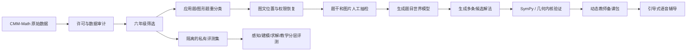

# EduChat-Math / CMM-Math 仓库分析

## 目录

- [1. 分析范围与结论摘要](#1-分析范围与结论摘要)
- [2. 先澄清名称与项目定位](#2-先澄清名称与项目定位)
- [3. 数据集设计与论文方法](#3-数据集设计与论文方法)
- [4. GitHub 仓库实际提供了什么](#4-github-仓库实际提供了什么)
- [5. 数据结构与实际质量](#5-数据结构与实际质量)
- [6. 六年级数据对我们的价值](#6-六年级数据对我们的价值)
- [7. Math-LMM 方法与可复用性](#7-math-lmm-方法与可复用性)
- [8. 评测代码分析](#8-评测代码分析)
- [9. 多图输入与潜在答案图泄漏](#9-多图输入与潜在答案图泄漏)
- [10. 与当前 voice-tutoring 项目的关系](#10-与当前-voice-tutoring-项目的关系)
- [11. 与 CMMaTH 的对比](#11-与-cmmath-的对比)
- [12. 推荐的数据接入方案](#12-推荐的数据接入方案)
- [13. 风险与工程问题](#13-风险与工程问题)
- [14. 分阶段落地建议](#14-分阶段落地建议)
- [15. 综合判断](#15-综合判断)
- [16. 主要参考资料](#16-主要参考资料)

## 1. 分析范围与结论摘要

分析对象：[`BoyceZhao2026/EduChat-Math`](https://github.com/BoyceZhao2026/EduChat-Math)。

该地址是 [`ECNU-ICALK/EduChat-Math`](https://github.com/ECNU-ICALK/EduChat-Math) 的 Fork。Fork 创建于 2026-08-17，当前 HEAD 与上游完全一致，均为提交 [`ccaedb70c923e90b43bd861f22446b1c68218940`](https://github.com/BoyceZhao2026/EduChat-Math/commit/ccaedb70c923e90b43bd861f22446b1c68218940)，上游最后提交日期为 2024-10-20。因此，本文实际分析的是这一共同代码快照；后续获取更新应优先关注上游仓库。

本次检查了 README、完整目录树、28,069 条数据、题型索引、图片文件组织、模型调用脚本、答案评测代码和论文。没有实际调用付费模型，也没有重新训练论文中的 Math-LMM。

核心结论：

1. 仓库名虽然叫 `EduChat-Math`，实际内容是 **CMM-Math 中文数学数据集与研究评测脚本**，不是教育聊天机器人，也没有引导式教学会话实现。
2. 它比此前分析的 CMMaTH 更适合我们：包含 2,246 道六年级题，而 CMMaTH 完整数据集中整个小学阶段只有 800 道。
3. 数据和图片确实完整地放在仓库中，并提供训练集、评测集和 13,419 张去重后的题目/解答图片，实际可用性明显高于 CMMaTH 当前公开仓库。
4. 它并不是纯多模态题库：28,069 道题中，论文称 21,200 道为纯文字题、6,869 道为多模态题。对我们的六年级文字应用题知识库反而有帮助，但不能把总体规模当成图片题规模。
5. 六年级题虽然多，但只有 271 条记录引用图片；且大量六年级 `analysis` 只是答案或很短的说明，不能直接视为高质量教师备课解法。
6. 数据字段需要系统清洗：`solution` 全部是字符串 `"null"`，真实解析位于 `analysis`；`options` 同时存在字符串和数组；图片占位符有多种写法，部分记录的占位符与图片数组不一致。
7. 论文的多图交错输入思想很有价值，但仓库评测脚本没有真正保留文字和图片的交错位置，而是把所有图片集中发送给模型。
8. 代码还存在一个高优先级评测风险：题目图片和解答图片共用一个 `image` 数组，模型调用脚本会把数组中的全部图片发给模型，可能把解答侧的辅助图也作为输入，造成不同程度的信息泄漏。
9. 论文提出的 Math-LMM、三阶段训练方案和模型权重没有完整发布在这个仓库中，无法直接复现训练或部署论文模型。
10. 最合理的用法不是直接接入全部数据，而是提取六年级子集，重新标注应用题类型，清洗并验证解法，严格区分知识库、训练集和私有评测集。

## 2. 先澄清名称与项目定位

这个项目存在三层名称：

- GitHub 仓库名：`EduChat-Math`；
- 数据集名：`CMM-Math`；
- 论文提出的模型名：`Math-LMM`。

其中真正开源得最完整的是 **CMM-Math 数据集**。仓库并不包含：

- 学生聊天页面；
- 多轮教学状态机；
- 学生步骤理解；
- 实时语音通话；
- 教学提示和答案防泄漏；
- 学习总结、知识掌握度和组卷；
- 可直接部署的 Math-LMM 服务。

所以不能因为仓库名字里有 `EduChat`，就把它理解成可以直接合并进当前 Demo 的辅导系统。它更准确的定位是：

```text
中文 K12 数学题库
+ 多模态图片
+ 标准答案与部分解析
+ 模型生成脚本
+ 离线评测脚本
```

论文后来被 ACM Multimedia 2025 数据集赛道接收；GitHub README 已更新为 `[MM 2025]`，但仓库引用的 arXiv PDF 仍保留早期会议模板占位内容。判断发表状态时应以 ACM Multimedia 官方接收列表和正式 DOI 为准。

## 3. 数据集设计与论文方法

### 3.1 数据来源与处理流程

论文描述的处理流程是：

```text
一万余份中国小学至高中数学试卷 PDF
→ Mathpix 提取 Markdown、公式与图片
→ 转换为 JSON
→ 修正文字、公式和图片识别错误
→ 学生检查格式与内容
→ GPT-4o、Gemini、Qwen-VL-Max 对学科类别投票
→ 形成训练集和评测集
```

这种来源与我们的家庭讲题场景较接近：题目不是人工合成的短句，而是来自真实试卷，包含选择、填空、判断和解答题。

### 3.2 数据规模

论文的主要统计如下：

| 项目 | 数量 |
| --- | ---: |
| 总题数 | 28,069 |
| 训练集 | 22,248 |
| 评测集 | 5,821 |
| 纯文字题 | 21,200 |
| 多模态题 | 6,869 |
| 图片引用总量（论文口径） | 15,213 |
| 带详细解答题目（论文口径） | 23,825 |
| 年级 | 12 |
| 学科大类 | 13 |

题型统计：

| 题型 | 论文数量 |
| --- | ---: |
| 选择题 | 10,840 |
| 填空题 | 8,050 |
| 判断题 | 106 |
| 解答题 | 9,083 |

需要注意：以上四类相加为 28,079，比总题数多 10。仓库的题型索引也确实包含 28,079 个 ID，其中 10 个 ID 已不存在于 `all_data.jsonl`。这不是本文计算错误，而是论文表格与仓库索引共同存在的小规模版本残留。

### 3.3 年级分布

仓库数据的实际年级分布为：

| 年级 | 题数 | 年级 | 题数 |
| --- | ---: | --- | ---: |
| 一年级 | 1,499 | 七年级 | 2,209 |
| 二年级 | 2,087 | 八年级 | 1,733 |
| 三年级 | 2,124 | 九年级 | 2,393 |
| 四年级 | 2,784 | 高一 | 2,871 |
| 五年级 | 2,473 | 高二 | 3,158 |
| 六年级 | 2,246 | 高三 | 2,492 |

相较于 CMMaTH 的高中偏置，这个分布均衡得多。

### 3.4 学科标签

13 个大类中数据最多的是：

| 学科 | 数量 |
| --- | ---: |
| 算术 | 9,854 |
| 度量几何学 | 3,614 |
| 解析几何 | 3,463 |
| 代数 | 3,316 |
| 立体几何学 | 2,638 |
| 计数 | 1,953 |

其余还包括组合数学、组合几何、画法几何、逻辑、变换几何、图论和统计数学。

这些标签只能用于粗筛选，不能代替我们需要的细粒度知识点，例如：

- 和差问题；
- 倍数问题；
- 分数与单位“1”；
- 百分数；
- 行程、工程、年龄问题；
- 长方形、圆、组合图形面积。

要用于我们的知识库，仍然需要二次分类。

## 4. GitHub 仓库实际提供了什么

### 4.1 目录结构

| 目录或文件 | 内容 |
| --- | --- |
| `data/all_data.jsonl` | 28,069 条完整数据 |
| `data/train_data.jsonl` | 22,248 条训练数据 |
| `data/test_data.jsonl` | 5,821 条评测数据 |
| `data/Question_type_index.txt` | 四类题目的 ID 索引，实际内容为 JSON |
| `Images/All_Images` | 13,419 张去重后的完整图片 |
| `Images/Train_Images` | 训练集图片副本 |
| `Images/Test_Images` | 测试集图片副本 |
| `model/answer_in_testdata` | GPT-4o、Gemini、Qwen-VL-Max 答题脚本 |
| `model/subject` | 使用多个模型为题目标注学科的脚本 |
| `evaluation` | 选择/判断题准确率和 GPT-4o 评分代码 |
| `outputs` | 论文时期多个模型的输出和评测结果 |

仓库文件总大小按 Git Blob 统计约 454 MB，大部分来自图片。图片在 `All_Images` 与训练/测试目录间存在重复存储，所以完整克隆较慢。

### 4.2 发布完整性

与 CMMaTH 当前仓库相比，CMM-Math 的明显优势是：

- 完整数据确实存在；
- 题目引用的图片也存在；
- 训练集和评测集已经拆分；
- 保存了真实模型输出，方便理解评测格式。

但它没有提供：

- Math-LMM 训练代码；
- 模型配置和完整三阶段训练流水线；
- Math-LMM 7B/72B 权重；
- 依赖锁定文件或完整运行说明；
- 数据 Schema；
- 数据清洗和一致性检测脚本；
- 明确的开源许可证。

因此它是“数据发布相对完整，模型复现不完整”。

## 5. 数据结构与实际质量

### 5.1 样本结构

每条数据大致为：

```json
{
  "id": "13047",
  "image": ["2742.jpg"],
  "answer": "B",
  "solution": "null",
  "level": "六年级",
  "question": "题目文字与 <ImageHere> 占位符",
  "options": "A. ...\nB. ...",
  "subject": "立体几何学",
  "analysis": "答案或自然语言解析"
}
```

### 5.2 字段问题

静态检查完整数据后发现：

1. `solution` 的 28,069 条记录全部是字符串 `"null"`，不能使用；实际解答存放在 `analysis`。
2. `options` 有 10,827 条是字符串，17,242 条是数组，消费端必须先统一类型。
3. `image` 共引用 15,189 次，对应 13,419 个唯一文件；与论文的 15,213 张图片相差 24。
4. 图片占位形式混合存在 `<ImageHere>`、Markdown 图片语法和“本地图片”文件名。
5. 有 173 条记录引用了图片，但在题干、选项和解析中没有识别到图片占位符。
6. 有 93 条记录存在图片占位符，但 `image` 数组为空。
7. 题型索引比主数据多出 10 个失效 ID。

这些问题不妨碍研究人员人工修补后做实验，但不适合直接进入生产知识库。

### 5.3 `analysis` 不等于高质量解法

完整数据中有 26,562 条 `analysis` 非空，但长度分布显示：

| `analysis` 长度 | 题数 |
| --- | ---: |
| 空或 `null` | 1,507 |
| 1–5 字符 | 2,732 |
| 6–20 字符 | 2,975 |
| 21–50 字符 | 1,471 |
| 50 字符以上 | 19,384 |

因此论文所说的“有详细解答”不能简单等价为 `analysis` 非空。短内容中有不少只是选项字母、最终数字或“答案：B”。

即便解析很长，也还需要检查：

- 数学过程是否正确；
- 图片是否与解法对应；
- 是否只提供一种解法；
- 是否适合六年级学生；
- 是否包含超纲表达；
- 是否把答案和推理混在一起；
- 是否可以转化为逐级提示。

## 6. 六年级数据对我们的价值

### 6.1 六年级题目规模

六年级共有 2,246 道题，题型为：

| 题型 | 题数 |
| --- | ---: |
| 选择题 | 524 |
| 填空题 | 1,208 |
| 解答题 | 514 |
| 判断题 | 0 |

其中主要学科为：

- 算术：1,116 题；
- 度量几何学：342 题；
- 立体几何学：292 题；
- 计数：196 题；
- 组合数学：122 题。

对我们的六年级应用题和基础图形题，这比 CMMaTH 有明显更高的筛选价值。

### 6.2 六年级图片题并不多

六年级只有 271 条记录的 `image` 数组非空，占约 12.1%，而且其中还可能包含只出现在标准解析中的图片。因此，它更适合：

- 扩充文字应用题候选库；
- 提取部分面积、体积、统计和示意图题；
- 建立真实题目表达的语言样本；
- 作为动态教师备课包的候选案例来源。

它不适合单独承担大规模 DiagramGraph 评测集。

### 6.3 六年级解析质量需要重点过滤

六年级 `analysis` 长度情况：

| `analysis` 长度 | 题数 |
| --- | ---: |
| 空或 `null` | 130 |
| 1–5 字符 | 904 |
| 6–20 字符 | 654 |
| 21–50 字符 | 275 |
| 50 字符以上 | 283 |

六年级只有约 12.6% 的解析超过 50 个字符。这说明虽然题目数量可观，但“题目 + 高质量详细解法”的可用数量远低于 2,246。

正确预期应是：它提供一个很好的六年级**原始题目池**，而不是已经准备好的六年级教师备课知识库。

## 7. Math-LMM 方法与可复用性

### 7.1 论文方法

Math-LMM 的架构包括：

```text
一个或多个图片
→ Vision Encoder
→ Adapter 做视觉与语言对齐
→ LLM 进行数学推理
```

论文重点处理多个图片和文字片段交错出现的题目，训练分三阶段：

1. 基础预训练：用图文对齐数据训练视觉适配；
2. 基础微调：学习通用多模态指令能力；
3. 数学微调：使用 CMM-Math、GSM8K、MATH 等数学数据强化数学推理。

论文实验使用 DFN5B-H-14+ 作为视觉编码器，声称 7B 版本可以在单张 RTX 4090 上推理。

### 7.2 对我们的启发

最值得借鉴的不是自己训练一个 Math-LMM，而是两点：

1. **保留图文交错位置**：图片属于题干、某个选项还是解答，语义完全不同，不能只把所有图片放到消息末尾。
2. **通用视觉能力与数学能力分开评测**：看懂图片和正确列式是两个阶段，需要分别记录中间结果。

当前 Demo 使用 Qwen3-VL-Flash，没有必要为业务验证立即投入三阶段训练。更合理的是先把数据用于：

- 视觉模型横向测试；
- 六年级子集回归评测；
- 题目世界模型生成测试；
- 动态备课与数学验证测试。

当私有评测证明通用模型在明确题型上存在稳定短板时，再讨论微调或蒸馏。

### 7.3 仓库无法复现 Math-LMM

仓库中没有论文模型的训练代码、权重和完整配置，因此目前无法仅靠这个仓库完成：

```text
CMM-Math 数据
→ 三阶段训练
→ Math-LMM 7B/72B
→ 复现论文结果
```

如果目标是复用数据，这不是阻塞项；如果目标是部署 Math-LMM，则是关键缺口。

## 8. 评测代码分析

### 8.1 评测方法

仓库使用两套指标：

- 选择题、判断题：抽取最终答案后计算 Accuracy；
- 填空题、解答题：把题目、标准答案、标准解析和模型回答交给 GPT-4o，评分 1–10。

选择题评测做了答案关键词抽取，并尝试使用 `latex2sympy2` 判断部分数学表达式等价。相比字符串完全匹配更合理。

### 8.2 不能直接用于我们的教学评测

该评测只能回答：

- 选项是否正确；
- 最终数学表达式是否大致等价；
- GPT-4o 是否认为解答准确、完整且有逻辑。

它不能回答：

- 图片中的对象和关系是否识别正确；
- 题目世界模型是否正确；
- AI 是否接受学生的不同合法思路；
- 是否重复询问学生已经回答过的问题；
- 是否提前泄露答案；
- 是否正确纠错；
- 学生是否理解；
- 是否正确进入完结态。

### 8.3 自动评分风险

1. GPT-4o 既是被评模型之一，又被用作开放题裁判，存在同模型偏好和风格偏差。
2. 1–10 分的 LLM 评分不是数学证明，不能替代 SymPy 或几何内核。
3. 评分脚本从文本中抽取第一个数字，输出格式稍有变化就可能解析错误。
4. `utils.py` 对模型输出使用 `latex2sympy2` 后调用 Python `eval()`，不应在生产环境处理不可信输入。
5. 论文结果来自 2024 年前后的模型，不能作为 2026 年模型选型排名。

## 9. 多图输入与潜在答案图泄漏

这是仓库最需要谨慎处理的技术问题。

### 9.1 单一图片数组丢失图片权限

数据只提供一个 `image` 数组，但论文明确区分：

- 题目中的图片：9,490 次；
- 标准解答中的图片：5,723 次。

数据没有为每个图片提供 `question_image`、`option_image` 或 `solution_image` 的结构化角色，只能依赖 `<ImageHere>` 等占位符在文本中的顺序推断。

### 9.2 现有模型脚本会发送全部图片

GPT-4o 和 Qwen-VL-Max 的答题脚本都遍历 `example['image']`，并把所有图片发送给模型，没有先根据占位符过滤掉解答侧图片。

完整数据中至少有 991 条记录满足：

- 题干和选项中没有图片占位符；
- `analysis` 中存在图片占位符；
- `image` 数组非空。

这类图片显然更可能属于标准解析。若把它们发送给答题模型，图片可能包含辅助线、可行域、变换结果或标注，从而给模型额外提示。它未必总是直接暴露最终答案，但会破坏评测输入的一致性。

### 9.3 交错输入没有真正保留

论文强调 `文字 → 图片 1 → 文字 → 图片 2` 的交错输入，但仓库脚本实际为：

- GPT-4o：先发送完整题目文字，再依次追加全部图片；
- Qwen-VL-Max：先追加最多 10 张图片，再追加完整题目文字。

这会丢失“哪张图属于哪个选项或哪一段文字”的关系。对于多个相似图形的选择题，影响尤其明显。

### 9.4 我们应该如何修正

导入时必须将原始记录转换为：

```json
{
  "question_content": [
    {"type": "text", "text": "..."},
    {"type": "image", "image_id": "2742.jpg", "role": "question"},
    {"type": "text", "text": "..."}
  ],
  "option_content": [],
  "solution_content": [],
  "student_visible_images": ["2742.jpg"],
  "teacher_only_images": []
}
```

只有 `student_visible_images` 可以进入视觉识别和学生会话。标准解析图片只能进入教师备课和离线验证，且不能在辅导开始时发送给学生侧模型。

## 10. 与当前 voice-tutoring 项目的关系

### 10.1 可直接提供的价值

| 我们的需求 | CMM-Math 的价值 |
| --- | --- |
| 六年级真实题目 | 高，提供 2,246 道候选题 |
| 六年级文字应用题 | 中高，算术题较多，但需要重分类 |
| 图形题图片识别 | 中，图片真实且已提供 |
| 多图题识别 | 中高，包含多图题和图片顺序信息候选 |
| 教师备课参考解法 | 中，部分 `analysis` 可作为候选 |
| 模型回归评测 | 高，已有训练/测试拆分 |
| 最终答案等价评测 | 中，可借鉴部分代码 |

### 10.2 仍然完全缺失的内容

- DiagramGraph 真值；
- 数学约束和 MathIR；
- 经 SymPy/几何内核验证的解法；
- 多条参考解法；
- 解法共同核心；
- 常见错误和误概念；
- 提示阶梯；
- 学生步骤和多轮对话；
- 教学完结条件；
- 答案防泄漏标签；
- 学习总结和组卷标签。

### 10.3 正确的业务位置



CMM-Math 应处于题目原料层和能力评测层，不能跳过中间验证直接决定教学对话。

## 11. 与 CMMaTH 的对比

| 维度 | CMM-Math / EduChat-Math | CMMaTH |
| --- | --- | --- |
| 总规模 | 28,069 | 23,856 |
| 公开仓库实际数据 | 完整 28,069 | 仅 1,000 条样本 |
| 原始题图 | 仓库中提供 | 当前仓库未提供题图 |
| 六年级数据 | 2,246 | 公开样本仅 6；完整小学共 800 |
| 是否全部依赖图片 | 否，多模态题约 6,869 | 原则上是图片依赖题 |
| 文字题覆盖 | 高 | 低 |
| 细粒度知识点 | 无，只有 13 个大类 | 有较细知识点路径 |
| 自然语言解答 | 有，但质量差异大 | 有标准 `analysis` |
| 训练集 | 有 | 主要定位评测 |
| 自动裁判 | GPT-4o 评分 + 规则 | GradeGPT |
| 多图题 | 较多，最高可达数十张 | 早期版本过滤部分多图题 |
| DiagramGraph 标注 | 无 | 无 |
| 引导式教学标注 | 无 | 无 |

对当前项目而言：

- 六年级应用题原料优先看 CMM-Math；
- 中文图形理解的专项压力测试可同时参考两者；
- 两者都不能直接提供动态老师能力；
- 两者都必须与我们的私有评测集隔离。

## 12. 推荐的数据接入方案

### 12.1 第一层：原始数据不可变保存

保存原始文件、提交 SHA 和每个文件的哈希，不在原文件上直接修改。

### 12.2 第二层：统一 Schema

转换为内部格式：

```json
{
  "source": "cmm_math",
  "source_id": "13047",
  "grade": 6,
  "question_type": "choice",
  "subject_raw": "立体几何学",
  "knowledge_points": [],
  "question_content": [],
  "student_visible_images": [],
  "teacher_only_images": [],
  "answer": {},
  "reference_solution_raw": "...",
  "quality_flags": [],
  "license_status": "unverified"
}
```

### 12.3 第三层：六年级重新标注

至少补充：

- 应用题类型；
- 典型数量关系；
- 是否需要方程；
- 是否需要看图；
- 图形类型；
- 难度；
- 是否超纲；
- 解答质量等级；
- 是否适合作为教学示例。

### 12.4 第四层：生成并验证教师备课包

对选中的题目执行：

```text
原始题目
→ 独立求解
→ 生成 1–2 条候选解法
→ 提取共同核心
→ SymPy / 几何内核验证
→ 与数据集参考答案比较
→ 人工处理冲突
→ 生成提示阶梯和完成条件
```

原始 `analysis` 只能参与比较，不能拥有最终事实确认权限。

### 12.5 第五层：严格隔离数据用途

建议分为：

- `knowledge_pool`：可检索的已验证案例；
- `training_pool`：未来允许用于微调的数据；
- `public_regression`：公开题回归集；
- `private_holdout`：模型从未见过的私有评测集；
- `dialogue_evaluation`：围绕同一题设计的学生思路脚本。

任何进入知识库或训练集的题目，都不能继续充当真实泛化评测题。

## 13. 风险与工程问题

### 13.1 许可和版权

仓库没有 LICENSE，GitHub API 也没有识别到许可证。论文称数据来自一万余份真实试卷 PDF，但没有在仓库中提供逐题来源和再使用许可说明。

在没有获得明确授权前，不能默认可以：

- 用于商业产品；
- 再发布题目和图片；
- 用于模型训练；
- 向最终家庭用户展示原题。

因此所有导入记录都应先标记 `license_status=unverified`。

### 13.2 运行脚本不是开箱即用

静态检查发现：

- 模型脚本使用空 API Key 占位，需要手动修改源码；
- 缺少 `requirements.txt`、`pyproject.toml` 和锁定版本；
- 多个脚本先切换到自身目录，但仍使用假设位于根目录的 `./data`、`./images` 和 `./outputs` 路径；
- 仓库实际目录是大写 `Images`，脚本使用小写 `images`，Linux 下会失败；
- 输出目录命名与评测脚本期待的目录不完全一致；
- Qwen 脚本最多发送前 10 张图，而数据中存在超过 10 张图的记录；
- 图片格式报错时，Qwen 脚本会清空图片并按纯文字题重试，导致评测任务被静默改变；
- GPT-4o 脚本会把 Base64 图片内容打印到日志，容易造成巨大日志和题目数据暴露；
- 没有单元测试、CI 和端到端复现命令。

这套代码适合作为论文实验记录，不适合直接合入当前 Demo。

### 13.3 数据质量与版本一致性

- 题型总数与题目总数相差 10；
- 图片引用数量与论文相差 24；
- 图片占位符和图片数组存在双向不一致；
- `solution` 字段失效；
- 六年级解析整体偏短；
- 13 个学科标签由三个模型投票产生，且粒度过粗。

### 13.4 公开数据污染

如果通用大模型已经见过 CMM-Math，使用它评测 Qwen3-VL-Flash 等新模型时可能包含记忆效应。应同时使用自主采集的私有新题和同构变式题。

## 14. 分阶段落地建议

### 阶段一：只做数据审计

1. 暂不导入生产数据库。
2. 建立转换脚本和 Pydantic Schema。
3. 修复题型 ID、图片占位和图片角色。
4. 输出数据质量报告。
5. 明确许可证和可使用范围。

### 阶段二：建立六年级候选集

1. 从 2,246 道六年级题中提取算术、度量几何和基础统计。
2. 重新标注和差、倍数、分数、百分数、行程、工程、年龄、面积等类别。
3. 剔除答案不完整、图片缺失、超纲和解析冲突题。
4. 先人工抽检 100–200 题，而不是立即处理全部数据。

### 阶段三：构建验证集和备课包

1. 从中选择 50 道文字应用题和 30 道图形题。
2. 补充多解法、核心思路、MathIR/DiagramGraph 和完成条件。
3. 使用 SymPy、几何内核和人工复核建立真值。
4. 用学生不同解题路径测试动态引导能力。

### 阶段四：决定是否扩大使用

只有在以下条件满足后才扩大：

- 权利明确；
- 数据清洗成本可接受；
- 六年级题型覆盖达到预期；
- 备课包验证通过率足够高；
- 使用这些案例确实改善私有集表现，而不是只改善原题表现。

## 15. 综合判断

| 维度 | 判断 |
| --- | --- |
| 六年级题目覆盖 | 高 |
| 六年级应用题候选价值 | 中高 |
| 六年级详细解法质量 | 中低，需要重做 |
| 图形题图片资源 | 中高 |
| DiagramGraph 直接支持 | 无 |
| 动态教师备课直接支持 | 低 |
| 引导式教学直接支持 | 无 |
| 数据发布完整性 | 高于 CMMaTH |
| 代码可直接运行性 | 低 |
| Math-LMM 可复现性 | 低 |
| 许可证清晰度 | 低 |
| 作为原始题目池 | 高，前提是权利明确 |
| 作为生产知识库 | 中低，必须深度加工 |

最终建议：**CMM-Math 是目前分析过的仓库中，最值得进一步筛选六年级题目的数据来源之一，但它仍然只是“教学原料”，不是“教师备课结果”。**

最有价值的下一步不是运行仓库里的旧模型脚本，而是先建立一个 CMM-Math 数据导入与审计工具，恢复图片在题干、选项和解析中的位置与权限，再从 2,246 道六年级题中筛选小规模高质量子集，进入我们现有的“题目世界模型 → 数学验证 → 动态教师备课包 → 引导式会话”流程。

## 16. 主要参考资料

- [目标 Fork：BoyceZhao2026/EduChat-Math](https://github.com/BoyceZhao2026/EduChat-Math)
- [上游仓库：ECNU-ICALK/EduChat-Math](https://github.com/ECNU-ICALK/EduChat-Math)
- [CMM-Math arXiv 页面](https://arxiv.org/abs/2409.02834)
- [CMM-Math 论文 PDF](https://arxiv.org/pdf/2409.02834)
- [ACM Multimedia 2025 官方接收列表](https://acmmm2025.org/accepted-papers-datasets/)
- [正式论文 DOI](https://doi.org/10.1145/3746027.3758193)
