# AI 数学辅导智能化、内容资料与图形题技术讨论

## 目录

- [1. 文档目的](#1-文档目的)
- [2. 年级知识点与大量题解能否提高智能化](#2-年级知识点与大量题解能否提高智能化)
  - [2.1 客观结论](#21-客观结论)
  - [2.2 知识库为什么有价值但不会自动产生智能](#22-知识库为什么有价值但不会自动产生智能)
  - [2.3 推荐的四层内容架构](#23-推荐的四层内容架构)
  - [2.4 除知识点和题解外还应准备什么](#24-除知识点和题解外还应准备什么)
  - [2.5 推荐的数据优先级](#25-推荐的数据优先级)
  - [2.6 MVP 验证方案](#26-mvp-验证方案)
  - [2.7 推荐的知识库检索流程](#27-推荐的知识库检索流程)
- [3. 教师应先理解题目：动态教师备课包](#3-教师应先理解题目动态教师备课包)
  - [3.1 为什么需要课前备题阶段](#31-为什么需要课前备题阶段)
  - [3.2 教师备课包包含什么](#32-教师备课包包含什么)
  - [3.3 多个候选解法如何生成与验证](#33-多个候选解法如何生成与验证)
  - [3.4 有思路与无思路的教学分支](#34-有思路与无思路的教学分支)
  - [3.5 教师解法图与学生解法图必须分离](#35-教师解法图与学生解法图必须分离)
  - [3.6 推荐数据模型](#36-推荐数据模型)
  - [3.7 与知识库和金标准的关系](#37-与知识库和金标准的关系)
  - [3.8 当前 Demo 的能力差距](#38-当前-demo-的能力差距)
  - [3.9 MVP 验证方案](#39-mvp-验证方案)
  - [3.10 从声明式数学求解得到的架构原则](#310-从声明式数学求解得到的架构原则)
- [4. 学生已掌握核心思路却仍被严格限制](#4-学生已掌握核心思路却仍被严格限制)
  - [4.1 问题本质](#41-问题本质)
  - [4.2 正确性、进度与泄露风险必须解耦](#42-正确性进度与泄露风险必须解耦)
  - [4.3 从步骤完成改为核心理解覆盖](#43-从步骤完成改为核心理解覆盖)
  - [4.4 动态提示预算](#44-动态提示预算)
  - [4.5 推荐决策流程](#45-推荐决策流程)
  - [4.6 MVP 改造与评测样本](#46-mvp-改造与评测样本)
- [5. 包含几何图形的题目如何识别与展示](#5-包含几何图形的题目如何识别与展示)
  - [5.1 这不是普通 OCR 问题](#51-这不是普通-ocr-问题)
  - [5.2 推荐的图形题处理流水线](#52-推荐的图形题处理流水线)
  - [5.3 统一 Diagram 数据模型](#53-统一-diagram-数据模型)
    - [5.3.1 DiagramGraph 是什么](#531-diagramgraph-是什么)
    - [5.3.2 分层数据结构](#532-分层数据结构)
    - [5.3.3 实体、标注与关系](#533-实体标注与关系)
    - [5.3.4 事实来源、置信度与确认状态](#534-事实来源置信度与确认状态)
    - [5.3.5 原题实体与教学辅助实体](#535-原题实体与教学辅助实体)
    - [5.3.6 与题目世界模型的关系](#536-与题目世界模型的关系)
    - [5.3.7 识别、确认和教学生命周期](#537-识别确认和教学生命周期)
  - [5.4 识别方案](#54-识别方案)
    - [5.4.1 总体方案](#541-总体方案)
    - [5.4.2 图片预处理与区域划分](#542-图片预处理与区域划分)
    - [5.4.3 文字和公式识别](#543-文字和公式识别)
    - [5.4.4 图形结构双通道识别](#544-图形结构双通道识别)
    - [5.4.5 候选融合与规则校验](#545-候选融合与规则校验)
    - [5.4.6 只让学生确认高影响不确定项](#546-只让学生确认高影响不确定项)
    - [5.4.7 OpenCV 如何使用和部署](#547-opencv-如何使用和部署)
    - [5.4.8 分阶段落地](#548-分阶段落地)
  - [5.5 页面展示与动态讲解](#55-页面展示与动态讲解)
    - [5.5.1 展示原则与页面布局](#551-展示原则与页面布局)
    - [5.5.2 原图的展示与确认](#552-原图的展示与确认)
    - [5.5.3 SVG 重绘教学黑板](#553-svg-重绘教学黑板)
    - [5.5.4 讲解高亮状态](#554-讲解高亮状态)
    - [5.5.5 字幕、语音与图形动作同步](#555-字幕语音与图形动作同步)
    - [5.5.6 辅助线与面积分解](#556-辅助线与面积分解)
    - [5.5.7 三种查看模式与失败降级](#557-三种查看模式与失败降级)
    - [5.5.8 学生对图形的交互](#558-学生对图形的交互)
    - [5.5.9 前端组件与 MVP 范围](#559-前端组件与-mvp-范围)
  - [5.6 几何验证与防误导](#56-几何验证与防误导)
    - [5.6.1 总体转换链路](#561-总体转换链路)
    - [5.6.2 GeometryFactSet](#562-geometryfactset)
    - [5.6.3 GeometryRuleEngine](#563-geometryruleengine)
    - [5.6.4 AlgebraicConstraintSet](#564-algebraicconstraintset)
    - [5.6.5 VerificationTrace](#565-verificationtrace)
    - [5.6.6 组合面积与区域操作](#566-组合面积与区域操作)
    - [5.6.7 学生新分割方法的独立验证](#567-学生新分割方法的独立验证)
    - [5.6.8 MVP 规则范围](#568-mvp-规则范围)
    - [5.6.9 几何 Guard 与架构原则](#569-几何-guard-与架构原则)
    - [5.6.10 MVP 实现决策](#5610-mvp-实现决策)
    - [5.6.11 几何计算内核](#5611-几何计算内核)
  - [5.7 MVP 范围与验收](#57-mvp-范围与验收)
- [6. 三个问题之间的关系](#6-三个问题之间的关系)
- [7. 推荐的下一步](#7-推荐的下一步)
- [8. MVP 默认决策汇总](#8-mvp-默认决策汇总)
  - [8.1 图形实现决策](#81-图形实现决策)
  - [8.2 测试与运行决策](#82-测试与运行决策)
  - [8.3 产品、内容与隐私决策](#83-产品内容与隐私决策)
- [9. 题目世界模型相关开源项目调研](#9-题目世界模型相关开源项目调研)
  - [9.1 调研结论](#91-调研结论)
  - [9.2 应用题结构化与符号求解](#92-应用题结构化与符号求解)
  - [9.3 几何图形解析与形式化](#93-几何图形解析与形式化)
  - [9.4 课程知识图谱与题库](#94-课程知识图谱与题库)
  - [9.5 推荐的开源能力组合](#95-推荐的开源能力组合)
  - [9.6 建议的验证顺序](#96-建议的验证顺序)

## 1. 文档目的

本文用于讨论三个会直接影响 AI 数学辅导智能化程度的问题：

1. 是否应将某一年级的知识点、大量题目和解答作为模型预输入，以及还应准备哪些资料。
2. 如何避免答案防泄露与固定知识点约束压制学生已经形成的正确核心思路。
3. 如何处理依赖几何图形、面积图、组合图形和示意图的题目，并在页面上准确展示和动态讲解。

三者本质上都指向同一个目标：系统不能只是“知道很多标准答案”，而要能够建立题目模型、理解学生当前思路、验证其数学关系，并选择适当的视觉与语言支持。

## 2. 年级知识点与大量题解能否提高智能化

### 2.1 客观结论

这里的“预输入”明确指：把某一年级的知识点、大量题目和解答建设成持久化知识库，由系统根据当前题目和教学阶段按需检索；不是把全部资料拼入单次 Prompt。

在这个前提下，建设知识库是有必要的，也很可能明显改善应用效果。它尤其适合解决通用模型对特定教材、年级范围、适龄方法、典型题型和教学表达掌握不稳定的问题。

它能改善的主要是：

- 年级适配：避免使用超纲概念和方法。
- 题型识别：更快找到可能相关的数量关系或几何性质。
- 提示质量：使用学生熟悉的术语和表示方式。
- 长尾覆盖：为少见题型提供可检索案例。
- 评测能力：判断模型版本是否在某类题上退化。

它不能自动解决：

- 学生这句话到底表达了什么。
- 一个非标准方法在数学上是否成立。
- 学生是否真正理解。
- 当前应该提示多少。
- 图形识别是否正确。

因此，知识库能够提高系统的知识覆盖、年级适配和教学专业性，但不会单独产生“理解学生”的能力。真正的智能来自“准确检索 + 理解当前学生 + 独立验证 + 动态决策”。

### 2.2 知识库为什么有价值但不会自动产生智能

知识库方案避免了把所有资料塞进上下文的问题，但仍取决于检索和使用方式。下列问题仍可能发生：

- **召回错误**：表面文字相似，却不是同一种数学关系。
- **漏召回**：学生采用非标准表达，检索不到真正相关的知识或案例。
- **检索结果锚定**：返回某条标准解法后，模型把学生思路强行套入该路线。
- **检索粒度错误**：返回整篇完整解答，而当前只需要一个概念定义或局部提示。
- **检索时机错误**：每一轮都检索题解，使参考路线持续压制学生自己的方法。
- **资料冲突**：不同教材、地区和教师对术语、步骤粒度或适龄方法存在差异。
- **来源质量问题**：题库中的错误解答、超纲方法或低质量解析会被放大。
- **缺少权限控制**：完整答案被检索后进入生成上下文，增加提前泄露风险。
- **“看过”不等于“会用”**：模型可能复述范例，却仍无法可靠验证新的学生推理。

推荐原则：

> 知识库负责提供可靠的候选知识和教学材料；题目世界模型、学生动态解法图和验证器负责决定这些材料是否与当前学生有关、是否正确以及现在能否使用。

知识库对不同任务的价值也不同：

| 任务 | 预期收益 | 原因 |
| --- | --- | --- |
| 判断所属年级和知识点 | 高 | 年级范围和概念映射可以结构化检索 |
| 提供适龄概念解释 | 高 | 可检索教材术语和教学表达 |
| 推荐相似题和微型变式 | 高 | 题目属性和难度可以预先标注 |
| 生成提示阶梯 | 中到高 | 前提是库中存的不是只有完整答案 |
| 理解学生当前自然语言 | 中 | 案例有帮助，但仍依赖完整上下文理解 |
| 判断全新思路是否正确 | 低到中 | 未命中不能判错，仍需数学验证 |
| 判断学生是否真正理解 | 低 | 必须依赖当前会话中的学生行为证据 |

### 2.3 推荐的四层内容架构

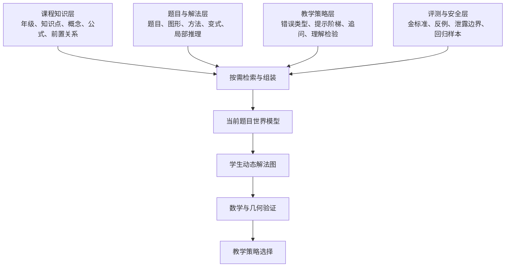

四层职责：

| 层 | 核心内容 | 在线使用方式 |
| --- | --- | --- |
| 课程知识层 | 概念、定义、公式、前置知识、适龄术语 | 根据当前概念按需检索 |
| 题目与解法层 | 典型题、多个方法、变式、局部解法结构 | 提示或验证困难时检索，不规定学生路线 |
| 教学策略层 | 常见错误、提示阶梯、澄清问题、理解证据 | 状态机选择教学动作时使用 |
| 评测与安全层 | 标准样本、错误样本、答案泄露和回归用例 | 主要离线使用，线上仅作验证和 Guard |

实现上不建议只有一个“题目向量库”。至少应同时保留：

- 结构化关系库：年级、单元、知识点、前置依赖、题型和难度。
- 语义检索库：概念解释、题目表述、学生表达、错误案例和教学话术。
- 原始内容库：题目图片、图形、教材来源和版本信息。
- 可执行规则库：公式条件、验证表达式、单位和几何约束。

向量相似度用于召回候选，不能独自决定知识点归属、数学正误或教学动作。

### 2.4 除知识点和题解外还应准备什么

仅准备“题目 + 标准解答”远远不够。更重要的资料包括：

#### 课程与概念资料

- 年级—单元—知识点层级。
- 每个知识点的定义、性质、公式和适用条件。
- 前置知识和后续知识依赖图。
- 教材使用的标准术语、符号和适龄表达。
- 同一概念的多种表征：文字、算式、线段图、数轴、表格和几何图。
- 容易混淆的相邻概念及区分方式。

#### 学生思维资料

- 正确但非标准的解法和表达方式。
- 一句话覆盖多个步骤的样本。
- 跳步、倒推、换方法和自我修正样本。
- 正确结果配错误理由的样本。
- 不完整口语、代词指代和语音识别错误样本。
- 学生常见错误、错误产生原因及最小纠错点。

#### 教学资料

- 每个知识点的提示阶梯，而不是只有完整讲解。
- 适合澄清不同思路的区分性问题。
- 判断理解所需的复述题、纠错题和微型变式。
- 不同提示强度下允许揭示的信息边界。
- 什么情况下应该接受跳步、结束教学或建议复习前置知识。
- 图示应该展示什么、何时高亮和何时隐藏。

#### 数学验证资料

- 公式的适用前提和等价变形规则。
- 题目对象、数量关系、单位和约束 Schema。
- 可由 SymPy 或规则执行的验证表达式。
- 几何性质和图形约束，例如平行、垂直、等长、包含和相交。
- 最终结果的代回与合理性检查规则。

#### 评测资料

- 不同难度、不同表述和不同图片质量的题目。
- 多轮对话，而不只是单轮答案。
- 应接受的多种合法思路。
- 应澄清、应纠错、应结束和不应泄露的边界样本。
- 模型升级前后的固定回归集合。

### 2.5 推荐的数据优先级

如果资源有限，推荐顺序不是先收集数万道题，而是：

1. 建立完整的年级知识点图和适龄表达规范。
2. 为每个知识点准备少量高质量典型题及多种解法。
3. 优先积累真实学生的正确变体、错误表达和多轮对话。
4. 建立提示阶梯、理解验证和结束判断样本。
5. 建立数学可执行规则及题目结构 Schema。
6. 再扩大题量和长尾覆盖。

对于智能辅导，`100 道题 × 丰富学生路径和教学标注`，通常比 `10,000 道题 × 单一标准答案` 更有调研价值。

### 2.6 MVP 验证方案

对同一批未见过的题目和学生表达做消融实验：

| 实验组 | 提供给模型的内容 |
| --- | --- |
| A | 仅题目和对话 |
| B | 题目、对话和相关知识点 |
| C | B + 检索到的局部题解案例 |
| D | C + 常见错误和教学策略 |

比较：

- 学生思路理解准确率。
- 未收录正确方法的接纳率。
- 数学误判率。
- 重复提问率。
- 过度提示和答案泄露率。
- 教学动作合理性。
- 延迟、Token 和成本。

只有在独立测试集上改善这些指标，资料才真正提高了系统能力；不能只观察回复是否更长、更像教材。

### 2.7 推荐的知识库检索流程

知识库不应在每一轮用同一个查询检索同一种内容。推荐采用分阶段、多路召回：

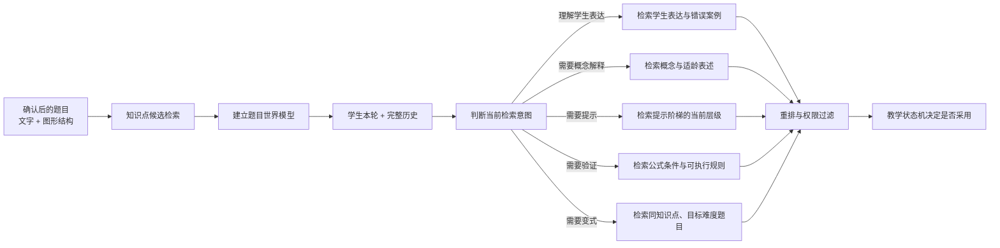

一次检索请求至少应包含：

```json
{
  "grade": 6,
  "knowledge_candidates": ["和差问题"],
  "problem_structure": ["two_parts", "known_sum", "known_difference"],
  "student_method": "线段图法",
  "current_gap": "如何去掉差量后平均分",
  "teaching_action": "give_level_2_hint",
  "allowed_disclosure": "concept_and_condition_only",
  "excluded_content": ["final_answer", "complete_solution"]
}
```

检索后还需经过：

1. **元数据过滤**：年级、教材版本、知识点、题型和难度。
2. **混合召回**：关键词、结构字段和向量语义共同召回。
3. **重排**：比较数学结构和学生当前方法，而不只是文字相似。
4. **权限过滤**：根据提示等级删除完整答案和未开放步骤。
5. **来源与版本记录**：每条材料可追踪到来源、审核状态和更新时间。
6. **状态机采用决策**：检索结果是候选材料，不直接成为最终回复。

为了减少锚定，学生思路分析应先于题解检索：先独立抽取学生主张，再检索相关知识或案例。只有需要提示、解释、验证或生成变式时，才检索具体题解片段。

## 3. 教师应先理解题目：动态教师备课包

### 3.1 为什么需要课前备题阶段

现实中的老师在讲题前，通常会先独立理解：题目问什么、条件之间有什么关系、有哪些正确解法、学生可能在哪里卡住。AI 辅导也需要同样的“备题”能力。

前面将金标准从在线教学主控制器中降权是必要的，但不能因此走向另一个极端：让 AI 每一轮听完学生后才临时猜测下一步。更合理的原则是：

> 系统应当先会做这道题，但不能要求学生按照系统预先想到的路线做。

学生确认题目后、正式通话前，系统生成会话级 `TeacherPreparationPackage`。它使 AI 在学生有思路时能判断和承接，在学生没有思路时也能选择一个适龄、最小的教学入口。

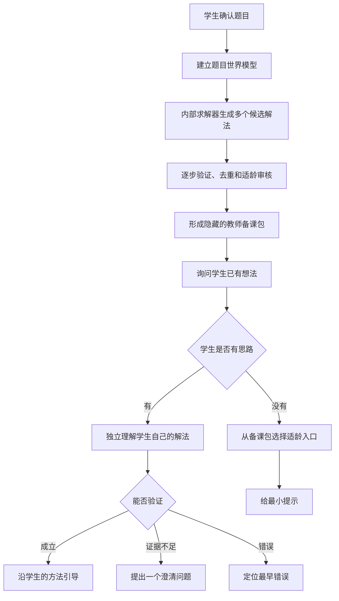

### 3.2 教师备课包包含什么

#### 题目世界模型

描述题目的客观事实，不规定解题方法：

- 数学对象、已知量和未知量。
- 数量关系、单位和约束。
- 问题目标。
- 图形、表格和标注。
- OCR 或题意中的不确定项。

例如和差问题的世界模型可以只包含：

```json
{
  "objects": ["故事书数量", "科技书数量"],
  "constraints": [
    "故事书数量 + 科技书数量 = 84",
    "科技书数量 - 故事书数量 = 18"
  ],
  "target": "求两个数量"
}
```

#### 多个候选解法

同一道题可以准备方程法、算术法和线段图法。每条解法包含：

- 方法名称、适用年级和前置知识。
- 核心思想和局部推理节点。
- 节点依赖及可执行验证表达式。
- 常见错误和适用提示阶梯。
- 数学验证、适龄审核和置信度状态。

候选解法是教师可能使用的方案集合，不是学生必须执行的脚本。

#### 核心理解目标

不同解法往往共享同一组核心数学理解。例如和差问题可以包含：

```text
K1：两个数量共同组成总量
K2：两个数量之间存在确定的差量关系
K3：需要同时利用总量和差量分离两个部分
K4：结果必须同时满足和与差两个条件
```

核心理解目标没有固定顺序。学生一句话可能覆盖多个目标，也可能先表达结论再补充理由。

#### 教学入口和卡点方案

备课包需要回答不同学生状态下从哪里开始：

| 学生状态 | 推荐教学入口 |
| --- | --- |
| 完全没有想法 | 找出题目中的对象、已知关系或图形结构 |
| 只看到总量 | 聚焦另一个差量、倍数或分率条件 |
| 主动画图 | 沿图中的对象和区域讨论，不强制改用方程 |
| 想列方程 | 让学生选择未知量并表示其他对象 |
| 已说出完整核心关系 | 接受跳步，进入计算或理由检验 |
| 使用候选集外的方法 | 独立验证，而不是拉回预设路线 |

### 3.3 多个候选解法如何生成与验证

候选解法生成不能只是让一个模型输出几篇自然语言答案：

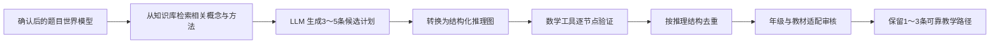

必须完成三类检查：

1. **数学正确性**：算式、等价变形、单位、结果代回和几何公式前提。
2. **结构去重**：三个不同措辞的方程法仍然只算一种方法。
3. **年级适配**：正确但超纲的方法可以保留为内部验证路径，不能作为首选教学路线。

如果某条解法无法独立验证，它只能标记为 `unverified`，不能向学生提供其中的实质性提示。

### 3.4 有思路与无思路的教学分支

#### 学生有思路

处理顺序是：

1. 不看候选解法，先独立提取学生本轮数学主张。
2. 更新学生动态解法图。
3. 验证学生局部推理是否成立。
4. 再检查它是否与某条候选解法相似，以便获得验证规则或提示素材。
5. 未匹配但成立时，建立新的会话级方法分支。
6. 沿学生实际采用的方法规划下一次引导。

匹配候选解法是支持证据；没有匹配不是错误证据。

#### 学生没有思路

系统从已验证备课方案中选择一个认知负担较低、符合当前年级和学生基础的入口，但一次只给一个最小提示。

例如内部知道方程、算术和线段图三种方法，也不应一次告诉学生三种完整路线，而可以先问：

> 题目中有两个数量，哪一个条件说明了它们合起来是多少？

学生仍无思路时再提高提示层级，而不是直接播放完整解法。

### 3.5 教师解法图与学生解法图必须分离

系统同时维护两张图：

| 图 | 表达什么 | 用途 |
| --- | --- | --- |
| 教师候选解法图 | 系统已经验证的可能解法 | 备课、提示、验证和选择教学入口 |
| 学生动态解法图 | 学生实际上说了什么、证明了什么 | 理解学生、判断进度和决定如何承接 |

两张图可以建立可选映射，但不能合并。否则系统很容易把“教师知道的一条路线”误认为“学生应该采用的路线”。

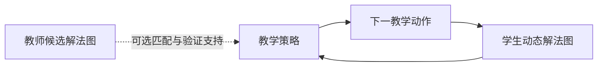

学生节点必须有学生原话证据。教师图中的前置步骤不能因为逻辑上存在，就自动写入学生已理解状态。

### 3.6 推荐数据模型

```python
class TeacherPreparationPackage(BaseModel):
    problem_world_model: ProblemWorldModel
    candidate_solutions: list[CandidateSolution]
    core_understandings: list[CoreUnderstanding]
    teaching_entries: list[TeachingEntry]
    preparation_status: Literal["ready", "partially_ready", "failed"]

class CandidateSolution(BaseModel):
    solution_id: str
    method: str
    age_appropriate: bool
    prerequisites: list[str]
    reasoning_nodes: list[ReasoningNode]
    verification_status: Literal["verified", "partially_verified", "unverified", "rejected"]
    confidence: float

class CoreUnderstanding(BaseModel):
    understanding_id: str
    description: str
    evidence_requirements: list[str]
    related_solution_nodes: list[str]

class TeachingEntry(BaseModel):
    student_state: str
    candidate_action: str
    hint_levels: list[str]
    allowed_information: list[str]
```

备课包属于当前题目的内部状态，不能直接发送给学生。回复模型只能获得状态机允许使用的局部内容。

### 3.7 与知识库和金标准的关系

三者职责不同：

| 能力 | 生命周期 | 主要用途 |
| --- | --- | --- |
| 内容知识库 | 长期、跨题 | 提供课程知识、题目、方法、错误和教学素材 |
| 金标准 | 长期、人工审核、有限覆盖 | 离线评测、回归、安全和高质量锚点 |
| 教师备课包 | 当前题、动态生成 | 理解当前题目、规划候选方法和教学入口 |

已命中金标准的题目可以直接加载人工审核的题目世界模型和候选解法，再做当前版本校验。陌生题则从知识库检索相关概念和方法，动态生成备课包。

陌生题的动态备课包不是新的金标准：它必须保留生成来源、验证状态和置信度，可以在会话中被学生的新方法补充或推翻。

### 3.8 当前 Demo 的能力差距

当前 Demo 已具备：

- 题目文字确认和初步结构化。
- 学生动态解法图。
- 完整会话历史理解。
- 接纳未匹配参考路径的学生方法。
- 动态教学目标、完成状态和总结卡。

但还没有完整具备：

- 陌生题确认后自动生成多个候选解法。
- 对每条候选解法逐节点执行独立数学验证。
- 按数学结构去重和年级适配审核。
- 自动提取跨解法共享的核心理解目标。
- 学生无思路时，根据多种方案选择最佳教学入口。
- 教师图与学生图之间的可选、非强制映射。

因此当前系统仍偏向“边听学生说，边理解和规划”，目标应升级为“先可靠备课，再听学生说；有思路就沿学生的方法，没有思路就从备课方案中选择入口”。

### 3.9 MVP 验证方案

建议先选择六年级应用题中的 20～30 道题，其中一半来自已有题库，一半为陌生变体。每题要求：

- 生成至少两种结构不同的候选方法；只有一种合理方法时允许说明原因。
- 每条方法包含结构化节点和逐节点验证状态。
- 生成 3～5 个跨方法的核心理解目标。
- 生成“完全没思路、部分思路、使用替代方法”三个教学入口。

重点评测：

| 指标 | 目标 |
| --- | ---: |
| 至少一条候选解法完全正确 | ≥ 99% |
| 被标记 `verified` 的节点数学正确率 | ≥ 99% |
| 候选方法结构去重准确率 | ≥ 95% |
| 年级适配通过率 | ≥ 95% |
| 学生无思路时首个提示合理率 | ≥ 90% |
| 未收录正确方法接纳率 | ≥ 95% |
| 教师图错误写入学生理解状态 | 0 |

必须加入反例：知识库检索到错误相似题、模型生成超纲方法、多个候选实为同一路线、学生方法不在备课包内、学生说“不会”后又提出自己的想法，以及题目本身信息不足等场景。

### 3.10 从声明式数学求解得到的架构原则

论文 [Solving Math Word Problems by Combining Language Models With Symbolic Solvers](https://arxiv.org/abs/2304.09102) 提出的 Declarative 方法，虽然不是完整的教学系统，但对教师备课包的技术架构有三个重要启发。我们应吸收这些原则，而不是直接照搬论文的完整实现。

#### 原则一：先理解和求解，再开始教学

系统不能一边与学生对话，一边临时猜测题目的含义和解法。学生确认题目后，应先在后台完成一次独立备题：理解数学对象、已知条件、数量关系和目标，生成候选解法，并验证结果能够满足原题条件。只有备题达到可用状态后，才进入正式引导。

这并不意味着学生必须遵循系统的解法。教师备课包提供的是内部认知基础和候选路线；学生表达想法后，系统仍应优先理解和验证学生自己的方法。

#### 原则二：自然语言理解与数学求解分开

大模型适合从题目中提取对象、关系和约束，但不应被当作唯一的代数计算器和正确性来源。推荐把处理过程拆成两层：

1. 大模型生成带语义的题目世界模型，并把可计算关系转换成变量、方程、不等式、单位和定义域约束。
2. SymPy 等数学工具负责求解、化简、回代和一致性检查，再将验证结果关联回原始语义关系。

必须注意：符号求解器只能证明“这组方程怎么算”，不能证明“大模型是否正确理解了题目”。因此还要检查对象绑定、比较方向、单位、条件完整性和约束来源。一个可以被 SymPy 成功求解的错误方程组，仍然是错误的题目理解。

建议同时保留两种相互映射、但职责不同的内部表示：

```text
题目语义模型：对象、事实、关系、单位、来源证据、不确定项和目标
可执行求解模型：符号变量、方程、不等式、定义域和求解目标
```

前者用于理解、教学和错误追溯，后者用于可靠计算和数学验证。

#### 原则三：复杂约束应当逐步构建

对于长题、复杂应用题和图文混合题，不应只让大模型在一次生成中直接输出完整解法或最终方程组。更可靠的方式是增量建立题目模型：

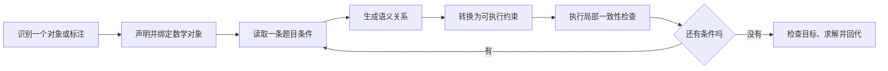

“逐步构建”不等于按照题目句子机械生成步骤，也不等于规定学生的作答顺序。它是后台理解题目时的可靠性机制：每增加一个对象或条件，都保留来源证据并进行局部检查，最后再进行全局求解。

对图片题还应把文字条件与图形证据逐步合并。例如先识别点、边、区域和尺寸标注，再建立“某个数字属于哪条边”“哪些边相等”“阴影区域由哪些部分组成”等关系，而不是只对整张图片生成一段自然语言答案。

#### 在本产品中的落地位置

这三个原则共同形成教师备课阶段的主路径：

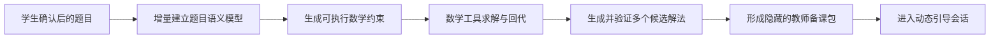

其中，题目世界模型和求解结果属于教师侧隐藏状态，不能绕过教学状态机直接展示给学生。它们的作用是让系统在教学开始前“确实会做并理解这道题”，随后再根据学生的实际表达选择承接、澄清、纠错或最小提示。

## 4. 学生已掌握核心思路却仍被严格限制

### 4.1 问题本质

这通常不是单一 Prompt 问题，而是系统把以下概念错误地绑在了一起：

- 是否匹配预设知识点或参考步骤。
- 学生本轮数学表达是否正确。
- 学生是否已覆盖核心思路。
- 当前允许 AI 透露多少信息。
- 教学是否可以结束。

当系统过度关注答案防泄露时，可能出现一种反常行为：学生已经独立建立关键关系，AI 仍按最初提示等级谨慎追问基础事实。安全规则没有泄露答案，却阻碍了真实教学进展。

这确实是智能化不足的表现，因为系统没有根据学生已经提供的证据动态调整教学权限。

### 4.2 正确性、进度与泄露风险必须解耦

每轮至少分别计算：

```python
class TurnDecision(BaseModel):
    math_verdict: str              # 本轮数学主张是否成立
    core_idea_coverage: float      # 核心关系覆盖程度
    independence_level: str        # 学生独立完成还是依赖提示
    unresolved_gaps: list[str]     # 仍缺什么
    answer_exposure_budget: str    # 当前允许确认或展示到什么程度
    completion_readiness: str      # 是否适合反思或结束
```

关键规则：

- 未匹配知识点或参考路径不能降低 `math_verdict`。
- 学生已经说出的正确内容不再属于“泄露”，AI 可以确认、整理和引用。
- 学生覆盖核心关系后，不应继续询问基础识别问题。
- 防泄露保护的是“尚未由学生完成的关键认知工作”，不是机械隐藏所有后续信息。
- 结果正确但核心理由缺失时，只追问理由，不让学生重新做整道题。

### 4.3 从步骤完成改为核心理解覆盖

每道题动态维护少量“核心理解槽位”，例如和差问题可以抽象为：

```text
K1：识别总量由两个部分组成
K2：识别两个部分之间的差量关系
K3：知道如何利用总量和差量分离两个部分
K4：能够用原题条件验证结果
```

槽位不是固定问答顺序。学生一句话可能同时覆盖 K1～K3，也可能先说 K3 再解释 K1。每个槽位记录：

- 学生原话证据。
- 验证状态。
- 独立程度。
- 使用过的提示等级。
- 是否仍需要解释或迁移验证。

当核心槽位已覆盖时，系统应选择：

- 承认学生已经形成核心思路。
- 让学生自行完成剩余机械计算。
- 直接进入关键关系复述。
- 学生确认理解后允许完成并生成总结。

而不是继续寻找一个尚未匹配的标准 `step_id`。

### 4.4 动态提示预算

“不泄露答案”应变成动态预算，而不是全程固定禁令：

| 学生状态 | AI 允许行为 |
| --- | --- |
| 尚无思路 | 只提醒条件或概念，不给关键关系 |
| 已找到部分关系 | 确认已说出的部分，只追问剩余缺口 |
| 已独立建立核心关系 | 可以整理关系、帮助检查表达，避免代算最终数值 |
| 已完成核心思路和计算 | 可以核验、要求简短解释，不再进行低层提示 |
| 理解验证通过或学生主动完成 | 生成总结并结束，不再提出下一步问题 |

泄露 Guard 应接收 `student_owned_information`：所有有学生原话证据且已验证的关系都可以在回复中复述。只有未被学生拥有的关键推理和最终数值仍需要保护。

### 4.5 推荐决策流程

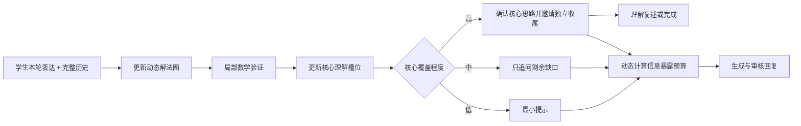

### 4.6 MVP 改造与评测样本

建议新增：

- `CoreUnderstandingSlot` 数据结构。
- `student_owned_information` 和 `remaining_core_gaps`。
- Guard 从固定禁止完整方程，改为禁止“学生尚未表达的关键关系”。
- 教学策略增加 `acknowledge_core_idea`、`invite_independent_finish` 和 `summarize_and_complete`。
- 页面业务逻辑观察台展示核心槽位覆盖率及证据。

必须加入的回归样本：

1. 学生一句话说完核心关系但没有计算。
2. 学生使用不同知识点名称表达等价方法。
3. 学生跳过标准步骤直接给出正确通用关系。
4. 学生核心方法正确但有一次机械计算错误。
5. 学生答案正确但理由错误。
6. 学生已完成，AI 仍重复询问基础条件。
7. 学生主动点击完成，系统只总结而不继续布置任务。

## 5. 包含几何图形的题目如何识别与展示

### 5.1 这不是普通 OCR 问题

图形题输入至少包含三种信息：

1. **文字层**：题干、数字、单位、点名和角度标注。
2. **视觉结构层**：点、线段、圆、弧、多边形、阴影、辅助线和空间位置。
3. **数学语义层**：平行、垂直、等长、相切、包含、分割以及哪个标注属于哪条边。

普通 OCR 只能读取文字，不能可靠回答：数字 `6 cm` 标在哪条边、阴影区域由哪些边界构成、两条看似垂直的线是否题目明确声明垂直。因此需要“版面定位 + 图形结构化 + 数学验证”，不能只让视觉模型输出一段描述。

### 5.2 推荐的图形题处理流水线

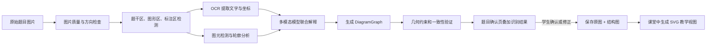

必须同时保留：

- 原始图片：事实来源，防止结构化重建遗漏。
- 标注后的图片：让学生确认识别绑定是否正确。
- 结构化图形：供验证、高亮和动态讲解。

### 5.3 统一 Diagram 数据模型

#### 5.3.1 DiagramGraph 是什么

`DiagramGraph` 是题目图片中“可见图形事实”的结构化表示。它不是一段图片描述，也不是最终解法，而是一张可被程序引用和修改的图：节点表示点、边、圆、区域、文字标注等对象，边表示连接、包含、平行、垂直、等长和数值绑定等关系。

它主要解决六个问题：

- **识别**：视觉模型识别到了哪些对象和关系。
- **绑定**：`6 cm`、`A`、直角符号分别属于哪个图形实体。
- **确认**：哪些信息可靠，哪些需要学生确认或修正。
- **验证**：公式使用的前提和几何关系是否成立。
- **展示**：前端如何重绘同一个图形并稳定高亮某条边或区域。
- **教学**：语音、字幕和黑板动作如何始终指向同一个数学对象。

例如“识别到文字 6 cm”只是 OCR 结果；只有建立 `6 cm -> segment_AB` 的绑定后，它才成为可以参与数学推理的长度事实。

#### 5.3.2 分层数据结构

建议把 `DiagramGraph` 分成五层，而不是把所有内容放进一个扁平数组：

| 层 | 保存内容 | 主要使用者 |
| --- | --- | --- |
| 画布与证据层 | 原图、图形区域、裁剪坐标和图像版本 | 识别服务、确认页面 |
| 几何实体层 | 点、线段、圆、弧、多边形、区域、坐标轴等 | 重绘器、几何验证器 |
| 标注与符号层 | 点名、数值、单位、角度、等长记号、直角记号 | OCR、标注绑定器 |
| 关系与约束层 | 连接、包含、平行、垂直、等长、相切和测量关系 | 世界模型、求解器 |
| 教学视图层 | 高亮、辅助线、分解区域、动画和讲解焦点 | 前端、教学状态机 |

其中前四层描述原题事实，第五层描述课堂中的临时展示状态。二者必须隔离，防止教学时新增的辅助线被误认为原题条件。

#### 5.3.3 实体、标注与关系

建议 MVP 支持以下实体类型：

```text
point                 点
segment / ray / line  线段、射线、直线
polyline              折线或线段图
circle / arc          圆和圆弧
polygon               三角形、四边形和一般多边形边界
region                可计算面积或可高亮的区域
axis / bar / marker   统计图坐标轴、柱形和数据标记
text_label            题内文字
measurement_label     长度、角度、时间、速度等数值标注
symbol_marker         直角、平行、等长和箭头等符号
```

关系应独立于实体保存，避免把推理信息藏在实体名称中。MVP 常用关系包括：

| 关系 | 示例 | 是否可直接作为数学事实 |
| --- | --- | --- |
| `incident` | 点 A 在线段 AB 上 | 需要可靠识别或确认 |
| `endpoint_of` | A 是 AB 的端点 | 是 |
| `boundary_of` | AB 是区域 R 的边界 | 是 |
| `inside` | 小圆位于矩形内部 | 是 |
| `measurement` | AB 长 6 cm | 需要完成标注绑定 |
| `parallel` | AB ∥ CD | 仅来自题干或明确符号时成立 |
| `perpendicular` | AB ⟂ BC | 仅来自题干、直角符号或确认时成立 |
| `equal_length` | AB = CD | 仅来自题干、等长符号或确认时成立 |
| `tangent` | 直线 l 与圆 O 相切 | 需要明确证据 |
| `composed_of` | 阴影区由 R1 和 R2 组成 | 可用于面积分解 |

一个较完整的示例：

```json
{
  "schema_version": "1.0",
  "diagram_id": "diagram_1",
  "diagram_type": "geometry",
  "source_image_id": "image_1",
  "image_bbox": [120, 260, 980, 1040],
  "entities": [
    {"id": "p_A", "type": "point", "geometry": {"x": 0.1, "y": 0.8}},
    {"id": "p_B", "type": "point", "geometry": {"x": 0.8, "y": 0.8}},
    {"id": "seg_AB", "type": "segment", "geometry": {"from": "p_A", "to": "p_B"}},
    {"id": "region_1", "type": "region", "geometry": {"boundary": ["seg_AB", "seg_BC", "seg_CA"]}, "visual": {"shaded": true}}
  ],
  "annotations": [
    {
      "id": "ann_1",
      "type": "measurement_label",
      "raw_text": "6 cm",
      "parsed_value": {"value": 6, "unit": "cm"},
      "bbox": [0.35, 0.79, 0.48, 0.85],
      "target_candidates": [
        {"entity_id": "seg_AB", "score": 0.94},
        {"entity_id": "seg_BC", "score": 0.12}
      ],
      "bound_target_id": "seg_AB"
    }
  ],
  "relations": [
    {
      "id": "rel_length_AB",
      "type": "measurement",
      "subjects": ["seg_AB"],
      "value": {"number": 6, "unit": "cm"},
      "evidence_refs": ["ann_1"],
      "origin": "explicit_diagram_mark",
      "confidence": 0.94,
      "status": "confirmed"
    },
    {
      "id": "rel_right_angle_B",
      "type": "perpendicular",
      "subjects": ["seg_AB", "seg_BC"],
      "evidence_refs": ["marker_right_angle_B"],
      "origin": "explicit_diagram_mark",
      "confidence": 0.98,
      "status": "confirmed"
    }
  ],
  "uncertainties": [
    {
      "id": "uncertainty_1",
      "field": "ann_2.bound_target_id",
      "reason": "标注距离两条边接近",
      "candidates": ["seg_BC", "seg_CD"],
      "resolution": "ask_student_to_select"
    }
  ],
  "teaching_overlays": [
    {
      "id": "overlay_1",
      "type": "helper_segment",
      "entity_id": "helper_split_1",
      "purpose": "split_area",
      "created_in_turn": 6
    }
  ]
}
```

坐标建议保存为相对于图形区域的 `0～1` 归一化坐标，方便不同屏幕尺寸叠加。所有数学关系都应记录来源：题干文字、明确符号、学生确认或模型推断。

稳定 ID 是整个模型的关键。例如 `seg_AB` 一旦生成，在 OCR 绑定、世界模型、语音字幕、SVG 元素和教学事件中必须保持一致，不能每一轮重新命名。

#### 5.3.4 事实来源、置信度与确认状态

每条可能影响解题的关系至少记录：

```json
{
  "origin": "problem_text | explicit_diagram_mark | student_confirmed | model_inferred | geometric_derivation",
  "confidence": 0.94,
  "status": "candidate | needs_confirmation | confirmed | rejected | derived",
  "evidence_refs": ["ann_1", "marker_2"]
}
```

来源比置信度更重要。即使模型以 99% 置信度认为两条边看起来垂直，只要图片中没有直角符号、题干声明或学生确认，这个关系也只能是视觉候选，不能进入求解器作为已知条件。

关键关系的处理规则：

- `problem_text`、清晰的 `explicit_diagram_mark` 和 `student_confirmed` 可以成为原题事实。
- `model_inferred` 默认不能直接成为关键求解条件，应进入确认队列。
- `geometric_derivation` 必须保存使用的前提和规则，支持追溯。
- 被学生修正后保留旧版本和修正记录，避免后台服务再次覆盖。

#### 5.3.5 原题实体与教学辅助实体

必须区分三类内容：

| 类型 | 示例 | 是否可以改变原题事实 |
| --- | --- | --- |
| `source` | 原图中的边、圆、阴影和标注 | 否 |
| `derived` | 根据已确认关系推导出的交点或相等关系 | 只能增加可追溯推论 |
| `helper` | AI 为讲解添加的辅助线、拆分色块和动画 | 否，且不能自动进入求解条件 |

例如 AI 为组合面积题添加一条分割线时，这条线应标记为 `helper`，记录创建回合和教学目的。删除辅助线只改变当前教学视图，不修改原始 `DiagramGraph`。

#### 5.3.6 与题目世界模型的关系

`DiagramGraph` 只描述图中可见对象和关系，`ProblemWorldModel` 描述整道题的数学语义。两者通过稳定实体 ID 连接：

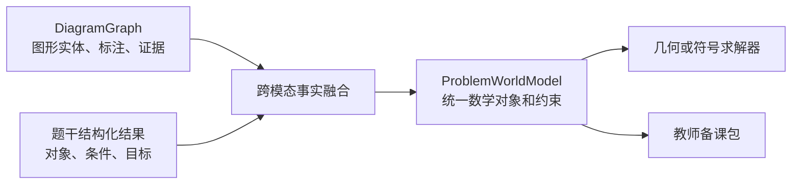

例如图中 `seg_AB` 标注为 `6 cm`，题干又说“以 AB 为长”，融合后世界模型可以建立：

```json
{
  "quantity_id": "rectangle_length",
  "value": 6,
  "unit": "cm",
  "diagram_entity_ref": "seg_AB",
  "text_evidence_ref": "text_span_3"
}
```

图形图负责回答“6 cm 在图中的哪里”，世界模型负责回答“这个长度在题目中扮演什么数学角色”。

#### 5.3.7 识别、确认和教学生命周期

`DiagramGraph` 不是一次生成后永久不变，而应有明确的版本生命周期：

1. 视觉模型、OCR 和传统视觉算法分别生成候选对象。
2. 合并候选，分配稳定 ID，生成 `draft` 版本。
3. 规则检查连接关系、标注绑定、单位和图形闭合性。
4. 将关键低置信度关系叠加在原图上，请学生确认。
5. 保存 `confirmed` 版本，并据此构建题目世界模型和教师备课包。
6. 通话过程中只通过 `diagram_patch` 修改教学视图。
7. 学生指出识别错误时，创建新的图形版本，重新执行受影响的世界模型、求解和备课步骤。

前端不应每一轮接收一张新生成图片，而应接收针对稳定实体的事件，例如：

```json
{
  "type": "diagram_patch",
  "diagram_version": 3,
  "highlight_entities": ["seg_AB", "region_1"],
  "dim_others": true,
  "caption": "先观察这条已知为 6 厘米的边和阴影区域。"
}
```

这样可以保证屏幕高亮、字幕中的“这条边”和语音讲解引用的是同一个对象。

### 5.4 识别方案

#### 5.4.1 总体方案

推荐采用“多模态模型主识别 + 专用 OCR 补强 + OpenCV 提供几何候选 + 规则校验 + 学生确认”的混合方案，而不是让一个模型看完整张图片后直接给出题目描述或答案。

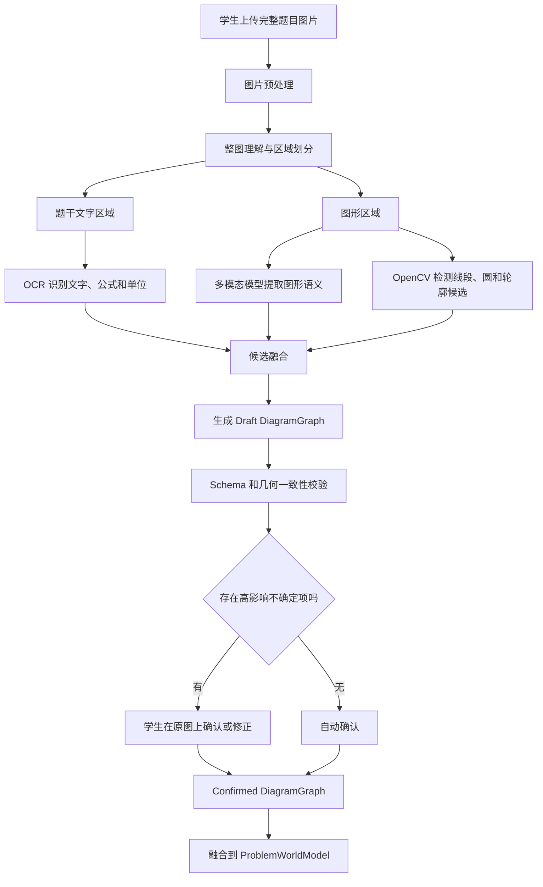

各技术的职责如下：

| 任务 | 推荐技术 |
| --- | --- |
| 页面结构和图形大意 | `qwen3-vl-flash` 等多模态模型 |
| 题干和标注文字 | 多模态模型；准确率不足时增加 `qwen-vl-ocr`，同时返回 bounding box |
| 图形区域检测 | 多模态模型或版面分析模型定位 |
| 直线、圆和轮廓 | OpenCV 的边缘、直线、圆和轮廓检测作为候选 |
| 点线面语义与标注绑定 | 多模态模型结构化输出 |
| 关系验证 | 几何规则、坐标计算和符号标记检查 |
| 不确定项 | 页面叠加候选，让学生点击确认 |

传统视觉算法不应单独承担语义理解，多模态模型也不应单独承担精确几何测量。两者结合：模型理解“这是什么”，确定性算法检查“结构是否自洽”。

特别注意：示意图通常不按比例绘制。系统不能因为图上两条线看起来相等或垂直，就推断数学上的等长或垂直；只有题干、等长符号、直角符号或学生确认才能建立这些约束。

#### 5.4.2 图片预处理与区域划分

后端首先使用 Pillow/OpenCV 完成方向检查、透视矫正、裁边、缩放、灰度增强和模糊度检测。必须同时保留原图以及预处理图，并保存坐标变换矩阵，确保识别结果能够准确叠加回原图。

第一次调用多模态模型只做整图分析，不要求解题，输出：

```json
{
  "problem_text_regions": [],
  "diagram_regions": [],
  "table_regions": [],
  "handwriting_regions": [],
  "diagram_type_candidates": [],
  "has_diagram_dependency": true
}
```

当前 Demo 可以继续用 `qwen3-vl-flash` 完成整图分析。该模型支持图像理解、空间定位和结构化输出，适合输出候选区域和语义，但坐标仍然需要后续工具和页面确认，不能直接视为精确几何数据。参见[阿里云 qwen3-vl-flash 模型说明](https://help.aliyun.com/zh/model-studio/qwen3-vl-flash)。

#### 5.4.3 文字和公式识别

题干区与图形区分别裁剪识别：

- 题干区提取中文、数字、分数、百分数、公式、单位和问题目标。
- 图形区提取点名、长度、角度、半径、直径、刻度和统计图标签。
- 每个结果必须保存文字内容、标准化数值、单位、坐标和置信度，不能只返回拼接后的全文。

```json
{
  "id": "ann_1",
  "raw_text": "6 cm",
  "normalized_text": "6 cm",
  "parsed_value": 6,
  "unit": "cm",
  "bbox": [0.35, 0.79, 0.48, 0.85],
  "confidence": 0.96
}
```

MVP 第一版可只使用 `qwen3-vl-flash`，减少服务数量。如果测试发现小数字、分数、单位或公式错误率较高，再增加 `qwen-vl-ocr` 作为独立 OCR Provider。阿里云将其用于试卷、文档、表格、公式和手写内容的文字提取，参见[Qwen OCR 官方说明](https://help.aliyun.com/en/model-studio/qwen-vl-ocr)。

#### 5.4.4 图形结构双通道识别

图形区域并行经过两个通道：

**通道 A：多模态语义识别**

- 判断对象是点、边、圆、区域、线段图还是统计图。
- 判断标注可能属于哪条边、哪个角或哪个区域。
- 识别阴影、直角符号、平行符号和等长符号。
- 按 `DiagramGraph` Schema 输出候选实体、关系和不确定项。

**通道 B：OpenCV 图元候选检测**

- `HoughLinesP` 检测线段及其像素端点。
- `HoughCircles` 检测圆形候选。
- `findContours` 检测闭合轮廓和阴影区域候选。
- 多边形逼近和线段交点计算辅助识别三角形、四边形和区域边界。

OpenCV 负责回答“像素层面在哪里”，多模态模型负责回答“这个对象在题目中可能是什么”。OpenCV 的直线检测能力可参考[官方 Hough Line Transform 文档](https://docs.opencv.org/master/d9/db0/tutorial_hough_lines.html)。

#### 5.4.5 候选融合与规则校验

融合阶段将 OCR 标注、多模态语义候选和 OpenCV 图元候选合并。例如 OCR 找到 `6 cm`，OpenCV 找到附近两条线段，多模态模型判断它更可能属于底边，系统最终生成带多个证据的候选绑定。

不同通道不能简单多数投票：

| 判断 | 主要证据 |
| --- | --- |
| 文字内容 | OCR |
| 线段和轮廓坐标 | OpenCV |
| 标注属于哪个实体 | 多模态语义 + 空间距离 |
| 是否为原题数学条件 | 题干、明确符号或学生确认 |
| 是否可以进入求解器 | Schema、规则校验和确认状态 |

生成 `Draft DiagramGraph` 后至少执行：

- ID 唯一、引用存在和多边形边界闭合检查。
- 数值、单位、实体类型和标注绑定检查。
- 直角、等长和平行符号的空间绑定检查。
- 题干所述点、边、图形与图中实体的一致性检查。
- 关键条件是否缺失、冲突或仅来自视觉推断的检查。

#### 5.4.6 只让学生确认高影响不确定项

学生不需要审核整张 `DiagramGraph`，只确认一旦识别错误就会改变题意或解法的内容，例如：

- `6 cm` 属于哪条边。
- 阴影范围是否正确。
- 模糊字符是 `5` 还是 `6`。
- 某个标注指半径还是直径。
- 图中是否确实存在直角符号。

OpenCV 产生的每个交点和不影响解题的装饰线不需要询问。确认页可以使用蓝色表示已确认、黄色表示待确认、红色表示冲突、虚线表示模型推测且尚不能用于求解。

#### 5.4.7 OpenCV 如何使用和部署

OpenCV 是一个图像处理程序库，不是必须通过网络调用的云服务。对当前 Demo，推荐把它作为 Python API 服务中的本地依赖运行：

```text
浏览器上传图片
  → 当前 API 后端保存临时文件或读取字节
  → Python 调用 OpenCV 处理图片
  → 返回线段、圆、轮廓等 JSON 候选
  → 删除临时文件或按本地数据策略保留
```

安装时后端通常使用无 GUI 版本：

```bash
pip install opencv-python-headless
```

示意代码：

```python
import cv2
import numpy as np

def detect_segments(image_bytes: bytes) -> list[dict]:
    image = cv2.imdecode(np.frombuffer(image_bytes, np.uint8), cv2.IMREAD_COLOR)
    gray = cv2.cvtColor(image, cv2.COLOR_BGR2GRAY)
    edges = cv2.Canny(gray, 50, 150)
    lines = cv2.HoughLinesP(
        edges,
        rho=1,
        theta=np.pi / 180,
        threshold=40,
        minLineLength=30,
        maxLineGap=8,
    )

    if lines is None:
        return []

    return [
        {"x1": int(x1), "y1": int(y1), "x2": int(x2), "y2": int(y2)}
        for [[x1, y1, x2, y2]] in lines
    ]
```

这里的输出只是“可能的线段”，不能直接变成 `AB`、平行关系或长方形条件。还需要合并重复线段、映射归一化坐标，并与多模态模型和 OCR 结果融合。

部署建议：

| 阶段 | 部署方式 | 原因 |
| --- | --- | --- |
| 当前本地 Demo | OpenCV 随 Python API 本地运行 | 零额外云服务、调试方便、图片不必额外外传 |
| 后续测试环境 | OpenCV 随 API Docker 容器部署 | 环境和系统依赖可复现 |
| 图形处理量明显增大 | 拆成内部异步 Worker | 隔离 CPU 消耗并支持任务队列 |
| 只有确切商业收益时 | 再评估云视觉服务 | 避免过早增加供应商和调用成本 |

所以“本地还是云服务”不是二选一：OpenCV 代码始终由我们部署。当前运行在电脑本地，将来 API 上云后，同一段代码随容器运行在云服务器上，一般不需要单独购买 OpenCV 云服务。

#### 5.4.8 分阶段落地

第一阶段先验证业务闭环：

```text
qwen3-vl-flash 整图理解
→ 结构化输出 DiagramGraph 草稿
→ Schema 和基础规则校验
→ 学生确认关键标注
→ 生成简化 SVG
→ 进入教学
```

第二阶段根据错误数据补强，而不是预先实现完整计算机视觉系统：

- 小数字、分数和公式识别差，再加入 `qwen-vl-ocr`。
- 线段、圆和轮廓坐标不稳定，再加入 OpenCV。
- 数字经常绑错边，再实现专门的标注绑定算法。
- 图形结构正确但数学条件误用，再加强几何规则和 Guard。

为了保持可替换性，建议封装：

```python
class DiagramRecognizer:
    async def analyze_layout(self, image) -> LayoutResult: ...
    async def extract_diagram(self, image, schema) -> DiagramGraphDraft: ...

class OCRProvider:
    async def recognize(self, image) -> list[OCRAnnotation]: ...

class PrimitiveDetector:
    async def detect(self, image) -> list[PrimitiveCandidate]: ...
```

首版配置可以是多模态模型承担前两项、`PrimitiveDetector` 关闭；建立图形评测集后，再用数据决定是否启用专用 OCR 和 OpenCV。模型名称也不应写死，以便对同一批图片比较不同模型版本。

### 5.5 页面展示与动态讲解

展示的总体原则是：

> 原图用于核对题目事实，重绘图用于持续讲解，高亮是附着在重绘图上的课堂状态。

原图、重绘图和高亮不是三个互相独立且长期并排的区域。正常通话时以重绘教学图为主，保留原图缩略图供随时核对；题目确认时以原图为主；识别或重绘不可靠时退回原图覆盖高亮。

#### 5.5.1 展示原则与页面布局

Web 端采用左右两栏，左侧作为 AI 数学黑板，右侧保留语音通话、实时字幕和教学状态：

```text
┌──────────────────────────────────────────────────────────────┐
│ 题目：已确认                  通话中  03:26        [完成]     │
├───────────────────────────────┬──────────────────────────────┤
│                               │                              │
│       AI 数学黑板             │       通话与字幕             │
│                               │                              │
│    SVG 重绘图 + 动态高亮       │  AI：先观察阴影区域……        │
│                               │  学生：我想把它分成……        │
│                               │                              │
│                               │  [按住说话] [结束通话]        │
├───────────────────────────────┴──────────────────────────────┤
│ [查看原题]   当前关注：阴影区域   已知：长6cm、宽4cm           │
└──────────────────────────────────────────────────────────────┘
```

通话过程中不应因为查看原图而跳转到新页面或中断语音。窄屏下可以把教学黑板放在字幕上方，但当前 Demo 只需要优先保证桌面 Web 布局。

#### 5.5.2 原图的展示与确认

题目确认阶段以原图为主，并在原图上叠加 OCR 文本框、点名、边、区域和低置信度绑定：

- 蓝色：已经确认的原题事实。
- 黄色：需要学生确认。
- 红色：不同识别结果存在冲突。
- 灰色虚线：模型推测，尚不能用于求解。

学生可以点击标注修改文字、选择正确线段或区域、删除误识别结果。学生确认后保存一个新的 `DiagramGraph` 版本，不直接覆盖原始识别证据。

正常通话时只显示原题缩略图和“查看原题”按钮。点击后使用页面内抽屉或弹层展示大图，并允许开关识别框、实体名称和低置信度候选，不能离开当前通话页面。

#### 5.5.3 SVG 重绘教学黑板

重绘图使用 SVG，不使用生成式模型重新生成一张不可编辑图片。每个 SVG 元素绑定稳定的 `DiagramGraph` 实体 ID：

```html
<line id="seg_AB" />
<line id="seg_BC" />
<path id="region_shaded" />
<text id="ann_length_6">6 cm</text>
```

这样前端才能精确高亮边和区域、控制标注显示、添加辅助线，并把字幕中的“这条边”映射到同一实体。

重绘图追求清晰，不需要像素级复刻原图，但必须：

- 保持对象的拓扑、连接、包含和标注绑定关系。
- 保留阴影、点名及题目明确给出的符号。
- 不擅自补充平行、垂直或等长等原题未声明的事实。
- 不因视觉美化改变阴影边界或待求区域。
- 显示“教学示意图，不保证按比例绘制”。

#### 5.5.4 讲解高亮状态

高亮通过改变 SVG 实体状态实现，不重新生成图片：

| 状态 | 展示方式 | 用途 |
| --- | --- | --- |
| 当前关注 | 蓝色加粗和轻微发光 | AI 正在讲的对象 |
| 学生提到 | 绿色描边 | 学生当前引用的对象 |
| 已知条件 | 蓝色标签 | 题目明确提供的信息 |
| 待求对象 | 橙色虚线或问号 | 当前要求的量或区域 |
| 存在疑问 | 黄色短暂脉冲 | 需要学生确认 |
| 错误绑定 | 红色描边 | 识别结果发生冲突 |
| 暂时弱化 | 降低透明度 | 减少无关对象干扰 |
| 教学辅助对象 | 紫色虚线 | AI 或学生添加的辅助线 |

动画只用于表达明确教学动作，例如聚焦某个区域、分解组合图形、依次展示两个条件或加入一条辅助线。避免持续闪烁、无意义移动和同时高亮大量对象。

#### 5.5.5 字幕、语音与图形动作同步

教学回复除文字外，还需要输出结构化图形动作：

```json
{
  "speech_text": "先观察阴影区域和这条长为6厘米的边。",
  "diagram_patch": {
    "diagram_version": 3,
    "focus_entities": ["region_shaded", "seg_AB"],
    "show_annotations": ["ann_length_6"],
    "dim_entities": ["seg_CD", "seg_DA"],
    "animation": "focus"
  }
}
```

前端先检查版本和实体 ID，再应用高亮、展示字幕并播放语音，使学生听到“这条边”时，对应实体已经被点亮。如果使用流式 TTS，回复应拆成多个语义片段，每个片段有独立的图形动作：

```json
[
  {
    "speech": "先看整个阴影区域。",
    "focus_entities": ["region_shaded"]
  },
  {
    "speech": "它可以从这里分成两个长方形。",
    "add_helper_entities": ["helper_split_1"],
    "focus_entities": ["region_left", "region_right"]
  }
]
```

如果回复引用不存在的实体、图形版本落后或动作违反原题事实，前端拒绝执行该动作，但仍可播放不依赖该指代的安全字幕；后台同时记录错误以供调试。

#### 5.5.6 辅助线与面积分解

AI 增加辅助线时只生成 `helper` 实体，不能修改原题事实或自动写入求解条件：

```json
{
  "operation": "add",
  "entity": {
    "id": "helper_split_1",
    "type": "segment",
    "origin": "helper",
    "style": "dashed",
    "purpose": "split_area"
  }
}
```

视觉上建议使用黑色实线表示原题图形、紫色虚线表示辅助线、蓝色区域表示当前讨论部分、淡灰色表示暂时弱化部分。页面提供撤销本轮辅助动作和恢复原始教学图的能力。

面积分解不能只产生视觉色块，还要同步生成可追溯的区域关系，例如 `region_shaded composed_of region_left + region_right`。只有经过几何验证后，才能作为候选解法中的数学关系。

#### 5.5.7 三种查看模式与失败降级

页面支持三种模式：

| 模式 | 展示方式 | 使用场景 |
| --- | --- | --- |
| 教学模式 | 重绘图为主、原图缩略图 | 默认通话和高亮讲解 |
| 对照模式 | 原图与重绘图并排、实体联动 | 学生核对重绘是否准确 |
| 原图模式 | 原图为主、覆盖层高亮 | 题目确认或重绘失败 |

在对照模式中，鼠标悬停或点击 `seg_AB` 时，原图对应位置和 SVG 中的实体应同步高亮，并显示它的名称、数值和确认状态。

原图覆盖高亮是必须保留的降级能力。如果无法可靠生成 SVG，系统仍可根据已确认 bounding box、轮廓或区域在原图上进行基础高亮，不应因为重绘失败阻止学生进入辅导。关键实体坐标也不可靠时，则只进行文字和语音引导，并明确说明暂时无法指向图中对象。

#### 5.5.8 学生对图形的交互

学生不仅可以观看，也可以点击点、边、区域或标注，以消除“这里、那条边、上面那块”等口语指代歧义。例如学生选中阴影左侧区域并说“我想先求这一块”，后端同时收到：

```json
{
  "student_text": "我想先求这一块",
  "selected_entities": ["region_left"],
  "diagram_version": 3
}
```

MVP 支持：

- 点击一个实体并在下一次发言中引用它。
- 点击空白处或按钮清除选择。
- 修改数字文字或重新绑定到一条边、一个角或一个区域。
- 由系统朗读当前所选实体及其已确认信息。

自由画线和拖动点暂不作为首版能力，避免把手势识别、几何构造和原题事实修改混在一起。

#### 5.5.9 前端组件与 MVP 范围

建议组件结构：

```text
DiagramWorkspace
├── OriginalImageViewer
│   ├── ImageCanvas
│   ├── RecognitionOverlay
│   └── ConfirmationEditor
├── SVGTeachingBoard
│   ├── SourceEntitiesLayer
│   ├── DerivedEntitiesLayer
│   ├── HelperEntitiesLayer
│   └── HighlightLayer
├── DiagramToolbar
│   ├── ViewModeSwitcher
│   ├── ResetView
│   └── ToggleLabels
└── DiagramCaption
```

首版只实现：

1. 原图缩略图、弹层查看和识别框叠加。
2. SVG 重绘基本图形。
3. 按稳定 ID 高亮点、边、标注和区域。
4. 添加和撤销一条虚线辅助线。
5. 学生点击选择一个实体。
6. 字幕或 TTS 语义片段开始时同步高亮。
7. SVG 重绘失败时退回原图覆盖高亮。

核心验收场景：AI 说“先看长为 6 厘米的这条边”时，字幕同步出现且正确线段高亮；学生点击阴影区域并说“我想先求这一块”后，后端同时获得学生语音文本和正确的 `region_id`，下一轮能够准确承接该指代。

### 5.6 几何验证与防误导

#### 5.6.1 总体转换链路

`DiagramGraph` 表示图片中有什么、对象位于哪里、标注绑定到谁以及关系证据来自哪里。它不是可直接执行的数学模型，不能原样交给 SymPy。系统需要经过几何事实、规则匹配和代数约束转换：

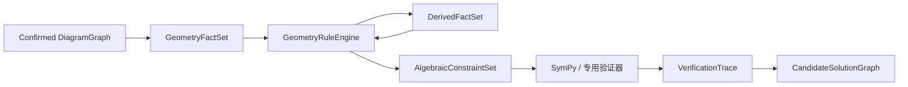

各层职责必须分离：

| 层 | 回答的问题 |
| --- | --- |
| `DiagramGraph` | 图中看到了什么，证据在哪里 |
| `GeometryFactSet` | 哪些图形关系已可作为数学前提 |
| `GeometryRuleEngine` | 哪条几何规则适用，可以推出什么 |
| `AlgebraicConstraintSet` | 如何转换成可计算、可比较的表达式 |
| `VerificationTrace` | 结论依据哪些事实和规则，是否通过验证 |
| `CandidateSolutionGraph` | 这些推导组成了哪一种可教学的解题方法 |

#### 5.6.2 GeometryFactSet

`GeometryFact` 是已经能够作为数学前提使用的结构化事实：

```json
{
  "fact_id": "fact_length_AB",
  "predicate": "length",
  "subjects": ["seg_AB"],
  "value": {"number": 6, "unit": "cm"},
  "source": "explicit_diagram_mark",
  "evidence_refs": ["ann_1"],
  "status": "confirmed"
}
```

至少区分：

| 事实类型 | 来源 | 能否直接参与推导 |
| --- | --- | --- |
| 原题事实 | 题干文字或明确图形符号 | 可以 |
| 学生确认事实 | 学生对关键识别结果的确认 | 可以 |
| 几何推导事实 | 已验证规则产生 | 可以，必须保留推导依据 |
| 视觉候选 | 仅根据图形外观推测 | 不可以，需确认或获得其他证据 |

例如两条线看起来垂直只能形成视觉候选。只有题干声明、明确直角符号、学生确认或有效几何推导，才能形成 `perpendicular(seg_AB, seg_BC)` 的可靠事实。

#### 5.6.3 GeometryRuleEngine

每条几何规则都必须包含前提、适用范围、输出和年级信息，不能仅保存公式文本。例如长方形面积规则：

```json
{
  "rule_id": "rectangle_area",
  "name": "长方形面积",
  "prerequisites": [
    "is_rectangle(region)",
    "boundary_edge(region, length_edge)",
    "boundary_edge(region, width_edge)",
    "adjacent(length_edge, width_edge)"
  ],
  "produces": [
    "area(region) = length(length_edge) * length(width_edge)"
  ],
  "grade_range": [4, 6]
}
```

规则引擎执行时，需要：

1. 匹配已确认事实，不把视觉相似当作前提。
2. 为规则变量绑定具体实体，例如 `region = region_ABCD`。
3. 检查实体类型、单位、定义域和所有必要前提。
4. 产生一个或多个派生事实或代数约束。
5. 保存使用的规则、输入事实和实体绑定。
6. 防止同一规则反复产生相同事实，并设置推导深度和数量限制。

几何规则用于证明“为什么可以这样列式”，SymPy 用于证明“这个式子如何计算或是否等价”，二者不能互相替代。

#### 5.6.4 AlgebraicConstraintSet

规则成立后，将几何量转换为 SymPy 可以执行的符号表达：

```python
length_AB = Symbol("length_AB", positive=True)
length_BC = Symbol("length_BC", positive=True)
area_ABCD = Symbol("area_ABCD", positive=True)

constraints = [
    Eq(length_AB, Rational(6)),
    Eq(length_BC, Rational(4)),
    Eq(area_ABCD, length_AB * length_BC),
]
```

每个符号必须能够反向关联到几何实体和数量类型。例如 `length_AB` 引用 `seg_AB`，单位维度是长度；`area_ABCD` 引用 `region_ABCD`，单位维度是面积。这样才能阻止长度与面积直接相加等类型错误。

系统不能只保存最终的 `S = 6 × 4`，还要保留它成立的完整语义依据：区域是长方形、两条边属于该区域且相邻、数值和单位绑定正确、使用了哪条面积规则。

#### 5.6.5 VerificationTrace

每次推导和求解都生成可追踪记录：

```json
{
  "trace_id": "trace_1",
  "rule_id": "rectangle_area",
  "bindings": {
    "region": "region_ABCD",
    "length_edge": "seg_AB",
    "width_edge": "seg_BC"
  },
  "input_facts": [
    "fact_is_rectangle_ABCD",
    "fact_length_AB",
    "fact_length_BC",
    "fact_adjacent_AB_BC"
  ],
  "produced_constraint": "constraint_area_ABCD",
  "verification": {
    "status": "verified",
    "engine": "sympy",
    "result": 24,
    "unit": "cm²"
  }
}
```

验证轨迹用于：

- 解释某一步为什么成立。
- 判断学生方法缺少哪个前提。
- 审核 AI 是否误用了公式。
- 当某条识别事实被修正时，找出所有需要失效并重新计算的下游结果。
- 将数学推导转换成候选解法图和适龄提示，而不直接向学生暴露完整内部答案。

#### 5.6.6 组合面积与区域操作

组合面积题需要把区域关系作为一等事实。两个常见结构是：

```text
disjoint_union(region_shaded, region_left, region_right)
```

对应：

```text
area(region_shaded) = area(region_left) + area(region_right)
```

以及：

```text
region_difference(region_shaded, region_outer, region_cutout)
```

对应：

```text
area(region_shaded) = area(region_outer) - area(region_cutout)
```

区域相加前必须验证内部不重叠且并集覆盖目标区域；区域相减前必须验证被减区域包含在整体中。不能因为图形在屏幕上“看起来差不多”就建立面积守恒关系。

分割法、补形法和平移拼接法可能得到相同的代数结果，但它们的图形操作、认知要求和提示路径不同，因此必须形成不同的 `CandidateSolutionGraph`，不能只按最终表达式去重。

#### 5.6.7 学生新分割方法的独立验证

学生提出候选备课方案之外的方法时，系统不按“是否匹配教师答案”判断，而是临时构建学生操作分支并独立验证。例如学生提出添加辅助线、分成两个长方形：

1. 将辅助线加入学生操作图，标记为 `helper`，不修改原题事实。
2. 计算辅助线与原边界的交点。
3. 检查是否形成有效闭合区域。
4. 检查新区域是否互不重叠，并且并集等于原目标区域。
5. 检查新区域是否满足学生声称的图形类型。
6. 检查计算所需的边长是否已知或能够推导。
7. 生成新的候选解法分支和验证轨迹。

可能返回：

```json
{
  "verdict": "valid",
  "student_method": "split_into_two_rectangles",
  "new_regions": ["student_region_1", "student_region_2"],
  "coverage_verified": true,
  "overlap_verified": true,
  "dimensions_derivable": true
}
```

也可能是局部可行而不完整：

```json
{
  "verdict": "incomplete",
  "reason": "形成了两个区域，但右侧区域的宽无法从当前事实推导",
  "next_teaching_target": "检查右侧区域宽度"
}
```

第二种情况不能简单判错。教学系统应承认分割在结构上可行，只追问仍无法计算的局部量。

#### 5.6.8 MVP 规则范围

首版不建设通用几何证明器，只实现有限、可测试、可追踪的规则集合：

- 基本图形：长方形、正方形、三角形、平行四边形、梯形、圆、半圆和扇形。
- 基本量：长度、底、高、半径、直径、周长和面积。
- 区域操作：不重叠相加、整体减局部、简单分割、简单补形和平移后的等面积关系。
- 公式规则：上述基本图形的面积与周长公式及适用前提。
- 基础校验：数值正数、单位维度、边界闭合、相交、包含、覆盖和不重叠。

线段图、行程示意图和统计图仍使用 `DiagramGraph` 表示视觉实体，但不应强行套入几何面积规则；它们需要分别映射到数量关系规则和统计数据规则，共用事实、规则、约束和验证轨迹接口。

#### 5.6.9 几何 Guard 与架构原则

几何 Guard 至少检查：

- 标注长度是否绑定到正确线段，单位是否一致。
- 面积与长度等数学维度是否混淆。
- 辅助线是否被错误升级为原题条件。
- 使用面积或周长公式的全部前提是否满足。
- 阴影区域是否与结构化区域边界一致。
- 是否把“看起来像”误判为平行、垂直、等长或相切。
- 区域分解是否满足覆盖、不重叠或包含条件。
- 语音、字幕、点击和图形高亮是否引用相同实体及版本。

对于无法确认的关键关系，必须先让学生核对，不能静默采用模型猜测。

四条核心架构原则：

1. `DiagramGraph` 保存图中证据，不直接保存最终答案。
2. 只有已确认事实和有验证轨迹的派生事实才能参与规则推导。
3. 每条规则必须检查前提，并保存输入事实、实体绑定、输出和验证结果。
4. 学生的新方法通过几何条件独立验证，不能通过是否匹配教师候选解法判断。

#### 5.6.10 MVP 实现决策

以下内容作为图形题 MVP 的默认实现决策。后续只有评测数据证明方案不适用时才调整，并通过 Schema、配置或 Adapter 版本记录变化。

**1. GeometryFact 标准谓词集合**

**决策状态：已确认。**

大模型不能自由创造业务谓词，否则同一个关系可能被输出为 `inside`、`contained_by`、`within` 等不同形式，导致规则无法稳定匹配。MVP 使用受控谓词表；模型只能选择标准谓词并绑定实体，无法表达时输出 `unsupported_relation`。

首版谓词确定为五组：

```text
实体分类：
is_triangle, is_rectangle, is_square, is_parallelogram,
is_trapezoid, is_circle, is_semicircle, is_sector

拓扑关系：
endpoint_of, boundary_edge, inside, contains,
intersects, disjoint, overlaps, composed_of

几何关系：
parallel, perpendicular, equal_length, collinear,
tangent, adjacent, shares_boundary

测量关系：
length, angle_measure, radius, diameter, perimeter, area

区域操作：
disjoint_union, region_difference, equal_area,
split_into, rearranged_to
```

标准参数签名与方向性如下：

| 谓词 | 标准签名 | 方向性或规范化规则 |
| --- | --- | --- |
| `is_triangle` | `(region)` | 一元分类 |
| `is_rectangle` | `(region)` | 一元分类 |
| `is_square` | `(region)` | 一元分类 |
| `is_parallelogram` | `(region)` | 一元分类 |
| `is_trapezoid` | `(region)` | 一元分类 |
| `is_circle` | `(shape)` | 一元分类，实体需有圆形几何表示 |
| `is_semicircle` | `(region)` | 一元分类 |
| `is_sector` | `(region)` | 一元分类 |
| `endpoint_of` | `(point, segment)` | 有方向，点在前、线段在后 |
| `boundary_edge` | `(region, segment_or_arc)` | 有方向，区域在前、边界在后 |
| `inside` | `(inner_entity, outer_region)` | 有方向，不得交换参数 |
| `contains` | `(outer_region, inner_entity)` | `inside` 的反向规范表达，不独立重复存储两份事实 |
| `intersects` | `(entity_a, entity_b)` | 对称，按实体 ID 排序后存储 |
| `disjoint` | `(entity_a, entity_b)` | 对称，按实体 ID 排序后存储 |
| `overlaps` | `(region_a, region_b)` | 对称，按实体 ID 排序后存储 |
| `composed_of` | `(whole, parts[])` | 有方向，整体在前；parts 按实体 ID 规范化 |
| `parallel` | `(segment_a, segment_b)` | 对称，按实体 ID 排序后存储 |
| `perpendicular` | `(segment_a, segment_b)` | 对称，按实体 ID 排序后存储 |
| `equal_length` | `(segment_a, segment_b)` | 对称，按实体 ID 排序后存储 |
| `collinear` | `(points[])` | 至少三个点；按实体 ID 规范化，顺序不表达方向 |
| `tangent` | `(linear_or_circle_entity, circle)` | 角色有类型约束，圆实体固定放在第二位 |
| `adjacent` | `(entity_a, entity_b)` | 对称，按实体 ID 排序后存储 |
| `shares_boundary` | `(region_a, region_b, boundary_entity)` | 前两个区域对称，边界实体固定在最后 |
| `length` | `(segment, quantity)` | 有类型约束，`quantity.dimension = length` |
| `angle_measure` | `(angle, quantity)` | 有类型约束，`quantity.dimension = angle` |
| `radius` | `(circle, quantity)` | 有类型约束，`quantity.dimension = length` |
| `diameter` | `(circle, quantity)` | 有类型约束，`quantity.dimension = length` |
| `perimeter` | `(region, quantity)` | 有类型约束，`quantity.dimension = length` |
| `area` | `(region, quantity)` | 有类型约束，`quantity.dimension = area` |
| `disjoint_union` | `(target_region, part_regions[])` | 有方向；部分互不重叠且并集覆盖目标 |
| `region_difference` | `(target_region, whole_region, removed_regions[])` | 有方向；目标等于整体扣除移除区域 |
| `equal_area` | `(region_a, region_b)` | 对称，按实体 ID 排序后存储 |
| `split_into` | `(source_region, result_regions[])` | 有方向，原区域在前 |
| `rearranged_to` | `(source_regions[], target_regions[])` | 有方向，必须另有面积守恒验证轨迹 |

实现约束：

- Schema 校验必须在规则匹配前检查参数数量、实体类型、数量维度和方向。
- 对称谓词入库前统一按实体 ID 排序，避免 `parallel(A,B)` 与 `parallel(B,A)` 成为两个事实。
- `contains` 与 `inside` 是反向视图，内部选择一个规范形式持久化，查询层负责转换。
- `parts[]`、`points[]` 等集合参数需要去重，并设置 MVP 最大数量。
- 标准谓词表按 `predicate_schema_version` 版本化；新增谓词必须通过 Schema、规则和回归样本审核。
- 大模型输出 `unsupported_relation` 时保存原始文本和相关实体，进入离线分析，不自动扩展在线谓词表。

**2. 候选事实如何升级为可用事实**

**决策状态：已确认。**

事实确认采用“来源权限 + 证据绑定 + 类型与一致性校验”的方式。任何单一识别模型都不能仅凭置信度把关键数学关系升级为可靠事实。

权限矩阵：

| 来源 | 可以直接做什么 | 不能直接做什么 | 默认状态 |
| --- | --- | --- | --- |
| 已确认题干文字 | 确认文字明确陈述的对象、数值、单位、图形类型和关系 | 补充题干没有陈述的几何性质 | `confirmed_source` |
| 清晰图形符号 | 确认符号明确表达且绑定无歧义的直角、平行、等长和阴影事实 | 根据外观看起来像某种关系而确认 | `confirmed_source`；绑定有歧义时为 `candidate` |
| 多模态模型 | 生成实体、标注绑定、图形类型和关系候选，提供证据位置与置信度 | 独立确认关键数学关系或覆盖已确认事实 | `candidate` |
| OpenCV/几何视觉算法 | 生成点、线、圆、轮廓、交点、像素角度和拓扑候选 | 根据像素长度或角度确认真实长度、垂直、平行或等长 | `candidate` 或仅保存为 `display_geometry` |
| 学生确认 | 确认文字内容、标注绑定、阴影范围、符号是否存在等可观察事实 | 直接确认公式结论、面积相等或未验证的数学推导 | `confirmed_student` |
| 几何规则推导 | 从合格输入事实产生新的派生事实和代数约束 | 修改原题事实、填补缺失前提或把视觉候选当作输入 | `derived_verified` |

这里的“已确认题干文字”不是未经审核的 OCR 文本。处理链路是：

```text
原始图片
→ OCR 文字候选
→ 题干确认页或高置信度自动确认策略
→ ConfirmedProblemText
→ 语义解析候选
→ Schema、单位和跨模态一致性检查
→ confirmed_source GeometryFact
```

题干拥有较高事实权限，是因为数学题通常以题干为主要语义来源，但 OCR 和大模型对题干的解析本身仍然只是识别过程，必须经过确认和校验。

事实本身采用以下生命周期：

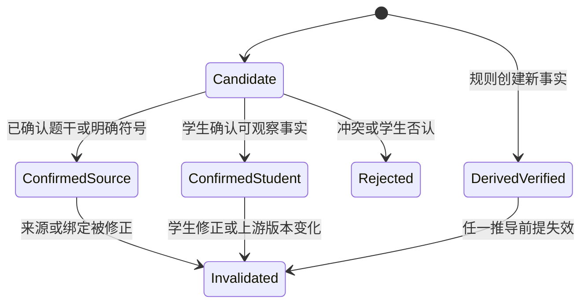

`rule_input_eligible` 不是事实状态，而是根据事实状态、实体类型、单位、版本和一致性动态计算的资格。规则成功时创建一个新的 `derived_verified` 事实，不能把原来的输入事实改成派生事实：

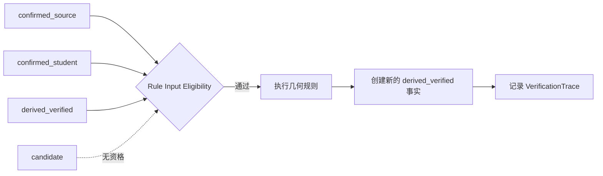

权限冲突按以下顺序处理：

1. 原图和确认后的题干是事实证据基线，任何模型输出都不能静默覆盖。
2. 学生确认与模型或 OpenCV 冲突时，优先采用学生对可观察事实的确认，并记录修正历史。
3. 学生确认与清晰题干矛盾时，不立即覆盖题干，而是展示原图证据并再次核对。
4. 图形符号与题干冲突时标记 `source_conflict`，停止依赖该关系的求解和教学。
5. 派生事实与原题事实冲突时，派生结果判为失败，回溯规则前提和实体绑定，不能修改原题来迎合推导。
6. 两条派生路径互相冲突时，两条路径都进入审核状态，寻找最小冲突事实集。

约束原则：

- 模型置信度再高，也不能单独证明垂直、平行或等长。
- OpenCV 测得接近 `90°` 只能形成视觉候选。
- 题干文字、清晰的直角或等长符号可以形成确认事实。
- 学生可以确认可观察事实；不能通过点击“正确”直接证明一个数学结论。
- 派生事实必须保留规则和输入事实，不能伪装为原题事实。
- 所有事实引用 `problem_version` 和 `diagram_version`，版本变化时重新计算资格并失效受影响的派生事实。

**3. 几何规则的实现形式**

**决策状态：已确认。** MVP 采用“配置元数据 + Python 执行器”的混合方式，暂不建设通用 DSL：

```python
RULE_REGISTRY = {
    "rectangle_area": RectangleAreaRule(),
    "triangle_area": TriangleAreaRule(),
    "disjoint_area_sum": DisjointAreaSumRule(),
}
```

规则名称、适用年级、前提说明和教学素材放在 YAML/JSON；实体匹配、空间验证和约束生成由经过单元测试的 Python 类执行。规则数量和表达模式稳定后，再评估是否抽象为 DSL。

**4. 几何空间计算由谁负责**

**决策状态：已确认。** 在规则引擎之外建立基于 Shapely 的本地几何计算内核：

```text
规则引擎：决定需要验证什么以及可以推出什么
几何内核：执行相交、包含、并集、差集、覆盖和区域计算
SymPy：执行符号代数、方程求解和表达式等价判断
```

SymPy 不承担多边形闭合、区域相交、辅助线分割和区域覆盖验证。业务层通过自有 `GeometryKernel` 接口调用 Shapely，不直接暴露 Shapely 对象，便于升级、替换和测试。

**5. 示意图不按比例时的双重几何表示**

**决策状态：已确认。** 区分：

```text
display_geometry：用于展示、点击、连接、包含和区域拓扑
metric_geometry：用于真实长度、角度、面积和代数计算
```

MVP 中 `metric_geometry` 主要来自题干、明确标注和可靠推导，不能从像素距离直接获得。`display_geometry` 可以辅助判断拓扑、生成 SVG 和解释空间指代，但不能因为两条线在像素上接近垂直就产生数学上的垂直事实。

**6. 空间判断的容差策略**

**决策状态：已确认初始配置，后续由评测集校准。** 所有坐标先归一化到图形区域宽高 `0～1`，距离阈值使用图形区域对角线比例。首版 `photo_diagram_v1`：

- 点合并距离：对角线的 `0.8%`。
- 边界吸附距离：对角线的 `1.0%`。
- 线段共线角度误差：`2°`；同时要求线间距离不超过点合并阈值。
- 候选平行或垂直角度误差：`2°`，但结果仍只能是视觉候选。
- 区域覆盖误差：对称差面积不超过原区域显示面积的 `0.5%`。
- 重叠判定忽略阈值：交集面积不超过较小区域显示面积的 `0.2%`。
- 极小碎片：小于原区域显示面积的 `0.2%` 时标记为噪声候选，不直接删除证据。
- 自相交多边形：默认无效，不静默自动修复；只允许明确记录的修复候选并要求重新校验。

所有阈值集中在 `ToleranceProfile`，写入 `VerificationTrace`，不能散落在算法函数中。阈值只用于显示坐标拓扑验证，不能用于推断真实长度和角度。

**7. 学生如何提出新辅助线**

**决策状态：已确认。** 首版不支持完全自由手绘，使用受控交互：

1. 学生点击已有点、边或区域。
2. 通过语音说明方向或目标。
3. AI 生成候选辅助线。
4. 页面以黄色虚线展示，尚不参与求解。
5. 学生确认后加入学生操作图，保持 `helper` 身份。
6. 几何内核验证新区域、覆盖关系和可计算性。

后续如果真实测试显示自由绘制有明显教学价值，再增加画笔输入及线段吸附，而不是在 MVP 中同时解决任意手绘解析。

**8. 验证状态集合**

**决策状态：已确认。** 验证结果使用以下状态，不压缩为 `correct/incorrect`：

| 状态 | 含义 | 教学动作倾向 |
| --- | --- | --- |
| `valid` | 方法或局部推理已验证成立 | 承认并沿学生思路继续 |
| `invalid` | 已有充分证据证明不成立 | 定位最早错误并最小纠正 |
| `incomplete` | 当前结构可行，但缺少局部条件或步骤 | 只追问剩余缺口 |
| `underdetermined` | 根据题目事实无法唯一确定 | 检查题目识别或信息完整性 |
| `unsupported` | 可能成立，但当前规则系统无法验证 | 不判错，说明验证能力边界 |
| `uncertain` | 关键识别或事实尚未确认 | 优先确认关键事实 |
| `conflicts_with_problem` | 与已确认原题条件冲突 | 指出冲突对象并邀请核对 |

回复策略必须区分“数学上错误”和“系统暂时不能验证”，避免把技术能力边界包装成学生错误。

**9. VerificationTrace 使用有向无环图**

**决策状态：已确认。**

同一事实可能有多条推导路径，因此验证轨迹不能只是线性步骤列表。建议保存为有向无环图：事实和约束是节点，规则应用是带输入和输出的推导节点。

```json
{
  "derived_fact_id": "fact_length_CD",
  "derivations": [
    {
      "rule_id": "rectangle_opposite_edges_equal",
      "input_facts": ["fact_rectangle_ABCD", "fact_length_AB"]
    }
  ]
}
```

实现时需要进行事实规范化与去重、规则应用去重、循环检测、最大推导深度和最大候选数量限制。一个结论允许保留多条独立证明路径，以便选择更符合学生当前方法和年级的解释。

决策完成情况与实现顺序：

1. ~~冻结 MVP 标准谓词、参数类型和对称性定义。~~ 已完成。
2. ~~冻结事实来源、状态机和升级权限。~~ 已完成。
3. ~~选择几何计算内核。~~ 已选择 Shapely，并通过自有 Adapter 封装；下一步完成区域运算原型。
4. 实现首批 Python 规则注册表和验证轨迹 DAG。
5. 接入学生辅助线、教师备课和动态教学策略。

#### 5.6.11 几何计算内核

几何计算内核是对结构化点、线和区域执行确定性二维空间运算的程序模块。它不识别图片、不理解题意、不选择教学方法，负责回答：相交、包含、覆盖、重叠、并集、差集、边界有效性以及辅助线能否形成有效分割。

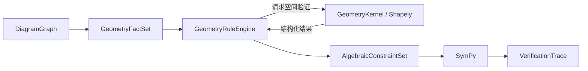

职责边界：

| 模块 | 核心职责 |
| --- | --- |
| OpenCV | 从图片像素中寻找线段、圆和轮廓候选 |
| GeometryKernel | 对已经结构化的二维对象执行空间运算 |
| GeometryRuleEngine | 决定需要验证什么，以及验证通过后可以推出什么 |
| SymPy | 执行符号代数、方程求解和表达式等价判断 |

例如学生说“画一条线，把阴影分成两个长方形”，规则引擎要求检查辅助线与边界、分割结果、覆盖和重叠；几何内核执行这些空间计算；规则引擎结合可靠的图形类型事实判断能否使用长方形面积规则；SymPy 最后验证面积表达式。

**技术选型**

MVP 使用 Shapely 作为本地 Python 几何库。它基于 GEOS，提供二维平面几何对象、空间谓词、有效性检查、并交差运算和图形分割，安装方式为 `pip install shapely`。参考 [Shapely 官方文档](https://shapely.readthedocs.io/en/stable/index.html)、[空间谓词](https://shapely.readthedocs.io/en/latest/predicates.html)和[分割说明](https://shapely.readthedocs.io/en/stable/manual.html#splitting)。

Shapely 与 OpenCV、SymPy 一样随 Python API 在本地运行；未来 API 容器上云时随容器部署，不需要单独购买云服务。固定依赖版本并记录 Shapely 与 GEOS 版本，避免不同环境产生几何行为差异。

**输入边界**

内核只接收 `display_geometry`，不读取原始图片，也不能把显示坐标长度当成真实数学长度：

```json
{
  "entity_id": "region_shaded",
  "geometry_type": "polygon",
  "coordinates": [[0.1, 0.1], [0.8, 0.1], [0.8, 0.7], [0.1, 0.7]],
  "diagram_version": 3
}
```

`display_geometry` 用于拓扑、点击和展示；`metric_geometry` 中的长度、角度和面积来自题干、明确标注或可靠推导。Shapely 返回的坐标面积只能用于覆盖、分割和碎片判断，不能作为学生题目的真实面积答案。

**MVP 接口**

```python
class GeometryKernel:
    def validate_geometry(self, geometry, tolerance) -> GeometryValidation: ...
    def intersects(self, left, right, tolerance) -> PredicateResult: ...
    def contains(self, outer, inner, tolerance) -> PredicateResult: ...
    def union(self, regions, tolerance) -> GeometryOperationResult: ...
    def difference(self, whole, removed, tolerance) -> GeometryOperationResult: ...
    def split_region(self, region, splitter, tolerance) -> SplitResult: ...
    def validate_partition(self, original, parts, tolerance) -> PartitionValidation: ...
    def snap_to_boundary(self, geometry, boundary, tolerance) -> SnapResult: ...
```

点线辅助操作包括：

```text
point_on_segment
segment_intersection
merge_nearby_points
merge_collinear_segments
snap_point_to_boundary
```

区域操作包括：

```text
is_valid_polygon
contains / covers
intersects / overlaps / disjoint
union / difference / intersection
split_region_by_segment
validate_partition
```

`validate_partition` 必须检查每个结果区域有效、结果内部不实质重叠、并集覆盖原区域、没有不可接受碎片，并返回每项检查和容差版本。

**结构化输出**

```json
{
  "operation": "split",
  "status": "valid",
  "input_entities": ["region_shaded", "helper_split_1"],
  "output_entities": ["student_region_1", "student_region_2"],
  "checks": {
    "line_intersects_boundary_twice": true,
    "regions_are_valid": true,
    "regions_are_disjoint": true,
    "union_matches_original": true
  },
  "tolerance_profile": "photo_diagram_v1",
  "geometry_engine": "shapely",
  "geometry_engine_version": "pinned-at-build"
}
```

内核不能只返回布尔值。失败时还要返回原因、受影响实体、几何证据摘要和是否可以通过学生确认解决，以支持教学策略区分 `invalid`、`incomplete`、`uncertain` 与 `unsupported`。

**Adapter 与安全边界**

- 业务模型不得保存或传递 Shapely 内部对象，只使用自有 Pydantic DTO。
- 进入 Shapely 前完成坐标有限值、实体数量、顶点数量和版本检查。
- 单次操作设置复杂度与执行时间上限，防止异常轮廓占用过多 CPU。
- Shapely 的自动修复结果默认只是候选，不能静默替换原题几何。
- 所有运算记录输入实体、版本、容差配置、内核版本和结果摘要。

### 5.7 MVP 范围与验收

首版不要覆盖全部小学图形题。本次确认支持的范围是：

- 长方形、正方形、三角形、平行四边形和梯形。
- 圆、半圆和扇形的基础面积题。
- 由 2～3 个基本图形组成的简单组合图形、阴影面积和周长题。
- 带长度、角度、点名称和简单辅助线标注的静态图。
- 线段图、行程示意图和基础统计图。
- 清晰印刷体、无复杂手写草稿。
- 长度和点名标注清晰。
- 支持阴影区域与一条辅助分割线。

明确暂缓：

- 严重变形、遮挡或低清晰度的复杂手绘几何图。
- 复杂曲线和不规则边界图形。
- 三维图形、复杂空间几何和立体展开图。
- 几何证明题、尺规作图题和必须自行构造多条辅助线的复杂题。
- 密集网格以及依赖像素级精确视觉测量才能解答的题目。
- 图形结构无法可靠确认，且学生也无法完成关键关系确认的题目。

建议验收指标：

| 指标 | 建议目标 |
| --- | ---: |
| 图形区域检测成功率 | ≥ 98% |
| 点名和长度 OCR 准确率 | ≥ 95% |
| 标注—边/区域绑定准确率 | ≥ 93% |
| 基本图元识别准确率 | ≥ 95% |
| 关键几何关系误确认率 | ≤ 1% |
| 原图与 SVG 实体一致率 | ≥ 95% |
| 语音—字幕—图形高亮回合一致率 | ≥ 99% |

数据集必须包含旋转、阴影、低对比度、标注靠近两条边、示意图不按比例以及相似图形干扰等困难样本。

## 6. 三个问题之间的关系

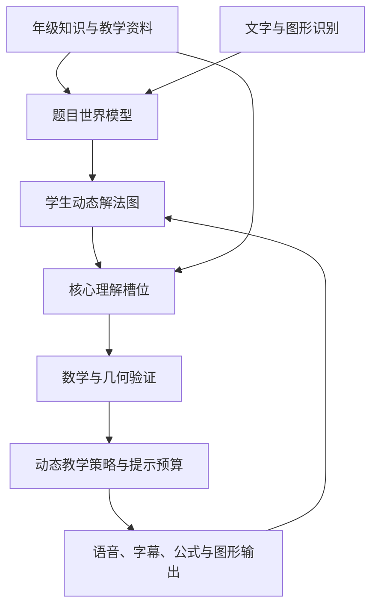

- 内容资料帮助系统知道概念、常见方法和教学方式，但不能替代学生思路理解。
- 动态解法图记录学生真正说了什么，防止参考资料压制非标准正确方法。
- 核心理解槽位判断学生是否已完成认知工作，从而动态放宽确认和总结权限。
- 图形结构化把视觉题目转换为可引用、可验证和可高亮的题目世界模型。
- 数学与几何验证决定系统能否安全地沿学生思路继续。

## 7. 推荐的下一步

当前 MVP 业务与技术决策已经收敛，下一步进入原型实现和数据验证：

1. **数据模型**：实现带版本的 `DiagramGraph`、`GeometryFact`、`AlgebraicConstraint`、`VerificationTrace` 和 `CandidateDiagramSolution` Pydantic Schema。
2. **几何内核 Spike**：接入 Shapely，实现有效性、包含、并交差、辅助线分割和 `validate_partition`，用 10 道手工结构化题验证容差配置。
3. **规则注册表**：先实现长方形、正方形、三角形、平行四边形、梯形和区域加减规则，再加入圆、半圆与扇形。
4. **识别闭环**：由多模态模型产生 `Draft DiagramGraph`，完成 Schema 校验、关键事实确认和版本保存；根据错误数据决定是否启用专用 OCR 与 OpenCV。
5. **SVG 教学黑板**：保留归一化坐标，实现基本实体、标签、高亮、学生单实体点选和一条受控辅助线；失败时降级为原图覆盖。
6. **教师备课与学生方法**：生成结构化图形候选方案，同时维护独立的学生操作图，并通过几何内核和 SymPy 验证新方法。
7. **50 题评测集**：完成分层标注和自动指标，校准识别阈值、`photo_diagram_v1` 容差及确认策略。
8. **运行与隐私验收**：验证并发任务、缓存、版本失效、延迟目标、内容日志开关、文件删除和第三方数据说明。

首个工程里程碑是：给定一份人工确认的组合图形 `DiagramGraph`，系统能够验证一条辅助线是否形成有效分割，生成面积约束和验证轨迹，并驱动 SVG 高亮。识别模型接入排在这个确定性闭环之后，避免同时调试视觉识别和数学验证。

## 8. MVP 默认决策汇总

本章将此前未决项统一收敛为可执行的 MVP 默认方案。默认方案可以根据评测结果调整，但不能在单次会话中由模型自行改变。

### 8.1 图形实现决策

| 问题 | MVP 决策 |
| --- | --- |
| `DiagramGraph` 到解题模型 | 使用 5.6 定义的事实、规则、约束、SymPy 和验证轨迹链路 |
| 几何规则 | 配置保存元数据，Python 注册类执行，不建设通用 DSL |
| 几何计算内核 | Shapely + 自有 `GeometryKernel` Adapter，本地或随 API 容器部署 |
| 坐标表示 | `display_geometry` 与 `metric_geometry` 分离，像素坐标不能产生真实测量值 |
| SVG 重绘 | 保留归一化原图坐标，只做吸附、线段合并、缩放和标签避让，不做复杂自动布局 |
| 重绘降级 | 拓扑、关键坐标或实体映射不可靠时，退回原图覆盖高亮 |
| 辅助线输入 | 点击实体 + 语音描述 + AI 候选虚线 + 学生确认，不支持自由手绘 |
| 学生新方法 | 在学生操作图中独立进行覆盖、重叠、图形类型和可计算性验证 |

图形题教师备课包使用结构化 `CandidateDiagramSolution`，每条方案保存：

- 分割、补形、平移或拼接操作序列。
- 新增辅助实体及其 `helper` 身份和教学目的。
- 操作前提、区域守恒关系、代数约束和验证轨迹。
- 年级适配、提示阶梯和核心理解目标。

教师候选操作图与学生实际操作图严格分离。学生方法未命中教师候选方案时，独立验证后可以创建会话级新分支。

统一回合输入：

```json
{
  "transcript": "我想先求这一块",
  "selected_entities": ["region_left"],
  "selection_timestamp_ms": 18200,
  "active_focus_entities": ["region_shaded"],
  "problem_version": 4,
  "diagram_version": 3
}
```

交互冲突规则：

1. 学生最新主动点击优先于 AI 当前高亮，用于解析“这里、这条边”。
2. 语音明确说出实体名称且与点击冲突时，系统提出一次澄清，不擅自选择。
3. 只点击不说话时更新选择状态，不自动推断数学主张。
4. 学生说“不是这条”时撤销当前指代绑定，并邀请重新点击。
5. “左边、上面”等方向词以学生当前可见视图为基准，并记录视图模式和版本。

### 8.2 测试与运行决策

**高影响不确定项**

确认优先级由三项共同决定：不确定程度、错误后是否改变题意或解法、是否参与核心求解。满足以下任一条件必须确认：关键数值或单位有多个候选；标注绑定前两名分差小于 `0.20`；阴影、半径/直径、直角等关键事实存在模型冲突；关键事实仅来自模型推断。

每题默认最多进行三次集中确认。仍无法确认的关键事实使题目进入 `uncertain`，允许查看和重新上传，不开放依赖该事实的完整辅导；非关键不确定项保留但不打断流程。

**评测集**

建立 50 道首批数据：30 道清晰印刷题、10 道拍摄质量扰动题、10 道歧义或困难题；覆盖已确认的基本图形、圆、组合面积、线段图、行程示意图和基础统计图。每题分别标注 OCR、实体、标注绑定、原题事实、禁止视觉推断关系、区域边界、候选方法、辅助线和教学高亮事件。

指标按识别、绑定、语义、空间验证、求解、SVG 一致性和回合高亮分层统计；最终答案正确率只能作为端到端指标，不能替代分层诊断。

**任务调度与调用预算**

上传后并行执行 OCR、多模态结构识别和可选 OpenCV；融合与确认数据就绪后先展示确认页；学生确认期间后台生成世界模型；确认版本稳定后执行几何验证和教师备课。只有 `preparation_status` 为 `ready` 或明确的 `partially_ready` 安全模式时开放通话。

同一图片版本默认只调用一次主视觉识别；Schema 修复优先使用文本重试，不重复上传图片；只有结构化结果不可修复时允许一次视觉重试。所有调用按图片哈希、模型版本、Prompt 版本和 Schema 版本缓存。

MVP 性能目标：确认页首屏 `P95 ≤ 8s`，确认后备课就绪 `P95 ≤ 12s`。超时后展示明确状态，不让学生重复上传；后台任务继续或提供重试。

**版本与恢复**

所有派生结果携带 `problem_version`、`diagram_version` 和 `preparation_version`。学生修改文字、数值、单位、标注绑定或区域时创建新版本，通过 `VerificationTrace` 依赖图使相关事实、约束、解法、总结和未播放动作失效。异步结果只允许写入与请求版本完全一致的会话状态，旧结果进入日志但不能覆盖新版本。

### 8.3 产品、内容与隐私决策

**知识库范围**

首个内容库不按完整六年级上下册铺开，聚焦已经确定的七类应用题以及本章图形题 MVP。内部使用教材无关的统一概念与规则模型，额外保存教材版本、单元、术语和适龄表达映射。

核心理解槽位采用“人工题型模板 + 模型按当前题补充”；模板定义不可缺少的核心理解，模型可以增加题目特有槽位，但不能删除模板要求。所有题库、教材、图片和解答在导入前记录来源、许可证、审核状态和内容哈希；来源或商业权限不明的资料只能用于隔离研究，不能进入产品知识库。

**教学完成与总结卡**

当系统判断完成或学生主动点击完成时生成总结卡，保存原题缩略图、确认后的教学图、学生实际使用的方法、学生确认过的辅助线、已掌握核心关系、一次易错提醒和可选微型变式。总结只能整理 `student_owned_information` 和已验证的学生方法；未由学生完成的关键推理不能被补成完整答案。

学生主动完成但证据不足时，系统尊重结束操作，明确标记“学生主动结束”，总结已确认内容和仍可复习的一个缺口，不继续强制提问。

**家庭数据与隐私**

MVP 默认本地存储。原始语音完成 STT 后立即删除，除非显式开启调试采样；字幕、结构化会话和总结保留在本地历史中，直到家庭用户删除。题目原图为支持复习而本地保存，但上传前提示可能包含姓名、学校、班级和试卷编号，并提供裁剪或遮盖入口。

发送到第三方服务的数据在 UI 和隐私说明中列出：题目图片发送给所选多模态/OCR 服务，通话音频发送给阿里云 STT，回复文字发送给阿里云 TTS。OpenCV、Shapely 和 SymPy 均在本地 API 内运行。

生产日志默认不记录原始图片、完整音频、完整 OCR 文本、完整学生字幕和 API Key；只记录脱敏 ID、耗时、状态码、模型版本、Schema 版本和错误类别。调试内容日志必须显式开启、设置过期时间并提供一键清除。家庭用户可以查看、导出和删除题目、会话、总结及关联原始文件。

## 9. 题目世界模型相关开源项目调研

> 调研日期：2026-08-12。开源项目的代码、模型、数据和许可证可能变化，正式采用前必须重新核验具体版本和文件许可证。

### 9.1 调研结论

目前没有发现一个开源项目能够直接提供本文定义的完整 `ProblemWorldModel`。现有项目通常只覆盖以下能力中的一部分：

- 应用题文字转换为数量、变量和方程。
- 方程或操作程序的符号执行。
- 几何图片转换为点、线、圆、符号和逻辑关系。
- 几何形式语言、定理和自动推理。
- 课程知识点、教材章节与练习题之间的知识图谱。

没有一个项目同时覆盖：

```text
中文小学题目
+ 图片和图形识别
+ 题目对象与约束建模
+ 多种解法生成与验证
+ 学生思路理解
+ 教学状态与提示边界
+ Web 动态 AI 黑板
```

因此推荐做法是：**由我们定义稳定的 Pydantic `ProblemWorldModel`，通过 Adapter 选择性吸收开源项目的数据结构、解析器和验证器。** 不建议让业务模型直接依赖某个研究项目的内部格式。

开源项目适配概览：

| 项目 | 主要能力 | 最适合借鉴或复用的部分 | 直接集成建议 |
| --- | --- | --- | --- |
| [Declarative Math Word Problem](https://github.com/joyheyueya/declarative-math-word-problem) | 应用题转变量和方程，再用 SymPy 求解 | 声明式约束生成流水线 | 优先做原型参考 |
| [CogComp Arithmetic](https://github.com/cogcomp/arithmetic) | 数量抽取、方程对齐和单位依赖 | 数量对象、原文对齐和 rate 标记 | 借鉴 Schema，不直接采用旧求解器 |
| [MathQA](https://math-qa.github.io/math-QA/) | 用操作程序表示解题过程 | 候选解法的操作节点和依赖 | 借鉴表示语言与数据集 |
| [InterGPS](https://github.com/lupantech/InterGPS) | 几何文字/图片解析、逻辑形式与符号推理 | 几何谓词、解析流水线和标注工具 | 重点研究，适配后复用局部能力 |
| [PGDP](https://github.com/mingliangzhang2018/PGDP) | 点线圆、符号和关系的图形解析 | `DiagramGraph` Schema 和标注格式 | 优先借鉴，模型复用需实验 |
| [FormalGeo](https://github.com/FormalGeo/FormalGeo) | 几何形式系统、推理图和求解器 | 几何约束、定理和验证思想 | 技术参考高，许可证风险高 |
| [AlphaGeometry](https://github.com/google-deepmind/alphageometry) | 奥数几何形式化与定理证明 | 证明状态图和规则推理 | 暂不作为小学面积题基础 |
| [K12-KGraph](https://huggingface.co/datasets/lhpku20010120/K12-KGraph) | 课程对齐知识图谱 | 年级、教材、概念和技能关系 | 用于知识库层，不替代题目模型 |
| [DeepMind Mathematics Dataset](https://github.com/google-deepmind/mathematics_dataset) | 程序化生成数学题与答案 | 合成题、难度分层和回归数据 | 可用于数据生成，不提供世界模型 |

### 9.2 应用题结构化与符号求解

#### Declarative Math Word Problem

该项目采用以下流程：

```text
自然语言应用题
→ LLM 形式化为变量和方程集合
→ SymPy 求解
```

这与应用题世界模型的约束生成非常接近，适合借鉴：

- 如何要求模型声明变量。
- 如何将自然语言条件转换为方程集合。
- 如何让 LLM 负责语义形式化、SymPy 负责确定性求解。
- 陌生题如何动态建立会话级工作模型。

但它的目标主要是求解，缺少我们需要的对象身份、单位、取值域、来源位置、OCR 置信度、图形、年级适配和教学状态。因此适合做 `ConstraintExtractionAdapter` 的原型，不适合直接作为完整世界模型。

仓库标注为 CC-BY-SA-4.0。正式复制代码、Prompt 或数据前，需要评估署名与相同方式共享条款对产品的影响。

#### CogComp Arithmetic Word Problem Solver

该项目采用 MIT License，数据中包含：

```json
{
  "sQuestion": "题目文本",
  "quants": [4.0, 36.0],
  "lAlignments": [1, 0],
  "lEquations": ["X=(36.0 * 4.0)"],
  "lSolutions": [144.0],
  "rates": [0]
}
```

值得借鉴的不是旧版 Java 求解器，而是：

- 题干中的数量抽取。
- 数量与方程参数的来源对齐。
- rate 数量和单位依赖图。
- 数据错误时能追踪“哪个数绑定错了”。

可以把这些思想映射到我们的：

```text
SourceEvidence
→ QuantityObject
→ MathConstraint operand
→ Unit / rate relation
```

该项目主要处理英文算术应用题，技术栈和 NLP 方法较旧，不建议直接作为中文系统的运行时求解器。

#### MathQA

MathQA 使用可解释的操作程序表示解题过程，例如：

```text
subtract(total, difference)
divide(previous_result, 2)
```

它对应的是 `CandidateSolution`，而不是 `ProblemWorldModel`：

- 世界模型描述题目客观事实。
- 操作程序描述如何从事实推导目标。

适合借鉴操作枚举、输入输出引用、中间结果依赖和可执行解法图。但原数据以英文和选择题为主，没有学生理解证据、提示等级和小学中文教学适配。

#### DeepMind Mathematics Dataset

该项目采用 Apache-2.0，可程序化生成大量数学问题和答案，并按模块与难度划分。它适合：

- 生成确定性算术、代数和测量类回归题。
- 验证 Schema 对不同数值和难度的稳定性。
- 构造工具调用和答案校验测试。

它主要生成 `question-answer` 对，不提供题目对象、事实来源、多解法和教学标注，因此不是世界模型实现。

### 9.3 几何图形解析与形式化

#### InterGPS

InterGPS 采用 MIT License，包含 Geometry3K、91 种几何谓词、文本解析器、图形解析器、定理知识、符号求解器和标注工具。其核心流程是：

```text
题目文字 → 逻辑形式
题目图形 → 逻辑形式
逻辑形式 + 定理规则 → 符号推理
```

它与几何题世界模型最接近，适合研究：

- 点在线上、长度、角度、平行、垂直和相等等谓词。
- 文字事实与图形事实如何归一为同一种逻辑形式。
- 题目事实与定理推导如何分离。
- OCR、符号检测结果如何绑定到几何实体。
- 几何数据标注工具。

限制包括：依赖版本较旧、主要面向规范平面几何、不是小学面积教学产品，也没有我们的学生对话、教学状态和动态黑板。建议先提取其谓词表和数据结构，设计 `InterGPSAdapter`，不要立即部署完整求解链路。

#### PGDP / PGDP5K

PGDP 是显式平面几何图形解析项目，其标注结构与我们设计的 `DiagramGraph` 很接近：

```json
{
  "geos": {
    "points": [],
    "lines": [],
    "circles": []
  },
  "symbols": [],
  "relations": {
    "geo2geo": [],
    "sym2sym": [],
    "sym2geo": []
  }
}
```

它还能输出 `PointLiesOnLine`、`Equals`、`MeasureOf`、`Perpendicular`、`Parallel` 和 `LengthOf` 等逻辑形式。

适合借鉴：

- 点、线、圆等基础图元结构。
- 符号和文字标注与几何实体的绑定。
- 图片坐标与逻辑形式的映射。
- 图形关系的密集标注格式。

直接复用模型的困难包括旧版 PyTorch/CUDA、多 GPU 训练环境、Demo 中不包含完整文字识别，以及训练数据与手机拍摄的小学试卷存在域差异。建议先复用 Schema 和数据标注思想，再评估模型推理兼容性。

#### FormalGeo

FormalGeo 提供几何形式系统、定义和定理库、推理计算引擎、数据集、正向/反向推理图及神经符号求解研究。它适合成为未来：

```text
DiagramGraph
→ Formal Geometry Constraints
→ Geometry Verifier
→ Reasoning Graph
```

最值得借鉴的是条件、目标、定义、定理和推导证据的分离，以及局部推理可验证性。

许可证必须谨慎处理。其仓库说明：2026-05-01 之前发布的代码和数据继续使用 MIT；之后版本改为 GPL，并额外声明商业用途受限。当前家庭产品存在未来商业化可能，因此不能直接引入最新版。需要锁定具体历史版本、逐文件核对许可证，或与项目方协商商业授权。

#### AlphaGeometry

AlphaGeometry 的软件采用 Apache-2.0，其他材料使用 CC-BY-4.0。它提供几何问题前提、结论、定义、推理规则、证明状态图和辅助构造搜索。

它适合研究复杂几何证明，但不负责从试卷照片解析图形，也不是为小学面积、教学提示或多轮交流设计。首版不建议作为图形题基础，仅保留为未来复杂几何验证的技术参考。

### 9.4 课程知识图谱与题库

#### K12-KGraph

K12-KGraph 提供课程对齐的概念、技能、教材章节和练习关系，更接近：

```text
六年级
→ 面积单元
→ 平行四边形面积
→ 前置：长方形面积
→ 后续：梯形面积
```

它可以支持课程知识库、前置知识判断和检索路由，但不能表示“当前图片中 6 cm 属于哪条边”或“阴影区域由哪些图形组成”。因此它属于长期知识库，不是题目世界模型。

该数据集发布时间较新，采用前必须进一步核对数据来源、许可范围、教材版权以及是否适用于商业产品。

#### 通用开源题库

开源题库通常只包含题干、选项、答案、知识点和自然语言解析。它们适合填充检索库和评测集，但通常缺少：

- 数学对象与来源坐标。
- 可执行约束。
- 多种结构不同的解法。
- 常见学生错误和提示阶梯。
- 图形实体与标注绑定。
- 学生多轮思路样本。

因此导入大量题目后仍需要结构化加工和质量审核，不能把自然语言解析直接视为可靠世界模型。

### 9.5 推荐的开源能力组合

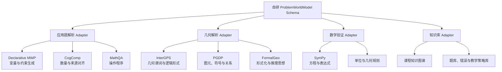

推荐职责分配：

| 我们自己的模块 | 可吸收的开源能力 |
| --- | --- |
| `ProblemWorldModel` | 自研统一 Schema，任何外部结果都转换到这里 |
| `ConstraintExtractionAdapter` | Declarative MWP 的声明式形式化思路 |
| `QuantityAlignmentAdapter` | CogComp 的数量、方程参数和 rate 对齐 |
| `CandidateSolutionGraph` | MathQA 的操作节点和中间依赖 |
| `DiagramParsingAdapter` | PGDP 图元关系 + InterGPS 几何谓词 |
| `GeometryVerifier` | 自研小学规则，未来选择性参考 FormalGeo |
| `CurriculumKnowledgeAdapter` | 课程知识图谱、题库和教材版本映射 |

如果只选择两个方向深入验证：

1. 应用题：先复现 Declarative Math Word Problem 的变量—方程—SymPy 流程。
2. 图形题：先采用 PGDP 的图元关系 Schema 和 InterGPS 的谓词体系，不急于复现完整训练模型。

### 9.6 建议的验证顺序

第一阶段：应用题世界模型最小闭环。

```text
中文题目
→ LLM 输出对象、数量、单位和约束
→ Pydantic 校验
→ SymPy 求解与代回
→ 原文来源对齐
```

选择现有 14 道题和 30～50 道陌生变体，验证对象绑定、约束正确性和题目修改后的失效机制。

第二阶段：比较三种应用题表示：

- 仅方程。
- 对象 + 事实 + 方程。
- 对象 + 事实 + 约束 + 来源证据 + 取值域。

验证完整世界模型是否能降低对象误绑、单位错误和跨轮题意漂移。

第三阶段：几何 Schema 原型。

- 从 InterGPS 谓词和 PGDP 标注格式中选择小学面积题需要的最小子集。
- 手工标注 30～50 道基本图形和组合面积题。
- 先完成原图叠加确认与 SVG 重绘，不先训练完整图形解析模型。
- 再比较多模态模型、OpenCV 和 PGDP 模型的解析结果。

第四阶段：许可证和工程可用性审计。

- 固定准备采用的 commit/tag。
- 分别核查代码、模型权重、数据集和论文附属材料许可证。
- 检查是否允许商业使用、修改、再分发和闭源部署。
- 为每个外部组件保留来源、版本和替换 Adapter。

最终验收标准不是“成功运行开源 Demo”，而是：

- 外部项目输出能稳定转换成我们的世界模型。
- 转换结果可验证、可回溯并允许学生确认。
- 任一外部组件都可以替换，不改变教学业务接口。
- 开源许可证符合未来产品的使用方式。
