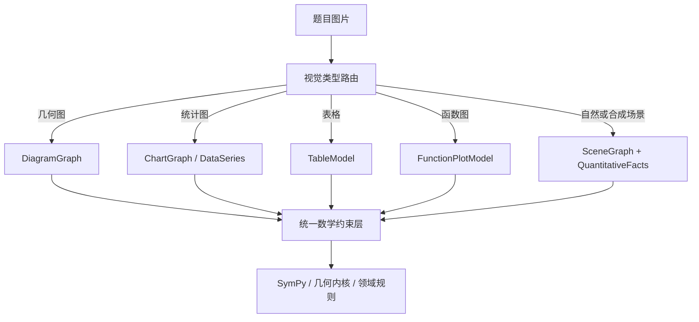

# MathVista 仓库分析

## 目录

- [1. 分析范围与结论摘要](#1-分析范围与结论摘要)
- [2. MathVista 是什么](#2-mathvista-是什么)
- [3. 数据集设计与实际分布](#3-数据集设计与实际分布)
- [4. GitHub 仓库实际提供了什么](#4-github-仓库实际提供了什么)
- [5. 数据结构与标注价值](#5-数据结构与标注价值)
- [6. 官方评测流程分析](#6-官方评测流程分析)
- [7. 代码与工程质量分析](#7-代码与工程质量分析)
- [8. 对图形识别与 DiagramGraph 的价值](#8-对图形识别与-diagramgraph-的价值)
- [9. 对题目世界模型和动态教师备课的启发](#9-对题目世界模型和动态教师备课的启发)
- [10. 对引导式、多轮教学的价值与缺口](#10-对引导式多轮教学的价值与缺口)
- [11. 是否适合作为知识库或训练数据](#11-是否适合作为知识库或训练数据)
- [12. 推荐的接入与评测方案](#12-推荐的接入与评测方案)
- [13. 与 CMMaTH、CMM-Math 的对比](#13-与-cmmathcmm-math-的对比)
- [14. 主要风险](#14-主要风险)
- [15. 综合判断](#15-综合判断)
- [16. 主要参考资料](#16-主要参考资料)

## 1. 分析范围与结论摘要

分析对象：[`lupantech/MathVista`](https://github.com/lupantech/MathVista)。

本次分析基于 2026-08-17 获取的 `main` 分支快照，最新提交为 [`c5acd37d75a8c8f9756cb66c78fe2e54fa2c31fb`](https://github.com/lupantech/MathVista/commit/c5acd37d75a8c8f9756cb66c78fe2e54fa2c31fb)，提交日期为 2026-07-27。分析范围包括 GitHub 仓库、Hugging Face 数据、ICLR 2024 论文、数据分布、许可证、官方评测代码，以及新增的 EvalScope 社区集成。没有调用模型执行完整基准测试。

核心结论：

1. MathVista 是一个**视觉场景中的数学推理评测基准**，不是题库教学系统，也不是可直接复用的智能老师。
2. 它对我们最有价值的用途，是评测“图片是否看懂、视觉事实是否提取正确、数学是否建模正确、最终答案是否正确”。它不能直接评测学生步骤理解、答案防泄露、引导节奏或学生是否理解。
3. 数据集有 6,141 题，覆盖几何图、统计图、表格、函数图、自然图片、合成场景等 19 类视觉上下文，元数据比前面分析的中文数据集更规范。
4. 它并不适合直接支撑“中文六年级应用题”：全部 1,272 道小学题都是英文；全部 400 道中文题都是高中几何题。
5. 数据集的主结构只有题目、图片、选项、答案与元数据，没有统一的完整解法、可验证约束、图形对象关系或教学对话。85.6% 的题目虽然带有来源数据集的附加标注，但格式彼此不统一。
6. 官方评测只判断短答案是否正确。模型即使“答案正确但解释错误”，仍可能得分；这对教学产品是不可接受的，因此不能用 MathVista 分数替代教师备课包验证。
7. 论文实验证明：OCR 或图片描述增强并不足以解决视觉数学问题，尤其无法可靠表示几何形状；模型自我验证也不能保证正确。这进一步支持我们当前“结构化视觉模型 + 数学工具外部验证”的方向。
8. MathVista 明确规定：可以作为测试集使用，商业场景也可以把它作为测试集，但**禁止把它作为训练集**。因此不能把它全量放进生产知识库、微调数据或教师备课资料库。
9. 最合理的落地方式是把它作为外部回归考场，选择与 MVP 有关的视觉切片，建立“感知—结构—约束—求解—教学”分层指标；中文六年级能力仍需我们自建私有评测集。

## 2. MathVista 是什么

MathVista 全称为 **MathVista: Evaluating Mathematical Reasoning of Foundation Models in Visual Contexts**，论文被 ICLR 2024 接收为 Oral。

它要回答的核心问题是：

> 基础模型能否同时理解图片和题目文字，并在几何、算术、代数、统计、科学等视觉场景中完成数学推理？

标准使用路径是：

```text
题目文字 + 题目图片 + 选项/答案格式要求
→ 多模态模型生成解答
→ 从长回复中提取短答案
→ 归一化答案
→ 与标准答案精确比较
→ 按任务、年级、视觉类型、推理能力统计准确率
```

它覆盖的主要基础能力包括：

- 识别图片中的文字、数字、对象和视觉属性；
- 理解几何图、图表、表格、函数图和抽象图案；
- 联合使用题干与图像信息；
- 执行算术、代数、几何、统计、逻辑和科学推理；
- 生成选择题或开放题的最终答案；
- 对不同模型执行统一的结果比较。

它不包含以下教学能力：

- 理解学生当前说到了解题路径的哪一步；
- 判断学生的思路是否与参考解法不同但仍然可行；
- 动态选择提问、提示、纠错或鼓励策略；
- 控制答案泄露程度；
- 判断学生是否真正理解；
- 生成可朗读、可高亮的课堂讲解状态；
- 管理实时语音轮次；
- 生成阶段总结、复习资料和试卷。

因此，MathVista 的正确产品定位是**多模态数学基础能力基准**，而不是我们的教学业务逻辑。

## 3. 数据集设计与实际分布

### 3.1 数据来源和拆分

MathVista 共整合 31 个来源：

- 9 个已有数学问答数据集；
- 19 个已有通用视觉问答数据集；
- 3 个新建数据集：`IQTest`、`FunctionQA`、`PaperQA`。

其中 28 个外部数据集贡献已有样本，3 个新数据集共新标注 736 题。为了避免个别来源占比过高，每个来源最多保留 400 题。

| 数据拆分 | 数量 | 答案是否公开 | 主要用途 |
| --- | ---: | --- | --- |
| `testmini` | 1,000 | 是 | 开发、快速验证、低成本评测 |
| `test` | 5,141 | 否 | 标准评测和排行榜 |
| 合计 | 6,141 | 部分公开 | 多模态数学评测 |

它没有训练集。`testmini` 也仍然是公开测试数据，不应被混入提示词示例、知识库或模型调优后再报告其测试成绩。

### 3.2 任务分布

| 任务 | 数量 |
| --- | ---: |
| 图形问答（figure QA） | 1,647 |
| 几何问题求解 | 1,319 |
| 数学应用题 | 1,200 |
| 通用视觉问答 | 1,038 |
| 教材问答 | 937 |

任务覆盖面广是它的重要优点，但“应用题”并不等同于中国六年级教材中的和差、倍数、分数、百分数、行程、工程和年龄问题。

### 3.3 视觉上下文分布

| 视觉上下文 | 数量 | 对当前项目的潜在价值 |
| --- | ---: | --- |
| 几何图 | 1,370 | 高，可评测图形识别和几何推理 |
| 合成场景 | 800 | 中，可评测对象计数和属性识别 |
| 条形图 | 781 | 高，可评测图表结构和数据读取 |
| 自然图片 | 615 | 中，场景复杂但与当前 MVP 距离较远 |
| 科学图 | 518 | 中低，难度和领域偏高 |
| 表格 | 450 | 高，可评测表格结构化抽取 |
| 函数图 | 400 | 低，主要是中学以上内容 |
| 抽象场景 | 375 | 中，部分可覆盖数量关系图 |
| 益智测试图 | 226 | 低，不是当前业务核心 |
| 散点图 | 205 | 低，超出六年级 MVP |
| 折线图 | 202 | 中高，部分适合小学统计题 |
| 饼图 | 97 | 中高，可覆盖百分数统计图 |
| 文档图片 | 59 | 中，可测试复杂排版 OCR |
| 地图图表 | 30 | 低 |
| 其他极少量类型 | 13 | 低，包括医疗图、雷达图等 |

这一分布说明，“带图数学题”不是一种统一的视觉问题。几何图、表格、统计图和自然场景需要不同的结构表示，不能全部强行放入同一个 `DiagramGraph`。

### 3.4 题型、答案和推理能力

| 维度 | 分布 |
| --- | --- |
| 选择题 | 3,392 |
| 开放题 | 2,749 |
| 文本答案 | 3,392 |
| 整数答案 | 2,461 |
| 浮点答案 | 272 |
| 列表答案 | 16 |

推理能力是多标签，单题可能同时属于多类：

| 推理能力 | 样本标签次数 |
| --- | ---: |
| 算术推理 | 2,093 |
| 统计推理 | 1,870 |
| 代数推理 | 1,748 |
| 几何推理 | 1,429 |
| 数值常识 | 858 |
| 科学推理 | 655 |
| 逻辑推理 | 231 |

这些标签适合做评测报表切片，但粒度不足以直接映射到六年级教材知识点，也不能描述一题的候选解法和步骤依赖。

### 3.5 语言与年级分布

| 语言 | 数量 |
| --- | ---: |
| 英文 | 5,737 |
| 中文 | 400 |
| 波斯文 | 4 |

| 年级层次 | 数量 |
| --- | ---: |
| 不适用 | 2,313 |
| 高中 | 1,895 |
| 小学 | 1,272 |
| 大学 | 661 |

这里有两个对当前项目非常关键的交叉结论：

1. **全部 1,272 道小学题都是英文。** 主要来自 `CLEVR-Math`、`IconQA`、`IQTest`、`TabMWP` 和 `ScienceQA`。
2. **全部 400 道中文题都是高中几何题。** 它们来自 `GeoQA+`，视觉上下文均为几何图。

因此：

- MathVista 没有“六年级”这一精确年级标签；
- 它不能用来估计中国六年级学生实际题目分布；
- 它可以验证模型的跨语言视觉数学通用能力；
- 它不能替代我们的中文六年级私有数据集。

## 4. GitHub 仓库实际提供了什么

### 4.1 目录结构

仓库主要目录如下：

```text
MathVista/
├── .devcontainer/              # 开发容器配置
├── .github/                    # GitHub 配置
├── assets/                     # README 与项目展示资源
├── data/                       # 题目 JSON、来源信息、OCR、图片描述
├── data_prepro/                # 数据预处理脚本
├── evaluation/                 # 构造提示、生成回复、提取答案、评分
├── jupyter_notebook_demos/     # 数据访问和调用示例
├── models/                     # GPT、Claude、Bard 等接口封装
├── results/                    # 历史模型结果
├── scripts/                    # 评测脚本入口
├── LICENSE
├── README.md
├── pyproject.toml
├── requirements.txt
└── utilities.py
```

与前面分析的部分中文数学仓库相比，MathVista 的工程完整度更高：

- 有明确许可证；
- 有开发容器、依赖和打包配置；
- 数据字段和评测流程文档较完整；
- 提供公开 `testmini` 标签和历史结果；
- 提供模型结果浏览与可视化页面；
- 2026 年仍有文档维护，并新增了 EvalScope 社区接入说明。

### 4.2 图片并不直接存放在 Git 仓库中

仓库包含 JSON、OCR 文本和图片描述，但完整题图需要从 Hugging Face 下载 `images.zip`，或者通过 Hugging Face `datasets` 直接读取解码后的图片。

这比“数据引用了图片但图片完全未发布”的情况更好，但首次运行仍需要额外下载。不能只克隆 GitHub 仓库就假设所有多模态评测资源已经就绪。

### 4.3 仓库体积主要被历史结果放大

仓库递归文件树约有 236 个条目，Git blob 总量约 178 MB。数据 JSON、OCR、图片描述和大量历史模型输出占据了主要空间，而核心评测代码本身不大。

如果我们只接入评测能力，不需要复制全部历史结果；更适合锁定提交版本并按需保留：

- 数据 Schema；
- `testmini` 元数据和标准答案；
- 所需图片；
- 官方答案抽取和归一化规则；
- 数据来源及许可信息。

## 5. 数据结构与标注价值

### 5.1 主数据结构

单题的核心格式可以简化为：

```json
{
  "question": "题目文字",
  "image": "题图路径",
  "choices": ["选项 A", "选项 B"],
  "unit": "m^2",
  "precision": 1,
  "answer": "标准短答案",
  "question_type": "multi_choice | free_form",
  "answer_type": "text | integer | float | list",
  "pid": "题目 ID",
  "metadata": {
    "split": "testmini | test",
    "language": "english | chinese | persian",
    "img_width": 640,
    "img_height": 480,
    "source": "来源数据集",
    "category": "math-targeted-vqa | general-vqa",
    "task": "任务类型",
    "context": "视觉上下文",
    "grade": "年级层次",
    "skills": ["推理能力"]
  },
  "query": "用于评测模型的提示文本"
}
```

值得借鉴的字段：

- `source`：保留每道题的来源和版权追踪；
- `context`：将视觉类型与数学知识点分开；
- `task`：区分“读图问答、几何求解、应用题”等任务；
- `answer_type`、`unit`、`precision`：为确定性评分提供契约；
- `skills`：支持多标签能力分析；
- 图片尺寸：有助于评测缩放、裁剪和 OCR 稳定性。

### 5.2 附加标注不是统一解法

论文统计有 5,261 题带来源数据集附加标注，占 85.6%。但这些标注可能分别是：

- Geometry3K 的形式化问题解析；
- TabMWP 的自然语言解法；
- TheoremQA 的定理信息；
- 其他来源特有的程序、事实或说明。

它们缺少统一格式和统一语义，不能直接等同于我们的“动态教师备课包”。尤其不能假设每题都具有：

- 完整且正确的题目世界模型；
- 1–2 条可验证参考解法；
- 每一步的前置条件和数学依据；
- 可供教学状态机使用的提示阶梯；
- 学生常见错误和诊断规则；
- DiagramGraph 或其他视觉结构真值。

### 5.3 对我们数据 Schema 的启发

我们可以借鉴 MathVista 的来源、视觉上下文和答案格式字段，但需要在其上增加教学和验证字段：

```text
MathVista 基础字段
+ problem_world_model
+ visual_representation_type
+ diagram_graph / chart_graph / table_model
+ verified_constraints
+ solution_routes[]
+ verification_evidence
+ student_step_candidates[]
+ misconception_candidates[]
+ hint_ladder
+ answer_disclosure_policy
+ completion_criteria
```

重点是：**题目元数据、最终答案、解题模型和教学策略应当是不同层次的对象，不能混在一个自然语言 `analysis` 字段里。**

## 6. 官方评测流程分析

### 6.1 三阶段评测

官方评测由三个阶段组成：


第一阶段，模型生成完整回复。提示会明确要求最终答案的格式，例如在结尾给出选项字母、整数、指定精度的小数或列表。

第二阶段，从长回复中提取短答案。简单情况使用规则；其他情况调用 LLM 答案抽取器。论文在 200 个样本上的初步实验中报告抽取准确率超过 99.5%，但这不是在所有模型输出、所有语言和所有错误表达上的完整保证。

第三阶段，根据题型和答案类型进行归一化并计算准确率：

- 选择题：将字母映射到选项文本；
- 整数：转成整数字符串；
- 浮点数：按指定小数位数四舍五入；
- 列表：转成字符串；
- 最终执行精确相等比较。

### 6.2 评测的优点

- 长回复和短答案评分分离，减少输出格式差异造成的误判；
- 选择题和数值题可确定性评分；
- `unit` 与 `precision` 让开放答案约束更清晰；
- 能按视觉场景、任务、年级、来源和推理能力生成细分结果；
- 同一模型的错误可以定位到特定视觉类型，而不只看一个总体分数。

### 6.3 评测的局限

#### 只评最终答案，不评推理真实性

模型可能出现：

- 看错图但碰巧选对；
- 计算过程错误但最终数字正确；
- 使用错误定理得到正确选项；
- 解释与答案互相矛盾；
- 先泄露答案再补充过程。

这些情况在 MathVista 的最终准确率中仍可能得分。论文对 Bard 的人工分析也专门区分了“答案正确”和“解释正确”，说明作者同样观察到了正确答案不代表正确推理。

#### 选择题的编辑距离兜底可能掩盖格式错误

官方代码在模型没有输出合法选项字母或精确选项文本时，会使用 Levenshtein 编辑距离选择“最相似”的选项。这保证了每道选择题都能得到一个候选答案，但也可能把空泛、残缺或无关文本强行映射到某个选项。

我们的内部评测应当同时记录：

- 原始回复；
- 原始抽取结果；
- 是否通过严格解析；
- 是否使用模糊兜底；
- 归一化后的答案；
- 最终正确性。

#### 列表和数学等价性处理较弱

列表答案主要依赖字符串形式，不能全面处理排列无关、分数与小数等价、代数表达式等价或单位换算。对于我们的数学验证，仍应使用 SymPy、分数精确计算和领域规则。

### 6.4 EvalScope 社区集成不能与官方分数直接混用

仓库在 2026-07-27 增加了 EvalScope 社区维护接入说明。它方便通过 OpenAI-compatible 接口评测模型，但与官方流程存在差异：

- 默认使用 `testmini` 和 0-shot；
- 选择题按选项标签评分；
- 开放题使用 EvalScope 数学解析器和数值等价评分；
- 提示、答案抽取和归一化都可能不同；
- 当前没有同一批预测在两种评分器上的一致性报告。

因此，如果目标是与 MathVista 官方榜单比较，应使用官方评测器；如果目标是我们内部多模型横向比较，可以使用 EvalScope，但必须锁定版本并保持同一评分实现。

## 7. 代码与工程质量分析

### 7.1 优点

- 数据准备、模型生成、答案抽取和评分职责基本分离；
- 支持断点续跑和定期保存结果；
- 模型调用有初步封装；
- 依赖版本被固定，便于复现旧实验；
- 有 `pyproject.toml`、格式化和类型检查配置；
- 历史结果和细分指标便于对照论文。

### 7.2 当前代码不是现代通用评测框架

核心脚本仍主要服务于论文时期的模型和调用方式：

- 远程模型选项包含 GPT-3.5、旧版 GPT-4、Claude 2、Bard；
- 本地模型路径分支直接抛出 `NotImplementedError`；
- 部分 README 命令、路径和模型封装带有论文实验工程痕迹；
- `requirements.txt` 固定在 2024 年前后的依赖版本；
- 新模型更适合通过 EvalScope，或由我们自己的 LLM/VLM 适配层调用。

因此，不建议把官方 `models/` 直接并入 Demo。应复用数据和评分思想，由我们现有的模型封装接入 `qwen3-vl-flash` 或其他候选模型。

### 7.3 有两处代码执行风险

代码审查发现：

1. `build_query.py` 的 `refine_ocr()` 对 OCR 字符串使用 Python `eval()`；
2. `generate_response.py` 的 Program-of-Thought 路径会对模型生成的代码使用 `exec()`。

如果输入完全来自可信、冻结的数据快照，风险相对可控；一旦把它们用于用户上传图片、外部 OCR 内容或不受信任的模型输出，就可能执行任意 Python 代码。

我们的应用中不能复制这种实现：

- OCR 结构应使用 JSON 解析和 Pydantic 校验；
- 模型生成的数学代码默认不执行；
- 如果未来确实需要执行，必须进入无网络、限时、限内存、只读文件系统的独立沙箱；
- 小学应用题和基础几何优先转换为受限约束，再交给 SymPy 或几何内核。

### 7.4 一个代码级小问题

`utilities.py` 的数量词数组里出现 `"fewest" "more"`，Python 会把相邻字符串自动拼成 `"fewestmore"`，导致 `fewest` 和 `more` 两个词未被正确识别。它不会破坏已经发布的数据，但说明如果复跑数据预处理，仍需做测试和人工抽查。

## 8. 对图形识别与 DiagramGraph 的价值

### 8.1 它能提供什么

MathVista 的 1,370 道几何图题可以作为很好的外部视觉推理测试池，用于检验：

- 顶点和线段是否识别；
- 角度、长度和数学符号是否关联到正确对象；
- 虚线、垂直、平行等视觉关系是否理解；
- 题干文字与图上标注是否合并；
- 模型能否从图形事实进入数学推理。

它还包含大量条形图、表格、函数图、折线图和饼图，可以帮助我们验证“视觉类型路由器”是否正确。

### 8.2 它不能直接提供 DiagramGraph 真值

主数据没有：

- 图元坐标；
- 点、线、角、面对象 ID；
- 数字与图元的绑定关系；
- 标准几何谓词；
- 视觉事实置信度与来源；
- 可供用户确认的争议事实；
- 统一的几何约束或证明步骤。

部分来源数据可能带有形式化标注，但并非全量、统一、可直接映射到我们当前的 `DiagramGraph` Schema。

因此，MathVista 可以评测“最终看图解题能力”，不能直接评测我们中间层的 `DiagramGraph` 准确率。要测中间层，仍需对一小部分样本二次标注。

### 8.3 不应让 DiagramGraph 承担所有视觉题

MathVista 的视觉类型分布提示我们采用“先分类、后结构化”的多表示方案：



对当前 MVP，可以只实现：

1. `DiagramGraph`：基础平面几何、面积、周长、组合图形；
2. `ChartGraph`：条形图、折线图、饼图；
3. `TableModel`：行列、表头、单元格和数值。

函数图、自然场景和复杂科学图暂时进入“不支持或仅实验性支持”分支。

### 8.4 OCR 和图片描述不能替代结构识别

MathVista 论文比较了给文本模型增加 OCR 和图片描述的效果。结论对我们非常重要：

- OCR 能提取文字，但不能可靠表达几何形状与对象关系；
- 通用图片描述容易遗漏解题所需的精确位置、数量和符号；
- 错误图片描述会把后续数学推理带到错误方向；
- 视觉识别错误后，多次推理或自一致性也可能持续得到同一个错误结果。

所以我们的链路仍应是：

```text
原图保留
→ OCR / 多模态模型 / OpenCV 分别提取候选事实
→ 生成结构化视觉模型
→ 对关键不确定事实请求学生确认
→ 转换为可验证数学约束
```

而不是“把图片描述成一段话，然后让 LLM 自己完成全部推理”。

## 9. 对题目世界模型和动态教师备课的启发

### 9.1 MathVista 验证了“先看懂，再求解”的必要性

论文中的失败案例反复显示：如果模型一开始看错关键视觉信息，后面的自我验证、自一致性和多轮重试都可能无效。

这支持我们已经确定的顺序：

```text
题目识别
→ 题目事实确认
→ 构建题目世界模型
→ 生成候选解法
→ 数学工具验证
→ 形成动态教师备课包
→ 才开始引导学生
```

不能一边与学生通话，一边临时猜图、猜解法和猜下一步。

### 9.2 题目世界模型需要区分事实层和推导层

结合 MathVista 的多视觉场景，建议统一建模为：

```text
原始证据层
  - 题干原文
  - 原图及区域
  - OCR 坐标与文字

确认事实层
  - 对象、数值、单位、关系
  - 每条事实的来源、置信度和确认状态

数学约束层
  - 方程、不等式、几何谓词、数据系列
  - 从哪些事实推导而来

解法层
  - 候选解法路线
  - 步骤、依据、前置条件
  - 工具验证结果

教学层
  - 当前小目标
  - 可接受学生路径
  - 提示阶梯
  - 常见误区
  - 完成标准
```

这样，即使模型最后答案正确，我们仍可发现它是否使用了错误的视觉事实或无效的中间步骤。

### 9.3 模型自我验证只能作为候选意见

论文展示了 GPT-4V 有时能够发现负长度等无效中间结果并改换解法，也明确指出这种能力不能保证准确，且在中文题上更弱。

因此我们的权限设计应保持：

- LLM 可以提出候选事实、候选约束和候选解法；
- LLM 可以指出自己可能出错并发起重新分析；
- LLM 不能单独把自己的第二次回答当作“已验证”；
- 数值、方程和基础几何关系交给外部数学内核；
- 无法自动确认的关键图形事实交给学生确认；
- 验证失败时进入 `partially_ready`，而不是生成猜测答案。

## 10. 对引导式、多轮教学的价值与缺口

### 10.1 论文有多轮示例，但不是教学对话数据集

论文附录展示了 GPT-4V 的多轮目标导向对话案例：用户反馈有时能帮助模型纠正视觉计数、重新计算、替换错误定理或汇总复杂上下文。

这证明“学生指出 AI 错误后重新备课”在能力上是可行方向，也支持我们保留：

- 学生纠错入口；
- 事实级修订；
- 修订后重新生成约束和解法；
- 保留完整历史上下文。

但这些只是定性案例，并不是带统一标签的辅导对话语料。部分示例里甚至是人类反过来辅导模型完成任务，不能据此认为模型已经会当老师。

### 10.2 MathVista 完全没有评测我们的核心教学行为

它不能回答：

- 学生只说了一半时，AI 是否会鼓励继续说；
- 学生采用非参考路线时，AI 是否能理解并跟随；
- 学生已完成核心思路时，AI 是否仍机械追问；
- AI 是否在不合适的时机泄露答案；
- AI 教错后是否能定位并修订具体事实或步骤；
- AI 是否准确进入完结态；
- 总结是否真正帮助学生第二次理清思路。

因此，MathVista 最多覆盖教学前的“教师是否看懂并解对题目”，不能覆盖“教师如何教”。

### 10.3 正确的业务位置

```text
MathVista 或类似外部基准
        ↓ 评测底层能力
图片识别 → 世界模型 → 数学验证 → 动态教师备课包
                                      ↓
                         学生思路理解与教学状态机
                                      ↓
                       实时语音、字幕、高亮、总结
```

MathVista 处在核心教学链路之前，是基础能力门禁，而不是教学状态机的输入脚本。

## 11. 是否适合作为知识库或训练数据

### 11.1 许可结论非常明确

仓库许可证说明：

- MathVista 自己新增的数据、清洗、标准格式和元数据采用 CC BY-SA 4.0；
- 原始图片和问题的版权仍属于各来源作者；
- 每题来源记录在 `metadata` 和 `source.json` 中；
- 数据集主要被设计为测试集；
- 可以在商业场景中作为测试集使用；
- **禁止作为训练集使用。**

因此不能把“代码仓库有开源许可证”等同于“所有题图和题目都可以任意训练或商用再发布”。

### 11.2 不建议放入生产知识库

即便用户说的“知识库”不是模型训练，而是 RAG，仍然不建议把 MathVista 全量放入生产检索库：

1. 它的用途条件明确围绕测试集；
2. 检索到测试题、标准答案或附加解法后再评测，会造成基准污染；
3. 原始图片和问题分别受来源版权约束；
4. 中文六年级覆盖几乎为零，实际收益很低；
5. 它没有统一高质量解法，不能直接改善教师备课。

更稳妥的方式是：

- 只把 MathVista 用于隔离的离线评测环境；
- 生产知识库使用我们有明确授权的教材知识点、题目、解法和教法资料；
- 严格分离 `train/knowledge/dev/private_test/public_benchmark` 的数据登记；
- 任何 MathVista 派生标注继续遵守来源许可和测试用途边界。

## 12. 推荐的接入与评测方案

### 12.1 第一阶段：作为 Qwen3-VL-Flash 的外部冒烟测试

不改动业务代码，先通过现有多模态模型适配层执行 `testmini` 中与 MVP 最相关的切片：

- 小学 + 几何图；
- 小学 + 表格；
- 小学 + 条形图/折线图/饼图；
- 小学 + 抽象场景；
- 全年级几何图，用于测试能力上限；
- 中文高中几何，只用于中文视觉识别压力测试，不代表六年级表现。

建议同时测试：

1. 原图直接输入；
2. 原图 + OCR；
3. 原图 + 我们的结构化视觉结果；
4. 结构化视觉结果 + 数学验证工具。

比较四种链路，可以定位提升究竟来自多模态模型、OCR、结构化表示还是数学工具。

### 12.2 第二阶段：建立五层评测，不只看最终答案

| 层级 | 评测对象 | 推荐指标 |
| --- | --- | --- |
| L1 视觉感知 | OCR、数字、符号、对象 | 字符准确率、关键事实召回率、对象检测准确率 |
| L2 视觉结构 | DiagramGraph / ChartGraph / TableModel | 对象、关系、绑定的 precision/recall/F1 |
| L3 数学建模 | 方程、几何谓词、数据关系 | 约束正确率、关键约束召回率、冲突率 |
| L4 解题验证 | 解法和最终答案 | 步骤有效率、工具验证通过率、最终准确率 |
| L5 教学行为 | 多轮引导 | 不泄露率、路径适应率、重复追问率、纠错率、完结态准确率 |

MathVista 原生只可靠提供 L4 的最终短答案指标。L1–L3 需要我们额外标注，L5 必须使用自己的学生对话脚本和人工审核。

### 12.3 第三阶段：制作小规模结构化派生评测集

可以在许可允许的测试用途内，选择约 50–100 道与 MVP 高相关的 `testmini` 题进行人工标注：

- 20–30 道基础几何图；
- 10–20 道条形图/折线图/饼图；
- 10–20 道表格题；
- 10–20 道抽象数量关系或合成场景题。

每题增加：

- 关键视觉事实；
- 视觉结构真值；
- 可验证数学约束；
- 允许的多个解法；
- 视觉误识别陷阱；
- 答案与解释一致性标签。

注意：这仍然是**评测集**，不是生产知识库或训练集。

### 12.4 第四阶段：建立中文六年级私有评测集

MathVista 无法解决中文六年级分布问题。我们仍需基于有授权的真实家庭练习场景建立私有数据，至少包含：

- 拍照模糊、倾斜、阴影、裁切和手写干扰；
- 和差、倍数、分数、百分数、行程、工程和年龄应用题；
- 长方形、正方形、三角形、平行四边形、梯形、圆和组合图形；
- 条形图、折线图、扇形统计图和表格；
- 学生正确、错误、跳步、换路、表达不完整和反驳 AI 的多轮对话；
- 学生主动点击完成和 AI 主动判断完成两种完结路径。

这套私有集才是产品发布门禁，MathVista 只能作为补充的外部泛化测试。

### 12.5 评测记录建议

每次模型或业务逻辑变更至少保存：

```json
{
  "benchmark": "MathVista",
  "benchmark_commit": "c5acd37...",
  "split": "testmini",
  "subset_filter": {
    "grade": "elementary school",
    "context": ["geometry diagram", "bar chart", "table"]
  },
  "model": "qwen3-vl-flash",
  "model_version": "实际版本",
  "prompt_version": "vision-world-model-v1",
  "evaluator": "official | evalscope | internal",
  "evaluator_version": "锁定版本",
  "raw_response": "...",
  "extracted_answer": "...",
  "normalization_fallback": false,
  "final_correct": true,
  "visual_facts_correct": true,
  "constraints_verified": true,
  "latency_ms": 0,
  "token_usage": {}
}
```

这能避免“换了提示或评分器，却误以为只是模型能力变化”。

## 13. 与 CMMaTH、CMM-Math 的对比

| 维度 | MathVista | CMMaTH | EduChat-Math / CMM-Math |
| --- | --- | --- | --- |
| 主要定位 | 国际多模态数学基准 | 中文 K12 多模态基准 | 中文 K12 数学数据与 Math-LMM 研究 |
| 规模 | 6,141 | 论文 23,856；仓库公开 1,000 样本 | 约 28,000 题 |
| 语言 | 以英文为主 | 中文 | 中文 |
| 小学/六年级价值 | 小学 1,272，但全为英文且无精确年级 | 小学占比很低，公开六年级极少 | 六年级约 2,246，较有价值 |
| 视觉覆盖 | 很广，19 类视觉上下文 | 13 类视觉主题 | 图片题约 6,869，六年级图片题较少 |
| 图片可获得性 | 可从 Hugging Face 下载 | 公开样本缺题图 | 数据包可用但需审计 |
| 元数据规范性 | 高 | 中高 | 中，字段和解析质量需清洗 |
| 统一完整解法 | 无 | 有自然语言解答但不能视为统一真值 | 有 `analysis`，质量参差 |
| DiagramGraph 真值 | 无 | 无 | 无 |
| 引导式教学数据 | 无 | 无 | 无 |
| 最适合用途 | 外部视觉推理评测 | 中文多模态评测思路 | 六年级候选题和解法清洗 |
| 训练/知识库使用 | 明确禁止作为训练集 | 需继续核对来源许可 | 需逐来源审计许可 |

三者都不能直接提供“教师大脑”。差别在于：

- MathVista 最适合做规范的外部考场；
- CMMaTH 更接近中文多模态考试场景；
- CMM-Math 对六年级题目候选池更有价值，但需要强清洗和版权审计；
- 我们自己的题目世界模型、数学验证和教学对话评测仍然不可替代。

## 14. 主要风险

### 14.1 公开基准污染

MathVista 自 2023 年公开，较新的模型可能已经在训练数据、评测调优或提示工程中接触过题目。因此高分不必然代表对家庭拍照新题的泛化能力。

应通过以下方式控制：

- 保留中文六年级私有测试集；
- 使用数值替换、图形重绘和等价条件变换生成受控变体；
- 单独报告公开基准与私有集表现；
- 不将 `testmini` 示例放进模型提示或知识库。

### 14.2 榜单时效性

论文和仓库中的主要模型比较来自 2023–2024 年，不能把其中的模型排名当作 2026 年的最新结论。当前选型应重新测试我们实际候选模型。

### 14.3 最终答案指标会高估教学可靠性

正确答案可能来自错误推理或偶然猜中。对家庭教学产品，错误过程比单次答错更危险，因为它会向学生传递错误概念。

必须把“最终答案正确”和“备课过程经过验证”分开作为两个门禁。

### 14.4 人类基线不是小学生基线

论文的人类评测参与者是具备至少高中学历的众包工作者，不能把论文中的人类准确率理解为六年级学生表现，也不能据此设计提示难度。

### 14.5 数据异构和长尾类型

数据来自 31 个来源，虽然统一了主 Schema，但附加标注、题目风格、图片质量和知识范围不同。总体分数可能掩盖某个关键类型完全不可用。

### 14.6 代码执行安全

官方代码中的 `eval()` 和 `exec()` 不能进入用户上传内容的在线路径。复用前必须替换为安全解析和受限数学执行。

### 14.7 许可与原始版权

CC BY-SA 4.0 只覆盖 MathVista 的新贡献；原始题目和图片仍属于各来源。即使只做派生评测，也要保留来源记录，并在对外发布前逐来源检查条件。

## 15. 综合判断

| 维度 | 判断 |
| --- | --- |
| 多模态数学外部评测价值 | 很高 |
| 视觉上下文覆盖 | 很高 |
| 数据与元数据规范性 | 高 |
| 图片资源完整性 | 高，但需从 Hugging Face 另行下载 |
| 中文六年级覆盖 | 极低 |
| 应用题知识库价值 | 低 |
| 对 DiagramGraph 的直接支持 | 无，需要二次标注 |
| 对视觉类型路由的启发 | 很高 |
| 对数学验证架构的启发 | 高 |
| 对引导式教学的直接支持 | 低 |
| 作为训练集的可用性 | 不可用，许可明确禁止 |
| 作为生产 RAG 知识库的适合度 | 不建议 |
| 作为模型选型和回归基准 | 很高 |

最终建议：**接入 MathVista，但只把它当作隔离的外部评测基准。**

它最值得帮助我们验证的不是“这个模型会不会当老师”，而是更底层的三个问题：

1. 模型是否真正看懂题图；
2. 结构化视觉模型是否比 OCR/图片描述更可靠；
3. 加入 SymPy 或几何内核后，数学正确性是否稳定提升。

而“动态理解学生思路、选择引导策略、避免泄露答案、接受多种路径、准确纠错和进入完结态”仍必须由我们自己的六年级私有评测集验证。

## 16. 主要参考资料

- [MathVista GitHub 仓库](https://github.com/lupantech/MathVista)
- [MathVista 项目主页](https://mathvista.github.io/)
- [MathVista ICLR 2024 论文（arXiv）](https://arxiv.org/abs/2310.02255)
- [MathVista 论文 HTML](https://arxiv.org/html/2310.02255v3)
- [MathVista Hugging Face 数据集](https://huggingface.co/datasets/AI4Math/MathVista)
- [MathVista 数据来源说明](https://huggingface.co/datasets/AI4Math/MathVista/blob/main/source.json)
- [官方评测代码](https://github.com/lupantech/MathVista/tree/main/evaluation)
- [EvalScope MathVista 说明](https://evalscope.readthedocs.io/en/latest/benchmarks/math_vista.html)
- [CC BY-SA 4.0](https://creativecommons.org/licenses/by-sa/4.0/)
