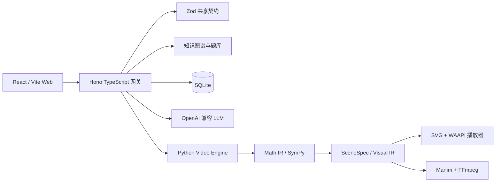

# `math-learning-tool` 仓库分析

## 目录

- [1. 分析范围与结论摘要](#1-分析范围与结论摘要)
- [2. 产品定位](#2-产品定位)
- [3. 总体架构](#3-总体架构)
- [4. 核心模块分析](#4-核心模块分析)
- [5. 数学正确性与答案防泄露](#5-数学正确性与答案防泄露)
- [6. 图形与可视化体系](#6-图形与可视化体系)
- [7. 知识图谱与学习闭环](#7-知识图谱与学习闭环)
- [8. 与当前 voice-tutoring 项目的对比](#8-与当前-voice-tutoring-项目的对比)
- [9. 最值得借鉴的设计](#9-最值得借鉴的设计)
- [10. 不建议直接照搬的部分](#10-不建议直接照搬的部分)
- [11. 风险与不足](#11-风险与不足)
- [12. 对当前项目的落地建议](#12-对当前项目的落地建议)
- [13. 综合判断](#13-综合判断)
- [14. 主要参考资料](#14-主要参考资料)

## 1. 分析范围与结论摘要

分析对象：[`zelda3721/math-learning-tool`](https://github.com/zelda3721/math-learning-tool/tree/master)。

本次分析基于 2026-08-17 获取的 `master` 分支快照，具体提交：[`6429e8900fb0a63e1b2f817818c063888100c9b7`](https://github.com/zelda3721/math-learning-tool/commit/6429e8900fb0a63e1b2f817818c063888100c9b7)。

分析方式：阅读仓库目录、README、核心类型定义、服务端练习与诊断逻辑、知识图谱代码、Web 动画播放器、图形约束校验、Python 解题验证与视频生成代码。没有在本地完整安装和运行该项目，因此 README 中的测试数量和“P0–P5 全部落地”等属于仓库作者声明，而不是本次独立验收结果。

核心结论：

1. 这已经不是一个简单的“LLM + Manim 视频生成器”，而是一个家庭本地部署的数学学习系统，覆盖练习、判卷、错因诊断、知识图谱、提示、变式、探索对话、Web 动画和 Manim 视频。
2. 对我们最有价值的是它的三层中间表示：`Math IR → Visual IR/SceneSpec → Web/Manim 渲染`，以及“数学证据先验证，视觉表达后消费”的架构原则。
3. 它在知识图谱、错因证据、练习闭环和可视化生产方面明显领先于当前 voice-tutoring Demo。
4. 它没有覆盖我们的核心交互：实时语音通话、语音轮次判断、学生未说完检测，以及围绕同一道题持续理解学生每一步思路的动态辅导状态。
5. 适合将其作为架构和数据契约参考，不适合整体合并或直接替换当前项目。

## 2. 产品定位

仓库将自己定义为“数学成长引擎”，主路径是：

```text
每日练习
→ 判卷
→ 提示阶梯
→ 错因诊断
→ 可视化讲解
→ 变式验证
→ 更新掌握度与复习计划
```

它强调六条教学原则：行为验证理解、不直接喂答案、用变式复习、错因归因必须有证据、图形承担数学论证、未核验知识不能作为诊断依据。

这与我们的教育理念高度一致，但产品入口不同：

- 该仓库是“练习和诊断驱动”的完整学习系统。
- 当前 voice-tutoring 是“学生带着一道题来，通过语音和老师式引导解决问题”的辅导系统。

## 3. 总体架构

仓库采用 TypeScript Monorepo 加独立 Python 引擎：



主要目录：

| 目录 | 职责 |
| --- | --- |
| `packages/schema` | Zod 类型真源，约束知识、学习者、图形、SceneSpec 和服务契约 |
| `packages/knowledge` | 知识图遍历、前置回溯、离线匹配和数据 lint |
| `packages/llm-client` | OpenAI 兼容客户端、流式输出、推理内容剥离和多端点配置 |
| `packages/explainer-web` | SceneSpec 解释、状态折叠、SVG 渲染和逐拍动画 |
| `apps/server` | 认证、练习、判卷、诊断、提示、录题、家长端和引擎代理 |
| `apps/web` | 学生练习、星图、错题本、探索、录题和家长视图 |
| `services/video-engine` | Solve、Verify、Direct、Compile、Watch 五阶段讲解引擎 |

架构上的突出优点是：TypeScript 和 Python 之间通过版本化契约连接。网关启动时检查引擎契约版本，不兼容时拒绝启动，而不是容忍结构漂移后产生静默错误。

## 4. 核心模块分析

### 4.1 练习与判卷

判卷不是简单比较字符串，而是包含：

- 数字、单位和格式归一化；
- 多小问完整性检查；
- 文本答案限定词检查；
- 集合型答案的顺序无关比较；
- 多种合法答案；
- 规则判定不足时的语义判断。

这表明项目在真实题库数据上进行过较多迭代。代码注释记录了题号被误当答案、只比较第一个数字、题库答案类型标错等实际问题。

局限是：这一模块主要判断最终作答是否正确，并不等价于理解学生的多步推理过程。

### 4.2 提示阶梯

系统提供 L1–L3：

- L1：指出审题重点；
- L2：指出方法方向；
- L3：给第一步操作。

LLM 输出后还经过程序端答案泄漏检查；泄漏或调用失败时回退静态提示。

它解决的是“不给答案”的底线，但静态兜底提示较通用，对具体学生思路的响应能力有限。我们的动态学生推理图和教学状态机仍有独立价值。

### 4.3 错因诊断

诊断不是让 LLM 在整个知识空间自由生成结论，而是：

```text
题目关联知识点
→ 沿 prerequisites 反向遍历
→ 根据掌握度和证据生成候选根因
→ LLM 只能在候选集合内选择
→ 程序校验节点和误概念 ID
→ 生成探针题进一步验证
```

置信度由固定启发式公式计算，依据包括节点是否核验、证据数量、掌握度和是否使用 LLM。项目明确承认这种置信度不是精准心理测量，这一点比较客观。

### 4.4 探索对话

探索模块采用苏格拉底式提示，限制最多四轮工具循环，并提供：

- `graph_query`：查询已存在的知识节点；
- `find_similar`：离线查找相关知识点和题型；
- LLM 不可用时的固定引导兜底。

它证明仓库内确实存在“不直接给答案”的多轮对话能力，但这是知识探索伙伴，不是围绕一道具体题目持续追踪学生解题步骤的实时老师。

### 4.5 解题与讲解生成

Python 引擎采用五阶段有界工作流：

```text
Solve
→ Verify
→ Direct
→ Compile
→ Watch
```

- `Solve`：生成结构化解法和 Math IR；
- `Verify`：用独立数学证据检查解法；
- `Direct`：把数学证据转换为 SceneSpec/Visual IR；
- `Compile`：优先确定性编译，必要时生成 Manim；
- `Watch`：技术指标和多模态模型共同审查成片。

状态机负责依赖、预算和回退，LLM 不负责无限循环决定下一工具，因此比自由 Agent 更可控。

## 5. 数学正确性与答案防泄露

### 5.1 Math IR

Math IR 是仓库最值得借鉴的实现。

LLM 不直接执行 Python，而是声明：

- 符号及定义域；
- 数学操作；
- 前序结果引用；
- 最终需要验证的 claims。

安全运行时使用 AST 白名单和 SymPy，支持计算、化简、求解、代入、微积分、极限、矩阵和关系比较，并限制表达式长度、操作数量、变量名和函数集合。

相比我们当前只支持基础方程系统的 `SympyMathVerifier`，该仓库的 Math IR 更通用，也更适合成为“题目的可执行世界模型”。

### 5.2 验证策略

项目区分三种情况：

1. 确定性数学可验证：必须执行并通过关键声明；
2. 不适合确定性工具：明确 `applicable=false`，不得伪造通过；
3. 验证器自身格式错误：与“答案被证伪”分开处理，防止错误验证器反向污染正确解法。

这是非常重要的工程经验：工具无法验证不等于学生或解法错误。

### 5.3 答案泄漏

练习接口会清除答案字段，提示模块做答案数值和文本检测。图形录入还会拒绝题干中没有出现、却被模型擅自写进图形的数值，因为额外尺寸可能让图直接泄漏答案。

需要注意：视频引擎的目标是生成完整讲解，内部和最终讲解会使用答案；因此“仓库不喂答案”主要由练习与提示 API 保证，不是所有引擎输出都天然安全。若接入我们的实时辅导，不能把视频引擎输出直接发给学生，仍需要教学策略和答案暴露控制层。

## 6. 图形与可视化体系

### 6.1 FigureSpec

`FigureSpec` 与我们的 `DiagramGraph` 目标相近，但职责不同：

- `DiagramGraph`：描述从原题图片观察和确认出的事实；
- `FigureSpec`：描述系统准备重新绘制的点、线、角、圆和约束。

FigureSpec 不以写死坐标为中心，而是声明长度、等长、角度、直角、平行、垂直和点在线段上等约束，由求解器计算坐标并回代验证。

这很适合解决“重绘图和题干不一致”的问题。

### 6.2 图形真实性门禁

录题流程中的 `figureGate` 有三类关键检查：

1. 没有约束的图拒绝，因为随机坐标可能只是“看起来像”；
2. 图形约束中的数值必须能在题干找到，防止模型创造条件；
3. 约束必须能被图形求解器满足。

它还容忍常见模型格式漂移，例如 `start/end`、`from/to`、数组线段和不同角度字段名。这与我们最近处理 `diagram_type="grid"`、`value="grid"` 的经验高度一致：边界应兼容写法漂移，但不能改变数学事实。

### 6.3 SceneSpec / Visual IR

SceneSpec 包含：

- `visual_thesis`：整段视觉要证明什么；
- `essence_rationale`：为什么这种表达能揭示数学本质；
- `visual_objects`：图元和数学参数；
- `scenes`：逐拍动作、教学语句和注意焦点。

Web 播放器和 Manim 共同消费同一个 SceneSpec。默认使用 Web SVG/WAAPI 播放，只有高质量成片需求才走 Manim。

这是比“让 LLM 直接写 Manim Python”更合理的分层：教学意图、数学事实和渲染技术互相解耦。

### 6.4 数量动画的对象连续性

`explainer-web` 使用稳定 Unit ID 跟踪每一个单位对象，处理移动、分割、合并、复制、计数和重新计数，并检查局部守恒。对象不会在每一拍被销毁后重画。

这一设计对我们的黑板动画很有价值：如果学生听到“把其中两份移走”，画面应该移动同一批对象，而不是下一帧重新生成一张看似相同的图。

## 7. 知识图谱与学习闭环

知识层采用 file-first：图谱、题型和问题 JSON 进入 Git，并通过 lint 检查悬挂节点、环、反向关系和重复。

学习者层采用 SQLite 和事件记录：attempt、mastery、mistake、review card 等可以从事件重新投影。

图谱代码支持：

- prerequisites 前置知识；
- evolvesTo 概念演化；
- 前置祖先和后继闭包；
- 演化主路径；
- 基于掌握度和证据的根因候选回溯；
- 离线关键词和中文二元组匹配；
- LLM 选择结果的 ID 白名单验证。

对我们的阶段总结、知识点复习和自动出卷，这部分比单纯的向量知识库更值得参考。题库知识库负责提供材料，知识图谱和学习证据负责决定“为什么现在复习这个”。

## 8. 与当前 voice-tutoring 项目的对比

| 维度 | `math-learning-tool` | 当前 voice-tutoring |
| --- | --- | --- |
| 核心入口 | 每日练习、判卷、错因和讲解 | 拍照后发起老师式语音通话 |
| 对话形态 | 文本探索、提示、讲解生成 | 语音、字幕和黑板同步的多轮讲题 |
| 学生思路理解 | 主要判断最终作答和错因 | 维护学生动态推理节点与完整会话历史 |
| 教学节奏 | L1–L3 提示和变式门 | 动态教学状态机、追问和完成态 |
| 数学验证 | 通用 Math IR + SymPy | 基础方程、普通应用题和网格面积验证 |
| 图形输入 | FigureSpec 生成/重绘、录题图形门禁 | 原图识别、DiagramGraph 和学生确认 |
| 可视化输出 | SceneSpec、Web SVG 动画、Manim 视频 | 原图、字幕、黑板信息和少量 SVG 高亮 |
| 学习者模型 | SQLite、掌握度、错因、复习和家长端 | 当前主要是单题会话，长期模型未完成 |
| 语音能力 | 可选视频旁白 TTS，没有实时 STT 通话链路 | 阿里云 STT/TTS，核心路径是语音通话 |
| 家庭产品完整度 | 账户、多个孩子、家长端、题库录入 | Demo 阶段，尚未做账户和持久化 |

两者并不是重复实现。更合理的关系是：voice-tutoring 继续负责“实时老师”，借鉴该仓库的数学执行、视觉表达和长期学习基础设施。

## 9. 最值得借鉴的设计

### 9.1 将动态备课升级为三份独立产物

建议我们的 `TeacherPreparationPackage` 逐步拆为：

```text
ProblemModel / DiagramGraph
→ MathIR：可执行数学证据
→ TeachingPlan：引导目标、理解槽位和提示策略
→ SceneSpec：黑板对象、动作和注意焦点
```

当前备课包将约束、解法步骤和教学入口放在一个结构中，后续扩展图形和动画时容易互相污染。

### 9.2 Web 动画优先，视频按需生成

实时语音辅导不适合等待数分钟生成 Manim 视频。可以采用：

- 通话中：SceneSpec → SVG/Canvas 即时逐拍展示；
- 课后复习：对重要知识点异步生成 Manim 视频；
- 视频与实时黑板共同消费一份经过验证的 SceneSpec。

### 9.3 采用图形“数字出处门禁”

我们的 DiagramGraph 需要增加：

- `evidence_refs`：每个尺寸和关系来自题干文字、明确图形标记还是学生确认；
- 图形数值与题干 OCR 数值的绑定检查；
- 模型根据像素估算的长度不能成为数学事实；
- 题干未给的尺寸不得进入学生可见重绘图。

### 9.4 把知识库和知识图谱分开

- 知识库：教材、题目、解法、错例和讲解素材；
- 知识图谱：前置、演化、相关和题型关系；
- 学习证据：学生在哪些题上独立完成、需要几级提示、出现什么错误；
- 检索只是获取材料，图谱与证据共同决定教学策略。

### 9.5 采用有界工作流

建议备课和可视化生成明确限制每阶段预算：

```text
理解题目
→ 求解
→ 工具验证
→ 教学规划
→ 视觉规划
→ 输出审核
```

修复应针对失败阶段，不应把整道题交给模型无限重做。

## 10. 不建议直接照搬的部分

### 10.1 不把静态 L1–L3 当作主要教学状态机

提示等级适合作为最低兜底，但真实学生可能跳步、换方法、自我纠错或已经理解核心关系。我们的动态思路理解仍应决定下一次追问。

### 10.2 不把 Manim 放进实时核心路径

仓库给出的产能基线是单条视频中位约 170 秒。即使硬件和模型变化，这种分钟级生产也不适合语音通话。实时核心路径应使用结构化黑板渲染。

### 10.3 不直接复用完整产品服务

该仓库已有认证、练习、家长、知识图谱、录题和两个讲解通道，整体引入会带来两个前端、两个后端语言栈、多套会话和权限模型。对当前 Demo 而言复杂度过高。

### 10.4 不让最终答案判卷替代过程理解

它的判卷模块很成熟，但“答案正确”不能证明学生理解，也不能识别学生在语音中形成的替代解法。这部分只能作为工具，不能成为我们辅导智能的核心。

## 11. 风险与不足

### 11.1 作者声明与独立验证之间仍有距离

README 声明 TypeScript 187 项测试、Python 238 项测试及 P0–P5 已落地。本次没有完整运行，不能据此判断所有真实路径均稳定。

### 11.2 仓库包含大量生成物

本次树快照约有 5896 个文件，其中约 5475 个位于 `services/video-engine/media`，合计约 289 MB，包含渲染缓存、SVG、视频和分片。这会扩大仓库、减慢克隆并混淆源代码与运行产物。若借鉴工程组织，不建议复制这一做法。

### 11.3 受限 `exec` 仍值得安全复核

主 Math IR 采用 AST 白名单且不执行任意 Python，这是正确方向。但验证模块仍保留一条执行模型生成 `verify()` 代码的兼容路径，即使限制 import、builtins、dunder、`open/eval/exec`，仍比完全声明式 IR 风险更高。我们的实现应坚持只解释声明式运算，不执行模型代码。

### 11.4 图形能力偏向“生成正确的新图”

FigureSpec 很适合约束生成图，但不完全解决真实照片中的图元检测、标签绑定、遮挡、透视和阴影区域确认。我们的 DiagramGraph、原图叠加和学生确认流程仍然必要。

### 11.5 缺少实时语音教学问题的验证

仓库没有证明以下能力：

- 流式 STT 下的未说完检测；
- 学生打断老师；
- 口语表达与数学步骤的对齐；
- 字幕、语音和黑板动作同步；
- 一道题内的动态理解完成判定。

### 11.6 许可证文件需要进一步确认

README 标注 MIT，但本次递归文件树中没有看到独立的 `LICENSE` 文件。若计划直接复制代码，应先让仓库作者补充或确认完整许可证文本；仅借鉴架构思想不存在这一代码复用问题。

## 12. 对当前项目的落地建议

建议按以下顺序吸收，而不是合并仓库。

### P0：升级数学备课契约

1. 为 `TeacherPreparationPackage` 增加通用 `MathIR`；
2. 运算使用受控操作集合和结果引用；
3. claims 必须引用工具执行结果；
4. `unsupported` 与 `incorrect` 严格分开；
5. DiagramGraph 的数学事实编译到同一 Math IR。

### P1：建立实时 SceneSpec

1. 定义黑板图元、对象 ID、逐拍动作和注意焦点；
2. 每次语音回复返回文本、TTS 分段和 SceneSpec patch；
3. 对象跨轮保持身份，不每轮重绘；
4. 图形和计算结果只能消费已验证事实；
5. 先做 Web SVG，不做实时 Manim。

### P2：完善图形真实性门禁

1. 数字必须绑定题干或明确图形标记；
2. 学生确认具体对象、标注和关系，而不是整图一键确认；
3. 约束求解并回代；
4. 模型格式漂移只做语法归一，不自动升级事实权限；
5. 无足够事实时明确要求补充确认。

### P3：建设长期学习证据

1. 知识点图谱；
2. 题目与知识点多对多映射；
3. 学生独立步骤、提示等级、误解和复述证据事件；
4. 阶段总结由事件投影生成；
5. 复习卷优先选择到期复习、薄弱点、探针和变式。

### P4：异步复习视频

1. 通话结束后从已验证 Math IR 和 SceneSpec 生成视频；
2. 只为高价值知识点生成；
3. 将视频作为复习材料，不作为理解完成证据；
4. 看完必须通过复述或变式题验证。

## 13. 综合判断

该仓库对我们有很高的研究价值，尤其是数学验证、Visual IR、图形真实性门禁和长期学习证据体系。

最合理的吸收方式不是“把它接进来”，而是采用以下边界：

```text
voice-tutoring 保留：
实时语音老师 + 学生思路理解 + 教学状态机 + 完成判定

重点借鉴：
Math IR + FigureSpec 约束思想 + SceneSpec + 知识图谱/证据事件

按需扩展：
课后 Web 动画 + 异步 Manim 视频
```

如果只选择一个近期行动，我建议优先研究并设计我们自己的通用 `MathIR`。它能同时改善陌生题动态备课、SymPy 验证、图形题求解、学生步骤验证和后续可视化，是这个仓库对当前项目价值最大的共同基础。

## 14. 主要参考资料

- [仓库 README](https://github.com/zelda3721/math-learning-tool/blob/6429e8900fb0a63e1b2f817818c063888100c9b7/Readme.md)
- [讲解引擎 README](https://github.com/zelda3721/math-learning-tool/blob/6429e8900fb0a63e1b2f817818c063888100c9b7/services/video-engine/README.md)
- [Math Runtime](https://github.com/zelda3721/math-learning-tool/blob/6429e8900fb0a63e1b2f817818c063888100c9b7/services/video-engine/src/math_tutor/infrastructure/agent/math_runtime.py)
- [Solve 工具](https://github.com/zelda3721/math-learning-tool/blob/6429e8900fb0a63e1b2f817818c063888100c9b7/services/video-engine/src/math_tutor/infrastructure/agent/tools/solve_problem.py)
- [Verify 工具](https://github.com/zelda3721/math-learning-tool/blob/6429e8900fb0a63e1b2f817818c063888100c9b7/services/video-engine/src/math_tutor/infrastructure/agent/tools/verify_solution.py)
- [SceneSpec Schema](https://github.com/zelda3721/math-learning-tool/blob/6429e8900fb0a63e1b2f817818c063888100c9b7/packages/schema/src/scenespec.ts)
- [FigureSpec Schema](https://github.com/zelda3721/math-learning-tool/blob/6429e8900fb0a63e1b2f817818c063888100c9b7/packages/schema/src/figure.ts)
- [图形真实性门禁](https://github.com/zelda3721/math-learning-tool/blob/6429e8900fb0a63e1b2f817818c063888100c9b7/apps/server/src/ingest/figureGate.ts)
- [Web 动画状态折叠器](https://github.com/zelda3721/math-learning-tool/blob/6429e8900fb0a63e1b2f817818c063888100c9b7/packages/explainer-web/src/fold.ts)
- [知识图谱遍历](https://github.com/zelda3721/math-learning-tool/blob/6429e8900fb0a63e1b2f817818c063888100c9b7/packages/knowledge/src/graph.ts)
- [知识点与题型定位](https://github.com/zelda3721/math-learning-tool/blob/6429e8900fb0a63e1b2f817818c063888100c9b7/packages/knowledge/src/locator.ts)
- [提示阶梯与泄漏检测](https://github.com/zelda3721/math-learning-tool/blob/6429e8900fb0a63e1b2f817818c063888100c9b7/apps/server/src/hint.ts)
- [错因诊断](https://github.com/zelda3721/math-learning-tool/blob/6429e8900fb0a63e1b2f817818c063888100c9b7/apps/server/src/diagnosis.ts)
- [苏格拉底探索](https://github.com/zelda3721/math-learning-tool/blob/6429e8900fb0a63e1b2f817818c063888100c9b7/apps/server/src/explore.ts)
- [视频生成与质量门禁](https://github.com/zelda3721/math-learning-tool/blob/6429e8900fb0a63e1b2f817818c063888100c9b7/docs/VIDEO_GENERATION_STRATEGIES.md)
- [视觉语义设计](https://github.com/zelda3721/math-learning-tool/blob/6429e8900fb0a63e1b2f817818c063888100c9b7/docs/VISUAL_SEMANTICS_DESIGN.md)
