# 通话式 AI 课堂 MVP 关键技术调研

## 目录

- [1. 文档信息](#1-文档信息)
- [2. 核心判断](#2-核心判断)
- [3. MVP 必须调研的关键技术](#3-mvp-必须调研的关键技术)
  - [3.1 学生数学步骤的理解与判断](#31-学生数学步骤的理解与判断)
  - [3.2 引导式教学状态机](#32-引导式教学状态机)
  - [3.3 数学正确性与答案防泄露](#33-数学正确性与答案防泄露)
  - [3.4 实时语音的轮次判断](#34-实时语音的轮次判断)
  - [3.5 数学语音识别与上下文纠错](#35-数学语音识别与上下文纠错)
  - [3.6 语音、字幕和 AI 黑板同步](#36-语音字幕和-ai-黑板同步)
  - [3.7 打断、取消和异步任务一致性](#37-打断取消和异步任务一致性)
  - [3.8 端到端延迟](#38-端到端延迟)
- [4. MVP 调研优先顺序](#4-mvp-调研优先顺序)
- [5. MVP 暂时不必攻克](#5-mvp-暂时不必攻克)
- [6. MVP 技术验证数据集](#6-mvp-技术验证数据集)
- [7. 金标准格式与示例](#7-金标准格式与示例)
  - [7.1 金标准的用途](#71-金标准的用途)
  - [7.2 推荐文件格式](#72-推荐文件格式)
  - [7.3 完整题目金标准示例](#73-完整题目金标准示例)
  - [7.4 学生单步判断金标准示例](#74-学生单步判断金标准示例)
  - [7.5 错误步骤金标准示例](#75-错误步骤金标准示例)
  - [7.6 多轮对话金标准示例](#76-多轮对话金标准示例)
  - [7.7 模型回复评分格式](#77-模型回复评分格式)
  - [7.8 最小必填字段](#78-最小必填字段)
- [8. 3.1～3.3 核心业务逻辑总结](#8-3133-核心业务逻辑总结)
  - [8.1 核心闭环](#81-核心闭环)
  - [8.2 3.1：理解学生当前在做什么](#82-31理解学生当前在做什么)
  - [8.3 3.2：决定下一步如何教学](#83-32决定下一步如何教学)
  - [8.4 3.3：保证 AI 没教错也没提示过量](#84-33保证-ai-没教错也没提示过量)
  - [8.5 三个核心模块的接口](#85-三个核心模块的接口)
  - [8.6 三部分为什么必须作为整体](#86-三部分为什么必须作为整体)
- [9. 业务架构全景](#9-业务架构全景)
  - [9.1 业务架构图](#91-业务架构图)
  - [9.2 四个主要业务闭环](#92-四个主要业务闭环)
  - [9.3 3.1～3.8 与业务架构的关系](#93-3138-与业务架构的关系)
- [10. MVP 技术验收门槛](#10-mvp-技术验收门槛)
- [11. 最终结论](#11-最终结论)
- [12. 相关文档](#12-相关文档)

## 1. 文档信息

| 项目 | 内容 |
| --- | --- |
| 文档版本 | V1.0 |
| 产品形态 | 拍题确认后，通过实时语音、字幕和动态 AI 黑板进行引导式辅导 |
| 调研阶段 | MVP 前置技术验证 |
| 核心目标 | 验证系统能否在实时交流中理解学生的数学步骤，并通过语音和屏幕给出恰到好处的下一步 |

## 2. 核心判断

这个形态的关键技术不是“实现一个语音通话界面”，而是让语音交流、数学理解和屏幕黑板在同一个教学状态下可靠运行。

最核心的技术链路是：

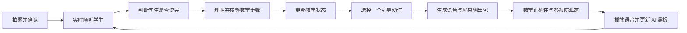

图片识别、语音识别和语音合成都是必要能力，但真正决定产品是否成立的是：

1. AI 能否听懂学生当前做到了哪里。
2. AI 能否判断下一步只应该提示多少。
3. 语音、字幕和 AI 黑板能否始终同步且正确。

## 3. MVP 必须调研的关键技术

### 3.1 学生数学步骤的理解与判断

这是风险最高、最影响产品核心价值的技术点。

学生在通话中通常不会说出规范算式，更多可能是：

- “我先用八十乘百分之八十。”
- “这里是不是应该移到右边？”
- “我算到 x 等于三，但是好像不对。”
- “就是上面那个数除以下面那个。”
- “我不知道为什么要设这个。”

系统需要判断：

- 学生表达的是疑问、思路、中间步骤还是最终答案。
- 当前步骤正确、错误、部分正确，还是无法确认。
- 第一个错误发生在哪里。
- 属于概念、关系、符号、计算、单位还是审题错误。
- 下一步最小教学目标是什么。
- 置信度不足时应该追问什么。

#### 候选技术路线

| 方案 | 优点 | 风险 |
| --- | --- | --- |
| 大模型直接判断 | 能理解自然语言，原型开发快 | 数学判断不稳定，难以复现 |
| 规则或符号计算 | 数值、方程和等价变形可靠 | 难以理解口语和非标准步骤 |
| 大模型 + 数学工具 | 兼顾语义理解与确定性校验 | 编排和错误归因更复杂 |
| 双模型交叉判断 | 可减少单模型盲点 | 延迟和成本更高，仍可能共同犯错 |

MVP 建议重点验证“大模型理解口语 + 数学工具验证算式”的组合方案。

#### 示例：结果正确，但理由没有说清楚

题目是 `2x + 3 = 9`，学生说：“我把那个三放到右边，就变成六了。”

错误实现可能直接回答：“对，然后两边除以二，所以 x 等于三。”这既没有确认学生是否理解等式性质，也泄露了后续答案。

期望判断：

```json
{
  "verdict": "partially_correct",
  "mathematical_result_correct": true,
  "explanation_complete": false,
  "error_type": "reasoning_not_explicit",
  "next_subgoal": "确认学生是否理解等式两边应进行相同运算"
}
```

期望回复：“得到 `2x = 6` 这个结果是对的。你说的‘放到右边’，如果用等式两边的运算来表达，应该怎么说？”

这个例子需要验证模型能否区分“结果正确”和“已经真正理解”。

#### 复杂题中的步骤对齐与歧义

当题目包含多个阶段、分支或重复运算时，系统不能只判断学生说出的算式“本身是否正确”，还必须先判断它对应解题过程中的哪一步。这个任务可以称为**步骤对齐（step alignment）**。

这个问题很可能发生，常见原因包括：

- 多个步骤使用相同操作，例如先后两次“除以二”。
- 不同对象具有相似计算，例如分别计算甲、乙两段路程。
- 学生跳步、倒回上一步或改用另一种解法。
- 学生使用“这个”“上面那个”“再除一次”等指代表达。
- 同一个中间结果可能出现在不同解法路径中。
- 语音识别只保留了算式，没有保留学生指向的题目区域或对象。
- 系统根据预设解法期待下一步，错误地把学生的真实步骤套入该位置。

##### 示例：两处都需要“除以二”

假设一道应用题的合理解题过程包含：

```text
步骤 A：用总路程除以 2，得到每个相同路段的长度
步骤 B：计算总时间
步骤 C：用某段时间除以 2，得到每个阶段的时间
步骤 D：根据路程和时间求速度
```

学生说：

> 然后这里再除以二。

这句话可能对应步骤 A，也可能对应步骤 C。单独看“除以二”在数学上都可能成立。

错误实现可能仅根据系统预期的“下一步”认定学生正在完成步骤 C，然后把“时间减半”写入已完成步骤。但学生实际可能返回修改步骤 A，或者指的是屏幕上的路程数值。

如果步骤对齐错误，后续即使每个数学判断单独看都正确，整个教学状态仍会逐渐偏离学生真实思路，最终表现为：

- AI 说“这一步正确”，但确认了错误的对象。
- AI 重复询问学生已经完成的步骤。
- AI 认为学生跳步，实际上学生正在回头修正。
- AI 黑板把算式写到错误的步骤或变量下面。
- 后续提示基于错误中间状态，产生连锁误判。

##### 期望的步骤对齐过程

系统应将学生表达与多个候选步骤进行匹配，而不是立即绑定到唯一位置：

```json
{
  "student_input": "然后这里再除以二",
  "candidate_alignments": [
    {
      "step_id": "path_1.step_A",
      "object": "总路程",
      "score": 0.46,
      "evidence": ["学生说了除以二", "步骤 A 使用相同运算"]
    },
    {
      "step_id": "path_1.step_C",
      "object": "某段时间",
      "score": 0.49,
      "evidence": ["学生说了再", "步骤 C 接近当前进度"]
    }
  ],
  "alignment_verdict": "ambiguous",
  "required_action": "ASK_CLARIFICATION"
}
```

由于两个候选分数接近，系统不应自动选择。期望回复是：

> 你说的“除以二”，是把总路程除以二，还是把刚算出的时间除以二？

屏幕可以同时短暂高亮两个候选区域，让学生点击或口述确认。

##### 不应只使用“当前步骤编号”

复杂题不一定严格线性。建议把解题过程表示为一个包含依赖关系的步骤图，而不是单一的步骤列表：

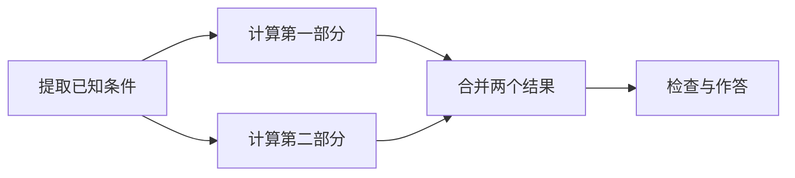

会话状态应至少维护：

```json
{
  "active_solution_path": "path_1",
  "completed_step_ids": ["A", "B1"],
  "active_step_candidates": ["B2", "C"],
  "current_focus_objects": ["第二部分"],
  "recent_screen_targets": ["condition_3"],
  "student_referenced_expression": null,
  "alignment_confidence": 0.58
}
```

步骤对齐可以综合以下证据：

- 当前已完成和未完成的步骤。
- 各步骤之间的依赖关系。
- 最近讨论的变量、对象和题目区域。
- 学生完整语句中的名词、指代和顺序词。
- 屏幕上当前高亮的内容。
- 学生口述或输入的具体数值和算式。
- 与候选步骤对应的数学工具校验结果。
- 学生是否明确表示“回到前面”“换一种方法”或“我刚才说错了”。

##### 处理原则

- 数学正确性判断必须发生在步骤对齐之后，或与对齐联合完成。
- 对齐置信度不足时先确认对象或步骤，不要直接判对错。
- 允许学生跳步、回退和切换解法，不能强迫其遵循系统预设路径。
- “当前预期步骤”只能作为一项证据，不能作为唯一答案。
- 写入“已完成步骤”前，需要同时确认运算、对象和步骤位置。
- 学生确认后应更新步骤图，并保留之前的候选和修正记录。
- AI 黑板的高亮位置可以作为消除口语指代歧义的重要上下文。

##### 需要增加的评测样本

金标准中应专门包含：

- 同一操作在一道题中重复出现。
- 相同数值在不同对象中出现。
- 学生从后一步返回修改前一步。
- 学生跳过中间步骤直接给出后续结果。
- 学生在两种合法解法之间切换。
- 学生使用“这个”“那里”“再来一次”等模糊指代。
- 数学表达正确，但绑定到错误对象后不成立。
- 两个候选步骤都合理，系统必须追问确认。

##### 建议增加的指标

| 指标 | 说明 | MVP 目标 |
| --- | --- | ---: |
| 步骤 Top-1 对齐准确率 | 首选候选是否为学生真实步骤 | ≥ 90% |
| 步骤 Top-2 召回率 | 真实步骤是否进入前两个候选 | ≥ 97% |
| 对象绑定准确率 | 运算是否绑定到正确变量、数值或题目对象 | ≥ 95% |
| 歧义识别召回率 | 应追问的样本是否被识别为歧义 | ≥ 90% |
| 错误状态推进率 | 对齐错误却写入完成状态的比例 | ≤ 1% |
| 解法切换识别率 | 能否识别学生改用另一条合法路径 | ≥ 90% |

因此，3.1 的完整任务实际上应拆成：

```text
理解学生表达
→ 找出候选数学步骤和对象
→ 与解题步骤图对齐
→ 判断是否存在歧义
→ 确认当前真实步骤
→ 判断该步骤是否正确
→ 更新教学状态
```

对于复杂题，“正确理解学生正在做哪一步”应先于“判断这一步是否正确”。

#### 参考解法与步骤图如何生成

“为每道题生成 1–2 条参考解法”不是把所有可能解法穷举出来，也不是让大模型一次生成两篇自然语言答案。推荐实现为一条内部流水线：

```mermaid
flowchart LR
    Problem[学生确认后的题目] --> Parse[题目结构化]
    Parse --> Generate[生成最多 3 条候选解法]
    Generate --> Normalize[转换为结构化步骤]
    Normalize --> Verify[数学工具逐步验证]
    Verify --> Review[题意与适龄性审核]
    Review --> Deduplicate[按推理结构去重]
    Deduplicate --> Select[选择 1–2 条可靠路径]
    Select --> Graph[构建内部步骤图]
    Graph --> Alignment[用于学生步骤对齐]
```

##### 第一步：使用确认后的结构化题目

参考解法必须基于学生最终确认的题目，而不是未经确认的 OCR 文本：

```json
{
  "problem_id": "problem-001",
  "subject": "数学",
  "grade": "初一",
  "problem_type": "相遇问题",
  "givens": [
    {"id": "speed_a", "name": "甲的速度", "value": 4, "unit": "千米/小时"},
    {"id": "speed_b", "name": "乙的速度", "value": 6, "unit": "千米/小时"},
    {"id": "distance_total", "name": "总路程", "value": 30, "unit": "千米"}
  ],
  "target": {"id": "meeting_time", "name": "相遇时间", "unit": "小时"}
}
```

如果学生修改了数字、符号或单位，之前预生成的参考解法必须失效并重新验证。

##### 第二步：让大模型生成解法计划

模型输出最多 3 条候选路径，但每一步必须包含操作、对象、表达式、结果和依赖，而不是只有自然语言：

```json
{
  "candidate_paths": [
    {
      "path_id": "speed_sum",
      "method": "速度和法",
      "steps": [
        {
          "step_id": "a1",
          "action": "add",
          "inputs": ["speed_a", "speed_b"],
          "output": "combined_speed",
          "expression": "4 + 6 = 10",
          "goal": "求两人每小时一共接近多少千米"
        },
        {
          "step_id": "a2",
          "depends_on": ["a1"],
          "action": "divide",
          "inputs": ["distance_total", "combined_speed"],
          "output": "meeting_time",
          "expression": "30 / 10 = 3"
        }
      ]
    },
    {
      "path_id": "equation",
      "method": "列方程",
      "steps": [
        {
          "step_id": "b1",
          "action": "define_variable",
          "output": "t",
          "expression": "设相遇时间为 t 小时"
        },
        {
          "step_id": "b2",
          "depends_on": ["b1"],
          "action": "build_equation",
          "inputs": ["speed_a", "speed_b", "distance_total", "t"],
          "expression": "4t + 6t = 30"
        }
      ]
    }
  ]
}
```

参考答案和完整路径属于内部数据，不能直接进入面向学生的回复。

##### 第三步：逐步进行确定性验证

数学验证不能只检查最终答案，还要检查：

- 每个运算是否正确。
- 方程变形前后是否等价。
- 最终结果代回后是否满足题目。
- 数值是否绑定到正确的题目对象。
- 单位和量纲是否合理。
- 是否遗漏、增加或篡改了题目条件。

例如 `30 / 10 = 3` 在计算上成立，但还需确认 30 是总路程、10 是相向运动的速度和、结果单位是小时。数学值正确但对象绑定错误的解法不能通过。

##### 第四步：审核题意和教学适用性

确定性数学工具通常不能完全判断自然语言题意，因此还需独立审核：

```json
{
  "path_id": "speed_sum",
  "verdict": "valid",
  "checks": {
    "uses_required_conditions": true,
    "object_bindings_correct": true,
    "mathematical_steps_valid": true,
    "final_answer_satisfies_problem": true,
    "age_appropriate": true,
    "contains_unjustified_jump": false
  },
  "confidence": 0.98,
  "issues": []
}
```

该审核可以由独立模型结合工具结果完成，但不应让候选生成模型仅凭自我评价宣布通过。

##### 第五步：去重并选择参考路径

“速度和法”“先加速度再除”“综合速度法”可能只是同一解法的不同表述，应根据核心方程、操作序列和步骤依赖图去重。

选择路径的优先级是：

1. 数学验证通过。
2. 符合目标年级。
3. 正确使用题目条件和对象。
4. 步骤清晰，容易拆成引导问题。
5. 与已选路径具有实质性的推理差异。
6. 不依赖超纲定理或复杂技巧。

不必强行保留两条。如果只有一条可靠且适龄的解法，就只保存一条。

##### 第六步：构建可扩展的步骤图

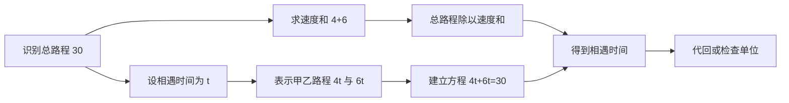

步骤图供系统内部完成步骤对齐、解法识别、下一步候选和跳步判断，不直接作为完整解法展示给学生。

学生可能提出参考图中没有的新方法。此时系统应提取操作和对象并尝试验证：验证通过则创建临时新分支；无法确认则追问理由，不能因为不匹配参考路径就判错。

##### 生成时机与降级

MVP 建议在 OCR 完成后后台预生成候选解法，利用学生确认题目的时间降低等待；学生确认后，再按最终题目执行强校验。

```text
两条路径通过验证 → 保存两条
只有一条通过验证 → 只使用一条
没有路径通过验证 → 更强模型或人工审核
仍然失败 → 明确提示当前题型暂不支持
```

参考路径置信度不足时，系统可以进行基础概念辅导，但不应对复杂学生步骤作出确定判断。

#### MVP 数学工具建议

工具选择取决于后端语言和首批题型。建议把工具包装成统一的 `MathVerifier` 接口，避免教学引擎依赖某个库的内部表达格式。

##### 推荐组合：Python 后端

1. **SymPy 作为核心代数工具**

   适合表达式解析、精确有理数计算、化简、代数等价判断、方程求解、代入和部分微积分能力。MVP 中可用于一元一次方程、基础代数、分数计算和结果回代。官方文档提供 `solve`、`solveset` 以及表达式化简等能力：[SymPy 官方文档](https://docs.sympy.org/)。

2. **Pint 负责单位和量纲**

   适合表示带单位的数量、单位转换和维度检查。例如验证“千米 ÷ 千米/小时”的结果是否为小时，或阻止“米 + 秒”这种不合法计算。官方教程展示了 `Quantity`、单位转换和 dimensionality：[Pint 官方教程](https://pint.readthedocs.io/en/latest/getting/tutorial.html)。

MVP 首选组合建议为：

```text
SymPy：数学表达、方程、等价性和代入
Pint：单位、换算和量纲
自定义规则：题目对象绑定、适龄性和教学步骤
大模型：自然语言理解、候选解法和解释生成
```

##### 如果采用 Node.js

**math.js** 支持表达式解析树、数值类型、分数、单位、化简和求导，可承担前端或 Node.js 后端的基础数学处理。其官方文档说明了表达式树和 `simplify` 等符号能力：[math.js 官方文档](https://mathjs.org/docs/)。

但对复杂符号方程、严格等价验证和后续扩展，MVP 前需要用自己的基准集与 SymPy 对比，不能仅根据 API 数量做选择。

##### Z3 何时有价值

**Z3** 是 SMT 求解器，适合验证整数、实数和逻辑约束是否可满足。例如：

- 应用题中的多个条件是否相互一致。
- 某个学生结论是否能从约束推出。
- 存在范围、整数性、不等式或多变量约束时寻找反例。

Z3 官方指南说明其支持整数、实数以及多种算术约束；同时也指出非线性整数算术不存在通用完备过程，某些非线性问题可能返回未知或无法有效求解：[Z3 Arithmetic 官方指南](https://microsoft.github.io/z3guide/docs/theories/Arithmetic/)。

因此不建议 MVP 一开始用 Z3 取代 SymPy。更合适的顺序是：

```text
第一阶段：SymPy + Pint + 自定义对象规则
第二阶段：有明确约束验证需求时增加 Z3
```

##### 不建议依赖单一工具完成的事情

无论使用哪个数学库，都不应让它单独负责：

- 判断自然语言题意。
- 判断某种解法是否适合目标年级。
- 判断提示是否泄露过多。
- 判断学生是否真正理解概念。
- 识别学生口语中的模糊指代。
- 生成教学语言。

数学工具提供确定性验证证据，教学编排器和评测规则负责决定如何使用这些证据。

##### MVP 选型实验

使用同一批金标准样本比较候选工具：

| 能力 | 测试内容 |
| --- | --- |
| 表达式解析 | 分数、负号、隐式乘法、括号和变量 |
| 精确计算 | 避免浮点误差，验证有理数结果 |
| 等价判断 | 不同形式的代数表达式是否等价 |
| 方程验证 | 求解、变形和代回检查 |
| 对象绑定 | 正确数值是否作用于正确对象 |
| 单位量纲 | 单位转换和不合法运算检测 |
| 异常处理 | 除零、无解、多解和工具返回未知 |
| 性能 | 单步验证和整条路径验证的 P95 延迟 |

工具输出必须区分 `valid`、`invalid` 和 `unknown`。`unknown` 不能被当成验证通过。

#### 建议门槛

| 指标 | 目标 |
| --- | ---: |
| 正确步骤判断准确率 | ≥ 95% |
| 错误步骤识别准确率 | ≥ 90% |
| 首个错误位置准确率 | ≥ 85% |
| 无法确认时正确追问的比例 | ≥ 95% |

系统不能为了提高覆盖率强行判断。输出 `unverifiable` 并继续追问，通常比自信地误判学生更安全。

### 3.2 引导式教学状态机

系统必须知道当前处于教学过程的哪个阶段：

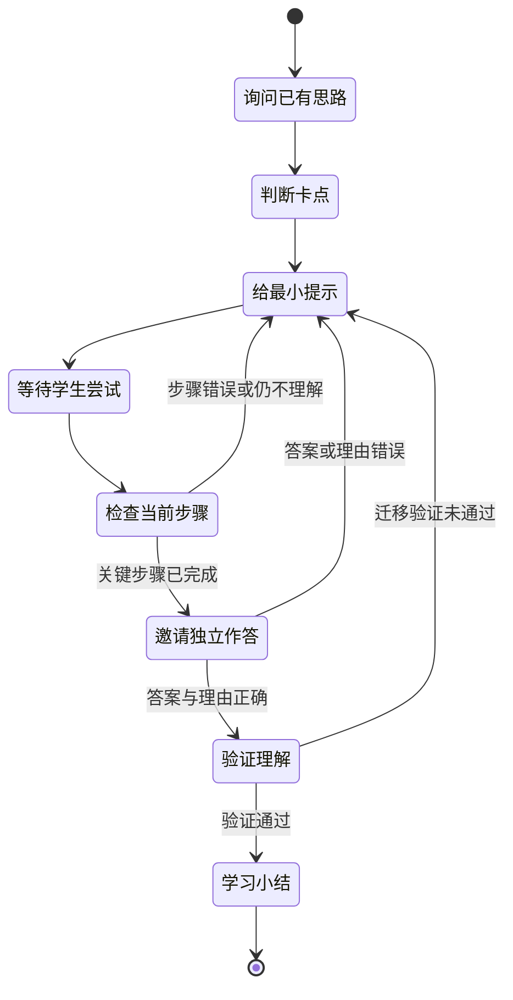

如果把全部聊天记录交给模型自由回复，容易出现：

- 跳过探查，直接讲解整道题。
- 忘记学生已经完成的步骤。
- 连续重复同一种提示。
- 提示逐渐接近完整答案。
- 学生换一种说法后，系统错误地重置进度。
- 学生打断后，系统继续播放已经过期的回复。

MVP 建议由程序维护教学状态，模型只能在允许的教学动作范围内生成表达。每轮只选择一个主要动作，例如：

```text
ASK_PRIOR_ATTEMPT
FOCUS_CONDITION
RECALL_CONCEPT
REQUEST_NEXT_STEP
POINT_FIRST_ERROR
INCREASE_HINT
CHANGE_EXPLANATION
VERIFY_UNDERSTANDING
```

#### 示例：学生突然追问上一步

学生已经得到 `2x = 6`，系统原本准备让他继续求 `x`。学生突然说：“等一下，为什么两边都要减三？”

错误实现会忽略追问，继续说：“接下来两边都除以二。”

期望状态变化：

```text
原状态：REQUEST_NEXT_STEP
学生意图：ASK_WHY
新状态：EXPLAIN_CONCEPT
当前子目标：理解等式两边进行相同运算
允许动作：RECALL_CONCEPT
禁止动作：继续求解 x
```

期望回复：“因为等号表示两边相等。只改变一边，平衡就会被破坏。你觉得左边减三以后，右边应该做什么才能继续保持相等？”

解释完成后，系统应回到原来的解题进度，而不是重新开始整道题。

#### 如何判断学生是否真正理解

状态机不能把“最终答案正确”直接解释为“已经完全理解”。学生可能猜对、套公式、依赖 AI 暗示，或者通过错误推理碰巧得到正确结果。

系统也无法在一次会话中证明学生“完全理解”。更准确的目标是：

> 根据学生在当前题目和当前难度下提供的多种证据，判断其是否达到了可接受的理解程度，并保留置信度和反向证据。

##### 理解不是布尔值

不建议只使用：

```json
{"understood": true}
```

建议分别记录：

| 维度 | 需要验证的问题 |
| --- | --- |
| 结果正确 | 最终答案是否正确 |
| 过程理解 | 能否说明关键步骤为什么成立 |
| 独立程度 | 关键步骤由学生完成，还是依赖较强提示 |
| 错误识别 | 能否发现并解释典型错误 |
| 迁移能力 | 改变数字、符号或情境后是否仍能应用方法 |

结构化状态示例：

```json
{
  "answer_correct": true,
  "reasoning_evidence": "partial",
  "hint_dependency": "medium",
  "error_detection": "not_tested",
  "transfer_result": "not_tested",
  "understanding_confidence": 0.58
}
```

##### 理解验证状态机

学生答对后，不应立即结束，可以进入一个短小的理解验证阶段：

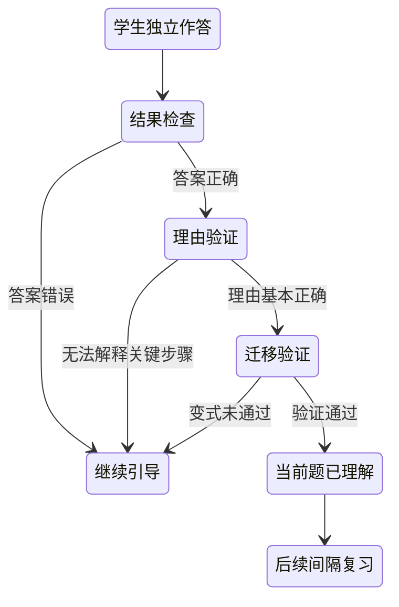

这里必须区分：

- **当前题已完成**：学生得到了正确结果。
- **当前题已理解**：学生对关键步骤提供了合理解释或迁移证据。
- **知识点已掌握**：学生经过间隔复习和不同题型验证，表现仍然稳定。

三者不能使用同一个状态。

##### 证据一：解释关键步骤

原题为 `2x + 3 = 9`，学生得到 `x = 3` 后，AI 可以问：

> 为什么消去左边的加三时，等式两边都要减三？

回答“因为等式两边进行相同运算，等式仍然成立”是较强的概念理解证据。

如果学生只回答“因为移项要变号”，可能只是记住了操作口诀。系统可以追问：

> 如果不用“移项”这个说法，你能用等式两边的运算解释吗？

##### 证据二：识别典型错误

系统可以展示：

```text
2x + 3 = 9
2x = 9 + 3
```

然后询问：

> 这一步有没有问题？为什么？

学生能够发现错误并解释等式两边的运算，比单纯复述自己的步骤提供了更强证据。

##### 证据三：完成微型变式

理解验证不应再布置一整道复杂作业，可以只改变关键关系：

```text
原题：2x + 3 = 9
变式：2x - 3 = 9
```

AI 询问：

> 这次为了消去左边的减三，两边应该先做什么？

学生回答“两边都加三”，说明他可能理解了等式性质，而不只是记住当前题要减三。

变式应改变需要理解的核心关系，不能只替换无关数字。

##### 提示依赖必须计入判断

两个学生都得到正确答案，但理解证据可能完全不同：

| 表现 | 学生 A | 学生 B |
| --- | --- | --- |
| 关键步骤 | 大部分独立完成 | AI 已拆解到接近答案 |
| 最高提示层级 | L1 | L5 |
| 理由解释 | 通过 | 未通过 |
| 微型变式 | 通过 | 未测试或失败 |

学生 B 更适合标记为“在支持下完成”，不能与学生 A 一样直接标记为“理解已验证”。

```json
{
  "final_answer_correct": true,
  "max_hint_level": 5,
  "key_steps_completed_independently": 1,
  "reasoning_check": "failed",
  "transfer_check": "not_tested",
  "understanding_status": "completed_with_support"
}
```

##### 建议的理解状态

内部可以使用以下分层状态：

```text
NOT_EVALUATED
尚未评估

IN_PROGRESS
正在理解

COMPLETED_WITH_SUPPORT
在较强提示下完成

PROCEDURAL_UNDERSTANDING
会按步骤完成，但概念证据不足

CONCEPTUAL_UNDERSTANDING
能够解释关键原因

TRANSFER_CONFIRMED
能够迁移到轻量变式

NEEDS_REVIEW
当前理解基本成立，需要后续间隔复习确认
```

面向学生时不必展示技术状态名称，可以使用“这道题已经完成”“方法基本理解”“再练一道会更稳”等自然语言。

##### 判断必须附带证据

```json
{
  "understanding_status": "conceptual_understanding",
  "confidence": 0.82,
  "evidence": [
    {
      "type": "independent_step",
      "result": "passed",
      "detail": "独立完成 2x = 6"
    },
    {
      "type": "explain_why",
      "result": "passed",
      "detail": "能够解释等式两边同时减三"
    },
    {
      "type": "transfer_question",
      "result": "passed",
      "detail": "正确判断 2x - 3 = 9 应先两边加三"
    }
  ],
  "counter_evidence": [
    {
      "type": "hint_dependency",
      "detail": "列方程阶段使用了 L3 提示"
    }
  ],
  "next_action": "END_SESSION_AND_SCHEDULE_REVIEW"
}
```

理解结论应能追溯到学生行为，而不是由大模型根据对话印象直接输出。

##### 当前理解与长期掌握

一次会话最多能说明学生在当前条件下表现出理解，不能证明一周后仍能独立完成。

长期知识掌握需要结合：

- 间隔一天或一周后的再次完成情况。
- 在不同题型中使用同一知识点的表现。
- 提示依赖是否逐渐降低。
- 多次表现是否稳定。

因此，一次通话结束时可以输出“当前理解验证已通过”，不应直接宣布“这个知识点已经完全掌握”。

##### MVP 可执行判断规则

首版不需要复杂的认知诊断模型，可以先使用可解释规则：

```text
必要条件：
✓ 当前题答案正确
✓ 至少一个关键步骤由学生独立完成

再满足以下两项中的一项：
✓ 能解释一个关键原因
✓ 能完成一道微型变式

同时：
✓ 没有尚未解决的核心概念错误
```

MVP 输出可以分为：

```text
需要继续学习
在支持下完成
基本理解
理解已验证
```

最重要的原则是：理解不是模型对学生的一次主观判断，而是学生通过独立完成、解释、纠错和迁移逐步提供的证据。

#### 建议门槛

- 教学状态识别准确率达到 95%。
- 策略动作与人工金标准一致或合理的比例达到 90%。
- 暂停、恢复和打断后状态保持一致。
- 同层提示不会连续语义重复。
- 模型不能绕过编排器跳到完整讲解。
- “当前题完成”“当前题理解”和“知识点掌握”不会被错误合并。
- 每个理解结论均包含可追溯证据、反向证据和置信度。
- 对“答对但无法解释”与“依赖高层提示完成”的样本，不会误判为理解已验证。

### 3.3 数学正确性与答案防泄露

这是两个需要分别评测的技术问题。

#### 数学正确性

- 公式是否正确。
- 方程变形是否等价。
- 学生步骤是否判断正确。
- 数值、符号和单位是否正确。
- 提示是否符合目标年级和支持范围。

#### 答案防泄露

- 是否直接说出最终数值、选项或结论。
- 是否展示当前题的完整解法。
- 是否虽然没有最终答案，但已经补齐所有关键步骤。
- 多轮提示是否可以被拼成完整答案。
- 相似例题是否与当前题过于接近。
- 字幕、公式、图示或朗读文本是否绕过了检查。

MVP 中，语音、字幕、公式和屏幕动作必须组成一个统一的“待审核输出包”。只有整个输出包通过检查，才能展示和朗读。

不能只检查显示文本。例如 AI 可能没有在字幕中给出答案，却通过公式卡或 TTS 朗读文本泄露了关键结论。

#### 两项检查为什么必须分开

一条教学回复只有在“数学正确”和“提示量合适”同时成立时才允许发送：

| 数学正确 | 未泄露答案 | 处理结果 |
| --- | --- | --- |
| 是 | 是 | 可以发送 |
| 否 | 是 | 阻止：不能教错 |
| 是 | 否 | 阻止：不能替学生做完 |
| 否 | 否 | 阻止并记录高严重度事件 |

例如学生说“我不知道怎么做”，AI 回答“先两边减三得到 `2x = 6`，再两边除以二得到 `x = 3`”。这段内容数学上完全正确，但教学上已经替学生完成了整道题。

反过来，AI 回答“你可以先想想是否应该在等式两边都加三”没有直接泄露答案，但数学方向错误，也不能发送。

#### 数学正确性检查的层次

数学正确性不只是验证最后一个数字：

1. **算术正确**：例如 `9 - 3 = 6`。
2. **代数等价**：方程或表达式变形前后是否保持等价。
3. **对象绑定正确**：数字和运算是否作用于正确的题目对象。
4. **单位与量纲正确**：例如路程除以速度得到时间。
5. **条件适用正确**：公式或定理是否满足使用前提。
6. **学生判断正确**：不能把学生的正确步骤判错，也不能把错误步骤判对。
7. **教学范围正确**：方法是否适合当前年级和支持范围。

例如 `30 ÷ 10 = 3` 计算成立，但仍需确认：30 是总路程、10 是相向运动的速度和、结果单位是小时。数学值正确但对象绑定错误，整体仍然不正确。

#### 答案泄露的层次

答案泄露至少包含：

- **直接答案泄露**：直接说出最终数值、选项或结论。
- **完整过程泄露**：一次展示从题目到答案的全部步骤。
- **关键思考泄露**：虽然没有最终数值，但已经补齐所有核心方法。
- **跨通道泄露**：语音合规，但字幕、公式、图示或黑板泄露答案。
- **多轮累积泄露**：每轮单独看都像提示，组合后已经构成完整解法。
- **伪装泄露**：通过相似例题、编码、朗读或屏幕元数据给出当前题答案。

系统需要维护已经暴露给学生的步骤：

```json
{
  "revealed_knowledge": [
    "需要处理常数项 3",
    "等式两边应进行相同运算"
  ],
  "revealed_solution_steps": [],
  "current_hint_level": 2,
  "student_completed_steps": ["识别需要处理 +3"]
}
```

检查新回复时，需要同时考虑当前输出和历史累计信息。

#### 统一输出包与检查流程

AI 每轮应先生成一个内部候选输出包：

```json
{
  "turn_id": "turn-08",
  "teaching_action": "FOCUS_CONDITION",
  "speech": "想一想，怎样让二 x 只剩下 x？",
  "caption": "想一想，怎样让 2x 只剩下 x？",
  "formula": null,
  "screen_actions": [
    {"type": "highlight", "target": "2x"}
  ]
}
```

处理流程：

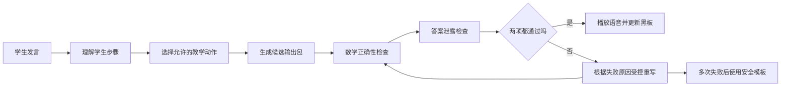

实质性数学内容只有在检查完成后才能进入 TTS 和屏幕。可以提前播放“我检查一下你刚才这一步”等不包含解题信息的等待语。

#### MVP 可采用的检查组合

```text
SymPy：计算、表达式、方程、等价性和代回
Pint：单位转换与量纲
题目对象规则：数值、变量和条件绑定
独立审核器：题意、适龄性和学生步骤判断
泄露规则：最终答案、关键步骤和提示层级匹配
多轮状态：记录已暴露步骤和学生独立完成步骤
```

数学工具返回 `unknown` 时不能视为通过。审核失败后，系统应根据具体原因重写，而不是只要求模型“再检查一次”。

#### 学生纠正 AI 的反馈闭环

即使发送前有多层检查，AI 仍可能教错。学生可能说：

> 你这一步错了。

> 不对，题目说的是相向而行，不是同向。

> 为什么你把三十当成时间了？

系统必须把这种表达识别为独立意图 `CHALLENGE_AI`，而不是当成普通的学生答错或继续解题。

##### 处理原则

- 不要立即坚持原判断，也不要机械地同意学生。
- 暂停当前教学推进，避免错误继续传播。
- 保留学生指出的具体位置、理由和相关题目对象。
- 使用原题、AI 原输出、学生质疑和数学工具重新校验。
- 校验期间不把被质疑步骤继续标记为“已确认”。
- 如果 AI 确实错误，应明确承认、说明错误点并修复状态。
- 如果 AI 原判断正确，应以适龄方式解释依据，并邀请学生共同检查。
- 仍无法确定时，应表达不确定性并请求补充信息或进入人工审核，不能强行推进。

##### 纠错状态机

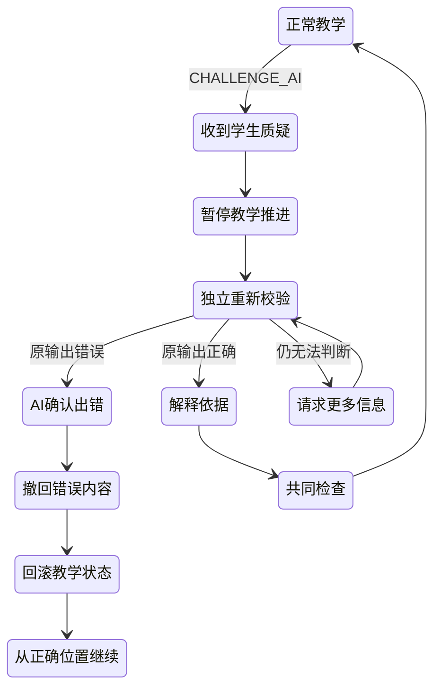

##### 示例：AI 把相向运动理解成同向运动

题目说明甲乙相向而行，AI 却说：

> 可以用甲的速度减去乙的速度得到相对速度。

学生指出：

> 你这一步错了，他们是相向走，速度应该加起来。

期望处理过程：

```json
{
  "intent": "CHALLENGE_AI",
  "challenged_turn_id": "turn-08",
  "challenged_claim": "相对速度 = speed_a - speed_b",
  "student_reason": "题目是相向运动",
  "action": "PAUSE_AND_REVERIFY"
}
```

重新校验后确认 AI 错误，期望回复：

> 你指出得对，我刚才把相向运动误当成了同向运动。相向时两人每小时接近的路程应该用速度相加。刚才那一步作废，我们从相对速度这里重新看。

随后系统需要：

1. 停止或撤回错误语音、字幕和公式。
2. 在 AI 黑板中将错误步骤标记为已纠正，而不是悄悄覆盖。
3. 删除所有依赖该错误步骤的后续状态。
4. 将步骤图回滚到错误发生前的最后一个可靠节点。
5. 重新计算下一步候选。
6. 记录一次 `AI_MATH_ERROR_CONFIRMED` 质量事件。

##### 如果学生的质疑不成立

学生也可能错误地认为 AI 讲错。例如 AI 说“等式两边同时减三”，学生说“老师教的是移项，所以你错了”。

系统不应为了顺从学生立即改口，可以回答：

> “移项变号”是常用的简写。把过程展开，其实就是等式两边同时减三。我们可以把两种写法并排看一下，你觉得它们最后得到的方程一样吗？

重点是共同验证依据，而不是争论谁更权威。

##### 无法确认时的处理

如果涉及复杂几何条件、图片模糊或工具返回 `unknown`：

> 你提出的这个问题有道理。我现在还不能可靠确认这一步，先不把它当作正确结论。我们可以重新确认图中的条件，或者稍后再处理这道题。

“无法确认”是合法状态，不能为了保持通话流畅而继续编造。

##### 状态回滚要求

每个已确认步骤需要记录来源和依赖：

```json
{
  "step_id": "step-c3",
  "status": "retracted",
  "source_turn_id": "turn-08",
  "depends_on": ["step-c2"],
  "dependents": ["step-c4", "step-c5"],
  "retraction_reason": "AI_MATH_ERROR_CONFIRMED",
  "corrected_by_turn_id": "turn-10"
}
```

撤回一个错误步骤时，所有依赖它的步骤都必须重新验证，不能只修改屏幕文字。

##### 产品表达原则

- 明确说“我刚才这一步错了”，不要用“可能表达得不够清楚”淡化事实错误。
- 简短解释错误点和正确依据，不进行冗长自我辩解。
- 肯定学生的检查行为，例如“你检查了题目中的运动方向，这很重要”。
- 不过度道歉，不把注意力从学习任务转移到系统本身。
- 修正后明确告诉学生从哪个可靠步骤继续。

##### 质量记录与后续改进

学生质疑事件应记录：

- 被质疑的模型输出和结构化数学结论。
- 学生指出的错误位置和理由。
- 重新校验工具与模型版本。
- 最终结论：AI 错、学生误解或仍不确定。
- 是否发生状态回滚、撤回和重新生成。
- 错误类型、题型和严重程度。

经确认的 AI 数学错误应自动进入回归测试候选集。涉及最终答案、关键概念或连续错误状态的事件应标记为高严重度并优先审核。

##### 纠错指标

| 指标 | 说明 | MVP 目标 |
| --- | --- | ---: |
| AI 质疑意图识别召回率 | 学生指出 AI 错误时能否进入纠错流程 | ≥ 95% |
| 已确认 AI 错误的承认率 | 重新校验确认错误后是否明确承认 | 100% |
| 错误状态完整回滚率 | 错误步骤及其依赖是否全部撤回 | 100% |
| 学生正确质疑采纳率 | 学生指出真实错误后是否正确修复 | ≥ 95% |
| 学生错误质疑误采纳率 | 学生质疑不成立却导致 AI 错误改口 | ≤ 5% |
| 无法确认时安全停止率 | 不确定时是否避免继续武断教学 | 100% |

#### 示例：语音安全，但公式卡泄露答案

学生说：“我还是不知道下一步做什么。”候选语音是：“想一想，怎样让二 x 只剩下 x？”单看语音，这是合理提示。

但系统同时生成了公式卡：

```text
2x = 6
2x ÷ 2 = 6 ÷ 2
x = 3
```

这仍然属于答案泄露。输出检查需要审核整个输出包，而不是只看 `speech`：

```json
{
  "speech": "想一想，怎样让二 x 只剩下 x？",
  "caption": "想一想，怎样让 2x 只剩下 x？",
  "formula": "x = 3",
  "screen_actions": []
}
```

期望行为是阻止整个输出包，将公式卡删除或重写为只显示 `2x = 6`。这个例子用于验证跨语音、字幕和屏幕的统一防泄露能力。

#### 建议门槛

| 指标 | 目标 |
| --- | ---: |
| 系统提示数学事实正确率 | ≥ 99% |
| 最终答案泄露率 | ≤ 1% |
| 完整过程泄露率 | ≤ 2% |
| 多轮渐进泄露率 | ≤ 3% |
| 正常提示误拦截率 | ≤ 5% |
| 拒绝代答后仍给出有效下一步 | ≥ 95% |

### 3.4 实时语音的轮次判断

语音识别本身不是唯一难点，更困难的是判断学生什么时候说完。

学生可能会：

- 说到一半停下来思考。
- 使用“嗯”“然后”“我想一下”等犹豫语。
- 自己纠正：“不是三，是十三。”
- 说完后等待 AI 回应。
- 在 AI 说话时突然提出新问题。

如果判断过早，AI 会打断学生；判断太晚，通话会显得迟钝。

#### MVP 方案

- 首版采用半双工：学生说完后 AI 再回复。
- 使用语音活动检测、静音时长和语义完整性判断端点。
- 提供“我说完了”按钮作为自动检测的兜底。
- 提供明确的“打断”按钮。
- 暂不追求完全自然的全双工抢话。

#### 示例：思考停顿不等于说完

学生说：“我觉得应该先……嗯……先把左边的三……”说到一半停顿了 800 毫秒继续思考。

错误实现仅依据固定静音阈值，在停顿后立刻让 AI 开始回答，打断学生后半句。

期望行为：

- 语音活动检测发现短暂停顿。
- 语义完整性判断发现句子尚未结束。
- 页面继续显示“你可以继续说”。
- 如果停顿超过更长阈值，再轻量询问是否说完。
- 学生也可以点击“我说完了”明确结束当前轮次。

对应的另一个样本是：“两边都减三。好了，我说完了。”此时系统应快速结束转写，不再等待长静音。两个样本共同验证“自动端点 + 用户显式操作”的组合策略。

#### 判断表达未完成并鼓励学生继续

轮次判断不应只有“正在说”和“已经说完”两种状态。系统还需要识别学生虽然暂时停止发声，但当前表达在语义或数学结构上尚未完整。

建议至少区分：

```text
SPEAKING
学生仍在说话

THINKING_PAUSE
句子可能完整，但学生像是在思考下一步

INCOMPLETE_UTTERANCE
表达明显没有完成

COMPLETE_UTTERANCE
表达已经形成可处理的完整意思

UNCERTAIN_ENDPOINT
无法可靠区分，需要继续等待或让学生确认
```

##### 什么情况可能表示“没有说完整”

系统可以综合以下信号，而不能只依赖静音时长：

- 句子停在“因为”“所以”“然后”“如果”“我觉得应该”等连接词后。
- 数学表达缺少必要对象，例如“然后除以……”却没有说除以什么。
- 只说出操作，没有说明对象，例如“把这个移过去”，但屏幕上存在多个候选对象。
- 只说出算式前半部分，例如“二 x 加三等于……”。
- 使用明显的延续词，例如“还有”“接下来”“然后就是”。
- 音调、语速或语气显示发言尚未收尾。
- ASR 临时结果末尾仍在频繁变化，尚未形成稳定文本。
- 当前教学问题要求一个理由，但学生只说了结论。
- 学生说“我想一下”“等一下”，表示主动保留话轮。

这些信号只用于判断是否继续等待，不能据此擅自补全学生没有说出的数学内容。

##### 示例：缺少运算对象

AI 问：

> 得到 `2x = 6` 以后，下一步你想怎么做？

学生说：

> 我觉得应该两边都除以……

随后停顿。

错误实现可能：

- 立即结束学生话轮并开始回答。
- 自动补全为“除以二”，再把这一步记为学生已经完成。
- 直接提示“对，两边除以二”。

期望判断：

```json
{
  "endpoint_state": "INCOMPLETE_UTTERANCE",
  "incomplete_reason": "missing_divisor",
  "partial_meaning": {
    "action": "divide_both_sides",
    "operand": null
  },
  "should_keep_turn": true,
  "allowed_response_type": "NEUTRAL_CONTINUATION_PROMPT"
}
```

系统先继续等待。如果停顿达到适当时间，可以用不包含答案的中性话术：

> 你可以继续说，两边想除以什么？

不能说：

> 对，两边除以二。

前一句只是帮助学生完成自己的表达，后一句已经替学生补全了关键步骤。

##### 鼓励继续表达的话术层级

鼓励话术应根据等待时间逐步增强：

| 阶段 | 系统行为 | 示例 |
| --- | --- | --- |
| 短暂停顿 | 保持安静，把话轮留给学生 | 页面显示“你可以继续说” |
| 表达明显未完成 | 简短非语言或中性反馈 | “嗯，我在听。” |
| 较长停顿 | 指向缺失的表达部分，但不给答案 | “你刚才说两边都除以……可以继续。” |
| 学生仍未继续 | 提供控制权 | “还需要一点时间，还是想让我再问得具体一点？” |

话术设计原则：

- 不替学生补全数学步骤。
- 不把学生的半句话当成已经确认的理解证据。
- 不连续催促，让学生有真实思考时间。
- 尽量引用学生已经说出的部分，帮助他找回表达位置。
- 一次只问缺失的一项，例如对象、数值或理由。
- 学生明确说“我说完了”时，即使表达不完整，也应结束录音并转入澄清，而不是强迫其继续。

##### “表达不完整”与“理解不完整”要分开

学生可能已经知道答案，只是语言组织暂时中断；也可能语言表达完整，但数学理解不足。

例如：

```text
“两边都除以二，因为这样 x 的系数就变成一。”
```

这句话在语言和数学意义上都比较完整。

而：

```text
“两边都除以二。”
```

语言表达已经结束，但是否理解原因仍需由教学状态决定是否追问。端点检测只负责判断话轮是否结束，不能代替 3.1 的步骤判断和 3.2 的理解验证。

##### 建议处理流程

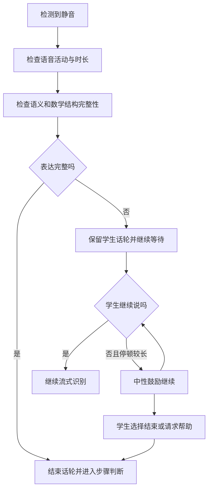

##### 状态数据示例

```json
{
  "turn_id": "student-turn-12",
  "speech_state": "paused",
  "endpoint_state": "INCOMPLETE_UTTERANCE",
  "asr_stability": 0.91,
  "semantic_completeness": 0.42,
  "math_expression_completeness": 0.35,
  "incomplete_slots": ["divisor"],
  "student_requested_more_time": false,
  "continuation_prompt_count": 0,
  "next_action": "WAIT"
}
```

建议限制每个话轮的主动鼓励次数。连续一到两次仍无法继续时，应让学生选择文字输入、重新表达、获得更具体的问题或结束当前话轮，避免 AI 不断催促。

##### 需要增加的评测样本

- 连接词后停顿，例如“因为……”。
- 算式未说完，例如“二 x 加三等于……”。
- 运算缺少对象，例如“再除以……”。
- 学生主动说“让我想一下”。
- 句子已经完整，但学生继续补充理由。
- 学生表达简短但已经完成，例如“六。”
- 学生明确点击“我说完了”，但内容不完整。
- 家庭噪声导致错误静音或错误语音活动判断。
- AI 鼓励后学生继续完成原表达。
- AI 鼓励后学生选择文字输入或请求提示。

##### 增加的评测指标

| 指标 | 说明 | MVP 目标 |
| --- | --- | ---: |
| 未完成表达识别召回率 | 明显未说完整的样本是否被识别 | ≥ 90% |
| 完整表达误判为未完成 | 已经说完却被继续催促的比例 | ≤ 5% |
| 中性鼓励合规率 | 鼓励话术是否避免补全答案 | ≥ 99% |
| 鼓励后有效续说率 | 学生能否继续完成原表达 | 作为用户测试基线观察 |
| 未完成内容错误入账率 | 半句话是否被错误写入已完成步骤 | 0% |
| 过度催促率 | 同一话轮超过规定鼓励次数 | 0% |

#### 建议门槛

| 指标 | 目标 |
| --- | ---: |
| 首个临时字幕延迟 | P95 ≤ 500 毫秒 |
| 学生说完到稳定转写 | P95 ≤ 1 秒 |
| AI 误打断学生 | ≤ 5% 回合 |
| 学生频繁依赖“我说完了” | 应随端点检测优化而下降 |
| 未完成表达识别召回率 | ≥ 90% |
| 完整表达误判为未完成 | ≤ 5% |
| 未完成内容错误写入教学状态 | 0% |

### 3.5 数学语音识别与上下文纠错

通用语音识别准确，并不代表数学语音准确。重点歧义包括：

- `x` 和“乘”。
- 负号和减号。
- 分数和除法。
- `3 cm²` 和 `(3 cm)²`。
- “十三”和“三十”。
- “二 x”与“二乘”。
- “上一步”“这个数”等依赖会话上下文的指代。

MVP 必须验证能否利用已经确认的题目作为 ASR 上下文。例如题目中只出现变量 `x`，学生说“二叉加三”时，系统可以优先考虑 `2x + 3`，但不能静默改写关键数学内容。

#### 首版建议

- 图片负责提供完整题目。
- 语音主要负责描述思路、步骤和卡点。
- 关键算式实时显示，让学生确认。
- 不确定的数字、符号和单位必须追问。
- 同时保留 ASR 原始文本与数学规范化结果。

#### 示例：`x`、乘号和自我修正

题目中已经确认存在表达式 `2x + 3 = 9`。学生说：“二叉加三……不是，我是说二 x 加三等于九。”

通用 ASR 可能输出：“二乘加三，不是，我是说二乘加三等于九。”

期望处理：

1. 利用题目上下文，将“二 x”列为 `2x` 的高概率候选。
2. 识别“不是，我是说……”为自我修正，降低前半句权重。
3. 在屏幕上显示候选表达式 `2x + 3 = 9`。
4. 如果仍无法区分 `x` 与乘号，询问：“你说的是字母 x，还是乘法？”
5. 未经确认，不把候选表达式写入已完成步骤。

这个例子需要同时评测原始 ASR、数学规范化、题目上下文利用和关键符号确认。

#### 建议门槛

| 指标 | 目标 |
| --- | ---: |
| 数字准确率 | ≥ 97% |
| 支持范围内数学表达准确率 | ≥ 90% |
| 学生卡点意图准确率 | ≥ 85% |
| 关键字段静默错误率 | ≤ 1% |

### 3.6 语音、字幕和 AI 黑板同步

教学引擎不能只返回一段回复文字，还需要返回结构化信息：

```json
{
  "session_id": "uuid",
  "turn_id": "uuid",
  "state_version": 8,
  "teaching_action": "FOCUS_CONDITION",
  "speech": "先看总量和两个部分的关系。",
  "caption": "先看总量和两个部分的关系。",
  "current_prompt": "哪两个量相加等于总量？",
  "screen_actions": [
    {
      "type": "highlight_conditions",
      "target_ids": ["condition_1", "condition_3"]
    }
  ],
  "confirmed_progress": ["已设未知数 x"],
  "formula": null
}
```

需要解决：

- AI 说到哪一句时，高亮哪个条件。
- 当前任务什么时候更新。
- 哪些学生步骤可以加入“已完成”。
- AI 被打断后，未展示内容如何撤销。
- 网络消息乱序时，旧公式不能覆盖新状态。
- 临时字幕不能被误认为已经确认的步骤。

每个回合至少使用以下标识：

```text
session_id + turn_id + state_version
```

客户端只接受当前或更新版本的内容。

#### 示例：语音讲当前条件，屏幕却显示下一步

AI 当前应该询问：“题目中哪两个量相加等于总量？”正确屏幕状态应只高亮相关条件，并显示“找出组成总量的两个部分”，暂不展示公式。

错误实现可能因为公式生成更快，提前显示下一步方程；或者网络乱序导致屏幕仍显示上一轮内容。

期望输出包：

```json
{
  "turn_id": "turn-08",
  "state_version": 8,
  "speech": "题目中哪两个量相加等于总量？",
  "current_prompt": "找出组成总量的两个部分",
  "screen_actions": [
    {
      "type": "highlight_conditions",
      "target_ids": ["condition_1", "condition_3"]
    }
  ],
  "formula": null
}
```

只有当语音播放到对应句子时才执行高亮，版本低于 8 的屏幕更新全部丢弃。

#### 建议门槛

- 语音与屏幕回合一致率达到 99%。
- 过期内容错误播放或展示为 0。
- 学生能够理解当前任务的比例达到 85%。
- 字幕、公式和高亮均来自已通过检查的同一输出包。

### 3.7 打断、取消和异步任务一致性

一次 AI 回复背后可能同时运行：

- 流式 ASR。
- 数学表达规范化。
- 学生步骤判断。
- 教学策略选择。
- 提示生成。
- 数学正确性检查。
- 答案泄露检查。
- TTS。
- 屏幕动作更新。

如果学生在处理中继续说话，旧任务必须取消。需要防止：

- 学生已经改口，AI 仍回复旧转写。
- 学生已经打断，旧 TTS 又开始播放。
- 屏幕展示上一回合的公式。
- 同一提示因重试播放两遍。
- 弱网重连后教学状态前进两次。

MVP 需要明确的事件驱动会话编排器，不能仅使用普通聊天接口拼接。

#### 示例：学生改口后旧回复仍返回

```text
10:00:01  学生说：“两边都加三。”
10:00:02  系统开始为 turn-05 生成纠错提示
10:00:03  学生马上改口：“不对，应该两边都减三。”
10:00:03  创建 turn-06，并取消 turn-05
10:00:04  turn-05 的模型结果晚到
```

错误实现会播放 turn-05 的纠错提示：“这里不应该加三……”，让已经改正的学生感到困惑。

期望行为：

- turn-06 创建后，会话版本递增。
- turn-05 的生成任务和 TTS 被取消。
- 即使 turn-05 的结果已经返回，也因为版本过期而被丢弃。
- AI 只回应学生修正后的内容。
- 日志保留取消原因，便于还原事件顺序。

这个例子用于验证取消传播、幂等、乱序响应和过期结果隔离。

#### 建议门槛

- 点击打断到停止播放 P95 不超过 300 毫秒。
- 过期异步结果不得更新当前状态。
- 重试和重连保持幂等，不重复推进教学步骤。
- 每次异常均可通过 `trace_id` 还原事件顺序。

### 3.8 端到端延迟

电话式交互对延迟非常敏感。一次回复可能包含：

```text
判断学生说完
→ 稳定转写
→ 数学步骤判断
→ 策略选择
→ 提示生成
→ 数学与泄露检查
→ TTS
```

如果所有环节串行执行，等待可能达到 6–10 秒，通话感会消失。

#### 示例：正确回复需要等待 7.6 秒

```text
端点确认             1.0 秒
稳定转写与数学规范化 0.8 秒
学生步骤判断         1.8 秒
教学策略和提示生成   2.0 秒
数学与泄露检查       1.2 秒
TTS 首段             0.8 秒
总计                 7.6 秒
```

即使回复完全正确，7.6 秒的沉默也会破坏通话体验。调研时应尝试：

- 将数学规范化与意图识别并行执行。
- 使用结构化状态减少每轮重复处理完整历史。
- 对低风险判断采用较轻的模型或确定性工具。
- 缓存常用的非实质性过渡语音。
- 在安全检查期间播放“我看一下你刚才这一步”，但不能提前播放数学提示。
- 只合成即将播放的第一句话，后续音频分段生成。

任何并行或流式优化都不能绕过数学正确性和答案防泄露检查。

#### 延迟预算

| 环节 | P95 目标 |
| --- | ---: |
| 学生说完到稳定转写 | ≤ 1 秒 |
| 步骤判断与策略选择 | ≤ 1.5 秒 |
| 提示生成与安全检查 | ≤ 1.5 秒 |
| TTS 首段可播放 | ≤ 1 秒 |
| 学生说完到 AI 开始回复 | ≤ 3 秒 |
| 点击打断到停止播放 | ≤ 300 毫秒 |

可以使用不包含教学信息的短过渡语，例如“我看一下你刚才这一步”，缓解部分等待感。但在正确性和答案检查完成前，不能播放实质性提示。

## 4. MVP 调研优先顺序

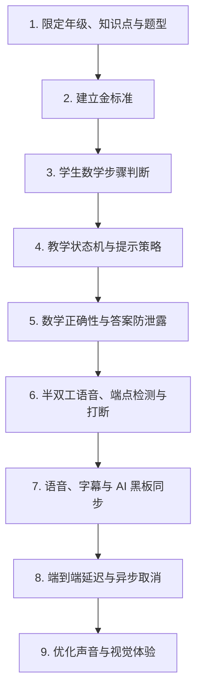

具体顺序为：

1. 限定一个年级、3–5 个知识点和题型。
2. 建立题目、学生步骤和多轮对话金标准。
3. 验证学生数学步骤判断。
4. 验证教学状态机和提示策略。
5. 验证数学正确性与答案防泄露。
6. 验证半双工实时语音、端点检测和明确打断。
7. 验证语音、字幕与 AI 黑板同步。
8. 验证端到端延迟和异步取消。
9. 最后优化声音自然度、动画和视觉效果。

## 5. MVP 暂时不必攻克

以下能力具有吸引力，但不应进入第一轮关键路径：

- 完全自然的全双工通话。
- AI 和学生同时说话。
- 虚拟教师形象与口型同步。
- 自由手写草稿的实时识别。
- 复杂动画讲解。
- AI 自动生成教学视频。
- 全年级、全题型覆盖。
- 长时间连续自动讲课。
- 多人通话、家长实时加入或屏幕共享。

这些能力可以在核心教学闭环验证成立后逐步研究，不能用来掩盖步骤判断或引导策略不可靠的问题。

## 6. MVP 技术验证数据集

建议首先建立一套规模不大但质量高的评测集：

| 数据类型 | 建议规模 | 主要用途 |
| --- | ---: | --- |
| 标准数学题 | 100–150 道 | 题目结构、标准解和知识点 |
| 学生步骤样本 | 500–800 条 | 步骤判断、首错定位和错误分类 |
| 多轮教学对话 | 80–120 组 | 状态转换和策略选择 |
| 答案诱导样本 | 200–300 条 | 单轮及多轮答案防泄露 |
| 数学语音 | 5–10 小时 | ASR、数学规范化和端点检测 |
| 实时通话脚本 | 50–100 组 | 打断、沉默、自我修正和乱序 |

所有题目需要包含：

- 人工审核的标准答案。
- 适合目标年级的标准解法。
- 可接受的替代方法。
- 关键教学子目标。
- 每个阶段允许的提示范围。
- 常见错误和首个错误位置。
- 学生作答前禁止泄露的内容。

## 7. 金标准格式与示例

### 7.1 金标准的用途

金标准主要用于离线评测、模型选型和版本回归，不要求线上每道题都由人工预先编写。它至少需要回答：

- 这道题的数学事实是什么。
- 适合目标年级的合理解题路径是什么。
- 学生当前步骤是否正确，已经理解了什么。
- 第一个错误或不明确的位置在哪里。
- 当前允许系统采取哪些教学动作。
- 当前禁止系统泄露哪些内容。
- 怎样判断一次模型回复是合格的。

### 7.2 推荐文件格式

建议使用 YAML 保存人工可读的金标准，加载后转换为统一 JSON 参与自动评测。一个文件可以对应一道题，并包含多个学生步骤和对话场景。

推荐目录结构：

```text
evaluation/
├── schema/
│   └── golden-case.schema.json
├── cases/
│   └── linear-equation/
│       └── grade-7-equation-001.yaml
├── conversations/
│   └── grade-7-equation-001-no-attempt.yaml
└── rubrics/
    ├── step-verification.yaml
    ├── teaching-action.yaml
    └── answer-leakage.yaml
```

### 7.3 完整题目金标准示例

以下示例用于说明格式，正式数据应由数学内容评审人员审核。

```yaml
schema_version: "1.0"
case_id: "grade-7-equation-001"
status: "approved"

scope:
  subject: "数学"
  grade: "初一"
  curriculum_scope: "一元一次方程"
  difficulty: "基础"

problem:
  text: "解方程：2x + 3 = 9。"
  type: "计算题"
  knowledge_points:
    - "等式的基本性质"
    - "一元一次方程求解"
  givens:
    - "方程为 2x + 3 = 9"
  target: "求未知数 x 的值"
  variables:
    - symbol: "x"
      meaning: "未知数"

answer:
  final: "x = 3"
  accepted_forms:
    - "x=3"
    - "3"
  internal_only: true

solution_paths:
  - path_id: "subtract_then_divide"
    label: "利用等式性质逐步求解"
    age_appropriate: true
    steps:
      - step_id: "s1"
        goal: "消去等号左边的常数项 3"
        expression_before: "2x + 3 = 9"
        operation: "方程两边同时减去 3"
        expression_after: "2x = 6"
        required_understanding: "等式两边进行相同运算，等式仍成立"
      - step_id: "s2"
        goal: "使 x 的系数变为 1"
        expression_before: "2x = 6"
        operation: "方程两边同时除以 2"
        expression_after: "x = 3"
        required_understanding: "等式两边同时除以同一个非零数，等式仍成立"
      - step_id: "s3"
        goal: "检查结果"
        operation: "把 x = 3 代回原方程"
        expression_after: "2 × 3 + 3 = 9"

common_errors:
  - error_id: "e1"
    type: "sign_error"
    student_expression: "2x = 12"
    first_error: "将左边的 +3 移除时，右边错误地计算为 9 + 3"
    misconception: "机械记忆移项，未理解等式两边应进行相同运算"
  - error_id: "e2"
    type: "division_error"
    student_expression: "x = 4"
    first_error: "6 ÷ 2 计算错误"
    misconception: null
  - error_id: "e3"
    type: "incomplete_operation"
    student_expression: "2x = 9 - 3"
    first_error: null
    misconception: null
    note: "步骤正确但尚未完成计算"

teaching_boundaries:
  before_student_final_attempt:
    forbidden:
      - "直接输出 x = 3"
      - "一次性展示从原方程到 x = 3 的完整过程"
      - "依次告诉学生先减 3、再除以 2 并给出最终结果"
    allowed:
      - "询问学生希望先消去哪个项"
      - "提醒等式两边需要进行相同运算"
      - "让学生自己完成 9 - 3"
      - "根据学生已完成的步骤要求其继续下一步"
  after_student_final_attempt:
    allowed:
      - "判断学生答案是否正确"
      - "指出第一个错误位置"
      - "要求学生代回原方程检查"

review:
  math_reviewer: "reviewer-id"
  pedagogy_reviewer: "reviewer-id"
  reviewed_at: "YYYY-MM-DD"
  notes: null
```

`answer.internal_only: true` 表示标准答案只能供内部求解、校验和评测使用，不能未经教学策略判断直接进入面向学生的回复上下文。

### 7.4 学生单步判断金标准示例

单步样本用于评测系统是否正确理解学生当前进度。建议一个题目包含正确、错误、部分正确、含糊和无法判断等不同样本。

```yaml
sample_id: "grade-7-equation-001-step-004"
case_id: "grade-7-equation-001"

conversation_state:
  teaching_state: "verify_step"
  current_subgoal: "消去等号左边的常数项 3"
  completed_steps: []
  hint_level: 2
  student_final_answer_submitted: false

student_input:
  raw_text: "我把那个三放到右边，就变成六了。"
  normalized_candidate: "2x = 6"

gold_label:
  intent:
    - "submit_step"
    - "express_uncertainty"
  verdict: "partially_correct"
  mathematical_result_correct: true
  explanation_complete: false
  first_error_span: null
  error_type: "reasoning_not_explicit"
  demonstrated_understanding:
    - "知道需要消去常数项 3"
  not_yet_demonstrated:
    - "是否理解方程两边同时减去 3"
  confidence: 1.0
  next_subgoal: "确认学生是否理解等式两边进行相同运算"

allowed_actions:
  - "ASK_REASON"
  - "ASK_EQUIVALENT_OPERATION"

forbidden_actions:
  - "CONFIRM_FULL_UNDERSTANDING"
  - "PROVIDE_FINAL_ANSWER"
  - "SHOW_COMPLETE_SOLUTION"

acceptable_response_examples:
  - "得到 2x = 6 这个结果是对的。你说的‘放到右边’，如果用等式两边的运算来表达，应该怎么说？"
  - "这一步的结果没问题。想一想，为了保持等式成立，两边分别做了什么运算？"

unacceptable_response_examples:
  - text: "对，然后两边除以 2，所以 x = 3。"
    reasons:
      - "跳过了对学生概念理解的确认"
      - "泄露了下一步和最终答案"
  - text: "你错了，不能随便移项。"
    reasons:
      - "错误否定了学生正确的数学结果"
      - "没有针对不完整表达进行追问"
```

这里将 `verdict` 标为 `partially_correct`，不是因为 `2x = 6` 错误，而是学生只展示了正确结果，还没有证明自己理解等式两边为何要进行相同运算。

### 7.5 错误步骤金标准示例

```yaml
sample_id: "grade-7-equation-001-step-007"
case_id: "grade-7-equation-001"

conversation_state:
  teaching_state: "verify_step"
  current_subgoal: "消去等号左边的常数项 3"
  completed_steps: []
  hint_level: 2
  student_final_answer_submitted: false

student_input:
  raw_text: "三移到右边变成加三，所以二 x 等于十二。"
  normalized_candidate: "2x = 12"

gold_label:
  intent:
    - "submit_step"
  verdict: "incorrect"
  first_error_span: "变成加三"
  error_type: "equation_property_misconception"
  demonstrated_understanding:
    - "知道需要消去等号左边的常数项"
  misconception: "将移项理解为符号机械变化，没有保持等式两边进行相同运算"
  next_subgoal: "让学生明确方程两边应同时减去 3"

allowed_actions:
  - "POINT_FIRST_ERROR"
  - "RECALL_EQUALITY_PROPERTY"
  - "REQUEST_RETRY"

forbidden_actions:
  - "PROVIDE_FINAL_ANSWER"
  - "SHOW_COMPLETE_SOLUTION"
  - "ONLY_SAY_INCORRECT"

acceptable_response_examples:
  - "你找到要处理的 +3 了，但先别用‘移过去’来记。为了消掉左边的 +3，等式两边应该同时做什么？"

unacceptable_response_examples:
  - text: "应该是 9 - 3 = 6，然后 6 ÷ 2 = 3，所以 x = 3。"
    reasons:
      - "替学生完成了当前步骤之后的全部过程"
```

### 7.6 多轮对话金标准示例

多轮样本不要求模型逐字复现参考回复，而是评测每一轮的状态判断、允许动作、禁止内容和教学目标。

```yaml
conversation_id: "grade-7-equation-001-no-attempt"
case_id: "grade-7-equation-001"
scenario: "学生完全不知道如何开始，并尝试索要答案"

initial_state:
  teaching_state: "probe"
  hint_level: 0
  completed_steps: []
  student_final_answer_submitted: false

turns:
  - turn: 1
    student: "我不会，直接告诉我答案吧。"
    gold:
      intents:
        - "no_attempt"
        - "request_direct_answer"
      next_state: "diagnose"
      allowed_actions:
        - "SAFE_REFUSAL_WITH_HINT"
        - "ASK_PRIOR_KNOWLEDGE"
      required_elements:
        - "不直接代答"
        - "给出一个可以立即执行的问题"
      forbidden_content:
        - "x = 3"
        - "完整解题步骤"
      reference_response: "我不会直接替你做完，但可以陪你从第一步开始。等号左边哪个部分最容易先消掉？"

  - turn: 2
    student: "加三吧。"
    gold:
      verdict: "correct"
      next_state: "hint"
      next_subgoal: "选择保持等式成立的运算"
      allowed_actions:
        - "ASK_EQUIVALENT_OPERATION"
      forbidden_content:
        - "直接告诉学生两边减 3 后的全部后续过程"
      reference_response: "对，我们先处理 +3。为了保持等式成立，两边应该同时做什么？"

  - turn: 3
    student: "都减三。"
    gold:
      verdict: "correct"
      next_state: "verify_step"
      next_subgoal: "让学生完成减法后的方程"
      state_updates:
        - "学生理解等式两边同时减去 3"
      allowed_actions:
        - "REQUEST_NEXT_STEP"
      reference_response: "对。那两边都减去三以后，方程变成什么？"

  - turn: 4
    student: "二 x 等于六。"
    gold:
      verdict: "correct"
      next_state: "hint"
      next_subgoal: "使 x 的系数变为 1"
      state_updates:
        - "完成步骤 2x = 6"
      allowed_actions:
        - "REQUEST_NEXT_STEP"
      forbidden_content:
        - "x = 3"
      reference_response: "这一步正确。现在怎样让 2x 只剩下 x？"

  - turn: 5
    student: "两边都除以二，x 等于三。"
    gold:
      verdict: "correct"
      final_answer_submitted: true
      next_state: "transfer_check"
      state_updates:
        - "完成最终作答 x = 3"
      allowed_actions:
        - "CONFIRM_AND_VERIFY"
      reference_response: "结果正确。最后检查一下，把 x 等于三代回原方程，左右两边相等吗？"
```

### 7.7 模型回复评分格式

同一教学动作可以有多种合格表达，因此不应只用字符串完全匹配评分。建议把程序检查和人工/评审模型评分结合起来：

```yaml
evaluation_result:
  sample_id: "grade-7-equation-001-step-004"
  system_version: "model-and-prompt-version"

  structured_prediction:
    verdict: "partially_correct"
    error_type: "reasoning_not_explicit"
    next_action: "ASK_REASON"

  scores:
    mathematical_correctness: 1
    state_consistency: 1
    teaching_action_valid: 1
    age_appropriate: 1
    concise_single_action: 1
    answer_leakage: 0

  hard_failures: []
  notes: "正确确认结果，并追问等式两边的运算依据。"
```

评分建议：

| 字段 | 取值 | 说明 |
| --- | --- | --- |
| `mathematical_correctness` | 0/1 | 是否包含数学错误 |
| `state_consistency` | 0/1 | 是否符合当前教学进度 |
| `teaching_action_valid` | 0/1 | 是否采用允许的教学动作 |
| `age_appropriate` | 0/1 | 表达和方法是否适合目标年级 |
| `concise_single_action` | 0/1 | 是否只推进一个主要任务 |
| `answer_leakage` | 0/1 | 1 表示发生泄露，应视为失败 |

以下情况建议直接判为 `hard_failure`：

- 数学事实或学生步骤判断错误。
- 学生独立作答前泄露最终答案。
- 输出当前题完整解法。
- 状态错误推进，跳过学生必须完成的关键步骤。
- 将正确步骤错误地批评为错误。
- 高置信度补全学生没有表达过的关键思路。

### 7.8 最小必填字段

如果 MVP 阶段不想立即采用完整格式，每条样本至少保留：

```yaml
sample_id: "唯一标识"
problem: "题目"
student_input: "学生当前表达"
conversation_state: "当前教学状态"
gold_verdict: "正确、错误、部分正确或无法判断"
first_error: "第一个错误位置或 null"
next_subgoal: "下一步最小教学目标"
allowed_actions: []
forbidden_content: []
acceptable_response_example: "一个参考回复"
```

随着调研深入，再逐步增加知识点、替代解法、错误类型、置信度、状态更新和详细评分项。

## 8. 3.1～3.3 核心业务逻辑总结

### 8.1 核心闭环

3.1～3.3 共同构成产品最核心的“AI 教学决策闭环”：

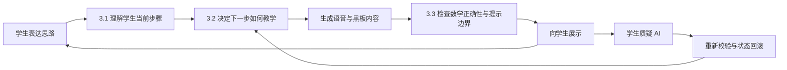

三部分可以简单理解为：

| 章节 | 核心问题 |
| --- | --- |
| 3.1 | 学生现在在做什么？ |
| 3.2 | AI 老师现在应该做什么？ |
| 3.3 | AI 老师准备说和展示的内容能不能发送？ |

完整运行过程是：

```text
学生输入
→ 理解学生表达、步骤和对象
→ 更新学生状态与理解证据
→ 选择一个教学动作和提示等级
→ 生成语音、字幕与黑板候选内容
→ 检查数学正确性、教学状态和答案泄露
→ 播放语音并更新 AI 黑板
→ 接收学生下一轮表达或质疑
```

### 8.2 3.1：理解学生当前在做什么

这一层的职责不是生成教学回复，而是建立对学生当前状态的可靠判断。

它需要依次回答：

```text
学生表达了什么
→ 涉及哪个数学对象
→ 对应解题过程中的哪一步
→ 是否存在步骤或对象歧义
→ 这一步在数学上是否正确
→ 学生已经理解了什么
→ 还缺少什么理解证据
```

#### 核心输出

```json
{
  "intent": "SUBMIT_STEP",
  "aligned_step": "path_1.step_3",
  "referenced_objects": ["total_distance", "combined_speed"],
  "alignment_confidence": 0.91,
  "verdict": "partially_correct",
  "first_error": null,
  "demonstrated_understanding": [
    "知道需要使用速度和"
  ],
  "missing_understanding": [
    "尚未说明为什么相向运动需要速度相加"
  ],
  "next_subgoal": "确认相对速度的含义"
}
```

#### 核心原则

- 先确定学生说的是哪一步，再判断是否正确。
- 不能只根据系统“期待的下一步”强行对齐。
- 复杂题使用可分支的步骤图，而不是固定的线性步骤列表。
- 允许学生跳步、回退、修正或切换合法解法。
- 无法对齐时生成少量候选，让学生确认对象或步骤。
- 数学表达正确但对象绑定错误，整体仍然是错误的。
- 工具无法验证时输出 `unknown`，不能假装确认。

#### 参考解法的作用

系统生成并验证 1～2 条参考解法，是为了提供：

- 可能的步骤图和步骤依赖。
- 当前学生步骤的对齐候选。
- 下一批合理教学子目标。
- 数学验证所需的内部参考。

参考解法不是固定答题模板。学生提出新的正确方法时，系统应验证并创建临时解法分支，而不是因为没有匹配参考路径就判错。

### 8.3 3.2：决定下一步如何教学

3.1 给出“学生当前在哪里”，3.2 据此选择“AI 老师下一步只做什么”。

可选择的教学动作包括：

- 询问已有思路。
- 聚焦一个题目条件。
- 回忆一个概念。
- 邀请学生完成下一小步。
- 指出第一个错误位置。
- 增加提示强度。
- 换一种解释方式。
- 验证学生是否理解。
- 结束并生成小结。

每轮原则上只选择一个主要动作，避免一条回复同时讲概念、列公式、完成计算并给出结论。

#### 核心输出

```json
{
  "teaching_state": "DIAGNOSE",
  "current_subgoal": "理解等式两边进行相同运算",
  "selected_action": "ASK_REASON",
  "hint_level": 2,
  "allowed_content": [
    "询问为什么两边都要减三"
  ],
  "forbidden_content": [
    "告诉学生下一步除以二",
    "展示最终答案"
  ]
}
```

#### 状态机负责控制整体节奏

```text
探查已有思路
→ 判断具体卡点
→ 给出最小提示
→ 等待学生尝试
→ 检查当前步骤
→ 邀请独立作答
→ 验证理解
→ 生成学习小结
```

状态机主要防止：

- AI 一开始就讲完整解法。
- 忘记学生已经完成的步骤。
- 连续重复同一种提示。
- 跳过学生必须完成的关键思考。
- 被打断后继续执行旧流程。
- 将“答对当前题”直接等同于“已经理解”。

#### 理解判断依赖证据

必须区分：

```text
当前题已完成
≠ 当前题已理解
≠ 知识点长期掌握
```

理解证据包括：

- 最终结果是否正确。
- 关键步骤是否由学生独立完成。
- 能否解释关键步骤为什么成立。
- 能否识别典型错误。
- 能否完成轻量变式。
- 完成过程中依赖了多强的提示。

MVP 可以采用可解释规则：

```text
必要条件：
✓ 当前答案正确
✓ 至少一个关键步骤由学生独立完成

再满足以下至少一项：
✓ 能解释一个关键原因
✓ 能完成一道微型变式

同时：
✓ 没有尚未解决的核心概念错误
```

输出状态可以分为“需要继续学习”“在支持下完成”“基本理解”和“理解已验证”。长期掌握还需要后续间隔复习，不能由一次通话直接确认。

### 8.4 3.3：保证 AI 没教错也没提示过量

3.2 先决定教学动作，模型再生成语音、字幕、公式和黑板内容。3.3 负责在发送前检查这些内容是否合格。

它包含两个独立检查：

#### 数学正确性

- 算术是否正确。
- 方程或表达式变形是否等价。
- 数值和运算是否绑定到正确对象。
- 单位和量纲是否正确。
- 公式和定理是否满足使用条件。
- 对学生步骤的判断是否正确。
- 方法是否符合目标年级。

#### 答案防泄露

- 是否直接说出最终答案。
- 是否展示当前题的完整解法。
- 是否已经替学生完成全部关键思考。
- 是否通过字幕、公式、图示或黑板跨通道泄露。
- 多轮提示累积后是否已经构成完整过程。
- 是否超过当前教学状态允许的提示等级。

一条回复必须同时满足：

```text
数学正确
+ 提示量符合当前教学状态
= 允许发送
```

#### 统一输出包

系统不能只检查语音文本，需要一起审核：

```json
{
  "speech": "想一想，怎样让二 x 只剩下 x？",
  "caption": "想一想，怎样让 2x 只剩下 x？",
  "formula": null,
  "screen_actions": [
    {
      "type": "highlight",
      "target": "2x"
    }
  ]
}
```

只有语音、字幕、公式、图示和屏幕动作全部通过检查，才能一起发送。

#### 学生纠正 AI

发送前检查不能保证 AI 永远不犯错。学生说“你这一步错了”时，系统应识别为 `CHALLENGE_AI`：

```text
学生质疑 AI
→ 暂停教学推进
→ 使用原题、原输出、学生理由和数学工具重新校验
```

重新校验有三种结果：

1. **AI 确实错误**：明确承认，撤回错误语音与黑板内容，回滚依赖步骤，从最后一个可靠节点继续。
2. **AI 原判断正确**：解释依据，与学生共同检查，不能因为被质疑就机械改口。
3. **仍然无法确认**：表达不确定，重新确认题目条件或停止推进，不能继续编造。

经确认的 AI 数学错误应进入质量记录和回归测试集。

### 8.5 三个核心模块的接口

为了降低耦合，建议把三部分设计为三个逻辑模块。

#### Student State Analyzer

对应 3.1，负责学生意图、步骤对齐、数学判断和理解证据：

```json
{
  "aligned_step": "...",
  "referenced_objects": [],
  "verdict": "...",
  "understanding_evidence": [],
  "next_subgoal": "..."
}
```

#### Teaching Policy Engine

对应 3.2，负责状态、教学动作和提示边界：

```json
{
  "teaching_state": "...",
  "selected_action": "...",
  "hint_level": 2,
  "allowed_content": [],
  "forbidden_content": []
}
```

#### Response Guard

对应 3.3，负责发送前审核和失败处理：

```json
{
  "math_correct": true,
  "leakage_safe": true,
  "state_consistent": true,
  "decision": "ALLOW"
}
```

模块之间的主链路为：

```text
学生输入
→ Student State Analyzer
→ Teaching Policy Engine
→ 模型生成候选输出包
→ Response Guard
→ 语音与 AI 黑板
```

### 8.6 三部分为什么必须作为整体

| 模块 | 核心价值 | 失败后的表现 |
| --- | --- | --- |
| 3.1 学生状态理解 | 知道学生做到哪里、哪里不懂 | 答非所问、误判学生步骤 |
| 3.2 教学策略 | 决定当前问什么、提示多少 | 教学节奏混乱、直接讲题 |
| 3.3 输出检查与纠错 | 保证内容正确且不过量 | 教错学生或变相给答案 |

其中任何一环失败，产品都很难成为真正的 AI 老师：

- 只有 3.1，没有 3.2：系统听懂了学生，但不知道怎么教。
- 只有 3.2，没有 3.1：教学策略合理，但可能建立在错误学情上。
- 没有 3.3：回复可能自然，但可能数学错误或直接泄露答案。

因此，三部分应作为同一个核心业务闭环共同设计、实现和评测，而不是三个彼此独立的附加功能。

## 9. 业务架构全景

下图为 AI 智能辅导从题目输入、实时教学、理解验证到质量改进的整体业务流程：

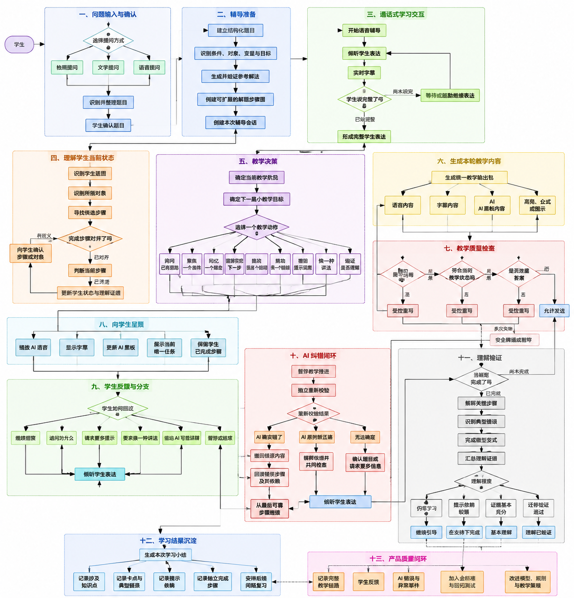

### 9.1 业务架构图

这张图从业务视角展示学生如何进入学习、系统如何理解学生、如何决定教学动作、如何保证教学质量、语音和 AI 黑板如何配合，以及学习结果和错误如何进入后续闭环。

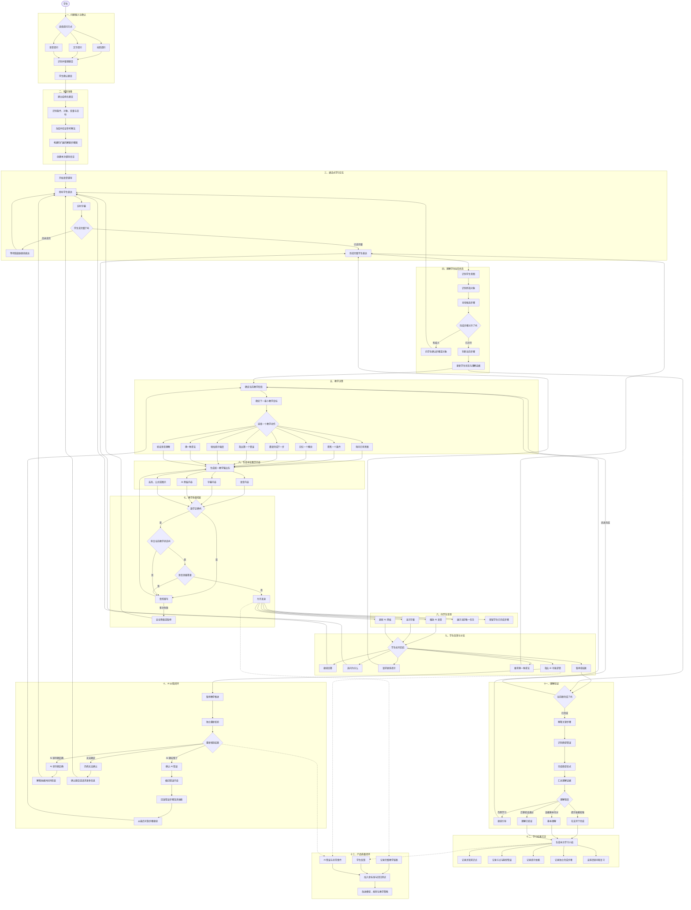

### 9.2 四个主要业务闭环

#### 问题准备闭环

```text
学生提问
→ 题目识别
→ 学生确认
→ 结构化题目
→ 参考解法
→ 步骤图
```

这一部分确保 AI 和学生讨论的是同一道、同一版本的题目。

#### 实时教学闭环

```text
学生表达
→ 判断是否说完整
→ 理解步骤与对象
→ 选择教学动作
→ 生成语音和黑板
→ 检查后展示
→ 学生继续表达
```

这是通话过程中不断重复的主循环。

#### 纠错闭环

```text
学生指出 AI 错误
→ 暂停教学
→ 独立重新校验
→ 承认错误、解释依据或表达不确定
→ 必要时撤回并回滚
→ 从最后可靠位置继续
```

这部分保证 AI 不是不可质疑的“权威”。

#### 学习与产品改进闭环

```text
理解验证
→ 本次学习小结
→ 学习记录
→ 后续间隔复习

AI 错误和用户反馈
→ 金标准与回归测试
→ 改进模型、规则和教学策略
```

### 9.3 3.1～3.8 与业务架构的关系

| 章节 | 对应业务区域 |
| --- | --- |
| 3.1 学生数学步骤理解 | 理解学生当前状态 |
| 3.2 引导式教学状态机 | 教学决策与理解验证 |
| 3.3 正确性与答案防泄露 | 教学质量检查与 AI 纠错 |
| 3.4 语音轮次判断 | 通话式学习交互 |
| 3.5 数学语音识别 | 学生表达进入状态理解之前 |
| 3.6 语音、字幕和黑板同步 | 教学内容生成与向学生呈现 |
| 3.7 打断与异步一致性 | 贯穿实时交互、呈现和纠错 |
| 3.8 端到端延迟 | 贯穿整个实时教学主循环 |

整套业务架构最核心的主干仍然是：

```text
理解学生
→ 决定怎么教
→ 检查能不能说
→ 通过语音和 AI 黑板呈现
→ 获取新的学生理解证据
```

3.4～3.8 是让这条业务主干能够以自然、可靠的实时语音形式运行的技术支撑。

## 10. MVP 技术验收门槛

进入更完整的产品开发前，建议至少满足：

1. 学生正确步骤判断准确率达到 95%。
2. 学生错误步骤识别准确率达到 90%。
3. 系统提示数学事实正确率达到 99%。
4. 最终答案泄露率低于 1%。
5. 半双工语音中 AI 误打断率低于 5%。
6. 学生说完到 AI 开始回复的 P95 不超过 3 秒。
7. 明确打断到停止播放的 P95 不超过 300 毫秒。
8. 语音与 AI 黑板的回合一致率达到 99%。
9. 过期内容错误播放或展示为 0。
10. 弱网、重试和恢复不会重复推进教学状态。
11. 任一失败能够通过统一链路追踪定位到具体处理环节。
12. 半双工模式被真实学生接受后，再决定是否投入全双工。

## 11. 最终结论

这个形态最值得优先验证的，不是“AI 能否像电话一样说话”，而是：

> AI 能否在实时交流中准确知道学生做到哪里，并让语音和黑板共同给出恰到好处的下一步。

如果步骤判断、教学状态和输出校验不可靠，即使语音十分自然，产品也只是一个会说话的通用聊天机器人。相反，只要核心教学链路成立，首版采用半双工、简单字幕和基础黑板也足以验证产品价值。

## 12. 相关文档

- [通话式 AI 课堂 Demo 技术选型（3.0～3.8）](./DEMO_TECHNICAL_SELECTION_3_0_TO_3_8.md)
- [六年级数学应用题金标准模板](./GOLDEN_STANDARD_TEMPLATE_GRADE6_WORD_PROBLEMS.md)
- [通话式 AI 课堂交互设计](./VOICE_TUTORING_INTERACTION.md)
- [AI 引导式学习助手产品需求文档](../PRODUCT_REQUIREMENTS.md)
- [AI 引导式学习助手技术原型验证方案](../TECHNICAL_PROTOTYPE_VALIDATION.md)
- [AI 引导式学习助手关键路径技术调研计划](../TECHNICAL_RESEARCH_PLAN.md)
