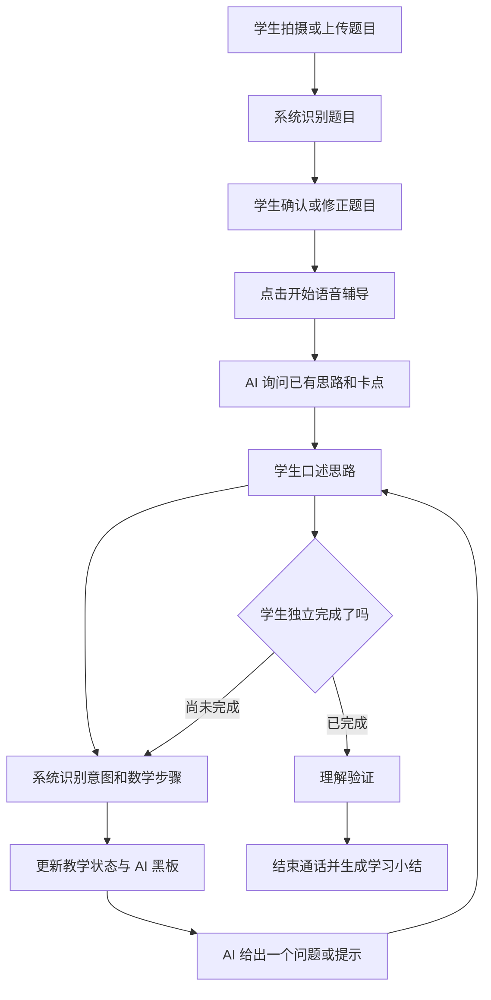

# 通话式 AI 课堂交互设计

## 1. 文档信息

| 项目 | 内容 |
| --- | --- |
| 文档版本 | V1.0 |
| 产品场景 | 家庭学习中的一对一数学辅导 |
| 交互概念 | 语音通话 + 实时字幕 + 动态 AI 黑板 |
| 目标用户 | 中小学生 |
| 核心目标 | 让学生像给老师打电话一样自然提问，同时获得接近面对面讲题的视觉辅助 |

## 2. 核心概念

学生拍照提交一道题，确认系统识别的题目无误后，点击类似拨号的“开始语音辅导”按钮，进入应用内的实时语音辅导。

辅导过程中，学生主要通过说话表达自己的思路、步骤和疑惑；AI 像一位一对一老师一样倾听、追问和提示。屏幕不是简单展示聊天记录，而是一块随教学过程持续变化的“AI 黑板”，用于展示原题、关键条件、当前任务、已完成步骤、必要公式和辅助图示。

产品形态介于语音通话与在线课堂之间：

- 比文字聊天更自然，学生更容易直接表达“我卡在哪里”。
- 比纯语音通话更准确，数学公式、数字和图形可以通过屏幕消除歧义。
- 比视频课堂更轻量，不依赖虚拟教师形象或长时间被动观看。
- 比传统搜题更强调思考过程，AI 根据学生的回答逐步引导，而不是输出答案。

## 3. 产品价值

### 3.1 降低学生表达负担

学生不必把完整思路整理成正式文字，可以像向家长或老师请教一样直接说：

- “我不知道从哪里开始。”
- “为什么这里要减三？”
- “我算到这里和答案不一样。”
- “这个公式是什么意思？”

### 3.2 同时利用听觉和视觉

语音适合解释、追问和鼓励，屏幕适合呈现精确的数学内容。两种通道各自承担擅长的任务，避免让学生仅靠听觉记住复杂条件和公式。

### 3.3 形成陪伴感

“正在听你说”“轮到你试试看”等通话状态，使学生感受到系统在持续关注他的思考，而不是提交问题后等待一篇自动生成的解答。

### 3.4 保留学生的主导权

系统每轮只推进一个教学动作，学生始终负责思考和完成下一步。这有助于避免产品退化成语音版搜题工具。

## 4. 设计原则

### 4.1 语音负责交流，屏幕负责思考支撑

| 语音负责 | 屏幕负责 |
| --- | --- |
| 询问学生已有思路 | 展示并定位原题 |
| 理解学生的疑惑 | 高亮当前讨论的条件 |
| 解释概念和“为什么” | 精确呈现数字、公式和单位 |
| 引导学生完成下一步 | 保留已经确认正确的步骤 |
| 根据回答调整讲法 | 展示当前只需思考的问题 |
| 给予适量反馈 | 必要时展示简图、数轴或相似例题 |

### 4.2 屏幕是一块 AI 黑板，不是聊天记录

页面不应持续堆积双方的完整对话。需要区分三类信息：

1. **实时字幕**：帮助学生确认刚才听到或说出的内容，短暂显示。
2. **当前任务**：本轮只需要学生思考或完成的一件事，持续突出。
3. **AI 黑板**：原题条件、公式、图示和已确认步骤，按教学进度结构化保留。

### 4.3 AI 一次只做一个教学动作

每轮语音回复原则上只执行一种主要动作：

- 问一个问题。
- 提醒一个条件。
- 指出一个错误位置。
- 解释一个概念。
- 展示一个必要公式。
- 给一个不同数字的相似例子。
- 邀请学生完成下一步。

首版建议将大部分 AI 语音控制在 10–20 秒。复杂解释需要主动停下来，确认学生是否理解。

### 4.4 不直接给答案

- 通话开始时先询问学生已经想到哪一步。
- 学生未提交自己的答案前，不播报或展示最终答案和完整解法。
- 学生索要答案时，AI 简短说明原则，并立即提供一个可执行的下一步。
- 屏幕公式、字幕、图示和语音全部受相同的答案防泄露规则约束。
- 学生提交答案后可以判断对错，但仍应围绕第一个错误位置引导修正。

### 4.5 精确内容优先显示

以下信息不能只通过语音传递，应同步显示：

- 数字、小数、分数和百分数。
- 正负号、运算符和括号范围。
- 方程、公式和单位。
- 几何条件、图形关系和坐标。
- 学生已经确认的中间步骤。
- 当前需要回答的问题。

### 4.6 不用虚拟形象制造课堂感

首版不需要虚拟教师、口型同步或复杂动画。课堂感主要来自：

- AI 能准确理解学生当前步骤。
- 回复延迟足够低。
- 语音自然且简洁。
- 屏幕内容跟随对话正确变化。
- AI 不抢话，也不会遗忘已经完成的步骤。

## 5. 用户流程



### 5.1 进入通话

1. 学生拍摄或上传一道题。
2. 系统展示原图和识别后的题目。
3. 学生修正数字、符号、单位等错误并确认。
4. 页面展示显著的“开始语音辅导”按钮。
5. 点击后检查麦克风权限和网络状态，进入通话页面。
6. AI 用一句简短开场询问学生已有思路。

### 5.2 通话循环

1. 页面显示“正在听你说”。
2. 学生口述自己的思路或疑问。
3. 屏幕显示临时字幕，数学表达不确定时提示确认。
4. 学生说完后，页面依次显示“正在理解这一步”和“正在检查提示”。
5. AI 通过数学步骤判断和教学策略选择本轮动作。
6. 语音播放提示，屏幕同步更新当前任务或 AI 黑板。
7. 页面重新进入“轮到你试试看”。
8. 循环直至学生独立完成并通过理解验证。

### 5.3 结束通话

- 学生可以随时主动结束或暂停。
- 正常结束前，AI 邀请学生口述最终结论和关键理由。
- 通过复述或一道微型变式题验证理解。
- 通话结束后展示知识点、学生自己的方法、主要卡点和复习建议。
- 保存结构化教学进度，学生稍后可以继续。

## 6. 页面结构

### 6.1 页面线框

```text
┌─────────────────────────────────┐
│  ‹ 返回   正在语音辅导 · 08:24  │
├─────────────────────────────────┤
│  原题（点击展开）               │
│  当前讨论的条件被高亮           │
├─────────────────────────────────┤
│  已完成                         │
│  ✓ 设未知数为 x                 │
│                                 │
│  现在请思考                     │
│  哪两个量相加等于总量？         │
│                                 │
│  [必要时显示公式、简图或数轴]   │
├─────────────────────────────────┤
│  AI 正在听你说……                │
│  实时字幕：我觉得应该先……       │
├─────────────────────────────────┤
│ [静音] [文字输入] [打断] [结束] │
└─────────────────────────────────┘
```

### 6.2 顶部通话区

- 返回或最小化通话。
- 当前通话状态。
- 通话时长。
- 网络异常或麦克风状态。
- 原题入口始终可访问。

### 6.3 AI 黑板区

AI 黑板由以下卡片按需组成：

| 卡片 | 内容 | 展示规则 |
| --- | --- | --- |
| 原题卡 | 图片和确认后的题目 | 默认折叠，随时展开 |
| 条件卡 | 当前相关的已知条件 | 只突出本轮相关条件 |
| 当前任务卡 | 本轮需要学生完成的事情 | 始终最醒目，只保留一个 |
| 已完成步骤 | 学生已独立完成且确认正确的步骤 | 按进度追加，可折叠 |
| 公式卡 | 当前必要公式及含义 | 不提前展示完整解法 |
| 图示卡 | 简图、数轴、坐标或局部标注 | 只有明显有助理解时展示 |
| 相似例题卡 | 不同数字的同类小例子 | 高提示层级才展示 |

### 6.4 实时字幕区

- 区分“你说”和“AI 老师说”。
- 临时识别内容使用较弱样式，稳定后再确认显示。
- 对数字、运算符和单位进行视觉强调。
- 数学表达存在歧义时暂停推进，提供候选让学生选择。
- 字幕只保留最近少量内容，完整记录可在通话结束后查看。

### 6.5 通话控制区

- **静音**：临时关闭麦克风。
- **文字输入**：环境不适合说话或公式难以口述时使用。
- **我说完了**：自动端点检测不确定时由学生主动结束本轮。
- **打断**：立即停止 AI 语音，让学生重新发言。
- **重复一遍**：重新播放上一条已通过检查的提示。
- **说慢一点**：调整后续语速。
- **结束**：结束或暂停本次辅导。

首版可以把低频操作收纳进“更多”，避免底部按钮过多。

## 7. 通话状态设计

学生必须随时知道系统正在做什么，建议使用以下明确状态：

| 状态 | 页面文案 | 主要视觉反馈 |
| --- | --- | --- |
| 连接中 | “正在连接 AI 老师……” | 轻量加载动画 |
| 正在听 | “正在听你说” | 麦克风与音量反馈 |
| 等待说完 | “你可以继续说” | 实时字幕保持更新 |
| 正在理解 | “正在理解你刚才这一步” | 当前字幕锁定 |
| 正在检查 | “正在检查提示是否准确” | 不展示未审核内容 |
| AI 正在讲 | “AI 老师正在讲” | 字幕与黑板内容同步高亮 |
| 轮到学生 | “轮到你试试看” | 当前任务卡突出 |
| 被打断 | “已停止，请继续说” | 立即停止播放和高亮 |
| 网络异常 | “网络不稳定，已保留当前进度” | 重连或切换文字入口 |

不建议只显示音频波形，因为波形不能说明系统是在倾听、理解、检查还是回复。

## 8. AI 黑板更新规则

### 8.1 可以保留的信息

- 已确认的题目条件。
- 学生亲自完成且判断正确的步骤。
- 当前所需的概念、公式或辅助图示。
- 当前唯一的教学子目标。
- 学生明确提出、尚未解决的疑问。

### 8.2 应当短暂显示的信息

- 实时语音临时转写。
- AI 的口语连接句和鼓励语。
- “正在理解”“正在检查”等系统状态。
- 已经被后续发言修正的内容。

### 8.3 不应展示的信息

- 学生尚未得出的最终答案。
- 从题目到答案的完整推导。
- 模型内部推理和审核过程。
- 与当前子目标无关的大段知识讲解。
- 已被打断或已经过期的提示、字幕和公式。

### 8.4 示例

学生说：“我觉得可以设速度为 x。”

如果步骤正确，AI 黑板更新为：

```text
已完成
✓ 设速度为 x

现在请思考
路程、速度和时间之间有什么关系？
```

如果 `x` 指代不清，系统先询问“你这里的 x 表示谁的速度？”，暂不把该步骤加入“已完成”。

## 9. 语音回复规则

### 9.1 回复结构

一次典型回复由三部分构成，但不要求每次全部出现：

1. 简短回应学生刚才的思路。
2. 指出当前最关键的一个位置。
3. 提出下一步问题或行动。

例如：

> 你先设未知数这个方向是对的。现在只看题目里的总路程，它由哪两段组成？

### 9.2 避免的表达

- 长时间连续讲解。
- 一次提出多个问题。
- 只说“很好”“不对”，不说明具体位置。
- 重复学生已经会的知识。
- 用超出目标年级的方法展示能力。
- 拒绝给答案后不给任何下一步。

### 9.3 学生长期无进展

建议依次处理：

1. 换一种问题表达。
2. 高亮更具体的题目条件。
3. 把当前任务拆成更小步骤。
4. 展示必要公式及其含义。
5. 使用不同数字的相似例题。
6. 建议暂停并复习前置知识。

任何阶段都不能替学生完成当前题的最终答案。

## 10. 语音与视觉同步协议

每个 AI 教学回合应生成一个统一输出包：

```json
{
  "turn_id": "uuid",
  "state_version": 8,
  "teaching_action": "FOCUS_CONDITION",
  "speech": "先看总量和两个部分之间的关系。",
  "caption": "先看总量和两个部分之间的关系。",
  "current_prompt": "哪两个量相加等于总量？",
  "screen_actions": [
    {
      "type": "highlight_conditions",
      "target_ids": ["condition_1", "condition_3"]
    }
  ],
  "confirmed_progress": [],
  "formula": null
}
```

同步规则：

- 语音、字幕、公式和屏幕动作必须属于同一个 `turn_id`。
- 客户端只接受不低于当前 `state_version` 的更新。
- 学生打断后，尚未播放或显示的同回合内容全部作废。
- 数学内容通过正确性和答案泄露检查后才能进入播放和展示。
- AI 朗读到相关句子时，屏幕才高亮对应条件或公式。
- 播放完成后，临时字幕可以淡出，但当前任务和已完成步骤继续保留。

## 11. 异常与降级

### 11.1 语音识别不确定

- 对不确定的数字、变量和单位进行高亮。
- AI 用自然语言确认：“你刚才说的是十三还是三十？”
- 学生可以口述确认，也可以点击或手动修改。

### 11.2 网络不稳定

- 立即保留当前题目、步骤和教学状态。
- 暂停 AI 播放，避免断续内容造成误解。
- 提供重连、转文字对话和稍后继续。
- 重连后不重复已经确认的教学步骤。

### 11.3 学生打断 AI

- 立即停止音频和字幕推进。
- 撤销尚未确认的屏幕更新。
- 页面显示“已停止，请继续说”。
- 学生新发言优先，上一回合的过期生成结果不得恢复播放。

### 11.4 长时间沉默

- 不要快速催促，给学生正常思考时间。
- 一段时间后轻声询问：“你还在想这一步吗？需要我再提示一点吗？”
- 提供继续思考、再提示、文字输入和结束辅导选项。

## 12. 首版范围建议

### 12.1 首版应包含

- 拍照上传并确认一道题。
- 点击按钮进入应用内语音辅导。
- 半双工语音：学生说完后 AI 回复。
- 流式字幕和“我说完了”兜底按钮。
- 明确的“打断”按钮。
- 原题卡、当前任务卡和已完成步骤。
- 简单公式、条件高亮和基础图示。
- AI 回复朗读及字幕同步。
- 暂停、结束和切换文字输入。
- 通话结束后的学习小结。

### 12.2 首版暂缓

- 完全自然的全双工抢话。
- 虚拟教师形象和口型同步。
- 复杂动画、实时书写和自由画板理解。
- 多人通话、家长加入或屏幕共享。
- 长时间自动讲课。
- 全学科和复杂数学图形。

## 13. 原型验证重点

### 13.1 业务体验

- 学生是否愿意通过说话表达真实思路。
- “电话”形式是否降低了向 AI 提问的压力。
- 学生是否理解屏幕上的当前任务。
- 学生是否觉得 AI 在认真听，而不是按固定脚本讲题。
- AI 拒绝直接答案后，学生是否愿意继续交流。
- 相比文字对话，通话方式是否更容易推动学生完成下一步。

### 13.2 交互体验

- 学生是否理解各个通话状态。
- 字幕、原题和当前任务是否足够清楚。
- 屏幕信息是否过多或变化太快。
- 学生是否能顺利打断、重听和切换文字。
- AI 每轮语音长度是否合适。
- 沉默等待是否自然，是否产生被催促感。

### 13.3 核心指标

| 指标 | 建议目标 |
| --- | ---: |
| 学生无需指导开始语音辅导 | ≥ 90% |
| 学生理解当前屏幕任务 | ≥ 85% |
| 学生愿意连续完成至少三个语音回合 | ≥ 80% |
| AI 单轮平均语音时长 | 10–20 秒为主 |
| 学生说完到 AI 开始回复 | P95 ≤ 3 秒 |
| 点击打断到停止播放 | P95 ≤ 300 毫秒 |
| 语音与屏幕内容一致率 | ≥ 99% |
| 过期内容错误播放或展示 | 0 个 |
| 直接答案泄露率 | ≤ 1% |
| 学生认为通话比纯文字更自然 | ≥ 70% |

## 14. 产品辨识度与长期方向

拨号按钮本身不是产品壁垒。真正有长期价值的是三种能力的组合：

1. **听懂学生**：准确理解学生的口语、数学步骤和真实卡点。
2. **知道提示多少**：根据教学状态提供最小但有效的下一步。
3. **动态呈现重点**：让屏幕像一块聪明的黑板，持续呈现正确且必要的信息。

如果三者验证成立，通话式 AI 课堂可以成为产品的主要使用形态，而不只是文字聊天之外的附加入口。后续可以逐步扩展自然打断、更多图示、实时草稿理解和个性化教学风格，但这些能力不应先于核心引导质量。

## 15. 相关文档

- [通话式 AI 课堂 MVP 关键技术调研](./MVP_TECHNICAL_RESEARCH.md)
- [AI 引导式学习助手产品需求文档](../PRODUCT_REQUIREMENTS.md)
- [AI 引导式学习助手原型验证方案](../PROTOTYPE_VALIDATION.md)
- [AI 引导式学习助手技术原型验证方案](../TECHNICAL_PROTOTYPE_VALIDATION.md)
- [AI 引导式学习助手关键路径技术调研计划](../TECHNICAL_RESEARCH_PLAN.md)
